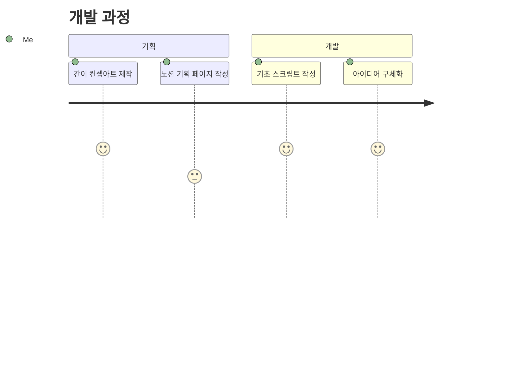

## **무슨 일이 일어났는가**

_최신 버전 게임플레이_

조금 더 일찍 말했으면 좋았을 텐데, 확신이 들어서 지금 작성하게 됐습니다. 행선지는 새로운 프로그래밍 패턴과 약간의 신선한 연출을 새로 시도해보고 싶은 욕심에 시작한 프로젝트로 [세 번에 걸친 개발기](https://hyngng.github.io/tags/armonia/)를 작성할 정도로 애착이 있었고, 약간의 개발 성과도 어느정도 있었지만 결과적으로는 개발을 중지하게 되었습니다.

## **솔직히 작성해본 반성문**





마지막으로 개발했을 때 제가 느꼈던 것은 의무감과 지루함입니다. 제가 시작한 일임에도 불구하고 마지막에 가서는 타자를 두드리는 일이 조금 버겁게 느껴졌던 것 같습니다.

왜 그런 일이 일어났는지 살펴보면, 사실 제 능력이 부족한 것보다 이걸 계속 만들고 싶은 마음이 들지 않았던 것이 첫 번째 이유입니다. 우선은 연습용이었으니까요. 일정 목표 달성 후 기회비용을 따졌을 때 지금 이 일을 좋게 마무리짓는 것이 최선일까 하는 의심이 들었고, 저는 답을 찾지 못했습니다.

두 번째로 제 발목을 잡은 것은 잘못된 방향 설정과 장기적인 계획의 부재입니다. 진심을 담아 진지하게 임하지 않았던 만큼 데드라인이나 구체적인 달성 목표가 없었고 문제 상황을 즉흥적으로 해결하는 일이 여전히 잦았습니다. 문제가 되는 상황을 맞닥뜨렸을 때 상황을 정의하고 최선의 해결책을 강구하는 등 필요한 노력을 들이는 일도 잘 없었습니다.

세 번째로 구체적인 개발 루틴 또는 메커니즘이 없었습니다. 프로그래밍보다 이미지와 애니메이션 에셋을 제작하는 과정에서 이러한 문제가 잦게 발생했습니다. 영화의 한 장면처럼 자연스러운 장면을 연출하는 것이 가장 큰 목표였으나 그림을 그리기 위해 필요한 작업 하나하나가 생각했던 것보다 너무 많은 노력을 요구했고, 솔직한 마음으로 당혹감을 느꼈습니다.

결과적으로 의욕은 떨어졌고, 애착아닌 애착으로 질질 끌어가기보다는 현명한 문제해결능력의 필요성과 작업의 비효율성 개선에 대한 고민을 뒤로하고 짧은 개발일정을 마무리짓는 것이 낫다는 생각이 들었습니다.

## **어느정도까지 만들었는가**

> **자세한 사항은 [깃허브](https://github.com/hyngng/unity-armonia)에서 확인할 수 있습니다!**
{: .prompt-tip }

[기획 단계에서 작성한](https://hyngng.github.io/posts/armonia-planning/) 간이 GDD와 실제로 개발된 것을 비교하면 이렇습니다.

기본 설명
: - [X] 이름: 행선지 (영어: waybound)
- [X] 장르: 횡스크롤 어드벤처
- [X] 형식: 2.5D 모바일

게임플레이
: - [X] 플레이어는 도시 외곽 환경에서 사람, ~~강아지, 고양이, 개미~~ 등 환경을 구성하는 생물이 되어 해당 생물에게 주어진 상호작용을 함. 예를 들어 사람은 자판기에서 음료를 꺼내 마시고, ~~강아지는 길거리 벤치의 냄새를 맡음.~~
- [x] 플레이어가 특별히 생물을 조종하지 않더라도 생물은 서로 상호작용을 하고 도시 외곽 분위기를 구성하며, 각각의 생물은 주어진 범위 내에서 외형적인 개성을 가짐.

주요 특징
: - [x] 오브젝트간 ~~다양한~~ 상호작용
- [x] 수작업 그림 이미지와 컷 애니메이션
- [ ] ~~비, 눈 등 날씨에 따라 달라지는 경험~~

사람과 비둘기에 한해 상호작용을 구현했으나 취소선 처리된 강아지나 고양이 등은 구현되지 않았습니다. 만들어진 상호작용은 다양하다고는 할 수 없습니다. 날씨 또한 파티클 시스템을 통해 구현하고 싶었으나 구현되지 않았습니다.

그래도 어찌됐든 2D나 3D도 아닌 2.5D를 시도해봤다는 것, 직접 그린 그림과 전통적인 컷 애니메이션 모두 부분적으로 사용해봤다는 것 등은 작은 수확이었다고 생각합니다.

## **다음에는 잘해야겠다**

어찌됐던 개발 과정이 만족스럽지 않았고 실패한 프로젝트입니다. 주요 원인은 성의없는 문제해결 과정과 작업의 비효율성 개선에 대한 방기였고, 우선은 다른 분들께서 비슷한 문제를 어떻게 해결하셨는지를 찾아보는 것이 좋을 것 같습니다. 

처음에는 정말 멋진 작품을 만들고자 했는데 여기서 마무리짓는것이 찝찝합니다. 솔직히 좀 분하네요. 포스트에 작성하지 않은 작은 부분까지 복기해서 다음은 끝까지 완성할 수 있도록 잘 준비해야겠습니다.