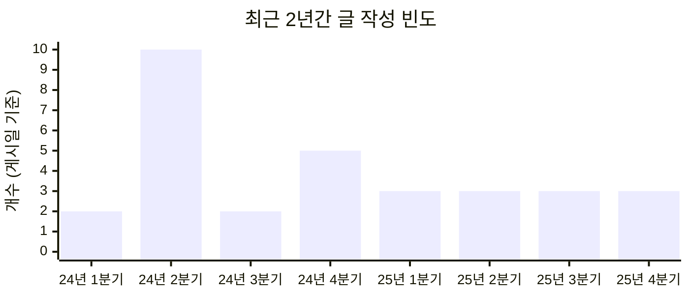

## **왜 블로그를 시작했더라**

그간 이 글을 제외하고 총 42개 글을 썼습니다. 먼저, 블로그 개설 시점으로 돌아가보자면 그 계기 자체는 외부의 영향을 받은 면이 있었습니다. 다른 블로그에서 본인이 공부한 것, 갖가지 기술사항, 직접 고안한 문제 풀이법 등을 한 곳에 모아놓았다는 것이 멋져 보였고, 자연스레 저도 기술 블로그라는 정체성을 의식했습니다. 사실 그 흐름이 나쁘지 않아서 지금도 일부러 그런 방향을 유지하고 있습니다. 앞으로도 프로그래밍 관련 경험, 그 과정을 만들며 겪은 어려움을 정리한 글을 꾸준히 올릴 예정입니다.

두 번째로, 저를 잘 설명하는 공간을 갖고 싶었습니다. 어느 순간부터 사람들을 처음 만났을 때 제 인상을 구체적으로 전달하는 것이 힘든 작업임을 알게 되었습니다. 이유는, 제 경험의 양과 폭이 이제 충분히 넓어졌기 때문이거니와 저조차 제가 어떤 사람이었는지는 잘 모르기 때문이었습니다. 지금 이 곳이 일반적으로 많이 이용하는 SNS, 그러니까 X나 쓰레드, 페이스북, 인스타그램 등이 아닌 블로그인 것도 동일 맥락에서입니다. SNS는 가벼운 글의 확산에는 유리하지만 이성을 활용하기에는 좋은 환경이 아니기 때문입니다.

결과만 미리 짚어보자면 두 가지를 생각보다 잘 달성해가고 있다고 생각하고 있고, 이전에 작성한 글들을 보면서 놀라움을 느끼고 있습니다. 시간과 노력을 많이 필요로 하지만 블로그를 관리하고 있는 것은 확실히 지금의 제가 가진 좋은 장점입니다.

## **그동안의 짧고 긴 행적**


블로그를 대하는 제 태도는 검색노출 신청 이전과 이후로 나눌 수 있을 것 같습니다. 이전에는 형식만 다른 SNS라고 봐도 될 정도의 짧은 글 위주로 작성했고 주기도 들쑥날쑥했지만, [웹마스터도구에 페이지를 등록](https://hyngng.github.io/posts/webmasters-and-seo/)하고나서부터는 글의 품질을 신경써서 작성하기 시작했습니다.

글 작성 기조가 변한 것도 이 때입니다. 단순히 공부한 것 위주의 정리보다는 제가 실제로 소화해낸 것, 피상적인 느낌보다는 고유한 느낌에 집중하게 되었습니다. 예를 들어 컴퓨터과학에서 자료구조, 알고리즘, 네트워크와 같은 분야의 세부개념은 글로 정리해서 올릴 필요를 잘 못 느끼고 있습니다. 이미 잘 정리된 글이 책과 인터넷에 너무 많고, 그런 상황에서 제 글이 어느 정도의 가치를 가지려면 차별화된 관점이나 심화과정이 필요한데 그런 경험은 다른 글에서 스쳐지나가듯이 언급하는 정도가 더 낫다고 생각하기 때문입니다.


### **꾸준한 글쓰기를 위한 원칙**



두 달을 단위로 작년부터 지금까지 작성한 글 개수를 정리하면 위와 같이 정리됩니다. 사실, 블로그를 개설하고서부터 글을 얼마나 자주 써야 하는지에 대해 고심이 있었습니다. 작년에는 암묵적으로 2주에 한 개의 글을 목표로 뒀고, 실제로 한 달에 4~5개의 글을 작성해본 적도 있지만 다음의 이유로 글 게시 빈도를 타협해야 했습니다. 먼저, 단순히 글 개수가 많다고 블로그가 풍성해지는 것은 아닙니다. 다음으로, 블로그와의 의존성이 커질 수록 본래의 삶에 집중하기 어려워집니다. 마지막으로, 목표 게시량이 많을 수록 양질의 글 작성을 위한 난이도가 크게 높아집니다.

25년에 들어서는 월 초냐 말이냐의 차이만 있을 뿐 매 달마다 최소 한 개의 글이라는 암묵적인 고집을 유지하고 있습니다. 말 그대로 암묵적인 패턴이므로 꼭 준수할 필요는 없지만, 1년정도 이 정도의 박자를 유지해보니 바쁜 일상과 블로그 사이에서 적절하게 오갈 수 있었습니다. 1년에 12개의 글이 적지는 않다는 점에서 이 정도가 장기적으로 실현 가능한 수위라고 생각하며, 특별한 계기가 없다면 아마 앞으로도 이 정도의 박자로 새 글이 올라갈 것 같습니다.


### **글을 쓸 때 주의하는 점**

- 정도의 차이는 있지만 하나하나 다 열심히 썼음
- 특히 최근의 [아비투스, 상상속의 질서, 유교에 대한 생각을 나열한 글](https://hyngng.github.io/posts/philosophical-reflections/)이나 [고려사와 부조리 철학을 엮은 글](https://hyngng.github.io/posts/finding-camus-in-goryeo-history/) 두 개는 인문학에 치중된 조금의 도박수임.


### **지속적인 블로그 커스텀**

블로그 구성 파일 원본을 소유자가 갖고 있다는 것 특성상 자연스럽게 페이지 구조를 자주 들여다보게 됩니다. 이전에도 [몇 차례 수정한 적](https://hyngng.github.io/posts/first-blog-customization/)이 있었고, 지금 시점에 와서도 꾸준히 취향에 맞춰 변경해주고 있습니다. 최근의 예시를 들자면 다크/라이트 모드 전환 애니메이션을 비활성화했습니다. 테마 차원에서 해제하는 옵션은 없는데 여간 거슬리는게 아니라서 `id="post-preview"`와 같이 테마 변경 효과가 정의된 속성을 찾아 `transition: none !important` 오버라이드했습니다. 지금은 깔끔하게 전환됩니다.

다음으로, 글이 작성되는 시점의 최신버전 `v7.3.1`을 기준으로 홈페이지에서 LQIP에서 원본 이미지로 전환될 때 블러 이펙트가 재생되지 않는 버그를 발견했고, 오랜 디버깅 끝에 해결해서, 공식 리포지토리에 [이슈를 발행했습니다.](https://github.com/cotes2020/jekyll-theme-chirpy/issues/2537) 2주 반 정도의 시간이 지나고 개발자분께서 문제를 확인하시면서 얼마 지나지 않아 [제 관점이 반영된 새 커밋](https://github.com/cotes2020/jekyll-theme-chirpy/pull/2551)이 만들어졌고 또 금세 새 버전 [v7.4.0](https://github.com/cotes2020/jekyll-theme-chirpy/blob/master/docs/CHANGELOG.md#740-2025-10-19)이 출시되면서 해당 버그가 정식적으로 수정되었습니다.

### **검색엔진에 대한 주저리**


백링크 생성이 중요하다는 것은 알지만, 홍보는 블로그 성격과 잘 조화되는 느낌이 아니라서 별다른 노력을 들이지 않고 있습니다.

{: .w-75 }
_빙 웹마스터도구의 페이지뷰 사이트_


이미 [한 차례 관련 글](https://hyngng.github.io/posts/webmasters-and-seo/)을 작성한 적이 있어서 후일담 정도로 읽어주시면 좋을 것 같습니다. 먼저, 웹마스터도구를 다룰 때에는 끈기를 가져야 했습니다. 정말, 큰 끈기를 가져야 했습니다. 특히 구글 서치 콘솔은 등록 후 정상적인 검색노출까지 반 년가량 걸릴 수 있으며, 충분한 시간이 지났다고 하더라도 페이지 권위가 낮다면 크롤러 동작이 꽤 저하될 수 있습니다. 제 인상이 정확하지 않을 수도 있지만 검색 엔진 최적화가 얼마나 수준높게 구현됐는지보다는 도메인 권위가 색인 생성에 있어 매우 중요하다는 느낌을 받았습니다.

빙에서는 색인이 갑자기 취소되는 일이 있었습니다. 정확히는 빙에서 관리하는 사이트의 상태 분류는 빙의 번역어를 빌려 '인덱싱된', '오류', '경고', '제외'로 정리되는데, 모든 페이지가 '제외'로 옮겨졌고 제 블로그가 빙 검색결과에서 지워졌습니다. 사이트 호스팅이나 robots.txt 등 페이지 자체적인 문제가 없었기 때문에 8월 13일 [이곳에서 지원 팀에 문의를 넣었고](https://www.bing.com/webmasters/support) 8월 30일에 _"We have reviewed your site and sent it to our Product Review group for further assessment."_, 10월 3일에 _"I am happy to inform you that the issue related to your site has been resolved"_ 라고 답변 메일을 받았습니다. 한 달 반 정도가 걸렸지만 색인은 다시 거의 복구가 되었고, 지금은 검색노출이 잘 이루어지고 있습니다.

## **개인적인 글쓰기 소신**


좋은 글을 쓰는 것은 여전히 어렵지만, 블로그를 포함해 계속 글을 쓰다 보니 지레짐작하게 되는 요점이 있습니다. 
자연스럽게 얻게 되는 감각은 옵시디언이나 노션에서 개인 메모를 작성할 때도 유용했습니다.

예를 들어 넓게는 읽을 만한 글을 작성하자는 맥락과, 남의 시선을 의식하지 않고 글을 쓰자는 맥락 사이에서 현실적인 고민이 필요합니다.


### **중구난방한 블로그 성격**

제 블로그가 다루는 주제는 정말 가지각색입니다. 좋게 말하면 풍부한 것이지만 나쁘게 말하면 성격이 애매하다고 평가할 수 있습니다. 다양한 주제를 혼용하는 것은 실제로 SEO의 관점에서 불리하게 작용하지만, 그럼에도 불구하고 저는 어느 정도의 확신과 근거를 가지고 많은 주제의 글을 작성하고 있습니다. 하나의 전제는 이렇습니다. 블로그는 자유롭게 글을 남기기 위한 개인적인 공간이고, 제 페이지에서 제가 눈치를 보는 일은 없어야 합니다. 제 관심이 정말 여러 곳에 나누어져 있다면 제가 작성하는 글 또한 그렇게 작성되는 것이 자연스럽습니다.

조금 비판적일지는 모르겠지만, 예를 들어 SNS에서 화제가 된 소재나 광고 단가가 높은 주제 등 남의 선호도 위주로 블로그를 관리하는 경우가 많이 보이는데 저는 그런 접근이 장기적으로는 개인 블로그로서의 의미를 퇴색시킨다고 생각합니다. 어찌되었건 글을 작성하는 순간 사전적 의미로서의 작가를 일부분 달성하게 된다는 점을 고려하면 읽는이의 기호를 반영하는 것은 분명 필요하지만, 그보다는 작가의 개성에 집중하는 것이 온당합니다. 이곳은 저를 설명하는 공간을 만드는 것에 의의가 있고, 제 블로그가 많은 주제를 다루는 것은 조금은 의도적입니다.

### **의도적인 문체 나누기**

초창기에는 작성자가 주체가 되는 해체로 글을 썼고, 다음에는 잠재적 독자를 염두해서 하십시오체로 통용해보기도 했습니다. 문체를 바꿔봤지만 양쪽에서 어색함을 느끼던 찰나에, 제가 좋아하는 김혜리 영화평론가의 비평문이 어떤 경우에는 글 형식이 독특하게 차별화되어있다는 것을 발견했습니다. 저마다의 작품마다 어울리는 형식이 따로 있다는 발상도, 그런 발상은 실천으로 옮길만 하다는 그의 철학은 설득력이 있었고 제게도 수용해보고 싶었습니다.

전에 이런 시도를 해본 적이 없어서 다른 분들께 어떤 느낌으로 보일지 조금은 도박이기도 합니다. 하지만 [최근의 이런 글](https://hyngng.github.io/posts/finding-camus-in-goryeo-history/) 등에서 소극적으로나마 문장 종결법을 다른 글과 구분해서 사용해보고 있는데 글에 조금 더 진솔해질 수 있고, 글을 쓰는 과정도 더 재밌게 다가와서 인상이 좋습니다. 앞으로 글 작성에 있어서 꼭 문장 끝을 맺는 방식뿐만이 아니라 문단 구성, 길이, 서술 시점 등 통일성보단 다양함을 추구하며 즐겁게 작성해보려고 합니다.

### **탈권위적인 표현 선택**

프로그래밍에서 변수명을 고민하듯 글을 쓸 때에도 여러 표현을 두고 그 사이에서 자주 고민합니다. 제가 생각할 때 좋은 표현을 고르는 기준은 수사의 화려함보다는 의미의 명료함, 그리고 문맥의 추상화 정도를 얼마나 완화할 수 있는지이고, 이 기준을 최대한 엄격히 적용하려고 합니다. 이미 작성된 문장도 시간이 지나면 아쉬운 부분이 보이기 때문에 의미 전달력을 떨어트리는 보그체나 번역체, 좀 더 세심하게는 만연체스러운 문장을 찾아서 다듬고 있습니다.

비슷한 맥락에서 단어를 고를 때 언어적 위계를 의식합니다. 가급적이면 한국어 고유어를 우선하고 필요에 따라 한자어와 외래어를 사용합니다. 논지는 간단합니다. 고유어는 검증된 고전에 속하지만 외래어는 상대적으로 일시적 유행으로 남을 위험이 있습니다. 이러한 경향성을 맹신하기보다는 그때그때 가장 정확하게 의미를 전달할 수 있는 표현을 선택하는 것이 중요하지만, 후자의 비중이 높은 글은 전문성을 과시하는 인상을 줄 수 있어서 의도적으로 피하고 있습니다. 그런 전문 표현을 사용해야 하는 상황에서는 말로 풀어서 쓰는게 낫지 않을지 먼저 숙고를 거칩니다.

### **AI에 대한 보수적 접근**

작문에 있어서 ChatGPT, Gemini, Claude 등 LLM 인공지능 서비스의 도움 없이 최대한 전통적인 방식을 고수하고 있습니다. 제가 글을 쓰는 이유는 복기와 역량 향상, 애착 때문이라 남에게 작문을 맡기는 것은 의미가 없습니다. 만약 주제를 충분히 감당할 수 있다면 외부의 도움 없이도 양질의 글을 쓸 수 있고, 그렇지 않다면 글감과 친해지는 것이 먼저라고 생각합니다. 단, 그렇다고 완전히 배제하는 것은 아니고 생성형 인공지능의 건전한 활용법을 고민합니다. 예를 들어 최근에는 작성중인 초안과 인상깊게 읽은 글을 비교분석하거나 특정 표현을 점검하는 용도로 활용하고 있습니다.

특히 최근 ChatGPT 5나 Claude 4.5 등 최근 모델들은 답변은 유의미하게 참고할 수 있는 수준입니다. 특히 Gemini 2.5 Pro는 출시때부터 지금까지 언어에 대한 숙련도가 높다는 느낌을 자주 받습니다. 글의 전반적인 인상과 문제점, 어떤 단어에 대한 대안, 문장의 축약본과 확충본을 잘 제시하기 때문에 국어사전만 잘 참고한다면 첨삭의 용도로 탁월합니다. 다만 환각 현상은 여전히 경계해야 합니다. 출시 시기 면에서 구형 모델로 갈수록 마이너한 오개념을 제시하기 때문에 공식 가이드라인, 드물게는 책이나 몇 개의 논문과 교차검증한 뒤에 글에 반영하고 있습니다.

## **앞으로도 정상영업합니다**


하나하나 많은 참고자료와 논문을 봐야 하기 때문에 취미 치고는 너무 무거운 주제이기는 합니다.


블로그 개설 당시에는 정치현실주의와 정치이상주의 등 국제정치의 기본 이론, 그리고 인도유럽어족과 언어유형론, 몽골 문자와 만주 문자의 유사성, 현대 한국어의 한자음의 기원 등 언어학상의 여러 요점들, AI의 급속한 발전을 엮은 그림 이야기나 CMOS 이미지센서의 물리적 한계와 극복 전략 등 큰 관심이 있던 분야마다의 정말 재밌고 블로그를 풍부하게 할 소재들이 많았습니다. 시간이 없다는 이유로 실제로 올라온 글이 없다는 것이 지나고 보니 아쉽지만, 관심은 꾸준히 유지되고 있기 때문에 언젠가 비슷한 주제로 글을 올릴 것 같습니다.

하나 더, 최근 AI의 발전으로 인터넷 검색 활동이 위축되고 있기 때문에 전통적인 블로그는 끝났다는 말도 있습니다. 실제로 검색엔진과의 상호 협력 관계가 후퇴하고 광고 수익이 줄어들면서 적지 않은 분들께서 블로그 관리의 의욕을 잃고 있는 모습이 보입니다. 많은 지표에 근거를 두고 있기 때문에 제 블로그 역시 더 희소하게 발견될 거라는건 기정사실이지만, 제 경우에는 어디까지나 정보 공유의 목적보다 자가소비적인 성격이 첫 번째이므로 제 경우에는 큰 동요 없이 활동이 이어질 것 같습니다.

1년 넘게 지속되는 블로그의 수가 적다는 글을 본 적이 있습니다. 이제 햇수로 3년차를 넘어 4년차를 바라보고 있으니 만약 그 말이 사실이라면 전 첫 번째 난관은 전에 잘 넘은 셈입니다. 제 개인적으로는 앞으로도 오랫동안 끌고 가고 싶다는 소망이 있습니다.



- 광고 이야기

글마다 정도의 차이는 있겠지만 하나하나 열심히 썼습니다. 사실, 모든 글은 어디서 찾아보기 힘든 글이라며 자아도취된 상태로 올린 글들이 많습니다. 특히 2024년 이전에 쓴 글은 지금와서 읽어보면 미숙한 부분이 많지만 변화의 일부로 받아들이는게 나을 것 같아 일부러 수정을 하지 않고 있습니다.

## **지금의 글 쓰는 과정 정리**

아마 옵시디언을 사용하는 분이라면 익숙할 수도 있을 텐데, 깃허브에 올라가는 모든 글의 마크다운 원본에는 상단에 프론트매터를 작성함으로서 글 제목과 같은 몇 가지 속성을 정의합니다. 제가 사용하는 Chirpy 테마에서는 지금 글을 작성할 때의 최신 버전인 `v7.3.1`을 기준으로 주로 다음과 같이 입력합니다.

```md
---
image:
    path: preview-image
    lqip: 
    alt: ""

title: ""

categories: []
tags: []
start_with_ads: true

toc: true
toc_sticky: true

date: 2025-01-01 00:00:00 +0900
last_modified_at: 2025-01-01 00:00:00 +0900
---
```
{: file="post.md" }

- `image`: 포스트에 미리보기 이미지가 필요하다면 걸맞는 파일을 Chirpy 테마에서 권장되는 1200 x 630 크기로 조절하고, 검색 엔진 최적화를 위해 webp 형식의 파일로 변환합니다. 크기 조절은 주로 [Powertoys](https://github.com/microsoft/PowerToys)의 [Image Resizer](https://learn.microsoft.com/ko-kr/windows/powertoys/image-resizer)를 쓰고 있고, 인코딩 프로그램은 [샤나인코더](https://shana.pe.kr/shanaencoder_download)를 이용합니다.
- `start_with_ads`: 제 블로그는 애드센스 광고를 포함하지만, 개인적 에세이와 같은 진중한 글에서는 오히려 나쁜 첫인상을 줄 수도 있다고 생각하기 때문에 어떤 글에서는 이 값을 `false`로 작성함으로서 상단의 광고가 숨겨질 수 있도록 만들었습니다. Chirpy 테마에서 기본적으로 제공되는 기능은 아니고 스스로 수정한 부분입니다.



- 보통 1년 넘게 가는 블로그가 잘 없음을 어필
- 앞으로도 꾸준히 쓸 예정임을 밝히며 마무리.

당연히 그렇습니다. 오히려 방문수에 휘둘리지 않고 좋은 글을 쓰려는 과정 자체와 스스로에게 집중할 수 있어서 더 낫습니다. 예전에, 블로그를 처음 개설할 때 참고한 글에서 수익이나 기대 방문자수를 플랫폼 선택 기준으로 제시하는 모습을 많이 봤는데 개인 블로그로서 좋은 판단기준은 아니라고 생각합니다.

### **덕분에 진짜 내 블로그**

- 복기와 복기와 복기. 그래서 지금도 글 쓸 때 나중에 보면 어떤 기분일까 상상하곤 함.
- 지금은 내 스스로가 블로그에 진짜 편안함을 느낀다. 성과의 결집물.

깃허브 페이지를 통해 발행되는 지킬 사이트라는 구조로부터 받게 되는 영향이 많습니다. 이 블로그는 처음부터 어렵게 시작해서, 나중에도 구석구석 기능에 이상이 없나 노심초사하게 살펴보게 되는 웹페이지로서 자의 반 타의 반으로 많은 애착이 들어갔습니다.

때문에, 제 경우에는 여러 개의 얕은 글보다는 한 개의 깊은 글을 목표로 작성하게 되었습니다. 물론, 단순히 그림과 사진만 올리고 짧은 코멘트로 끝나는 글도 있지만 

이렇게 몇 가지 글을 작성하다 보니 이 블로그가 심리적 고향처럼 느껴집니다. 하나하나의 글을 작성할 때마다 보다 좋은 글을 쓰기 위해 노력했던 것들이 생각나고, 벌써 40개 넘게 글이 쌓이면서 무게감을 느낍니다. 그 덕에, 그리고 실제로 한 달에 최소 한 개의 글을 작성하며 그 느낌을 실현해 오면서, 제가 무슨 일을 하게 되든 언젠가는 블로그로 돌아가게 된다고 느끼고 있습니다.

- 최근 AI의 발전으로 검색엔진이 많이 대체되고 있고, 내년 즈음 같은 검색엔진이 AI에게 점유율이 역전될 것이라는 전망이 있다.
- 어차피 AGI에 밀릴 테지만, 그래도 내 기록으로서 유용함

최근 AI의 발전으로 검색엔진이 대체되고 있기 때문에 전통적인 블로그는 끝났다는 말도 있습니다. 많은 지표에 근거를 두고 있기 때문에 제 블로그 역시 더 희소하게 발견될 거라는건 기정사실이지만, 이 공간은 어디까지나 정보 공유의 목적보다는 자가소비적인 성격이 첫 번째이므로 당분간은 계속 다양한 주제로 글을 올릴 것 같습니다.
