
문서가 만들어진 것은
2025-08-31


## **사회복무요원이 되어가는 과정**

실제로 어떻게 사회복무요원이 되는지 먼저 설명할 필요가 있을 것 같습니다. 11월 중반의 수능 철, 세간의 관심 밖에서 사회복무요원 신청도 재학생에 한해 [병무청 병무민원 사이트에서](https://mwpt.mma.go.kr/caisBMHS/) 약 일주일간 같이 이루어집니다. 기관이 병무청에 인원 충원을 희망한 건에 대해 사회복무 대상자는 소집을 최대 2개 기관까지 순차적으로 지원할 수 있습니다. 만약 정원보다 지원자가 많을 경우 무작위 추첨을 통해 선발하되, 1년에 한 번뿐인 기회인 만큼 탈락 횟수에 따라 우선순위를 차등 부여합니다.

저는 학기 도중의 11월 20일, 예전에 휴대폰 캘린더 앱에 남겨둔 "사회복무요원 신청" 메모를 당일에 보고 기숙사에서 부랴부랴 알아보던 것이 생각납니다. 제가 지원한 곳은 인천교통공사였고, 최종적으로 다음과 같이 마감되었습니다.

{: .light .border }
{: .dark }
*병무민원 사이트에서 조회한 경쟁률*


|정보|값|
|---|---|
|복무기관|인천교통공사|
|공석|2명|
|탈락횟수별 1지망 선택인원 - 3회|0명|
|탈락횟수별 1지망 선택인원 - 2회|0명|
|탈락횟수별 1지망 선택인원 - 1회|4명|
|탈락횟수별 1지망 선택인원 - 0회|3명|


저는 탈락횟수가 1회였으므로 50% 확률로 소집이 된 셈입니다. 아마, 저는 사회복무요원 신청을 받는 첫 날에 지원했고 그 때 마지막으로 확인한 경쟁률이 탈락횟수가 1회인 인원에 대해 2명이었던 것으로 기억합니다. "아직은 신청자가 많이 없지만 아마 점점 오르겠지? 이번에 되면 좋고, 아니면 아쉬운 거지" 정도의 생각이었습니다. 그리고 사실 안 될 줄 알았습니다.

*당시에 받았던 병무청 카톡 알림*

친구와 카페에 있는데 병무청에서 카톡이 왔습니다. 한참 지인과 시간을 보내고 있었는데, 알람을 보고 표정이 굳어졌습니다.

이 경험으로 지금도 병무청에서 알림이 올 때마다 조금씩 놀랍니다.

### **논산훈련소에서**

> 훈련소 경험에 대해서는 [이곳에서 별도의 글](https://hyngng.github.io/posts/training-camp-logs/)로 상세히 다루었습니다.
{: .prompt-info }

시간이 지나고, 훈련소에 입영했습니다.

### **복무기본교육**

- 보은

### **인천교통공사 본사에서**

인천교통공사에 지원한 이유는 아동센터나 요양원 등의 악명높은 시설보다는 지하철역에서 근무하는 것이 차악이라는 생각에서였습니다. 그리고 훈련소를 수료하는 순간까지 얌전히 역으로 배치될 줄 알고만 있었습니다.

인천교통공사의 경우 수료 후 다음날, 바로 본사 1층 ??실로 모여 기본적인 인원 체크를 받습니다. 집 주소와 출퇴근 방법, 월급을 받을 통장 번호 등의 기본적인 인적사항을 기재하고 사회복무요원증 발급을 위한 사진을 찍습니다. 행정 절차가 끝나면 각 인원을 호명하며 "○호선 ○○역으로 가시면 됩니다"라며 배정받은 근무지를 안내받았습니다.

그런데 저는 여기에서부터 뭔가 달랐습니다. 지금도 뭐라고 말씀하셨는지 기억이 납니다. "일단은 교통복지팀이라고만 알아두시면 됩니다" 그러니까, 역이 아니었습니다. 가는 길에 정보를 알아봤지만 나오는 것이 없었습니다.

아니 이게 무슨. 처음들어보는 부서인데.

## **근무 시작**

### **인천교통공사 교통복지팀**

*내가 들어오기 몇 달 전의 사무실 모습. 출저: 유튜브 '인천교통공사 ITC' - 교통약자 이동을 지원하는 인천교통공사 장애인콜택시*

첫인상은 당혹스러웠습니다. 사무실은 수영장 건물에 딸려 있었고, 분위기는 어수선했습니다.

훈련소 수료 직후였기 때문에, 자신을 사회복무요원이라고 소개하는 사람들 머리가 하나같이 긴 것이 어색하게 느껴졌던 것이 기업니다. 도착해서는 간단한 소개를 들었고, 별다른 업무 없이 근무가 끝나고 집에 도착했습니다.

## **무슨 일을 하는가**

{: .light .border }
{: .dark }
*사실 이 사진 한 장으로도 충분할 것 같긴 하다*

제 업무를 설명하기 위한 기본적인 구조는 이렇습니다. 대한민국에는 시각장애나 지적장애 등의 이유로 교통약자로 분류되는 분들이 계시고, 교통복지팀은 고객의 휠체어 이용 유무에 따라 일반 택시와 특수 장애인 차량(이하 특장차) 두 가지 형태로 이동 서비스를 제공합니다. 전자는 바우처 택시, 후자는 특장차라고 불립니다.

바우처 택시는 개인사업자 자격으로 인천교통공사와 협약을 맺는 형식인 반면 특장차는 인천교통공사 소속 직원이 직접 담당하는 형식입니다. 정리해서, 다음과 같은 구조입니다.

바우처 택시와 특장차 모두 300명 가까운 인원으로 운용되고 있습니다. 이때 원활한 운행을 위한 행정적 지원을 사무실에서 맡습니다.

통행권, 결제기 영수증 용지, 

바우처에는 단말기를 담당합니다.

특장차에는 미터기, 결제기, 태블릿(갤럭시 탭 액티브 시리즈)

### **전화 응대**

> "감사합니다 교통복지팀 사회복무요원 ○○○입니다"  
> "용무가 어떻게 되실까요"  
> "네 바꿔드리겠습니다"

이건 병무청의 규정이라기보다는 회사 내규인 듯 합니다.

### **단말기 문제 해결**

협력업체 어플을 설치한 스마트폰을 단말기로 사용합니다. 바우처

바우처 기사분들 연령대가 꽤 있는 편이라 제 또래가 알만한 것들을 다들 잘 모르십니다.

특히 작년, 갤럭시가 OneUI 8.0으로 업데이트되면서 측면 버튼 꾹 누르기 기본 동작이 전원 꺼짐 메뉴 대신 인공지능 비서(제미나이 등) 호출로 변경되었습니다. 바우차 기사분들 상당수가 단말기에 이상이 있는줄로 오해하셨고, 사무실로 문의 전화를 많이 주신 적이 있습니다. 솔직하게 상황이 더럽다고 생각이 드는 순간이었습니다.

사회복무요원이라고 한다면 으레 편하고 쉽게 병역을 수행하는 사람들 정도로 생각하는 경향이 있는 것 같습니다. 틀린 말은 아니지만, 적어도 제가 겪은 곳에서는 반론의 여지가 있습니다.

교통복지팀은 인천이동약자지원센터 사무실로도 불립니다.

각각 230명 수준이었고, 소집해제 시점에는 300명에 달했습니다

사회복무요원이 일반 직원과 다른 점은 직무교육 없이 바로 투입된다는 점입니다. 블로그에 작성된 일련의 글을 보면 알 수 있듯이, 저는 병역 제도가 없었다면 인천교통공사와 엮일 일이 없었을 사람입니다. 설명 없이 '눈치껏 터득하고, 알아서 수행해라'라는 식으로 흘러갑니다.

모범사회복무요원으로 선정되어 특별휴가를 이틀 받았습니다. 이게 기준이 좀 웃기던데, 단순히 휴가를 안 쓰고 아껴두면 선정됩니다.

대신, 저는 "저 사람은 저렇게 생각하게 된 나름의 이유가 있을 것이다"를 끊임없이 생각했습니다. 이것은 영화나 문학 등으로부터 얻게 된 감수성이고, 또 최근에는 마르쿠스 아우렐리우스의 명상록이나 노자 도덕경으로부터 근거를 보강받은 기본 전제입니다.

더구나 사내의, 더 나아가서는 대한민국 사회의 문화라는 큰 파도를 제가 부정하기는 어렵습니다. 이것 자체에 불만이 있을지언정 존중은 해야 합니다. 정말 말도 안 되는 상황에서도 말로 해결하기 위해 노력했고, 자정 작용을 기대하며 다양한 상황을 최대한 존중하려고 노력했습니다.

다만 개인적으로는, 없는 개념을 갖다가 으스대는게 마음에 안 들었습니다. 자기가 이곳에 더 오래 있었다는 개념이, 타인을 고민을 나눌 동료가 아니라 교화와 교정의 대상으로 바라보게끔 만드는 동기로 이어집니다. 그 생각을 뒷받침하는 작은 근거들이 조목조목 살펴봤을 때 얼마나 허무한 것인지 생각해보자면 좀 한심합니다.

그래서 마음에 안 드는 부분이 있었습니다. 모두가 그렇진 않았지만 사회복무요원 사이 우열을 나누는 분들이 계셨습니다. 권위는 직급이 아닌 이름에 있어야 한다고 생각합니다. 다음의 상황을 보는 것이 빠를 것 같습니다.

## **아카이브**

### **24년 3분기**

사무실에서 그림을 그릴 수 있는지 또는 책을 읽을 수 있는지를 분위기를 살펴봤지만 그럴만한 환경이 되지 않는다고 생각해서 포기했습니다.

- 보은 사회복무요원 연수센터

### **24년 4분기**

유정복 인천시장을 만났습니다. 당시에 차량안내를 위해 서있었는데, 제 기억으로는 가장 늦게 와서 가장 빨리 출발한 사람이었습니다. 나중에 국민의 힘 대선후보로도 출마를 했던데, 이상합니다.

첫 연차를 썼습니다. 당시 소니 A7C 카메라를 중고로 구입한지 얼마 되지 않았었고, 관심이 생겨 지인과 소니 윈터 알파 랜드 2024 행사에 찾아가기 위해서 사용했었던 기억이 있습니다.

### **25년 1분기**

사회복무 관련
: - 3월에는 사회복무요원을 이제 그만하고 싶다는 생각이 들었습니다. 심적으로 힘들었었습니다.

개인 활동
: - 인프런에서 몇 개 강의를 신년 기념으로 무료로 배포한 덕에, 파이썬 강의를 주워담아 들었습니다. 고급 문법에 대한 내용이었고, 그 중 일부는 블로그에 '[파이썬 객체 동작 제어를 위한 매직 메서드](https://hyngng.github.io/posts/python-magic-method/)' 등의 글로 정리했습니다.

### **25년 2분기**

- 사회복무요원 갈등양상을 유교적 접근으로 승화, 글을 작성.
- CANNON 만들기 시작?
- 사회복무기간의 절반이 해당하는 날이 지나갔습니다. 제 경우에는 4월 27일이었습니다.

### **25년 3분기**

사회복무 관련
: - PASCAL 만들기 시작? (8월)
- 새 사복이 들어오고 맛집 탐방

개인 활동
: - 7월에는 '시지프 신화'와 '국가는 왜 실패하는가', 두 권의 책을 읽었습니다. 좋은 책이었습니다. 특히 '국가는 왜 실패하는가'의 경우 착취적 경제제도, 정치제도가 국가경쟁력의 상실로 이어진다고 설명합니다. 뒤에서 더 자세히 다루겠지만, 공감이 많이 가는 주제였습니다.

### **25년 4분기**

- 10월부터는 시간이 흐르는 속도에 가속이 점점 붙기 시작했습니다. 글을 쓰는 지금의 순간까지 4달이 눈 깜짝할 새에 흘러간 기분입니다.

개인 활동
: - 이 달에는 많은 권의 책을 읽었습니다. 출퇴근길과 점심시간, 휴일, 추석 연휴 등 짬 시간을 모두 책 읽는 데에 할양했고, 이 한 달에만 '손자병법', '명상록', '노자', '경험의 멸종', '인간관계론', '초공간', '총, 균, 쇠'를 모두 한 번씩 완독했습니다. 이중 유난히 인상깊었던 손자병법의 경우 블로그에 [별도의 서평](https://hyngng.github.io/posts/thoughts-on-art-of-war/)으로 정리했습니다.

### **26년 1분기**

개인 활동
: - 복학을 위한 활동을 시작했습니다. 제 경우에는 학교로 복학신청서와 사회복무요원 복무확인서(별지 제4호서식), 잔여휴가 확인서를 제출했습니다.

- RITORNO 만들기 시작

## **썰**

- 시각장애인이 택시에서 "저 커피마실래요 메가커피가 제 취향이라 글로 데려가주세요"라고 요구했는데 기사는 또 그걸 데려다줌. 사무실로 전화해서 사정 설명하면서 "저 사람 커피 사러 갔는데 이게 맞냐"라고 문의함.

스타리아와 스타렉스 중에 스타렉스가 싫어서 스타리아만 배차해달라는 사람.

폐차되는 차 개인적으로 구매가 가능하냐는 사람.

대전교통약자이동지원센터, 부산 장애인콜택시 두리발 등에서 문의전화

같은 수영장 건물 1층에는 승강대관리팀 부서가 있습니다.

## **피그마**

- 뭐 만들었는지
- 뭐 어떻게 썼는지

- 웹디자인할 때 쓰는 거라니까 놀라고 엄청 능력자 취급...?

## **임금님 귀는 당나귀 귀**

### **내 일 아님**

사회복무 업무는 도저히 제 일로 느껴지지 않았습니다. 인천교통공사를 자원한 것은 맞지만 그 선택은 차악의 선택이었고, 그것은 제가 능동적으로 이 회사에 이력서를 제출하고 면접을 통과해가면서 도달하게 된 것이 아니라 병역법에 따라 수동적으로 차출된 결과였기 때문이었습니다.

이 전제를 갖고 업무에 임한 것 치고는 결과가 좋기는 했습니다. 

### **젊은 피를 수혈하다**

### **부조리와 내실 챙기기**

- 군대놀이

가장 한심한 모습이었습니다. 사회복무제도는 대체 병역을 위한 것이기는 하지만, 기본적으로 현역 군인만큼의 규율을 요구하지는 않습니다. 그나마 서로 기수를 따지는 경우가 철도 사회복무요원에 한해 스크린도어가 없는 시절에나 있었지, 지금은 없어졌다고 들었습니다. 그런데 이 곳은 다른 모습이었습니다.

사회복무요원 사이 우열을 나누는 분들이 계셨고 또 그런 분위기가 권장되었습니다. 제 개인적으로 권위는 직급이 아닌 이름에 있어야 한다고 생각합니다. 다음의 상황을 보는 것이 빠를 것 같습니다.

> A: B씨는 지금 맡은 일이 뭐에요?  
> B: ○○ 하잖아요.  
> A: 그거 말고 없어요?  
> B: 아 지금 막내 업무랑 △△도 같이 하고있네요.  
> A: 아니 그건 □□가 아니잖아요 그거 말고 다른거 없어요?  
> B: 그것도 제외하면 없죠.  
> A: 그러면 바쁜 것도 아닌데 놀면서 왜 □□ 안 해요?  
> B: ??

제가 쓴 시나리오가 아닙니다. 다른 사회복무요원이 예시로 든 건데 마음에 들어서 세부 업무 내용만 도형으로 가리고 가져왔습니다. 요는, 사회복무요원이 서로를 동료로 인식하고 있다면 이런 대화가 있을 수 있을리 없습니다.

제가 들어왔을 때 사회복무요원끼리 저러고 있었고, 나중에 소집된 새 사회복무요원도 저러고 있었습니다.

제가 싫었던 것은 새로 들어온 사람은 고생해야 한다는 전제가 아니라, 새 업무 동료를 하나의 존중해야 할 인격으로 보지 않고 교화, 이용해야 할 대상으로 보는 시선이었습니다. 가장 실망스러웠던 것은 제 다음으로 들어온 분께서도 그렇게 행동하지 않길 바랬는데, 아무런 신호도 주지 않았는데 똑같은 소리를 했다는 겁니다.

저는 다른 분들을 선후임으로 보지 않았습니다.

> **또한, 가장 힘들고 어려운 일은 무조건 후배 몫으로 돌아간다.** 업무난도와 업무량, 개인의 적성에 따라 업무가 배분되어야 하지만 절대 그렇지 않다. 모두가 맡기 싫어하는 일, 부담스러운 일이 연차가 가장 낮은 직원에게 배정된다. 어려운 일일수록 행정경험이 많은 선임들이 맡아줘야 하는데 그 어떤 선배직원도 나서지 않는다. 오히려 배정이 되면 상사에게 항의하고 나는 그 일 못한다고 까무러친다.  
후배 직원은 그렇게 반발하기 힘들다. 연차가 오래되지 않았기에 자기 주장을 마음껏 펼치기 어려운 입지에 있다. 한낱 동물들도 새끼일때는 성체가 될 때까지 주변에서 배려해 준다. 먹이를 직접 잡을 수 없으니 가져다 먹여주고 이동할 때도 그 속도에 맞춰 준다. 공무원에게 그런 배려를 바라는 것은 사치다. **이제 막 입사한 신규 공무원에게 가장 어려운 일, 모두가 하기 싫어하는 일을 업무배정해버리고 나몰라라다.** 본인이 버티면 다행이고 못버티고 나가도 어차피 나랑 상관없는 일이라는 식이다. 어차피 그 직원 나가도 신규직원은 계속 들어온다. 그리고 그 직원이 당돌하게 일을 못하겠다라는 식으로 나오면 싸가지 없다는 낙인을 찍고 신규 직원이 일 열심히 안한다며 선배 직원들끼리 똘똘 뭉쳐 조리돌림한다. 팀장 과장 등 관리자는 다 알지만 모른체한다. 괜히 나서기도 싫고 책임지기 싫고 직원들에게 싫은소리 하기도 어렵다. 결국 연차가 가장 낮은 신규직원만 고생 또 고생이다.
>> [출처: 브런치 '임이삭' - 공무원 조직은 쌍팔년도 군대문화](https://brunch.co.kr/@publicofficer/16)

젊어서는 고생이고 늙어서는 신선놀음.

여기서 '후배 직원'만 '사회복무요원'으로 바뀌면 제가 놓였던 생태를 잘 설명하는 글이 됩니다. 조직 생리에 대한 성찰과 개선은 뒷전이고 현상유지에 급급한 분위기가 너무 답답했습니다. 하지만 지인을 제외하면 어디에도 성토하기 어렵습니다.

- 선후임을 따집니다.

따질 수는 있다고 생각합니다. 그런데 들어온 순서 이상의 의미를 가져서는 안 됩니다. 그러나 교통복지팀에서는 의도적으로 방치되었습니다. 왜곡된 자부심인지, 텃세인지, 지금도 이 심리가 이해가 잘 가지 않습니다. 예를 들어 다음의 상황이 자연스럽게 발생했습니다.

- '막내'라는 개념이 존재했습니다.
    - 운전원 음주측정 메일을 매일 10시 반과 1시 반에 기록하는 일을 맡습니다.
    - 매주 화요일과 목요일 오후 2시, 인천교통공사 본사와의 문서수발을 맡습니다.
    - 사무실과 교육실, 노조사무실 3개 실에 대해 쓰레기 분리수거를 맡습니다.
    - 사무실 냉장고에 과자와 음료수를 채우는 일을 맡습니다.
    - 그 외 잡무가 있다면 우선적으로 넘겨집니다.

저는 업무 뷔페라고 불렀습니다. 선임이 편한 업무를 먼저 가져간 뒤에 남아있는 힘든 업무가 후임에게 맡겨지는 구조입니다. 

- 소집일자가 저와 한 달 밖에 차이나지 않지만 전화 응대부터 온갖 잡무를 떠넘겼습니다.
- 사회복무요원이 사회복무요원에게 먼저 나서서 일을 시킵니다.

> 되도록이면 휴가도 선임이 먼저 쓸 수 있게, 응?

폭행, 폭언이 없는 경우 부조리로 신고가 안 됩니다.

- 저는 없앴습니다.

- 일하기싫은 사복 마인드 짬뽕 => "전화 받아라"하고 눈치싸움. 난 처음엔 타협을 하려 했는데 잘 안 풀렸고,
나중에 가니 택시기사나 고객과 싸우는 것 보고 엮이기 싫어서, 그러니까 나에게 감정을 가지는 것 자체가 불쾌해서
그냥 일 받았음. 소해 후에는 말없이 바로 차단.

어떤 지적인 상호작용이나 연민을 기대하기 어려운 환경이 가장 큰 스트레스였습니다. 정명론적으로, 사회복무요원에는 사회복무요원에 맞는 행동강령과 규범이 있다는 식으로 강요되는 환경이 좀 답답했습니다.

### **의존성 역전 원칙 위반**

프로그래밍에는 의존성 역전 원칙(Dependency Inversion Principle)이라는게 있습니다. 언제가 될지는 모르겠지만 향후 SOLID 원칙에 대한 제 생각을 정리하고 다듬어서 별개의 글을 꼭 쓸 것이고, 그때 지금의 이야기를 더 자세히 포함할 겁니다.

이 원칙의 요지를 쉽게 풀이하면 "계약서에서 합의된 내용만을 이행하라"라는 이야기입니다. 그리고 이 원칙을 준수해야 하는 이유는 조직의 건전성을 위해서입니다. 그러니까, 사실 사회복무요원의 입장에서 진지하게 고민할만한 내용은 아닙니다.

좀 더 풀어서 설명하자면 업무분장 외 일을 시켜서는 안 된다는 겁니다.

하지만 분명 사무실에서 벌어지는 일은 불편했습니다. 이것이 비단 사회복무요원과 직원간의 관계라서가 아니라, 

### **행정은 어렵다**

행정 강도가 꽤 높은 측면에 속했습니다. 저는 이전까지 전화나 문자를 '받는' 위치에 있었지, 전화나 문자를 '보내는' 위치는 아니었습니다. 그리고 약 20개월간 어떤 공지사항을 전파해야만 하는 입장이 되면서 그들의 고역을 이해하게 되었습니다.

우선 연락이 닿지 않는 경우가 꽤 있습니다. 그리고 연락이 닿아도 내용 이해가 미비한 경우가 있습니다. 문장을 최대한 풀어서 쓰고, 정확한 단어를 심사숙고해서 골라서 사용해도 마찬가지입니다. 이건 그들의 잘못이라기보다는 상황 자체가 나쁘기 때문에 가깝습니다.

행정을 조직 목표 달성을 위해 자원을 관리하고 체계적으로 실행하는 과정이라고 한다면,

위험한 이야기일지는 모르겠지만, 도덕적 가치는 사회적 지위에 따라 결정되지 않는다는 고전적 윤리학의 시선이 납득이 갔습니다. 좀 더 직설적으로, 사회적 약자라고 해서 선한 것은 아닙니다. 무리한 요구를 하는 분들이 많이 계셨습니다.

### **싸움**

공정하고 청렴하게, 투명하게. 이런 표현을 쓰지만 사실 무엇이 공정한 것인지, 무엇이 청렴한 것인지 구체화하지 않는다. 언어적 한계와 오해의 발생. 이헌령 비헌령, 미주알고주알.

안전한 이동, 행복한 동행

### **권위에 대한 솔직한 생각**

> 단체 생활에서 갈등이 생겼을 때 이를 해결한 경험이 있나요?

여러 기업이 "팀원, 상사와의 갈등을 겪었던 경험과 어떻게 해결하려고 했는지에 대한 노력"을 물어보는 이유를 알게 되었습니다. 제 경우에 특별한 해소 방법은 없었습니다. 해소가 되지 않은 상태에서 소집해제를 맞이했기 때문입니다.

일이 이렇게 흘러간 이유는 제 나름대로 갈등의 근본 원리에 대한 생각이 있었습니다. 하나, 제 경험으로는 사회복무요원간 관계에서 이익 충돌이 일어납니다. 한 사람이 자리를 비우면 타인이 고생해야 하고, 자리를 비울 기회조차 충돌합니다.
둘, 사회복무요원과 직원간 관계에서 방기와 연루가 일어납니다. 이것은 국제정치학에서 다루는 동맹 딜레마(Alliance Dilemma)가 개입된 생각입니다. 사회복무요원은 근무지에 연루될 위험이 있고, 직원은 사회복무요원으로부터 방기될 위험이 있습니다.

## **그래도 좋았던 것**

- 여러 사람들 본 것 (좋은 의미로도 나쁜 의미로도)

### **명절 선물**

### **체육대회**

*작년 사진정산에 포함할까 말까 고민 많이 했던 사진*

인천교통공사 내규에 따라 직원과 함께 사회복무요원도 체육대회를 진행합니다. 한 번 할 때 인당 4만원 정도의 식비가 나오고, 일 년에 4월과 10월 총 두 번 진행됩니다. 저는 초밥집, 애슐리퀸즈, 고든램지 버거로 총 3번 진행했습니다.

### **엑셀 다루기**

### **사무실 분위기**

## **마치며**

{: .w-75 }
*1년 8개월간 사용했던 알람. '당분간 해야 하는' 일은 끝났고, 이제 이 알람을 영원히 끌 수 있게 되었다.*

그래도 솔직히 좋은 소리는 못 하겠습니다. 이제 사회복무요원을 그만 할 수 있어서 정말 다행입니다. 그런데 이때 혹자는, 그렇게 힘들고 마음에 안 들었다면 왜 근무지를 변경하지 않은 것이냐라는 의문이 있을 수 있을 것 같습니다. 여기에는 크게 세 가지 이유가 있었습니다.

하나, 원래 근무할 줄 알았던 지하철에는 야간조가 있습니다. 저는 잠에는 타협이 원래 없으나, 인천교통공사를 지원한 것 자체가 어쩔 수 없는 차악의 선택지였으니 감수해야 한다고 생각하고 있던 찰나에, 낮에 근무할 수 있다는 조건이 너무 좋았습니다.

또 하나, 공무직 사회를 관찰하는게 생각보다 재미있었습니다. 사회복무요원 소집 직전까지 학교와 동아리 등에서 일관되게 접했던, "자신이 그 일을 왜 하는지, 그 업무가 왜 그렇게 이루어져야 하는지 의심하고, 통찰하고, 개선하라"라는 메시지와는 정반대되는 곳이 공무직 사회였기 때문이었습니다. 많은 서류와 잡담이 오가고, 또 문서수발을 하러 시청에 들렀을 때 보이는 주무관들 사이의 분위기, 특이한 일이 발생했을 때 뒤탈없게 처리하려는 노력 등등도 재미있었습니다.

마지막으로, 호기심이 있었습니다. 국제정치 이론이 실제로 효과를 보는지 확인하고 싶었습니다. 패권국이 교체되면 국제질서가 교체된다고 설명합니다. 설득력이 있는 이야기였고 역사상의 실례도 많았지만, 이것이 국소적으로 우리 사회에 적용할 수 있는 이야기인지 궁금했습니다. 그래서 제 생각에는, 실제로 효과가 있는 것 같습니다.

사실, 교통복지팀은 사내에서도 기피부서로 취급되는 분위기였던 것 같습니다.

### **21개월은 긴 시간이다**


> 💸 사회복무요원 월급 관련 안내사항 💸 

💁🏻‍♂️ 인천교통공사 사회복무요원 월급일은 '매월 15일' 입니다. 해당 월 1일 부터 말일 까지 근무한 월급이 지급되는 겁니다! 

💁🏻‍♂️ 다만, 금년 12월 해당 월급은 회사 연말정산 관련사항으로 '내년 1월 15일' 이 아닌 '금년 12월 31일' 에 지급 됩니다! 
( 금년 1월에 근무한 해당 월급은 원래대로 금년 2월 15일, 해당 일이 주말이라면 보다 일찍 지급됩니다. )

✅ 사회복무요원 기본월급
- 소집월 ~ 2개월 차(이등병) :640,000원
- 3개월 ~ 8개월 차(일병) : 800,000원
- 9개월 ~ 14개월 차 (상병) : 1,000,000원 
- 15개월 차 이상 (병장) : 1,250,000원 

✅ 1일 교통비 : 대중교통(인천 시내버스)왕복이용요금(현금기준) : 2,800원 

✅ 1일 중식비 : 7,000원 

💁🏻‍♂️ 기본월급은 연가, 병가 등 휴무와 관계없이 지급되는 금액이며, 교통비와 중식비는 본인 출근일수와 관계합니다! 
ex) 2022년 김병장 1월 출근일수 : 17일 
      기본월급 : 1,250,000원 +
      (중식비 : 7,000원 + 교통비 : 2,800원)  X 17일 
      = 1,250,000 + 166,600 = 1,416,600원 

💁🏻‍♂️ 야간 교대 출근 근무자의 야간출근에 경우 중식비와 교통비가 2일치로 계산 됩니다. 

💁🏻‍♂️ 오후 반가를 사용할 경우에는 교통비, 중식비가 지급 됩니다. ( 오전반가 사용 시, 교통비 만 지급됩니다.) 

💁🏻‍♂️ 보다 더 자세한 사항은 배정받은 근무지에 문의하시기 바랍니다.

---

💁🏻‍♂️ 본인이 배정받은 사업소 위치를 지도에 검색하여 찾아가시고, 위치에 도착해서 사무실을 찾지 못할 경우에는 안내해드린 전화번호로 전화하시면 직원분이 친절하게 알려주실거에요! 

💁🏻‍♂️본사에서 교육이 끝난 후, 바로 배정받은 사업소로 이동해주세요! 도중에 이탈 할 경우에 ⚠️경고⚠️ 처분을 받을 수 있습니다.

☎️ 사업소 주소 및 전화번호 안내 ☎️

✅ 1호선역무사업소 : 인천 1호선 인천시청역, 032-451-3658

✅ 2호선역무사업소 : 인천 2호선 가정역 4번 출구 지하 1층, 032-451-4203

✅ 7호선역무센터 : 경기도 부천시 길주로 486 부천종합운동장 별관 2층 (7호선 부천종합운동장역 3번출구), 032-451-7206

✅ 월미기술팀 : 월미바다열차 월미공원역, 032-450-7664

✅ 승강대관리팀 : 인천광역시 미추홀구 매소홀로 618 문학경기장 박태환수영장 1층, 070-4550-1546

✅ 교통복지팀 : 인천광역시 미추홀구 매소홀로 618 문학경기장 박태환수영장 2층, 032-437-0498

✅ 운연기지지원팀 : 인천광역시 남동구 운연로 80, 032-451-4402

✅ 귤현기지지원팀 : 인천광역시 계양구 만봉길 65, 032-451-3814

✅ 육상교통기획팀 
-송도파트 : 인천광역시 연수구 아카데미로 51번길 42, 032-858-4826
-터미널파트 : 인천광역시 미추홀구 연남로 35 인천종합터미널, 032-430-7313

✅ 신교통운영팀 : 인천광역시 서구 파랑로 105 청라BRT 통합차고지 3층, 032-569-6046

✅ 연수관리팀 : 인천광역시 계양구 경명대로 990 인천교통연수원, 032-545-7138

✅ 교학팀 : 인천광역시 계양구 경명대로 990 인천교통연수원, 032-546-7385

```mermaid
gantt
    title 하루 루틴
    dateFormat HH:mm
    axisFormat %H:%M

    section 집 (아침)
    취침: 00:00, 07:38
    출근 준비: 07:38, 08:05

    section 출근
    버스: 08:05, 08:25
    수인분당선: 08:25, 08:46
    인천 1호선: 08:46, 08:55

    section 근무
    오전 근무: 08:55, 11:30
    점심식사: 11:30, 13:00
    오후 근무: 13:00, 17:50

    section 퇴근
    인천 1호선: 17:50, 18:14
    수인분당선: 18:14, 18:24
    버스: 18:24, 18:34

    section 집 (저녁)
    개인 활동: 18:34, 23:30
    취침: 23:30, 24:00
```



---

## 1

**업무**
- 고객지역채우기
- 근무평정서발송

## 2

**업무**
- Sheet1 생성
- 급여명세서 일괄 발송
- 정비내역서 다운로드 및 분할
- LOWDATA
- 확정운행실적
- 바우처, 특장차 등록/해지 정보관리
	- eksys 전산 + KT스마트메시지Plus
- 고객 웹회원 연동
- 
**프로그램**
- Sheet1 생성 자동화
- 급여명세서 발송 자동화
- LOWDATA 부분 자동화

## 3

**업무**
- 음주측정 메일 확인
- 물품수령관리대장
	- 우산, 컵밥 등등
- 운영조직도, 명패, 파일철, 연락처 종이, 추첨지
- `WiseVCS.apk` QR코드 생성 
- 컴퓨터 분해 및 청소
- 프린터 IP 연결
- 연말정산 서명받기, 인원관리
- 태블릿 교체
- 근무복 조별로 정리
- 창고 정리
- 바우처 폰 교체
- 바우처 로그인 안내
- 바우처 영수증 정산
- 전화 응대
- 문서 수발
- 사무실 청소, 정리
- 
**프로그램**
- 바우처 요금 이동거리 받아 프로그램으로 구하기
- 통행료 경우의 수 구하기

- 이재혁이 만든 업무분장.