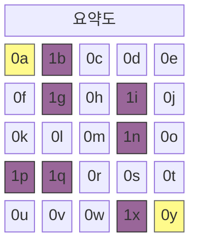
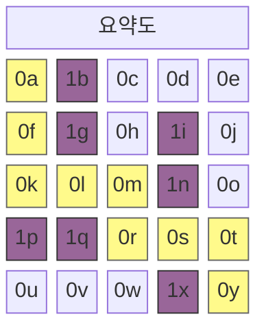

A* 알고리즘은 특정 두 지점을 연결하는 최단 경로를 찾기 위한 그래프 탐색 알고리즘입니다. 이 알고리즘 특성은 $n$이 노드라고 할 때 다음의 한 개 식으로 요약 가능합니다.

$$
f(n) = g(n) + h(n)
$$

## **열린 목록과 닫힌 목록**

A* 알고리즘은 최단거리를 구할 때 이동 가능한 인접 노드에서의 비용을 조사합니다. 먼저 조사 대상을 열린 목록(Open List)에 추가하고, 조사가 끝난 노드부터 닫힌 목록(Closed List)으로 이동합니다.

```python
open_list = []
closed_set = set()
```

이 과정을 구현하기 위해 두 개의 리스트를 사용합니다. 열린 목록은 우선순위 큐, 닫힌 목록은 집합(Set) 자료구조를 사용합니다.

## **$g(n)$: 한 칸 이동 비용**

$g(n)$은 열린목록에 등록된 후보 노드로 이동했을 때의 비용을 측정하는 함수입니다. 만약 맵이 격자로 주어졌다면 상하좌우 이동비용은 $1$, 대각선 이동이 가능할 경우 대각선 이동 비용은 $\sqrt{2} \approx 1.4$로 계산할 수 있습니다.

```python
# 노드가 아래와 같이 정의되어 있다고 한다면
class Node:
    def __init__(self, position, parent=None):
        # ...
        self.g = 0

# 다음과 같이 표현할 수 있음
neighbor.g = current_node.g + 1
```

## **$h(n)$: 도착지까지의 거리**

$h(n)$은 열린목록에 등록된 후보 노드로부터 목적지 노드까지의 이동 비용을 대략적으로 추정하는 함수입니다. 식당 선택할 때 손님 많은 곳으로 가거나 해외제품을 구매할 때 환율을 1200~1400원으로 어림잡아 계산하는 것 등을 휴리스틱이라고 부르는데, 그래서 휴리스틱 측정값이라고도 합니다. 문제 상황에 맞게 휴리스틱 측정값을 알맞게 결정하는 것이 알고리즘의 성능 향상에 도움을 주는 것으로 알려져 있으며, 일반적으로 다음과 같은 방법으로 구할 수 있습니다.

- 맨해튼 거리 $h(n) = \|x_1 - x_2\| + \|y_1 - y_2\|$
```python
def heuristic(start_node, end_node):
    return abs(
        end_node[x] - start_node[x]) + abs(end_node[y] - start_node[y]
    )
```
- 유클리드 거리 $h(n) = \sqrt{(x_1 - x_2)^2 + (y_1 - y_2)^2}$
```python
def heuristic(start_node, end_node):
    return math.sqrt(
        (end_node['x'] - start_node['x'])**2 + (end_node['y'] - start_node['y'])**2
    )
```

## **파이썬으로 구현한 알고리즘**

```python
import heapq

class Node:
    def __init__(self, position, parent=None):
        self.position = position
        self.parent = parent

        self.g = 0
        self.h = 0
        self.f = 0

    def __lt__(self, other):
        return self.f < other.f

def heuristic(a, b):
    return abs(a[0] - b[0]) + abs(a[1] - b[1])

def astar(grid, start, end):
    open_list = []
    closed_set = set()

    start_node = Node(start)
    end_node = Node(end)

    heapq.heappush(open_list, start_node)

    while open_list:
        current_node = heapq.heappop(open_list)
        closed_set.add(current_node.position)

        if current_node.position == end_node.position:
            path = []
            while current_node:
                path.append(current_node.position)
                current_node = current_node.parent
            return path[::-1]

        x, y = current_node.position
        neighbors = [(x+dx, y+dy) for dx, dy in [(-1,0), (1,0), (0,-1), (0,1)]]

        for next_pos in neighbors:
            nx, ny = next_pos
            if not (0 <= nx < len(grid) and 0 <= ny < len(grid[0])):
                continue
            if grid[nx][ny] != 0:
                continue
            if next_pos in closed_set:
                continue

            neighbor = Node(next_pos, current_node)
            neighbor.g = current_node.g + 1
            neighbor.h = heuristic(next_pos, end)
            neighbor.f = neighbor.g + neighbor.h

            if any(n.position == neighbor.position and n.f <= neighbor.f for n in open_list):
                continue

            heapq.heappush(open_list, neighbor)

    return None
```

## **알고리즘 실행 예시**

해당 알고리즘은 주어진 노드의 값이 $0$이면 길, $1$이면 장애물로 판단합니다. 예를 들어 다음과 같은 맵을 가정해 보겠습니다.



```python
grid = [
    [0, 1, 0, 0, 0],
    [0, 1, 0, 1, 0],
    [0, 0, 0, 1, 0],
    [1, 1, 0, 0, 0],
    [0, 0, 0, 1, 0]
]

start = (0, 0)
end = (4, 4)

path = astar(grid, start, end)
```

다음과 같이 $5 \times 5$ 크기의 맵에 출발지를 `(0, 0)`, 목적지를 `(4, 4)`로 설정하고 중간중간 적절히 벽을 배치할 경우 최단경로 `path`는 다음과 같이 출력됩니다.



```bash
[(0, 0), (1, 0), (2, 0), (2, 1), (2, 2), (3, 2), (3, 3), (3, 4), (4, 4)]
```