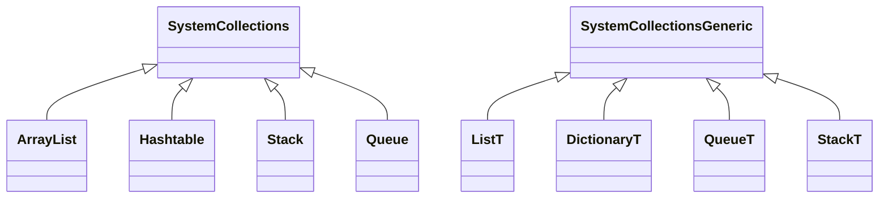
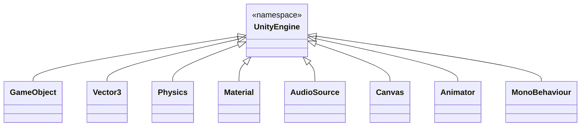

다른 언어나 환경에서 프로젝트를 하다보면 헷갈리고 까먹는게 생김. 그래서 나만의 대방주를 만들 겸 원활한 개발을 위해 알 필요가 있는 기본 사항을 핵심 위주로 정리함. 그래서 예를 들어 if문, for문 등 절때 까먹을 것 같지 않을 기초적인 부분은 배제했음.

## **기본 네임스페이스**

```cs
using System.Collections;
using System.Collections.Generic;
using UnityEngine;
```

### **System.Collections**



`System.Collections`와 `System.Collections.Generic`는 둘 다 자료구조 클래스를 정의하는 네임스페이스입니다. 각각 `ArrayList`, `Hashtable`, `Stack`, `Queue` 또는 `List<T>`, `Dictionary<T>`, `Queue<T>`, `Stack<T>` 등의 클래스가 정의되어 있으며, 대부분은 `System.Collections.Generic` 네임스페이스를 사용합니다.

### **UnityEngine**



`GameObject`, `Vector3`, `Physics`, `AudioSource` 등 유니티에서 사용하는 개념이 정의되는 네임스페이스입니다.

## **클래스 상속**

### **기본 상속 구조**

```cs
public class Animal
{
    public void Eat() => Debug.Log("Eating");
}

public class Dog : Animal
{
    public void Bark() => Debug.Log("Barking");
}
```

### **추상클래스와 인터페이스**

```cs
public interface IAnimal
{
    void Speak();
}

public class Cat : IAnimal
{
    public void Speak() => Debug.Log("Meow");
}
```

### **인스턴스화**

```cs
/* C#에서 인스턴스화하는 기본적인 방법 */
Dog dog = new Dog;

/* 유니티에서 사용하는 경우 */
Instantiate(GameObject Dog, Vector3 position, Quaternion rotation);
```

- MonoBehaviour

- 상속 유형 여러가지.
    - static
    - 인스턴스 생성방법 여러가지
    - override 하는 법과 안 하는 법
    - protected, public 클래스

## **변수 선언 및 사용**

### **애트리뷰트**

```cs
[SerializeField]
[Header("this is a header")]
[Range(0, 1)]
private float speed;
```

| 속성(Attribute) | 설명 |
|---|---|
| SerializeField | `private`, `protected` 등 은닉된 변수를 인스펙터창에 표시한다 |
| Serializable | 별도의 클래스를 인스펙터창에 표시한다 |
| Header | 변수에 대한 간략한 설명으로 분류군을 표시한다 |
| HideInInspector | `public` 변수를 인스펙터에서 숨긴다 |
| RequireComponent | 해당 컴포넌트가 추가될 때 다른 컴포넌트도 함께 추가된다 |
| Range | `int`, `float` 변수를 특정 범위 내에서 인스펙터창으로 조절 가능하도록 변경한다 |
| Space | 한 줄의 간격을 추가한다 |
| CreateAssetMenu | `ScriptableObject` Asset을 생성할 때 메뉴 추가한다 |
| MenuItem | 해당 `static` 함수를 메뉴 항목에서 실행할 수 있도록 변경한다 |
| ContextMenu | 해당 `non-static` 함수 실행을 컴포넌트 톱니 메뉴에 추가한다 |
| AddComponentMenu | 인스펙터의 `AddComponent` 메뉴 항목으로 컴포넌트 추가 |
| ExecuteInEditMode| 플레이중이플레이 모드가 아니더라도 스크립트가 실행되도록 변경한다 |
| Multiline | 여러 줄의 `string` 변수를 입력받을 수 있도록 변경한다 |
| TextArea | 폭에 맞춰 자동으로 줄바꿈과 슬라이드바 표시한다 |
| Tooltip | 변수에 대한 설명을 표시한다 |

### **Nullable 변수**

```cs
private int? number = null;
```

### **배열과 리스트 선언**

```cs
/* 배열 선언 */
private int[] intArray = new int[];

/* 배열의 크기 구하기 */
Array.Length();
```

```cs
/* 리스트 선언 */
private List<int> = new List<int>();

/* 리스트의 크기 구하기 */
List.Count();
```

배열과 리스트는 서로 다른 네임스페이스를 참조하기 때문에 선언방식에 차이가 있습니다. 예를 들어 리스트는 `System.Collections.Generic`에서 가져오기 때문에 제네릭을 사용합니다.

### **딕셔너리**

```cs
Dictionary<string, int> dictionary = new Dictionary<string, int>();
```

### **get set 프로퍼티**

```cs
private string name;
public string Name
{
    get { return name; }
    set { name = value; }
}
```

변수 은닉화는 물론, 변수의 수정과 특정 함수의 실행을 간략히 연결시킬 수 있어 유용한 프로퍼티입니다.

변수를 `private`로 선언해놓고 값을 외부 조건에 따라 변경하는 구조가 이상하게 느껴질 수 있지만, get set 프로퍼티를 사용하는 이유는 근본적으로 외부 클래스가 직접 수정하지 못하게 하기 위함입니다.

## **함수 선언 및 사용**

### **람다 함수**

```cs
var specificNumbers = Array.FindAll(numbers, n => n % 2 == 0);
```

### **코루틴**

```cs
private IEnumerator MyCoroutine()
{
    Debug.Log("Hello, world!");

    yield return new WaitForSeconds(1);
}

/* 시작과 끝 */
StartCoroutine(myCoroutine);
StopCoroutine(myCoroutine);
```

### **델리게이트**

```cs
public delegate void MyDelegate(string message);
```

## **코드 작성 관련**

### **삼항 연산자**

```cs
condition ? value_if_true : value_if_false;
```

`if-else` 대신 사용하기 좋은 형식으로 코드 압축성이 좋고, 코드를 읽고 쓰는 속도가 빨라진다는 장점이 있습니다. 단 삼항 연산자를 중첩해서 사용하는 경우 대개 가독성이 나빠지는 문제가 있으므로 그런 경우 코드 압축성을 포기하고 `switch`문을 사용하는 편이 좋을 수 있습니다.

### **NULL 관련 연산자**

```cs
string result = value ?? "value not set";
```

- Null 병합 연산자

```cs
string? data = Database?.data;
```

- Null 조건부 연산자

`for`, `while`문은 다른 언어와 비슷한 형태를 갖고 있어 헷갈릴 여지가 적지만 `foreach`는 존재감을 잊을 수 있음.

```cs
foreach (string item in itemList)
{
    Debug.Log(item);
}
```

파이썬의 `for`문과 매우 비슷하고 편하게 사용할 수 있습니다.

### **전처리기**

```cs
#if UNITY_EDITOR
    /* ... */
#else
    /* ... */
#endif
```

컴파일하기 전에 미리 처리하는 도구입니다. 주로 조건부 컴파일, 코드 매크로 정의, 파일 포함 등의 작업에 사용됩니다.