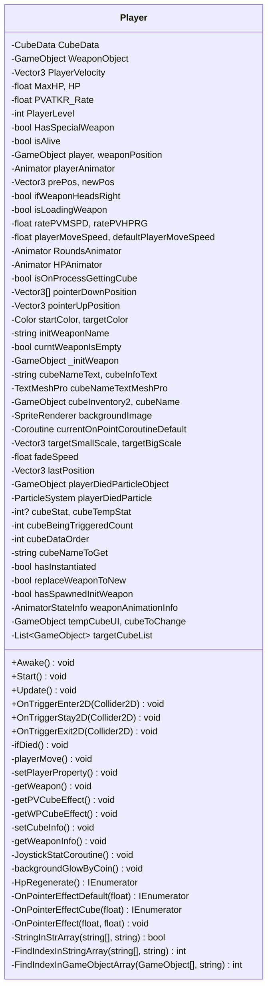


2026-03-26에 작성 완료함


{: .light .border }
{: .dark }
*앎의 4단계*

내가 어디쯤 와있는지는 모르겠다. 앎의 4단계로 비유하면 의식적 유능 정도의 단계이지 않을까 싶고, 무엇이 좋은 설계인지 조망하는 감은 아직 없다. 그런 와중에 조금씩 알 것 같은 것들이 몇 가지씩 생기고 있다.

## **객체지향에 대한 단평**

객체지향이 고안된 배경이나 객체지향이 잘 하는 것들은 잘 알려져 있다. 종래의 절차지향 패러다임이 지닌 한계를 타파하기 위해서, 세부적으로는 추상적 사고를 보존하고 복잡한 비즈니스 로직을 사람이 이해하기 편한 방식으로 자연스럽게 설계하기 위해서. 그러나 상대적으로 이 방법론이 왜 큰 호응을 얻었는가는 덜 다뤄진다. 그리고 이와 관련해 내가 찾은 관점은 두 개, 사업과 철학이다.

하나. 무언가를 책임진 사업가, 야망가는 불확실성을 싫어하기 마련이다. 국경을 접한 북방 제국이 한반도계 국가를 끊임없이 침략한 이유 중 하나는 대륙 정벌이라는 사업을 달성하기 이전에 후방을 안정시키기 위해서였다. 로마가 카르타고를 치기 전에 이탈리아 반도를 먼저 통일한 사례, 독일은 프랑스 침공 이전에 소련과 불가침조약을 체결한 사례도 동기는 크게 다르지 않다. 사업의 규모가 클수록, 책임자의 집착이 진지할수록 블랙스완 차단은 필수적이다.

둘. 현대물리학자가 대통일 이론을 열망하는 것, 언어학자가 세계의 모든 언어 사이에 보편문법이 있다고 가정하는 것, 경제학자가 수백만 명의 행동을 수요와 공급이라는 하나의 그래프로 설명하려 하는 것 등은 모두 난잡함을 통제해내려는 의도에서다. 왜 그런 노력이 역사적으로 동반되어 왔을까, 그 이면에 인지비용을 낮추려는 실용적인 이유도 있겠지만 나는 알베르 카뮈가 제시한 관점을 더 좋아한다. 예컨대 "인간은 불확실성과 모호함을 견디지 못하고 명료한 인식관을 갈구하기 마련이다"라는 것.

이건 일개 상상일 뿐이다. 하지만 직관으로는 이 두 원리, 위험 관리 기질과 인간 본성이 프로그래밍에서 작용한 결과로서 객체지향을 이해하더라도 큰 위화감은 없어 보인다. 객체지향은 전통적 절차지향 코드를 나누어 적재적소에 정리하고 그 구조와 이름에 더 많은 이정표를 남기면서, 결과적으로 불확실성을 감소시키고 복잡도를 통제하며 개발자에게 안정감을 선사하는 것이 사실이다.

## **SRP: 단일 책임 원칙**

> 객체는 각각 하나만의 책임을 갖는다.

비슷하게 글쓰기에는 한 개의 문장에서는 한 가지의 주제만을 다루라는 일문일사<sup>一文一事</sup> 원칙이 있다. 그래서 단일 책임 원칙의 취지 자체는 낯설지 않고 자칫 오해해버리기 쉽다. '관심사를 쳐내어 의미상 명료함을 달성하는 것', 이것은 SRP의 주된 요지이기는 하지만 핵심은 아니다. SRP가 진정으로 도달하고자 하는 것은 해석가능성을 한 개로 통제하는 것이고, 그리하여 변경의 예측가능성을 달성하는 것이다.

SOLID 원칙은 살아 숨쉬는 프로그램을 전제로 만들어졌다. 상황은 계속 바뀔 것이고 프로그램도 계속 바뀌어야만 한다. 이때 필요한 것은 손자병법의 태도, 철저한 계산으로 리스크를 관리하고 효율을 달성하고자 하는 셈법이다. 유능한 장수는 병사를 두 번 징집하지 않고 군량을 세 번 수송하지 않는다<sup>役不再籍, 糧不三載</sup>는 말마따나 반복 비용을 소거하는 것은 중요하다.

같은 이유로 개발 단계에서 작업 목표를 명확히 인식하는 것과 작업량을 최소화하는 것, 부작용 없이 과감히 실행할 수 있는 것과 그렇지 않은 것에는 큰 비용 차이가 있다. 이 맥락에서 의미관계가 명확하다는 것은 곧 행동의 파급력이 예측 가능하다는 것이고, 이는 다시 곧 행동 리스크를 계산할 수 있다는 것이 된다. SRP를 잘 받아들여야 하는 이유다.

## **DIP: 의존성 역전 원칙**

> 추상이 세부사항에 의존하는 게 아니라, 세부사항이 추상에 의존해야 한다.

나는 대체병역으로 사회복무를 이행하면서 회사의 자정능력이 어디까지 관철되는지를 바라볼 수 있었고, 재밌게도 그 과정에서 DIP 원칙을 계속 떠올렸다. 발상은 이렇다. 부서와 그 구성인원간 업무분장이 있는 전형적인 회사 구조에서 DIP에 따르면 회사는 사회적으로 먼저 합의된 개념, 업무분장에 대해서만 의존해야지 그 업무를 수행하는 직원의 개인기나 기량에 의존해서는 안 된다.

사실 당연한 것일지 모른다. 회사의 나날은 고정된 것처럼 보이고 어제도 오늘도 내일도 그 직원이 그 자리에서 같은 업무를 수행할 것처럼 느껴지기 마련이다. 하지만 현실적으로 정기적 발령이나 급격한 인사이동, 퇴사, 극단적으로는 버스 팩터<sup>Bus Factor</sup>에서의 끔찍한 가정처럼 업무 담당자가 사망하는 등의 이유로 직원이 교체되는 일은 일어날 수밖에 없다. 만약 조직이 업무분장을 넘어 개개인의 역량에까지 의존하고 있었다면 어떠한 이유로든 그 사람이 부재하게 되었을 때 혼선이 빚어지게 된다.

이 관점에서 한 사람에게 합의된 범주를 넘어선 업무가 위임되는 상황을 막아야 하는 이유는 그것이 한 사람의 선의를 이용하는 비도덕적인 행위여서이기 이전에 조직이 와해되는 위험을 야기할 수 있기 때문이다. 한 번은 괜찮을지도 모르나 여러 번은 안 된다. 예를 들어 조직에 요구되는 업무량이 늘어났다면 개개인에게 업무를 과중시킬 것이 아니라 업무분장을 손봐서라도 책임이 분배되는 구조에 대해 재합의를 이뤄야 한다. 그리고 이 감각을 기술적으로 번역하면 원문이 된다. '추상이 세부사항에 의존하는 게 아니라, 세부사항이 추상에 의존해야 한다'

## **형해화**

실리에 의해 제시된 개념이 하나의 규범으로 자리잡으면서 의미는 사라지고 형식만 덩그러니 남아버리게 되는 경우가 있다. 사실 그런 경우가 있다 정도가 아니고 우리가 아는 대다수의 것들이 그렇게 자리잡아 문화와 전통이 된다. OOP도 실리에 가치를 둔 방법론으로 출발했으나 오늘날 프로그래밍 커리큘럼에 있어서 하나의 통과의례처럼 여겨지는 경향은 있는 것 같다.

이미 성능에 있어서는 DOD라는 훌륭한 접근이 있고, 상태 관리의 복잡성에 있어서는 함수형 패러다임이라는 대안이 있다. 특히 최근에는 바이브 코딩이 새 트렌드로 떠오르면서 코드 설계를 사람이 직접 들여다보지 않는 방향으로 발전하고 있기 때문에, 객체지향 설계가 앞으로도 꾸준히 선택될 수 있을지 의심되는 면도 있다. 어떤 패러다임이든 오래오래 경직된 전통으로 남는 일은 없기를 바란다.



직원이 회사에 맞춰 일하는 것(직원이 업무 분장에 의존)뿐만 아니라, 회사 역시 직원의 개인기에 기대는 대신 객관적인 업무 분장표에 의존하게 되므로 의존성의 방향이 '역전'된다

이 부분은 꽤 재밌습니다. 굳이 기술적 용어를 들어 설명하지 않더라도 상식적으로 바른 내용이기 때문입니다.

자리가 아닌 자리에 앉은 사람의 원맨쇼에 의지하는 경우가 있습니다. 그리고 그 경우는 생각보다 흔하게 찾아볼 수 있습니다. 이는 제 3자의 시선으로 보더라도 조직이 거만했다며, 그 위험을 사전에 탐지하지 못한 것은 조직의 책임이라는 거부감 섞인 비판으로 이어집니다.

그런데 좀 이상합니다. '책임'이라는 단어가 어디까지를 책임지는 것인지는 모호합니다. 예를 들어 코드 한 줄 한줄을 모두 각기 다른 책임을 지닌 것으로 볼 수도 있고, 절차지향으로 작성된 장문의 스크립트가 한 개의 책임을 지닌 것으로 볼 수도 있습니다. 이 딜레마는 단일 책임 원칙을 좀 더 고급지게, '클래스를 수정할 이유가 하나여야만 한다<sup>A class should have only one reason to change</sup>'라고 단서를 달면 좀 더 말끔히 정리됩니다.

### **객체지향의 의의**

객체지향은 사람이 이해하기 쉬운 방식으로 프로그램을 개발하기 위한 것이지 기계의 입장에서 고안된 것이 아니다. 이 관점에서 객체지향의 의의를 더 잘 이해하기 좋은 예는 반대편에 서 있는 패러다임, ECS<sup>Entity Component System</sup>다.

ECS는 효율적인 메모리 이용을 위해 식별자, 순수 데이터, 처리 로직을 완전히 분리하고 데이터를 연속적으로 배치하는 환원주의적 접근을 취합니다. 어렵지만

ECS에 대한 설명과 OOP와의 비교  

반대로, 객체지향은 획기적이지만 좋은 만큼 회의적으로 다룰 필요가 있습니다. 단순한 프로그램에서까지 객체지향 설계를 적용하는 것은 오버엔지니어링입니다.

### **객체지향의 함정**

내게 있어서 객체지향의 지닌 가장 큰 설득력은 모듈화였다. 그런데 실제로 처음 OOP를 써보면 코드가 점점 서로 엮이고 엮여가고, 코드 분리는 커녕 간단한 수정도 버거워지는 모습을 볼 수 있다.

실제로 이게 객체지향의 핵심은 맞다. 기본적으로 결합시키는 것을 전제로 최대한 결합을 낮추는 역방향 사고를 하는 게 내가 느끼는 객체지향의 핵심이다.

### **작명하기 좋은 환경의 이점**

- 이름짓기는 사고의 구체화에 매우 좋음.

사람이 이해하기 쉬운 방식이라는 것은, 단순히 객체에 동작을 할당하는 것만을 의미하진 않고, 내 생각에 일반적으로 크게 어필되지는 않지만, 구조에 대한 단서가 구조적으로 더 많이 남는다는 것이 객체지향의 가장 큰 장점인 것 같다.

예를 들어 `Chief.Cook()`과 같은 코드는 그 자체로 주석을 대체하는 장점이 있을 뿐만 아니라, 코드 분류의 기준을 그 자체로 명확히 하는 효과도 있다. 예컨대 객체를 어느 정도의 추상도로 분류할지, 어느 정도로 추상적인 메서드를 할당할지 등.


*개발자는 이름을 고민한다*

> Good code is its own best documentation.

이름 없음은 천지의 시작이며<sup>無名天地之始</sup>, 이름 있음은 만물의 어머니이다<sup>有名萬物之母</sup>. 이름짓기는 그 자체로 세상 인식의 도구로서 매우 중요합니다.

암묵지<sup>tacit knowledge</sup>라는 개념을 더 잘 이해할 수 있게 되기 때문입니다.

네임스페이스, 클래스, 멤버는 모두 세상에 없던 개념을 명확히 하고자 하는 것이고, 제 3자의 입장에서 코드 전체의 강력한 단서가 됩니다. 로직을 이미 알고 있는 개념의 재인식으로 대체할 수 있고, 그건 효율적입니다.

> 내가 그의 이름을 불러주기 전에는  
그는 다만  
하나의 몸짓에 지나지 않았다  
> 
> 내가 그의 이름을 불러주었을 때,  
그는 나에게로 와서  
꽃이 되었다

## **SOLID 원칙**

SOLID 원칙은 단일 책임 원칙(SRP), 개방 폐쇄 원칙(OCP), 리스코프 치환 원칙(LSP), 인터페이스 분리 원칙(ISP), 의존성 역전 원칙(DIP) 등 다섯 가지 원칙을 모두 포함하는 용어입니다.

SOLID 원칙 자체는 접하고 적용해본지 2년정도가 다 되어가는데, 원칙의 개념은 이제 익숙하지만 그 적용은 아직 꽤 어렵다는 느낌이 듭니다. 그래도 정리해보니 SOLID한 개발철학은 추상적으로는 클래스간 의존도를 풀어헤치는 것, 그리고 좀 더 세부적으로는 다음의 두 가지 지향성으로 정리되는 것 같습니다.

## **분류를 명확히 해라**

단일 책임 원칙의 제안은 클래스의 역할을 명확히 정의하라는 것으로 꽤 명확합니다. 그 개념에 대한 이해는 어렵지 않지만, 실제로 클래스를 작성하다보면 어디까지가 단일책임이라고 할 수 있을지에 대한 고민이 생깁니다. 그런 상황을 잘 성찰해보고 지혜롭게 해결하라는 것 자체가 SOLID 원칙이 유도하고자 하는 맥락이겠지만, 원칙 자체는 이런 상황에 침묵합니다.

객체지향 구현을 위한 핵심개념 class가 '분류하다'라는 뜻의 classify의 명사형이라는 것을 고려하자면, 굳이 '단일 책임 원칙'이라고 부르지 않더라도 객체지향적인 설계 자체가 꽤 엄격한 분류와 정리를 요구합니다. 개인적 경험을 인용하자면, 이전에 [게임을 만들어 보면서](https://hyngng.github.io/posts/palette-second-devlog/) 플레이어 객체에 부착되는 한 개 클래스 `Player.cs`에 일부러 모든 책임을 부여하는 차력쇼를 해본 적이 있습니다. 의도는 명확했습니다. 하나는 "하나의 클래스에서 조금이라도 연관된 기능을 모두 모아 관리하면 코드를 여러 곳에 분산해서 작성할 필요가 없을 것이다"였고, 또 하나는 "최대한 긴 코드를 짜보고 싶다"였습니다.

`Player.cs` 하나에 처음에는 1000줄 넘게 작성했었고, 나중에 정리해보니 720줄 정도였습니다. 지금 글을 쓰면서 살펴보니 이 하나 클래스가 짊어지고 있는 책임은 이렇게 정리가 됩니다.



1. 입력에 따른 이동, 애니메이션, 효과음 제어
2. HP의 표시, 회복 및 사망 처리
3. 무기 교체, 무기별 특수효과
4. 8개 슬롯의 인벤토리 관리
5. 조이스틱 등의 UI

지금 살펴보니 좀 끔찍하네요. 굉장히 무겁고 불필요합니다. 특히 조이스틱 UI가 그렇습니다. 만약 지금 다시 같은 책임을 구현한다면, 이렇게 만들 것 같습니다.

그런데 개발을 주로 혼자 하다 보니, 

## **노자도덕경**

객체지향 설계는 무위자연의 경지에 도달하는 것.
- 춘추전국시대와 제자백가 등에 빗대어 도가사상에 대한 기초 설명(정말 간략히).
- 도가를 떠나 도(道)라는 한자가 갖는 의미에 대한 설명

- 객체지향은 인간이 가장 잘 이해할 수 있는 방법으로 (가장이라는 표현은 과장된 것이지만) 프로그래밍을 하는 것.
- ECS라는 설계법 등을 보면 정말 다름.
- 사실 프로그래밍이라는 것 자체가 인간이 하는 것이고, 또 할 수 있도록 설계된 것이지만은.
- ECS에서는 SOLID 원칙 적용 어려움

```cs

```


- 버스 팩터 1

직원은 지정된 업무분장을 실현하는 주체입니다.

## **번외: KISS 원칙**

> Keep It Simple, Stupid
