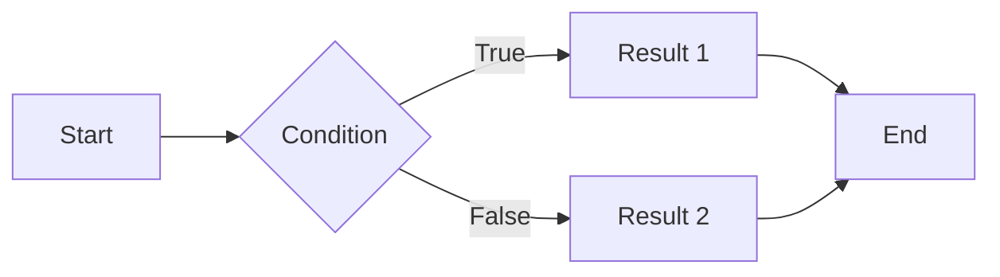

## **Introduction**

It's been nearly two years since [the first post](https://hyngng.github.io/posts/first-post/). Honestly, the post count isn't high for a two-year span, but that doesn't mean I lacked attachment. Between public and private obligations, and periods when my own activity lagged, I've still been managing this blog periodically.

Lately, while revamping the blog and applying for search engine indexing, I realized I've grown quite comfortable with the GitHub Pages platform. Writing posts has become noticeably easier than before, and with the leftover bandwidth I've been polishing the blog. Personally, choosing a GitHub blog felt like a bit of a gamble, yet I'm genuinely enjoying the platform's character — so I want to lay out what advantages made it appealing.

## **Free Customization**

{: .light .border }
{: .dark }
*Recently added feature to strip specific tags, and the screen showing it working*

GitHub blogs are generally far more difficult to operate than other platforms. They demand attention and hands-on configuration, which is a hassle — yet the reason people choose them is the sheer freedom of the operational experience.

Unlike other blog platforms that feel like closed gardens where you can only use features provided within certain fences, GitHub blogs hand you every piece of information that composes the page in a directly editable state. If you have frontend fundamentals, you can implement most features yourself. The main languages involved:

- Ruby
- Liquid
- SCSS
- JavaScript

In my case, I've already written two posts about [miscellaneous custom settings](https://hyngng.github.io/posts/first-blog-customization/) and [implementing a specific feature](https://hyngng.github.io/posts/blog-content-remove/). Beyond those, I've recently added a few gizmos without dedicated posts: LQIP preview images, an Instagram icon, an Applause Button.

That degree of customization freedom makes tinkering fun, and that fun becomes the motivation to keep running the blog steadily. I find myself constantly looking at the blog wondering how to improve it further, or browsing similar blogs for good ideas to adopt.

## **Posts in Markdown**

*Writing screen for the paragraph you're reading now*

Another major trait of GitHub blogs is writing posts in Markdown, a markup language. Markdown has pros and cons, but I find the upsides outweigh the downsides.

Once you're fluent in Markdown, the nuisance of clicking editor buttons every time you want bold, a blockquote, a horizontal rule, etc. disappears. With the syntax internalized, your hands stay on the keyboard, your eyes on the screen.
On top of that, the theme I use supports external modules well — [MathJax](https://www.mathjax.org/) for math notation, [Mermaid](https://mermaid.js.org/) for diagrams and charts — so writing feels less constrained, and I can focus on post quality instead.

For instance, with a little care, you can cleanly embed equations or diagrams like these in the post body:

**MathJax**
$$
\begin{equation}
  \sum_{n=1}^\infty 1/n^2 = \frac{\pi^2}{6}
  \label{eq:series}
\end{equation}
$$

**Mermaid**

There's also the perk of decent compatibility with Markdown-based tools like Obsidian. It's a bit clunky, but syncing Obsidian to mobile lets you edit posts on the go.

## **Useful Theme-Specific Features**

*Portion of the Chirpy theme's config screen*

I initially picked this template for its clean design, dark mode toggle, and related-post recommendations, but using it revealed quite a powerful set of built-in features. If you're launching a GitHub blog with this template, the following are worth mastering:

- Google Search Console & Analytics integration
- Separate images for dark/light modes
- LQIP (low-quality image placeholders), PWA (web app)
- GitHub-based comment systems: Utterances, Giscus

These are all easy to overlook, but leveraging them well improves the overall experience for both writer and reader. Done right, you can smooth out the moment images load, or even let visitors install your blog as a dedicated app on their phones.

On top of that, handy features like adding drop shadows to images or aligning images and text side-by-side are available, and MathJax/Mermaid are well-supported at the template level — all of which I've found genuinely useful.

## **Closing Thoughts**

The trade-off is that it's a bit difficult. If you're not a developer, you need some familiarity with GitHub and the technical makeup of web pages to operate smoothly. As the [Chirpy official writing guide](https://chirpy.cotes.page/posts/write-a-new-post/) shows, even just writing a post requires learning some syntax. Ad insertion and post exposure are also cumbersome since there's no built-in integration service — external procedures are involved.

Even so, I think a GitHub blog can be the best experience for anyone who wants to reduce platform dependency or has strong technical curiosity. It's definitely not easy, but 90% of functionality works out of the box, so it's not hopelessly hard. Add in low platform lock-in and the ability to run the blog exactly how you want, and once you're acclimated it's not just doable — it brings a unique sense of achievement and fun in itself.