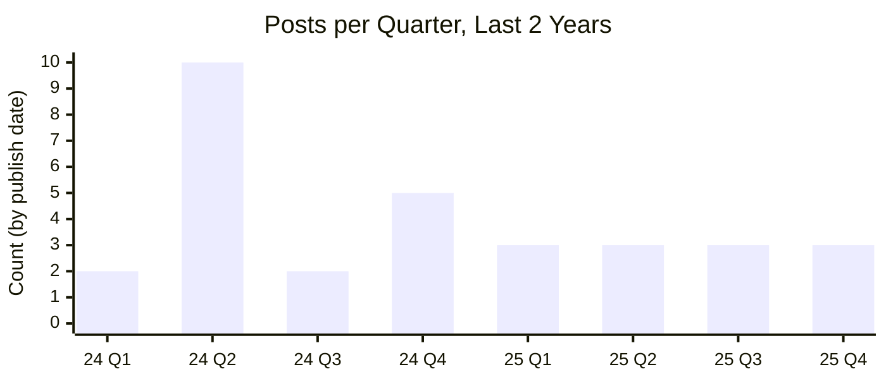
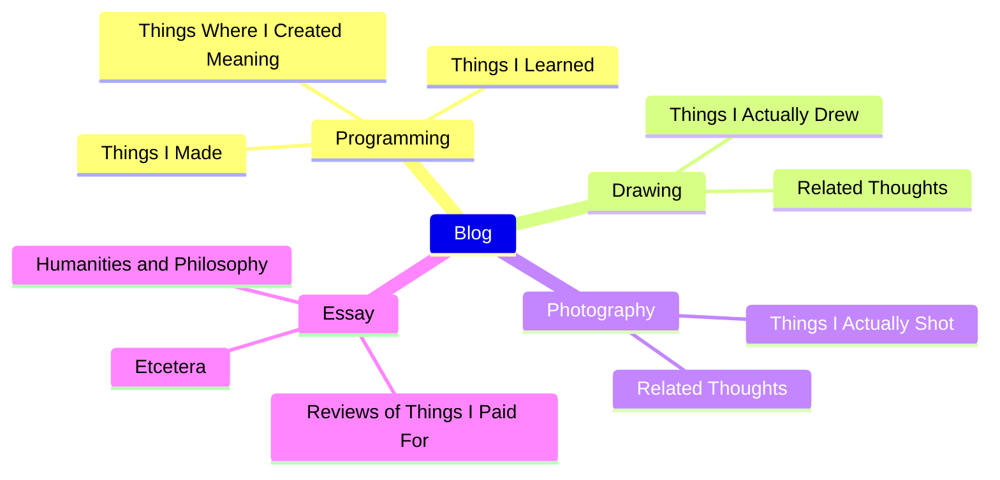

## **Why Did I Start This Blog?**

Excluding this post, I've written 42 posts total. Rewinding to the beginning: the impetus was partly external. I saw another blog where someone had gathered their studies, technical notes, and self-devised problem-solving methods in one place, and it looked impressive. Naturally, my blog leaned toward a technical blog direction. That trajectory hasn't been bad, so I've kept it up intentionally. Going forward, I plan to keep posting about programming experiences and the difficulties encountered along the way.

Second, I wanted a space that explains me well. At some point, describing who I am to strangers became exhausting. That's also why this is a blog rather than mainstream social media like X, Threads, Facebook, or Instagram. Social media favors light, viral content but isn't a good environment for reasoned expression, and it can't authentically portray a single person.

The bottom line: I feel I've achieved both goals better than expected. Rereading past posts brings a quiet surprise, a certain reflection. It takes time and effort, but maintaining this blog is unquestionably one of my current strengths.

## **The Long and Short of It**

### **Principles for Consistent Writing**

Summarizing posts written since last year in two-month intervals yields the above. Since launching the blog, I've wrestled with how often to write. Last year I implicitly aimed for one post every two weeks, and actually hit 4–5 posts a month at times, but compromised on frequency for these reasons: more posts don't automatically make a blog richer. The more dependent I became on the blog, the harder it was to focus on my actual life, and higher output targets made quality harder to sustain.

Since 2025, I've kept a rhythm of roughly one post a month — whether early or late in the month. It's an implicit pattern, not a hard rule, but sustaining this pace for about a year has let me move between a busy life and the blog comfortably. Twelve posts a year isn't few; I consider this a sustainable long-term level, and barring special circumstances, new posts will likely keep appearing at this tempo.

### **Ongoing Blog Customization**

Perhaps because the blog's config files are always at hand, I find myself peeking at the page structure every time I write and making frequent tweaks. I've [customized before](https://hyngng.github.io/posts/first-blog-customization/), and at this point I'm still steadily adjusting to taste. A recent example: I disabled the dark/light mode transition animation. The theme has no option to turn it off, but it bugged me, so I found attributes where the theme-change effect was defined — like `id="post-preview"` — and overrode with `transition: none !important`. Clean transitions now.

Next, I found a bug in blog theme version `v7.3.1`: when the homepage preview image switches from LQIP to the original, the blur effect doesn't play. After lengthy debugging, I fixed it and [filed an issue](https://github.com/cotes2020/jekyll-theme-chirpy/issues/2537). Two and a half weeks later, the developer confirmed the problem, a [commit reflecting my perspective](https://github.com/cotes2020/jekyll-theme-chirpy/pull/2551) was created, and soon after, the fix shipped officially in [v7.4.0](https://github.com/cotes2020/jekyll-theme-chirpy/blob/master/docs/CHANGELOG.md#740-2025-10-19).

### **Ramblings on Search Engines**

I've [written about this once before](https://hyngng.github.io/posts/webmasters-and-seo/), so treat this as an epilogue. First, webmaster tools demand patience. Immense patience. Especially Google Search Console: normal search exposure can take six months after registration, and even after ample time, low page authority can throttle crawler activity. My impression — possibly inaccurate — is that domain authority matters far more for indexing than how well SEO is implemented.

Bing once suddenly dropped my index. Precisely, Bing classifies pages into "Indexed," "Error," "Warning," or "Excluded." Every page of my blog moved to "Excluded" and vanished from Bing search. No hosting or `robots.txt` issues existed, so on August 13 I [contacted Bing Webmaster Tools support](https://www.bing.com/webmasters/support). On August 30: "We have reviewed your site and sent it to our Product Review group for further assessment." On October 3: "I am happy to inform you that the issue related to your site has been resolved." About a month and a half later, the index was largely restored, and search exposure works normally now.

## **Personal Writing Principles**

### **A Scattershot Blog Character**

As of writing, the blog's subjects roughly break down as above. It's varied — generously, "rich"; critically, "ill-defined." Mixing many topics is actually disadvantageous for SEO, yet I write across a range of subjects with some rationale. One premise: a blog is a personal space for writing freely, and I should never have to self-censor on my own page. If my interests are genuinely scattered, my writing naturally reflects that.

It may sound critical, but running a blog based on what's trending on social media or what commands high ad rates — the common case — erodes a personal blog's meaning long-term. Given that the act of writing already makes you a writer in the dictionary sense, the writer's subjectivity should take about 51% priority over the reader's taste. This space exists to explain me well, so covering multiple topics is intentional.

### **Deliberate Style-Switching**

Early on, I wrote in first-person deconstruction. Later, I tried the formal "hasipsio-che" (honorific) style with a hypothetical reader in mind. Both felt awkward until I noticed that critic Kim Hye-ri's film reviews sometimes use free-form sentence endings. The idea that each work deserves its own fitting form, and that this philosophy is worth practicing, was persuasive — I wanted to adopt it.

I've never tried this before, so it's a bit of a gamble how it'll land with readers. But in [recent posts like this](https://hyngng.github.io/posts/finding-camus-in-goryeo-history/), I've tentatively distinguished sentence endings from other pieces, and it makes the writing feel more candid and the process more enjoyable. Going forward, I'll chase variety over consistency — not just sentence endings, but paragraph structure, length, narrative perspective — and try to keep things fresh.

### **Choosing Anti-Authoritarian Expression**

Like naming variables in programming, I often deliberate between multiple phrasings when writing. My criterion for "good expression" focuses on semantic clarity over rhetorical flourish — how much I can lower the abstraction level of the context — and I apply this seriously. Even published sentences reveal regrets over time, so I hunt down and refine bog-che (bureaucratic style), translationese, and sentences veering toward run-on structures that weaken communication.

Similarly, when choosing words, I'm conscious of linguistic hierarchy. I prefer native Korean words first, then Sino-Korean and loanwords as needed. The logic: native words belong to the vetted canon; loanwords risk remaining fleeting trends. Rather than dogmatically trusting this tendency, what matters is picking the expression that conveys meaning most precisely at that moment. But prose heavy on loanwords can project a show-of-expertise vibe, so when a loanword isn't more precise than its native counterpart, I deliberately avoid it. In situations requiring technical terms, I first consider whether spelling it out in plain language would be better.

### **Respecting the Reader, Slow Tempo**

I avoid bold text. Bold clarifies emphasis, but that effect is realized conveniently through visual highlighting — and it carries the side effect of over-prioritizing the writer's particular opinion. Sure, some contexts demand it: movie posters, product ads, commercial settings. But in an archive-heavy environment like this, it's better for the writer to strive sincerely for persuasive phrasing. Minimizing markdown flourishes like italics and strikethroughs stems from the same reasoning.

Likewise, I stick to long-form writing. I avoid the habit of cutting posts short, and when new information belongs, I'd rather append to an existing post than spin off a new one. This, too, swims against today's trend of short, punchy, mobile-first content. I accept the disadvantage because I want what I write now to survive as good writing in the future, not evaporate.

### **Conservative Approach to AI**

Unlike code, for writing I stick to traditional methods without help from ChatGPT, Gemini, Claude, or other LLM services. I write to review, improve, and out of attachment — outsourcing composition defeats the purpose. If I can fully own a topic, I can write well without outside help; if I can't, getting intimate with the material comes first. That's not total exclusion — I'm exploring healthy uses of generative AI. Lately, I've used it to compare my draft against a piece I admired, or to audit specific phrasing.

Notably, recent models like ChatGPT 5, Claude 4.5, and especially Gemini 2.5 Pro (which has felt highly proficient with language since launch) offer meaningfully referenceable responses. They excel at overall impression, problem-spotting, word alternatives, sentence condensation and expansion — superb for editing if you also cross-check with a dictionary. Hallucinations still demand strong vigilance. Later releases tend to confidently spout misconceptions in niche areas, so I verify against official guidelines or occasionally books and papers before incorporating anything.

## **Business as Usual Going Forward**

At launch, I had plenty of material to enrich the blog: basics of international relations like political realism vs. idealism; linguistics topics like Indo-European languages and typology, Mongolian and Manchu script similarities, origins of Sino-Korean readings in modern Korean; illustrated stories tying into AI's rapid advance; physical limits of CMOS image sensors and mitigation strategies. It's a shame none became posts due to "no time," but the interest persists. I'll likely write on similar themes someday.

One more thing: recent AI advances are supposedly shrinking internet search, and some say traditional blogs are dead. Search-engine symbiosis is weakening, ad revenue is dropping, and many are losing motivation to maintain blogs. The indicators back this up, so my blog will undoubtedly become harder to discover. But since my primary purpose is self-consumption rather than information sharing, I can continue without much shake-up.

I've read that very few blogs last over a year. If true, I'm past that first hurdle — heading into year four. Personally, I want to keep this going for a long, long time.