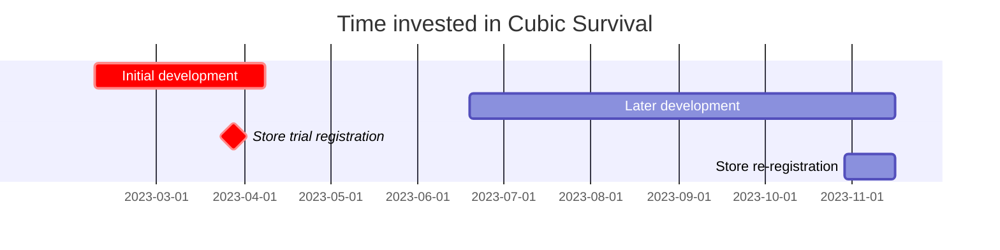

---
image:
    path: /2023-12-22-palette-first-devlog/gameplay.webp
    lqip: data:image/webp;base64,UklGRrYAAABXRUJQVlA4TKoAAAAvD8ABAHW4jWxbbfp4JJmZmSml0LH7L0Mq4pgVtG3DuOOPdQge4zaSFHVVH9P78o+T+j8BbhLNGhMUUL7GTwDFP6j3DTiLqMug0k4+RlwpOQFUC2jKxL/yzX0tKUApmm8sxu7n4LvlOeUbSBnGjBjAWUR/xmX1IQt/X/KSXVS1BnsLKLMeGqGJGl7KM5cUhbtrZyZYxL+CgfcTwNUUcJMaRE0DKQrAqa8oAA==
    alt: Example gameplay
    
title: "'Cubic Survival', Conception and Development Process"
authors: ["dev"]

categories: [마일스톤, 게임 개발]
tags: [마일스톤, 게임 개발, 유니티, C#, URP, 큐빅 서바이벌, 기획, 개발일지]
start_with_ads: true

toc: true

date: 2023-12-20 19:18:00 +0900
last_modified_at: 2023-12-22 20:42:00 +0900

mermaid: true
---

## **Making a Game**

In the new year of 2023, I needed to find something to do. I wanted to make something that would help me improve my programming skills while also being enjoyable for me. After the New Year's bells rang, I drew up a few plans the next day.

I came up with a few ideas: a Python library based on the 5W1H principle, a mirrorless-style camera application, and a 2D mobile game. Each was derived from my experience making [a Python-based program](https://hyngng.github.io/en/dev/astp-devlog/), building simple applications with Android Studio, or my [previous Unity project](https://hyngng.github.io/en/dev/lavad-devlog/).

But game development looked way too fun. My previous experience with Unity had left a strong impression, and the idea of being able to create and use my own assets was incredibly appealing. Even though it would be a lot of hard work, the theme of making a program with my own unique material that you couldn't find anywhere else felt very attractive. Plus, I was enjoying object-oriented programming at the time and wanted to use an object-oriented language properly, so I decided to start making a 2D mobile game.

## **Project Overview**



Since the development period is divided into early and late stages, I'm going to briefly review each in two separate posts. Therefore, this post covers the initial development highlighted in red on the chart above.

I started this project lightly, thinking I'd just quickly check out the features of object-oriented programming and move on. I never expected to become so attached to it. As a result, this project had no systematic plan or goals; at most, I had a few vaguely hopeful points like the ones below.

- [x] I want to create a visually minimalist design.
- [x] I want to implement smooth camera movement.
- [x] I want to effectively apply object-oriented design.
- [x] I want to try using coroutines.

Given the long development period, I ended up achieving these goals one by one. How and where each was accomplished is a long story, so I'll cover them in detail across this post and the next.

## **Initial Development Process**

{: w="960" }
*At first, I thought it would be nice if some event occurred every time I defeated a few enemies*

Initially, I started with clone coding. My approach was to pick a well-known game and try to replicate what I could, starting small.

The first game I referenced was Brawl Stars, which I have fond memories of playing with friends back in high school. Rather than trying to copy the entire game system, I used it more to get a sense of what a "2D mobile platform should feel like."

### **Joystick**

{: w="960" }

I wanted to implement a joystick that would look at home in a typical 2D mobile game. I made one joystick on the left for player movement and another on the right for aiming.

To build it, I used the `OnScreenStick` class from the `UnityEngine.InputSystem.OnScreen` package, creating two new scripts based on this class that would `Translate()` the player and a transparent aiming object respectively, according to their phase difference. Since there wasn't much Korean documentation on the `OnScreen` package, I heavily referenced the [official documentation](https://docs.unity3d.com/Packages/com.unity.inputsystem@1.7/api/UnityEngine.InputSystem.OnScreen.OnScreenStick.html?q=OnScreenStick).

As a side note, I had many ideas I wanted to implement — visually connecting the stick and center point with a LineRenderer, giving the stick an elastic feel so it bounces back to center, or making joystick controls vary by weapon — but my skill was lacking at the time, and some ideas conflicted with the game structure, so I couldn't implement them. Instead, I only managed to add vibration feedback when pressing and releasing the joystick.

### **Enemy Spawning and Behavior**

{: w="960" }
```cs
void spawnEnemy(GameObject Enemy, float east, float west, float south, float north)
{
    float spawnPointX = Random.Range(west, east);
    float spawnPointY = Random.Range(south, north);

    instantiatedEnemy = Instantiate(
        enemy,
        player.transform.position + new Vector3(spawnPointX, spawnPointY),
        transform.rotation
    );
}

IEnumerator spawnEnemies()
{
    for (int i = 0; i < data.spawnCount; i++)
    {
        spawnEnemy(Enemy, east, west, south, north);
        yield return new WaitForSeconds(spawnDelay);
    }
}
```

At first, I made a portal object that would instantiate enemies at designated points, but the result looked too monotonous, so I wrote the code above to spawn enemies around the player.

Based on the four parameters `east`, `west`, `south`, `north`, the code generates random coordinate values at a certain distance from the player. I made sure the coordinates were outside the rendered screen area so enemies wouldn't suddenly appear right next to the player.

In Unity, adding a delay isn't as simple as calling `Delay()`. Most sources recommended using coroutines for this kind of thing, which became my first experience using them. I created a coroutine that spawns enemies at intervals determined by the `spawnDelay` value.

```cs
void Move()
{
    dirTowardsPlayer = (player.transform.position - gameObject.transform.position).normalized;
    transform.Translate(dirTowardsPlayer * speed * Time.deltaTime);
}

void OnCollisionEnter2D(Collision2D collider)
{
    if (collider.gameObject.tag == "player")
    {
        player.hp -= damage;

        Vibration.Vibrate((long)20);
        Destroy(gameObject);
    }
}
```

Enemies basically move toward the player. On collision with the player, they reduce the player's HP by `damage` with vibration feedback and are `Destroy()`ed.

### **Inventory and Items**

As the game structure began to take shape, I thought it would be nice to have an inventory where I could store items and retrieve them later. This was a point where I did some serious thinking, because many games either have inventory UI as a separate window or don't have one at all, using button toggles instead. Neither option satisfied me.

Instead, I aimed to create an inventory that could hold multiple items without the UI interfering with the gameplay experience. So I replaced the manual aiming function assigned to the right joystick with auto-aim and assigned a new inventory access function instead. Pressing and holding the right joystick opens the inventory, and releasing it closes the inventory.

{: w="960" }
```cs
public struct InventoryData
{
    public string[]     Code;
    public GameObject[] UI;
    public GameObject[] ItemUI;
    public GameObject   Weapon;
    public int[]        Rounds;
}

for (int i = 0; i < InventoryData.InventoryUI.Length; i++)
    InventoryData.UI[i].transform.position = Vector3.Lerp(currentPos, targetPos[i], 2*t);
```

The inventory uses 8 objects that fan out around the player when accessed. To manage all the data needed for inventory access (item identifiers, inventory objects, item objects, weapon data, ammo, etc.), I created a struct like the one above.

I split items into two objects: one for spawning on the field and one for UI display. When the player picks up a field item, the item UI object is added to the `ItemUI` array.

|Item|ID|
|---|---|
|Pistol|WPPSTL|
|Shotgun|WPPASG|
|Minigun|WPMING|
|Movement Speed Passive|PVMSPD|
|Attack Speed Passive|PVATKR|
|...|...|

Item identifiers were structured so that a 2-character type prefix is followed by a 4-character item name. What's interesting is that I didn't realize it at the time, but as items kept accumulating and I naturally thought, "I need to give each one a unique code for identification," I later learned this concept is called an "identifier." It turned out to be quite useful, so I plan to keep using it in the future.

### **Weapon Firing**

{: w="960" }
```cs
if (shotTimer > fireThreshold)
{
    for (int i = 0; i < bulletCount; i++)
    {
        instantBullet = Instantiate(
            bullet,
            FirePosition.transform.position,
            Quaternion.Euler(
                0, 0, transform.rotation.eulerAngles.z + Random.Range(MOA * -1, MOA) + 180
            )
        );
        Destroy(instantBullet, 1);
    }
}

shotTimer += Time.deltaTime;
```
```cs
void hasHitEnemy()
{
    hit = Physics2D.Raycast(transform.position, transform.right, 100);

    if (hit.collider != null && hit.distance < 1)
    {
        if (hit.collider.gameObject.tag == "enemy")
        {
            if (hit.collider.GetComponent<Enemy>().HP > 0)
                Destroy(gameObject);
            /* ... */
        }
    }
}
```

Bullets are spawned from the `FirePosition` child object of the weapon object, travel straight in the direction the player is aiming, and are destroyed after 1 second. To implement bullet spread, the Z-axis angle is slightly adjusted using `Random.Range()` within the `MOA` variable value specified for each weapon when the bullet is spawned.

Collision detection was done using raycasts. However, perhaps because the bullet speed was too fast, even raycasts weren't detecting collisions properly, causing bullets to pass right through enemies. Increasing the ray length or expanding the collider range didn't solve the problem, but adding the `hit.distance < 1` condition did.

After implementing everything, I discovered that for cases where object instantiation happens frequently — like bullet firing — there's an optimization technique called Object Pooling. I plan to apply it when I have time in the future.

## **User Experience Design**

If the previous section was about "wanting to make an action game where you walk around a field defeating enemies," this section is about "wanting to implement smooth and unique user experiences." I think most of the proper visual work was done during the later development stage, so I'll cover that in the next post.

### **Camera**

{: w="960" }
```cs
void Move()
{
    transform.position = Vector3.Lerp(
        transform.position,
        player.transform.position,
        Time.deltaTime * moveSpeed
    );
}

void Vignette()
{
    targetVignetteValue = inventoryIsOpen ? 0.35f : 0f;

    vignette.intensity.value  = Mathf.Lerp(
        vignette.intensity.value,
        targetVignetteValue,
        Time.deltaTime * vignetteSpeed
    );
}
```

There's an option called Vignette that I've often noticed while editing [photos](https://hyngng.github.io/posts/photos-of-imin/). It darkens the edges of the screen to draw attention to the center. Coincidentally, Unity's [post-processing](https://docs.unity3d.com/kr/2020.3/Manual/PostProcessingOverview.html) has the same option, and I thought it would be perfect to apply this effect when the inventory is open.

So I set the vignette value to around 0.35 when accessing the inventory. Like the camera movement, I made the vignette transition smooth using Lerp. During development, I found it difficult to get the `vignetteSpeed` and `moveSpeed` parameters to feel exactly right. I'd play, tweak, play again, tweak again, and then come back to adjust them later when I wasn't satisfied — I spent the entire development period searching for the right values.

### **URP**

{: w="960" }
*A shadow is cast behind the enemy each time a weapon fires.*

At first, I was using the default lighting effects of the Unity2D environment, but I found several things lacking. When I applied [URP (Universal Render Pipeline)](https://unity.com/srp/universal-render-pipeline) as an alternative, the visuals improved dramatically. It provides beautiful, smoothly-falling light effects by default, and I found it really useful — I could create more subtle or vibrant light by adjusting options like Falloff Strength, or use the Shadows option to create light and shadow effects as shown above.

However, when I later added Light2D to every bullet and enemy, the phone started heating up quickly. It seemed to consume quite a bit of GPU resources, so I couldn't use it aggressively and ended up keeping it only for enhancing the fire effects when weapons are fired.

## **Closing**

I've briefly summarized the initial development activities. One thing I noticed while writing is that my memories from this period aren't as vivid as I thought. I feel like I couldn't capture all the thoughts and efforts, so next time I'll try to jot down notes more frequently along the way.

Still, going through the process of implementing things myself taught me that game development is a much more sophisticated endeavor than I had imagined. In particular, I gained a new appreciation for other games that successfully sought out and implemented new paradigms instead of following popular trends. And personally, as someone who admires that kind of thing, I felt a bit of ambition creeping in.
