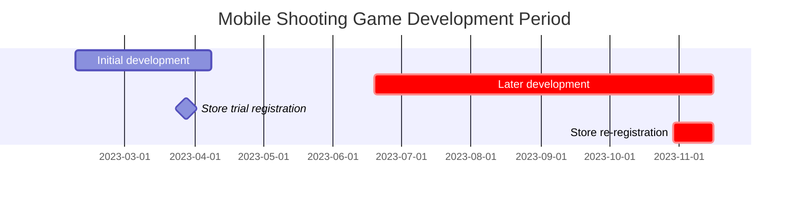
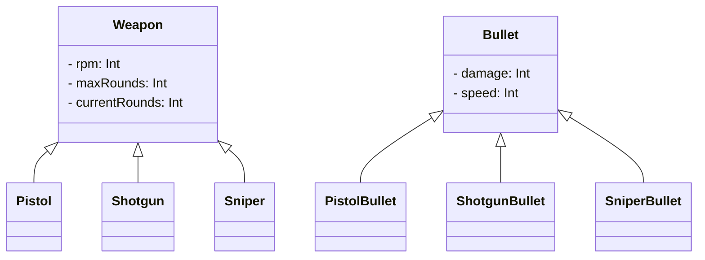

---
image:
    path: /2023-12-24-palette-second-devlog/gameplay.webp
    lqip: data:image/webp;base64,UklGRp4AAABXRUJQVlA4TJIAAAAvD8ABAHW4jW07cZZZFK05opg5dwVuh0KP63YPX9K8r/lX2LbdtG3b9v9P9+h/Fb0HJzN7K5b4l9pKtZWb2R27bhXcyUFTG7pYJHM/j3G0hVQBKFLpYAoBjtvQBBaj0oVxD4yYgvfcVhMW4nXznn2YZdIpqKutlAY8G6Tyuj7Ai/m2hX8hYgZqSjLIlVXcBu+9t4FzCAA=
    alt: Example gameplay
    
title: "'Cubic Survival', Development and Release Process"
authors: ["dev"]

categories: [마일스톤, 게임 개발]
tags: [마일스톤, 게임 개발, 유니티, C#, URP, 큐빅 서바이벌, 개발, 개발일지]
start_with_ads: true

toc: true
toc_sticky: true

date: 2023-12-22 22:38:00 +0900
last_modified_at: 2024-03-20 17:38:00 +0900

mermaid: true
---

## **Why I Resumed Development**

:::info
Continues from the [previous post](https://hyngng.github.io/posts/palette-first-devlog/).
:::



When March came and the new semester started, I kept working on the game's basic systems — like the player inventory — for about the first month. But as exams approached, the pressure broke my development flow. However, after finals ended in June, I found myself with free time again, so I decided to pick up the game I'd been working on.

During the two months of summer break, I focused on visual aspects like image assets and particle effects and found myself intensely interested. Beyond the impression that the game was improving effectively, the very act of intentionally creating a unique feel that you couldn't find elsewhere felt incredibly special. Experiences like this seemed rare, so in the second semester, I took a gamble: I decided to keep up with classes and exams but invest as much time as possible in game development.

Thus, this post focuses on what I made and how I made it for all the remaining parts during that period.

## **Making Weapons**

### **Firing Animation** {#weapon-animation}


```cs
if (shotTimer > fireThreshold)
{
    WeaponAnimator.SetTrigger("Fire");
}

shotTimer += Time.deltaTime;
```

I created firing animations using Unity's animation component. Unity's animation component supports not only traditional cut-out animation by swapping sprite images but also animation that directly adjusts the position of child objects. By appropriately using both types, I made the weapon play corresponding recoil animations when fired.

For the muzzle flash effect played at the barrel tip, I applied a blur effect to the image itself, exaggerated the sprite's size to reduce awkwardness, and added the light effects provided by URP along with post-processing Bloom. This helped reduce the impression of being too plain and created a flashy, eye-catching effect.

{: w="480" }
{: w="480" }

The images composing the muzzle flash animation were made using Clip Studio's animation features. Since creating animation sprites by hand is essentially digital grunt work, I considered using official assets provided by Unity instead. But none of them had the feel I wanted, so I ended up drawing them myself. While making them, I studied [other shooting animations](https://www.youtube.com/watch?v=kAafHZcT2fc) frame by frame, slowly working toward the feel I wanted.


To reduce the awkwardness when swapping weapon objects, I also created a weapon-specific chamber check animation that only plays when switching to or obtaining a new weapon. I added a brief delay to player controls while the weapon is being manipulated, and after applying it, the play experience felt much more organic, which was satisfying.

### **Enemy Hit Effect**


```cs
public void Hit()
{
    ParticleSystem hitEnemyParticle = hit.collider.GetComponent<ParticleSystem>();
    hitEnemyParticle.Emit(particleNumber);
}
```

Hit effects were created using the particle system. At first, I simply implemented particles moving in random directions with gradually decreasing speed, but the result felt more awkward than I expected.

This was solved somewhat by chance. When I set the linear velocity and orbital velocity to "Random between two curves" in the Velocity over Lifetime module and twisted the graph twice, it created a dust-like effect, so I went with that. It looks good visually and provides a decent sense of impact.

### **Ammunition System**


```cs
public virtual void Update()
{
    if (roundsCurrent > 0)
        Fire();
    else if (!WeaponAnimationInfo.IsTag("Weapon_Reload"))
        WeaponAnimator.SetTrigger("RoundIsEmpty");
    else
        roundsCurrent = roundsMax;
}

public virtual void Fire()
{
    if      (currentRounds == 1) WeaponAnimator.SetTrigger("FiredLastRound");
    else if (currentRounds > 0)  WeaponAnimator.SetTrigger("Fired");

    roundsCurrent -= 1;
}
```

I created a feature to display remaining bullets. When bullets reach 0, the reload animation plays, and when the reload animation finishes, the ammo count resets to the weapon object's maximum ammo value. Like the player's HP, the ammo UI is simply displayed as a game object above the player's head.

I also added a bit of detail: if the weapon is switched before the reload animation finishes, a `GainedEmpty` animation — distinct from the `Gained` animation — plays when the weapon is picked up again later. The difference is that `GainedEmpty` starts reloading with the bolt locked back and the chamber visible. I took this from observing how many FPS games implement this detail.

### **Damage Effect**


The damage effect itself was implemented during the initial development, but since the behavior was driven by code rather than the animation component, and the visuals were quite lacking, I remade it. Instead of simply fading out, I made the effect's size and movement speed adjustable dynamically.

I also implemented a critical hit system alongside it. When damage is doubled by chance, a dedicated animation plays. To make it easy to tell when a critical hit lands, I differentiated the size and color of the critical damage animation compared to the normal one.

### **Weapon Variety**


```cs
public abstract class Weapon : MonoBehaviour
{
    protected int   RPM;
    protected int   maxRounds, currentRounds;

    public virtual void Awake()
    {
        /* ... */
    }
}
```
```cs
public class Pistol : Weapon
{
    public override void Awake()
    {
        base.Awake();
        
        maxRounds     = 10;
        rotationSpeed = 40;
    }
}
```

I didn't originally plan to focus on guns, but as I tried to reuse what I'd initially made, I ended up creating several gun-based weapons. While making them, I was conscious of object-oriented polymorphism. I put basic attributes like `RPM`, `maxRounds`, and `currentRounds` in the parent `Weapon.cs` class and had specific weapon classes like `Minigun.cs`, `Shotgun.cs`, and `SMG.cs` inherit from it.

This was my first time using inheritance, and it was definitely more efficient than my previous coding approach. Centralizing repetitive code at a lower level and calling it from the leaf code felt fundamentally different from using a library — it was unfamiliar and fascinating at the same time.

## **Making Animations**

### **Player Movement**


Using Unity's default square shape as the player felt too half-hearted, so I added a new body and moving legs. Depending on whether the player has pulled the joystick to its maximum range, either the walking or running animation plays appropriately.

To reduce awkwardness in the animation, I made the walking animation speed adjust dynamically based on how far the joystick is pulled, and also added the ability for the player to walk backward depending on the aim direction. For example, if the player is walking left but the enemy is on the right, the player slowly walks backward while aiming at the enemy. The result looks quite natural rather than awkward.

### **Experience System**


I created an experience system to alleviate some of the tedium during gameplay. When the player defeats an enemy, they gain experience. When enough experience accumulates, they level up and receive certain enhancements. The accumulated level appears as a score on the results screen at game over.

Initially, I made it so the player had to physically collect experience particles to gain XP, but as the game progressed into later stages, the increasing number of enemies made the screen too cluttered. So I changed it so that XP is awarded immediately upon defeating an enemy. After applying this change, it felt much cleaner — almost the standard approach.

### **Entering the Game Screen**


Personally, I prefer smooth transitions between scenes rather than abrupt cuts — it feels like the program is being considerate. I wanted to apply this to my game as well.

So instead of just switching scenes when the play button is pressed, I made the player appear from within a button-shaped object of the same size. When the button is pressed, the main scene's UI fades out smoothly, and the play scene's UI appears from the edges of the screen. While there are some rough spots that give away its amateur origins, I'm a bit proud of creating a unique experience that other games don't have.

## **Later Development: Other Work**

### **Image Assets**


*Drawn on a Galaxy Tab*

As [explained earlier](#weapon-animation), all image assets were made by myself rather than using the Unity Asset Store. After drawing the weapons in pixel art first, the style didn't feel awkward, so I made other images — enemies, hit effects, joysticks, experience bars — in pixel art as well. Pixel art was surprisingly low-pressure to create, giving me quite a bit of freedom to make multiple drafts or swap out existing images for new ones.

I mainly used Clip Studio to export images as transparent-background PNGs, then cropped them to their individual sizes before importing. All imported images were set as Sprite (2D and UI) with Filter Mode set to Point (no filter) and Max Size adjusted to match the image resolution.

### **Camera**

Through my [photography hobby](https://hyngng.github.io/posts/photos-of-imin/), I discovered that a lot can be expressed through field of view, and I wanted to apply this to my game. Since Unity's 2D environment renders scenes in orthographic mode, the concept is different, but I felt there was still room to think about how much to include in the frame from an abstract perspective.

<div class="row">
    <div class="col-md-6">
        
    </div>
    <div class="col-md-6">
        
    </div>
</div>

So I made the `Camera.orthographicSize` value — which governs the camera's field of view — dynamically adjustable to whatever value I wanted at any given time. For example, I thought it would be interesting to narrow the field of view during reloading or when starting a new game to express helplessness and tension. Building a test application and playing it myself showed the intention came through well and made the gameplay feel unique, which was satisfying.

### **Audio**

{: .light .border }
{: .dark }
*Critical hit sound effect*

Sound-related elements — background music, sound effects, etc. — were quite baffling to handle on my own. Unlike drawing pictures or writing code, I had zero knowledge about anything related to sound. I really didn't know where or how to obtain audio files, or how to edit them.

In the end, after a lot of random searching, I obtained free audio files from [Pixabay](https://pixabay.com/ko/sound-effects/) and [GDC Game Audio](https://sonniss.com/gameaudiogdc), then did some light editing — noise reduction, bass boosting — using the [Audacity](https://www.audacityteam.org/) audio editing program.

The results turned out decently, but the sound aspect left me quite baffled. If I ever make another game, I think I'll need to source sound effects and background music first before building around them.

### **In-App Ads**


```cs
void PlayerDied()
{
    ShowInterstitialAd();
}
```

This was implemented fairly early in the later development stage. Having worked with externally distributed modules like APIs and SDKs while making a [simple automated stock trading program](https://hyngng.github.io/posts/astp-devlog/), I was interested in them, so out of curiosity I created the ad-calling feature. When the player dies and transitions to the results screen, an interstitial ad appears.

I followed the [Google AdMob official documentation](https://developers.google.com/admob/unity/banner?hl=ko) while implementing it, and carefully going through the official guide made it much easier than I expected. The result worked cleanly, which was surprising.

### **In-App Purchases**

{: .light .border }
{: .dark }
```cs
void Purchase()
{
    if (playerDonateKimbab)
    {
        DonateKimbab();
        playerDonateKimbab = false;
    }
}
```

I also wanted to implement in-app purchases in the same vein. However, since the game doesn't have in-game currency or items, I made it in the form of donations. I came up with three food items — kimbap, fire noodles, and steak — registered them as in-app products in the Google Console, and set up the purchases to go through without any in-game rewards.

During implementation, I heard that security is something to be careful about when implementing in-app purchases. Since this project is very much a toy project and wasn't made for profit, it wasn't a big concern, but I thought I'd need to be more careful if I ever implement in-app purchases in the future.

## **Store Registration**

### **Preparing for Registration**

{: .light .border .w-25 }
{: .dark .w-25 }
*App logo*

For consistency, I made the app logo using the same image as the play button. For this project, store registration had a somewhat symbolic meaning — I didn't intend to attract attention with this game — so I accepted that the logo might lack intuitiveness. The app's package name was derived from the developer account and the project name I personally used, so I settled on `com.payang.palette`.

### **Store Registration**

{: .light .border w="960" }
{: .dark w="960" }
*Store listing information form in the Google Console*

I limited the app registration to the Play Store, so I used the Google Console. In fact, I had registered it once during the [initial development stage](https://hyngng.github.io/posts/palette-first-devlog/), but that was just out of curiosity to see what the app registration process was like and whether my app would actually appear on the store. After confirming it was registered properly, I immediately deactivated the app.

Then, after more than half a year passed, I felt that continuing to invest time in this project had become burdensome, but I also thought the game's quality had improved enough compared to the beginning. So I updated the app and decided to activate it. During registration, I rewrote the app name and description, and updated the app icon, graphic images, and screenshots with new ones.

{: .light .border w="960" }
{: .dark w="960" }
*The game on Google Play Store*

The app is now finally reactivated and available for download. It's been about a week since activation, and searching for the title shows it appearing without issues.

### **Promotion and Feedback**

Honestly, it's embarrassing to call it proper promotional activity. I'd never thought about promotion before, so it was difficult. But since what I made was a "game," I thought it would be nice if people actually played it, so I started looking into where and how to promote it.

However, since this game started more as a fun toy project that grew in scale rather than something made to be played from the beginning, I worried about whether promoting it was the right thing to do. And while the development process was enjoyable, promotion was a different matter — I felt embarrassed about putting my creation out there.

{: .light .border w="960" }
{: .dark w="960" }

Still, I gathered my courage and posted a short message on the overseas [Unity2D subreddit](https://www.reddit.com/r/Unity2D/comments/17p1toj/my_first_game_is_now_on_google_play_what_do_you/). I posted it hoping maybe 100 people would see it, but within a week the views surpassed 20,000, and after about a month, nearly 100,000 people had shown interest. I was truly amazed.

{: .light .border w="960" }
{: .dark w="960" }

Among them, a few people thankfully actually played the game and even left detailed feedback. The feedback included "the joystick position is fixed and can't be adjusted, which is inconvenient," "the Bloom seems excessive," and "it looks too similar to other games."

I agree with some of the feedback, but I don't want to proceed with further development right now. I plan to gradually make fixes when I have time in the future, or incorporate the feedback into my next project.

## **Closing**

:::tip
You can download and play it on the [Play Store](https://play.google.com/store/apps/details?id=com.payang.palette&hl=ko-KR).
:::

With this, the project that I poured a lot of time and effort into has come to an end. I spent about half a year focused on it, and seeing the app registered on the store brings up many thoughts, but personally, three things stood out the most.

- Making animations is fun and rewarding, but it requires an enormous amount of time since each one has to be done manually. Unless you're a professional animator, creating animations with the feel you want requires mental preparation, and making dedicated animations for each object is inefficient. I think it would be more efficient to design things so that multiple objects can share the same animation whenever possible.

- Making a project spontaneously in a bottom-up fashion without planning might be fun in a small-scale context, but it clearly has its limitations. Development flow would get interrupted, animation flow would get interrupted, and when I wasn't satisfied, I'd often revert or delete work I'd already done and start over.  
  Because of this, I kept feeling regretful that meticulous planning upfront could have prevented such inefficiency. So next time, I plan to invest heavily in planning at the beginning.

- Lastly, there's time management. This project was originally started during winter break as something short — at most a month. But because it was so fun, it turned into a summer break project, and nearly became another winter break project.  
  Game development alongside my studies was so enjoyable that academics slipped to psychological second priority. Naturally, my grades were affected, and I regretted not managing my time well.

Still, the making process itself was so enjoyable and rewarding that I think I'll probably pick up Unity again soon to create a next milestone that addresses these shortcomings. I want to apply the tips and patterns I've learned along the way, and besides, the first time is always the hardest — the second time shouldn't be as difficult. Still, if I do pick it up again, I want to take the game to the next level with more systematic planning and preparation.
