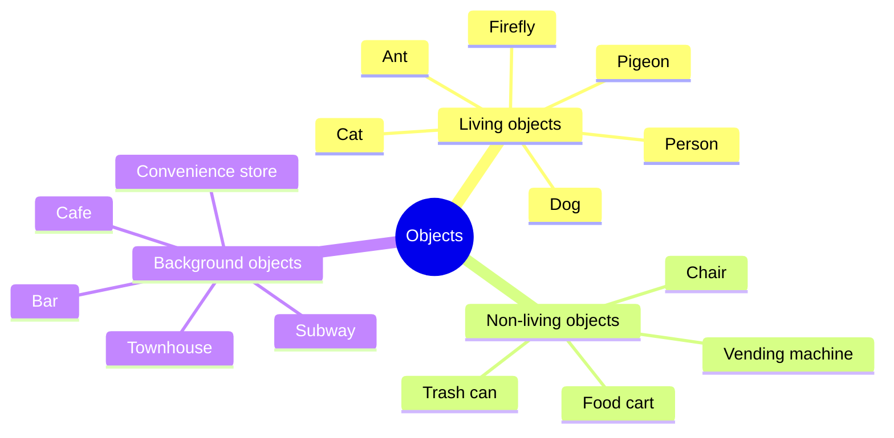
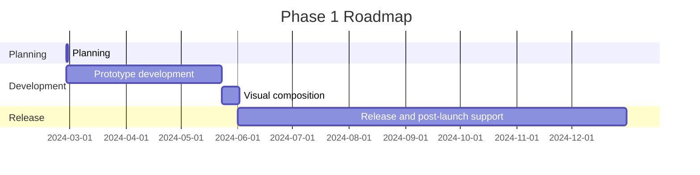

---
image:
    path: /2024-03-22-armonia-devlog-planning/preview-image.webp
    lqip: data:image/webp;base64,UklGRoAAAABXRUJQVlA4THMAAAAvD8ABAJUwiiRJkZtjZmbGF9s5Kyd1ScY8FbRt5MYA/F79RFEjSWpSxn2Zbw+m+z8BjqBzPlDmvL+4+00yVxL5ht9jZKHMSM22JRAbkUChuDviWIX4O+VnNh9jixzr0LjyndMjOUfNsQQDkKGXf/yfCzAGAA==
    alt: Something like this
    
title: "'Waybound', Planning a Game"
authors: ["dev"]

categories: [마일스톤, 게임 개발]
tags: [마일스톤, 게임 개발, 유니티, 행선지, 기획, 개발일지]
start_with_ads: true

toc: true
toc_sticky: true

date: 2024-03-22 19:24:00 +0900
last_modified_at: 2024-04-30 18:58:00 +0900

mermaid: true
---

## **Introduction**

After wrapping up my [previous experience](https://hyngng.github.io/posts/palette-developing/) and just as I was about to start a new Unity project, I rewatched a calm film I'd seen about ten years ago and started thinking about the influence experiences have. After organizing my thoughts a bit, I found myself wanting to create something like that — just as a good film leaves a lasting experience. I'd also had a general desire to make and express things anyway.

{: .w-50 }
*A rough concept art and plan drawn while chatting with a friend*

Focusing on experience, I conceived an environment where objects within the scene would interact with each other on their own, even without the player performing any actions — a game where you simply observe and wander around with no scores or game-over conditions.  
Based on this idea, I quickly sketched something out. The feel was better than expected, and the feedback from people around me was positive, so I began developing a plan around it.

## **Planning**

The most regrettable thing about my previous project was the lack of planning. Without reference metrics and a long-term plan, it was difficult to set the game's direction on a macro level, and on a micro level, it was hard to think about things like retention or profitability. So this time, I want to establish at least some planning upfront.

I looked for concepts that could help with game planning and came across something called a GDD (Game Design Document). It's a kind of game specification document with no fixed format, so I referenced the [GDD template created by Unity](https://connect-prd-cdn.unity.com/20201215/83f3733d-3146-42de-8a69-f461d6662eb1/Game-Design-Document-Template.pdf) and wrote out only the necessary parts in advance.

### **Light GDD**

- Basic Description
    - Name: 행선지 (English: waybound)
    - Genre: Side-scrolling adventure
    - Format: 2.5D mobile
- Gameplay
    - The player becomes a creature that makes up the environment — a person, dog, cat, ant, etc. — in a suburban setting and performs the interactions available to that creature. For example, a person can take a drink from a vending machine; a dog can sniff a bench on the street.
    - Even when the player isn't specifically controlling a creature, creatures interact with each other and shape the suburban atmosphere. Each creature has visual individuality within a given range.
- Key Features
    - Various interactions between objects
    - Hand-drawn images and cut-out animation
    - Changing experiences based on weather — rain, snow, etc.

### **Example Objects**



### **Example Interactions**

```mermaid
graph TD;
    Person -- Buy a drink --> Vending machine;
    Person -- Walk --> Dog;
    Person -- Pet --> Cat;
    Person -- Look at --> Firefly;
    Person -- Sit on --> Chair;
    Person -- Buy food --> Food cart;
```

## **Goals**

### **Technical Goals**

Previously, I had a lot of confusion when naming variables and functions. I couldn't maintain either consistency or intuitiveness, making it increasingly burdensome to read and modify the code.

Then I came across [a post about naming conventions on the Unity blog](https://unity.com/how-to/naming-and-code-style-tips-c-scripting-unity) and was a bit shocked. If only I'd known this from the start, it would have been so much more convenient. It gave me a clear understanding of when and what to use for variable and function names in C#, and what practices to avoid.

As I looked for more conventions I should know about, I also discovered an e-book published by Unity called ["Level up your code with game programming patterns"](https://blog.unity.com/games/level-up-your-code-with-game-programming-patterns). I read through it carefully and learned about various usable techniques — SOLID principles, factory patterns, state patterns, and more. Based on that, I searched for derivative patterns and developed some things I wanted to try for more systematic code design. Summarizing, I came up with the following:

- PlasticSCM
- Event-driven programming
- Procedural animation
- Strict naming conventions

Among these, PlasticSCM is a version control system (VCS) meant to replace GitHub, which I plan to use to save my work intermittently during development. Event-driven programming and naming conventions are core to the development capabilities I want to gain through this project. Besides these, I also have smaller goals like better utilizing things I'm not yet comfortable with — singleton patterns, coroutines, delegates, get-set properties, and so on.

### **Artistic Goals**

The basic goal is to depict the everyday atmosphere around us through the experience of line and image in motion. I want to express those things in a way that's sufficiently visible but not overwhelming. I'm aiming for a cinematic feel if possible, and specifically plan to use the following:

- Cut-out animation
- Dynamic depth of field
- Tone curve

Overall, I'd like to make it engaging enough that the user can simply sit and watch the game screen and still be entertained. However, I do wonder whether I have the skill for that. In particular, I've heard that drawing the movements of animals — dogs, cats, pigeons, etc. — through cut-out animation is the domain of professional animators. I don't need to create animations that precise, but since I lack background knowledge and experience, I expect there will be trial and error.

## **Roadmap**


