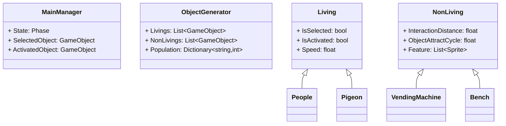
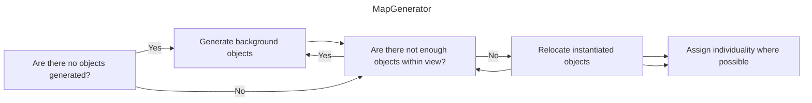
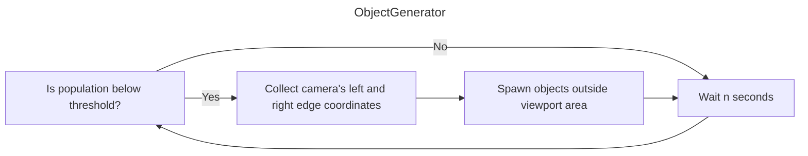
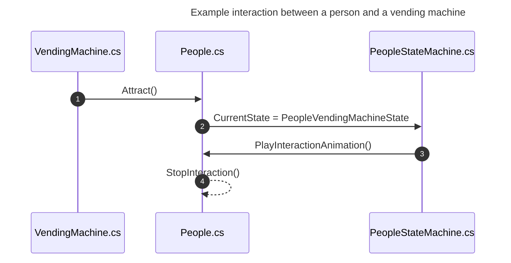
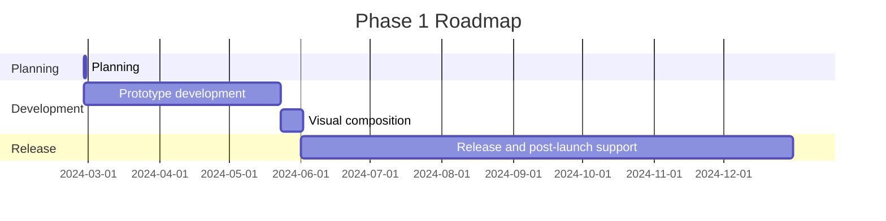

---
image:
    path: /2024-04-30-armonia-first-devlog/gameplay.webp
    lqip: data:image/webp;base64,UklGRiQBAABXRUJQVlA4TBgBAAAvD8ABAM1kRP9jE+UpQv/D4CCSJEXqOXpmBhts/1W8BGZa6B0bG44kyW2bnQUUHM7+//t8zQmA2wiMHEXSexc+ENN/QdRAxJC9WSlicZYaCiHEiBEEBULCMMoQhMMi0bv93TqZbAMSDEWRd+s75TKrKm4VicC+vLm9fnxs++PKnIq5yl2/HI/H7Znt/PFTbA+vP6RcraP+/u4u769YybUSgygQFMaTzCmCmruS9R8Wur+T874jmH1RRSUTIWlnwwMxK3/FTqFkkIRu7it/NDlMKxKqKhJtqW+MXnKWekjlKoNGylt4ripQbry6Ou5Me5Ctq6J0E8qGQe2+v3Tlrj/5bLz7VimPuFYRKZDFKkBIEQUROUhNEJEA
    alt: Prototype under development
    
title: "'Waybound', First Development Log"
authors: ["dev"]

categories: [마일스톤, 게임 개발]
tags: [마일스톤, 게임 개발, 유니티, C#, 행선지, 개발, 개발일지]
start_with_ads: true

toc: true

date: 2024-04-30 18:14:00 +0900
last_modified_at: 2024-05-23 23:11:00 +0900

mermaid: true
---

## **Introduction**

:::info
Continues from the [previous post](https://hyngng.github.io/en/dev/armonia-devlog-planning/).
:::

This is the development log for my [fourth milestone](https://hyngng.github.io/categories/%EB%A7%88%EC%9D%BC%EC%8A%A4%ED%86%A4/), which I'm tackling again because it's fun. I needed to organize my notes and do a mid-point check, so I've briefly summarized what I made in about a month. Here's what was accomplished in this development phase:

- Game Systems
    - [x] Smooth camera movement with touch input
    - [x] Selection, control, and interaction of on-screen objects
    - [x] Ensures object count stays below a certain limit
    - [x] Some objects acquire random individuality within a specified range
    - [x] Ensures objects only exist within the camera's view

- Added Objects
    - [x] 2 types of living objects (Person, Pigeon)
    - [x] 7 types of background objects (House, Subway, etc.)
    - [x] 6 types of street objects (Fire hydrant, Traffic cone, etc.)

## **Archive**

{: .w-75 }
_When people were implemented. The player can become any object and interact with the surrounding environment._

## **Asset Production**

### **Image Assets**


_Background images I drew_

I created background image assets by looking up city illustrations, neighborhood building photos, and street views to reference for a suburban feel. To keep the possibility of localization (language translation) open, I avoided text-based elements like advertisements, newspapers, or signs with calligraphy. I also wanted a hand-drawn feel, so I used rough-textured lines and deliberately avoided straight-line tools. The result turned out a bit crooked but clean, which I'm satisfied with.

It's gratifying, but I think the resolution might be too high. I tried downscaling the images, but since they weren't originally created at a low resolution, they looked quite smudged and didn't turn out well. I think I could have achieved the same feel by drawing at a lower resolution from the start, so this part is a bit disappointing.

### **Sprite Shader**

This was a challenge I encountered during development. Objects in this project commonly use the sprite component, but none of Unity's default shaders for sprites support receiving shadows, so I'm using one made by someone else.

It works well, but since it's fundamentally an Unlit shader, it doesn't cast shadows. I wanted objects to cast shadows on each other, so I looked further into it and found that Unlit shaders simply cannot implement the Cast Shadow feature. I need a shader that can be applied to sprites and cast shadows without reflecting light, but since I'm a complete novice when it comes to shaders, implementing it myself is difficult. I'll need to look into this further.

### **Animation Assets**

{: .light .w-25 .border }
{: .dark .w-25 }
_Pigeon in flight_

I also drew animations myself. For example, pigeon movement was hard to handle with Unity's animation component alone, so I drew frames one by one and stitched them together like traditional animation. I'd never drawn animal movement in animation before, so I looked up videos of pigeons walking and flying to observe and draw them.

Rather than creating and using simple single animations, I subdivided the animation flow into phases. For instance, the pigeon's flight was split into three separate bundles: an EnterFly animation for launching into the sky, a BeingFly animation for hovering in the air, and an EndFly animation for landing on the ground. These were then linked with the state pattern. As a result, the output looks quite convincing, as you can see in the [Archive](#archive) above.


_Walking person and atmospheric fireflies_

For the most part, though, I used Unity's animation component as shown here. The example above shows a scene where the walking animation's horizontal flip and playback speed are automatically adjusted based on the person's position changes. It's hard to tell because I didn't capture the footage well, but the head, body, and limbs are assembled as separate pieces whose positions are individually controlled — not cut-out animation.

As an aside, I think animation-related work is the hardest. Unlike programming, there's no particular breakthrough for an individual to make in animating — that hits me every time. Work efficiency is entirely dependent on personal skill. I have no idea how professional animators do this kind of work.

## **Development Process**

I made efforts to improve on the disappointing aspects of my [previous experience](https://hyngng.github.io/posts/palette-developing/). In particular, I kept SOLID principles in mind to maintain code maintainability. Whenever a class seemed like it might get too large, I unhesitatingly split it to comply with the single responsibility principle. I used access modifier keywords more carefully, and on a more detailed level, I actively utilized class attributes and `#region`.

Thinking I needed to back up work from time to time, I also tried [Unity Version Control (VCS)](https://www.plasticscm.com/), and it was incredibly convenient. If you're familiar with GitHub, you can adapt quickly, and particularly being able to upload through Unity's internal interface at any time during work was great.

### **Class Design**



Before starting development, I considered the roles of classes and the relationships between them to sketch out a basic framework. It didn't go as far as drawing a full UML diagram — just enough formalization to prevent overly impromptu design that would lead to complicated structures. There's more about other classes, but including everything would make the diagram too large and complex, so I've only picked the most representative ones.

Beyond the script members, I kept in mind that `MainManager` would be used as a singleton with event-driven programming, and that `Living` and `NonLiving` would use the state pattern as parent scripts — and I realized these goals as planned.

During development, the actual form changed quite a bit — I introduced a few programming patterns and split the bloated touch-related code from `MainManager.cs`{: .filepath } into `TouchManager.cs`{: .filepath }. Still, having the broad framework established beforehand was definitely convenient. It was so helpful this time that if I ever develop something again, I'll be sure to sketch out at least a simple diagram.

### **Map Generation and Management**

{: .w-75 }



```cs
void GenerateObjects(List<GameObject> instantiated, List<GameObject> instantiable)
{
    GameObject tempInstantiated = instantiated[instantiated.Count - 1];

    for (int i=instantiated.Count - 1; i>0; i--)
        instantiated[i] = instantiated[i - 1];
    instantiated[0] = tempInstantiated;
    
    instantiated[0].transform.position = new Vector3(
        instantiated[1].transform.position.x - objectSize, 0, 0
    );

    /* ... */
}
```

This was my first time creating map generation myself. I looked into procedural map generation algorithms like BSP beforehand, but they seemed different from what I wanted to create, and I didn't think such a complex system was necessary, so I built it myself.

- It satisfies the following conditions:
    - Once generated, the map is preserved until the game ends.
    - Map-related objects are only visible within the screen.
    - Each round shuffles the list order to vary the map layout.

The result is a step-by-step map generation procedure that works based on the camera's viewport, regardless of the device's screen ratio. Using a list of game objects, the first value in the list is always the object at the left edge and the last value is the object at the right edge. Depending on the camera's viewport, objects are newly instantiated or their order is adjusted. It's working better than I expected.

### **Object Generation**



```cs
void GenerateObject(GameObject targetObject)
{
    bool spawnAtLeft = Random.value > .5f;
    float spawnPosX = spawnAtLeft
                    ? MainCamera.GetRenderWidth(gameObject).Left - 1.8f
                    : MainCamera.GetRenderWidth(gameObject).Right + 1.8f;

    GameObject generatedObject = Instantiate(
        targetObject,
        new Vector3(
            spawnPosX,
            targetObject.GetComponent<BoxCollider>().size.y / 2,
            Random.Range(-3.5f, 3.5f)
        ),
        Quaternion.identity
    );
    generatedObject.transform.parent = standardObject.transform;
    GeneratedObjects.Add(generatedObject);
}

IEnumerator ManagePopulation()
{
    while (true)
    {
        GenerateLiving(LivingToGenerate);
        yield return new WaitForSeconds(GenerationDelay);
    }
}
```

Object generation wasn't too difficult since I'd written similar code before. Using `ViewportToWorldPoint()`, objects are instantiated outside the viewport, and after being instantiated, they disappear if they remain outside the viewport for n seconds.

However, there are still areas to improve. For example, if the camera moves quickly in one direction, an empty town with no people is visible, and then after some time, people start appearing one by one from the sides — this looks very awkward. I'll need to address this by maintaining a consistent density of objects on both sides of the camera's view.

### **Interaction**



For the object-to-object interactions that are core to this game, I made the interacting object call the interaction. In a coroutine, at regular intervals, I use `Physics.OverlapBox` to find objects within range and then call an interaction on a random one. I used the state pattern, and it works in detail as shown above.

However, whether because I'm still not familiar with the state pattern, the process feels too tangled. I wonder if there's a simpler way to implement interactions.

## **Closing**

Going through development so far, game development is definitely fun and rewarding. First conceptualizing a structure, then gathering materials based on the planned design, creating materials myself when there aren't enough, and seeing the results of this complex process come through as clear visual feedback — there's definitely a unique sense of accomplishment.

- The following tasks remain for the future:
    - [ ] Add sound effects audio
    - [ ] Utilize procedural animation
    - [ ] Diversify objects and interactions
- Or I'd like to try the following:
    - [ ] Toast notifications
    - [ ] Aerial perspective

I ended up spending about two weeks redesigning the blog during development. I hope I can stay focused and finish within the remaining month without getting distracted.


