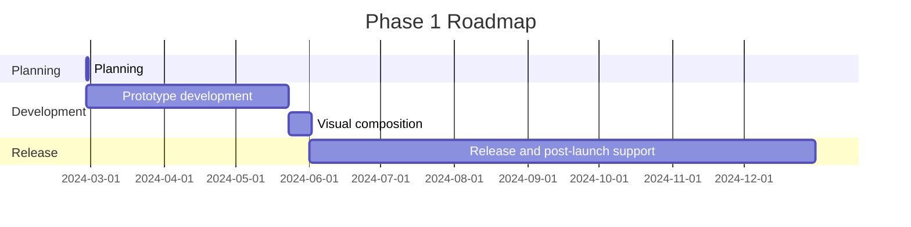

---
image:
    path: /2024-05-31-armonia-second-devlog/gameplay.webp
    lqip: data:image/webp;base64,UklGRlYAAABXRUJQVlA4IEoAAADwAQCdASoQAAgAAUAmJQBOgB8xi/GXoBAA/vuITP1jzd5vh9i82itNyxKJOlCBXvOebik8444+JnSUJik6FdPY8GR+D5jZO/WAAA==
    alt: Prototype under development
    
title: "'Waybound', Second Development Log"


categories: [마일스톤, 게임 개발]
tags: [마일스톤, 게임 개발, 유니티, C#, 행선지, 개발, 개발일지]
start_with_ads: true

toc: true

date: 2024-05-31 22:53:00 +0900
last_modified_at: 2025-12-26 11:40:00 +0900

mermaid: true
---

## **Introduction**

:::info
Continues from the [previous post](https://hyngng.github.io/posts/armonia-first-devlog/).
:::

This is the development log for my [fourth milestone](https://hyngng.github.io/categories/%EB%A7%88%EC%9D%BC%EC%8A%A4%ED%86%A4/). I've summarized the results of another month of work. This month mainly focused on expanding the game's systems and content. The specifics of what was accomplished in this phase are as follows:

- Game Systems
    - [x] Background object layering
    - [x] Optimization through shader graph replacement
    - [x] Settings accessible via pinch-to-zoom-out
    - [x] Object interaction using procedural animation
- Added Objects
    - [x] 2 types of building objects serving as backdrop

## **Archive**

{: .w-75 }
*Recorded during settings screen entry testing*

## **Asset Production**

### **Image Assets**

{: .light .w-25 .border }
{: .dark .w-25 }
*Pigeon pecking at the ground*

I plan to keep adding keyframe-style animations. This time, I created an animation for the pigeon's pecking behavior. The animation itself is short, and more importantly, since I had [assets from before](https://hyngng.github.io/posts/armonia-developing-first/#animation-assets), there was none of the previous burden of having to find and observe pigeon videos to mimic their characteristics.

Similar to before, I created `DigState.cs` and linked it with the state pattern, so the behavior looks natural. The interaction triggers when the ground is touched while the pigeon is selected.

### **Shader Files**

As I'll detail later, due to GPU cost issues, I replaced the 2D sprite shader I was using with a lighter one. The problem is that this shader doesn't support the Cast Shadow feature and doesn't apply the post-processing depth of field (DOF) effect. It would be great to improve this, but I'm still unfamiliar with shaders, so I'll either need to study them in depth or sacrifice certain visual features.

## **Development Process**

### **Camera-Style Settings Screen**

{: .w-75 }
*Entering the settings screen via pinch zoom. Still a prototype.*

To keep the screen as clean as possible without UI and to create a more interesting presentation, I made the settings screen accessible via pinch zoom without any separate UI indicator. The pinch zoom works in stages — within a certain range it functions as normal camera zoom, but beyond a certain threshold, it triggers haptic feedback and enters the settings screen. Once accessed, you can exit the settings screen by pinching in.

I designed the settings screen UI to look like a camera. This was inspired by the feeling I get when occasionally taking photos and watching POV street photography videos — as if the on-screen scene in my hand breaks the barrier between me and the subject, connecting the scene with a sense of realism. I wanted to replicate that experience.

For the battery and time, I used `SystemInfo.batteryLevel` and `DateTime.Now` to display the actual battery status and time. The shutter speed and aperture values are planned to function as controls for post-processing motion blur and depth of field effects, respectively.

There are still things to finish — text is displayed in the default font, for example — but even in its current state, the experience feels unique, so I'm satisfied for now.

### **Applying Procedural Animation**

{: .w-75 }
*Looks at the pigeon occasionally when one is nearby*

While working on my [previous milestone](https://hyngng.github.io/posts/palette-second-devlog/), I saw organic animations interacting with the environment using procedural animation and thought they looked really cool. I filed that away and decided to try it this time. I thought it would require technically sophisticated conditions to implement, but since it's provided as a Unity package, it was easier than expected. However, controlling it with code was more complex than I anticipated.

Unlike the pigeon, the person's head, body, and legs are separate independent objects. Using the `Multiple Aim Constraint` component from the [Animation Rigging package](https://docs.unity3d.com/Packages/com.unity.animation.rigging@1.1/manual/index.html), I experimentally implemented the ability for the person's head object to look toward pigeons within a certain distance.

```cs
public void ChangeSourceObject(GameObject discoveredObject)
{
    WeightedTransformArray sourceObjects = Constraint.data.sourceObjects;
    WeightedTransformArray newSourceObjects = new WeightedTransformArray(sourceObjects.Count);
    
    newSourceObjects[0] = new WeightedTransform();
    WeightedTransform wt = newSourceObjects[0];

    /* ... */

    newSourceObjects[0] = wt;
    
    data.sourceObjects = newSourceObjects;

    Animator.enabled = false;
    rigBuilder.Build();
    Animator.enabled = true;
}
```

To implement this feature, I needed to swap the `sourceObject` property of the `Multi Aim Constraint` component with an object in the scene, and this process was filled with difficulties. If anyone wants to change the procedural animation's `sourceObject` via code, I hope the following tips help:

- The `sourceObjects` property is read-only. You need to define the data in a separate local variable and then assign the new value to `data.sourceObjects`.
- After assignment, you must disable the object's animator, build the `rigBuilder`, and then re-enable the animation for it to apply correctly.
- If an object is registered as another object's `sourceObject`, when that object is destroyed, the `sourceObject` property it's registered to must be changed to `None`.

There were many frustrating moments when even the [official documentation](https://docs.unity3d.com/Packages/com.unity.animation.rigging@1.0/api/UnityEngine.Animations.Rigging.html) didn't have solutions for certain behaviors or errors, but I managed to make it work in the end. After implementing it, I could definitely see the effect of making the game atmosphere feel more dynamic. If I ever get around to making a 3D toy project, I definitely want to make better use of this.

### **Attempting Optimization with the Profiler**

{: .w-75 }
*Example data measured with the Unity Profiler*

My game was strangely overheating to the point where it couldn't maintain 40 FPS after building. Even though my code wasn't perfect, I thought I was following best practices — avoiding heavy functions like `GetComponent()`, `Find()`, and making sure repetitive operations like `for`, `foreach`, and coroutines weren't running excessively. So I couldn't understand why a lightweight 2.5D project was dropping frames.

The phone getting uncomfortably warm during debugging bothered me, so I decided to tackle optimization with the Profiler for the first time. The process was simpler than I thought: within the data recorded by the Unity Profiler, I identified which operations were most heavily used in the sections where frame rates were high, and improved those parts.

In my case, `Semaphore.WaitForSignal` was taking up about 50–70% of the share. After reading that in this case, the recommended approach is to switch to a lighter shader, I replaced the [shader file I had previously found](https://hyngng.github.io/posts/armonia-first-devlog/#sprite-shader) with a lighter one. This led to a considerable increase in frame rate and a significant reduction in overheating.

## **Release Criteria**

### **The Need for Goals to See It Through**

Creating animations and interactions for various objects is fundamentally fun and interesting, but I felt that it requires more time and effort than I initially thought. I expected my efficiency to improve with practice and accumulated know-how, and it did improve significantly. But tasks like typing code or creating keyframe animations still require a minimum amount of physical labor — pressing keys or drawing lines on a screen.

As the project grew and there were more assets to manage, I began to feel the burden I was carrying increasing. I remember reading advice in a Unity-published game industry report: "Don't bite off more than you can chew." I started to wonder if my situation was heading in that direction.

So I decided that I needed release criteria as a target point. For now, I've set my goal at a level where I can apply for [Google Featuring](https://play.google.com/console/about/guides/featuring/). Google Featuring provides clear criteria for high-quality apps and games, including:

- [High user ratings](https://support.google.com/googleplay/android-developer/answer/138230?hl=en)
- [Compliance with Google Play policies](https://play.google/developer-content-policy/#!?modal_active=none)
- [High Android Vitals scores](https://support.google.com/googleplay/android-developer/answer/9844486?hl=en&visit_id=638527380779176477-2227653483&rd=1)
- [Compliance with Android and Google Play core app quality guidelines](https://developer.android.com/quality?hl=ko)

In particular, [Android Developers](https://developer.android.com/quality?hl=ko) provides criteria for good user experience: usability (backup and restore, etc.), accessibility, localization, deep links (translation, etc.), visual appeal and craftsmanship (animation, audio, controls, etc.), and many other standards and examples. These need to be more detailed, but they serve as good high-level reference points.

### **Additional Self-Imposed Detailed Criteria**

- App
    - [ ] App icon
    - [ ] 3D sound
    - [ ] Simple tutorial
    - [ ] In-app text localization
- Objects
    - [ ] 5 or more types of objects
    - [ ] 2 or more individual traits per object
    - [ ] 3 or more interactions per object
- Background
    - [ ] Weather system (rain, snow, etc.)
    - [ ] Dynamic skybox with clouds
    - [ ] Ensure 3 or more background objects on screen

## **Closing**



According to the original roadmap, I was aiming to finish by today or tomorrow — the time this post is published — but whether due to lack of skill, I'm far behind. I need to set a new roadmap and, more importantly, define quarterly roles and goals in more detail.

Additionally, in June, I'll be starting my alternative military service, so I'll have to put development aside for a while and go to training camp. I'm not sure what the situation will be like going forward, so I can't say if it'll be possible, but I still want to keep developing steadily toward the goal of reaching a store-ready level.
