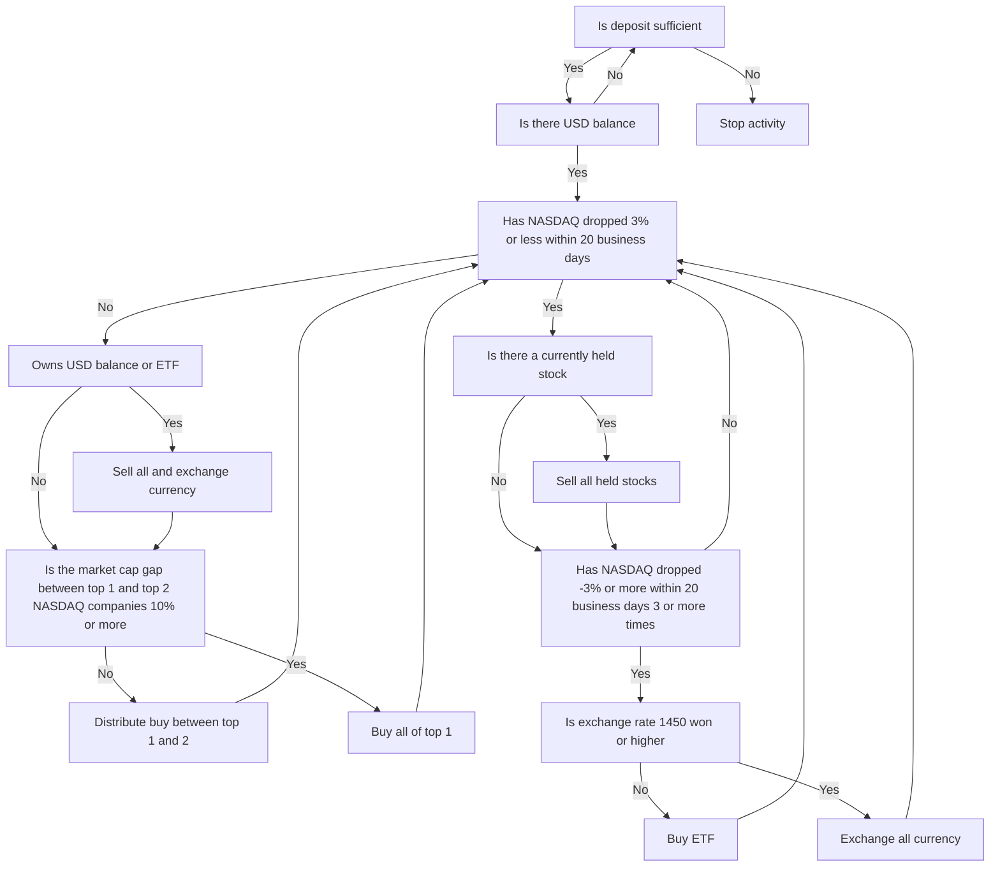

## **ASTP, the Auto Stock Trading Program**

**ASTP (Auto Stock Trading Program)** is [my second milestone](https://github.com/hyngng/astp/tree/legacy), built around the concept of automated stock trading based on internal algorithms. After finishing the first semester of my freshman year, I wanted to create a program on my own, and when an acquaintance mentioned automated stock trading, it sparked my interest. The program was written in Python, and I received help from that acquaintance regarding stock-related matters, following only basic strategies.

## **Program Features**

I used Korea Investment & Securities' [OpenAPI](https://www.truefriend.com/main/customer/systemdown/OpenAPI.jsp?cmd=TF04ea01200). This was my first time building a program that uses an API, and I was surprised by how many more things became possible. The trading strategy follows two principles and operates based on the NASDAQ.

- Algorithm Summary
	- **Stock Buy**: Buys stocks based on the ratio between the NDX index and the top two NASDAQ-listed companies.
	- **Stock Sell**: If the NDX index crashes or the USD/KRW exchange rate rises excessively, sells all held stocks and suspends trading for 20 business days. Whether the NDX has crashed is determined by comparing the maximum and minimum NDX values recorded in Excel at market open and close.
- Libraries Used
	- `mojito`: A Python wrapper module for Korea Investment & Securities' OpenAPI.
	- `yfinance`: Used to fetch NASDAQ market cap rankings.
	- `BeautifulSoup`: Used to scrape the NASDAQ-100 value, which is missing from all stock-related modules.

## **Structure and Example Code**



```python
# NDX crawling
def get_ndx():

    if response.status_code == 200:
    
        html = response.text
        soup = BeautifulSoup(html, 'html.parser')

        ndx_class = soup.find(class_ = 'Fw(b) Fz(36px) Mb(-4px) D(ib)')
        ndx = re.sub(r'[^0-9]', '', ndx_class.get_text())

    else:
        print(response.status_code)
    
    return ndx

# Check if NDX dropped by -3%
def ndx_collapsed():

    df_ndf_data['ndx_index'] = df_ndf_data['ndx_index'].astype(float)
    ndx_decrse_3per = False

    ndx_max = df_ndf_data['ndx_index'].max()
    ndx_min = df_ndf_data['ndx_index'].min()

    if 100 * (ndx_max - ndx_min) / ndx_max > 3:
        ndx_decrse_3per = True
        print("\nNDX fluctuation is severe.\n")
    else:
        print("\nNDX value is stable.\n")

    return ndx_decrse_3per
```

## **Program Operation Example**

{: .w-75 }
*Example program operation and screen after buying one share of Apple through the program*

Since it is a simple Python program without a UI, it runs without issues through the command prompt. Once executed, the program automatically places buy and sell orders until manually terminated. Completed sell orders can be verified through the prompt window or the Korea Investment & Securities app, as shown in the captured screen below, confirming purchase status and held stocks.

## **Cautions and Limitations**

- The US stock market operates from 11:30 PM to 6:30 AM Korean time, so ASTP, which is based on foreign stocks, has time constraints on when code behavior can be verified, unlike typical programs.
- Two prerequisite steps are required outside the program itself to use Korea Investment & Securities services:
    1. Open a Korea Investment & Securities account and apply for [OpenAPI](https://apiportal.koreainvestment.com/intro). Obtain `key` and `secret` from the application page and store them along with the virtual account number in the project's `mock.key` file.
    2. Install the [eFriend Expert](https://www.truefriend.com/main/customer/systemdown/OpenAPI.jsp?cmd=TF04ea01200) program provided by Korea Investment & Securities to handle order transmission, balance inquiries, etc.
- Additionally, since the shared certificate module does not support 64-bit environments, you must [set up a 32-bit virtual environment](https://hyngng.github.io/posts/virtual-32bit/) and run the code on that environment, even if inconvenient.

## **Closing**

:::tip
You can explore more details on [GitHub](https://github.com/hyngng/astp/tree/legacy).
:::

The main takeaway from this milestone was the experience of using external modules such as APIs and libraries. Using them firsthand made it clear that actively leveraging existing modules enables much more to be accomplished. I also learned how to sort and display data such as NASDAQ indicators and individual company market capitalizations.

Although it wraps up as a simple ~237-line codebase, if I were to expand the program later, I think it would benefit from refining buy and sell conditions more precisely and organizing the code more concisely through class-based structuring.
