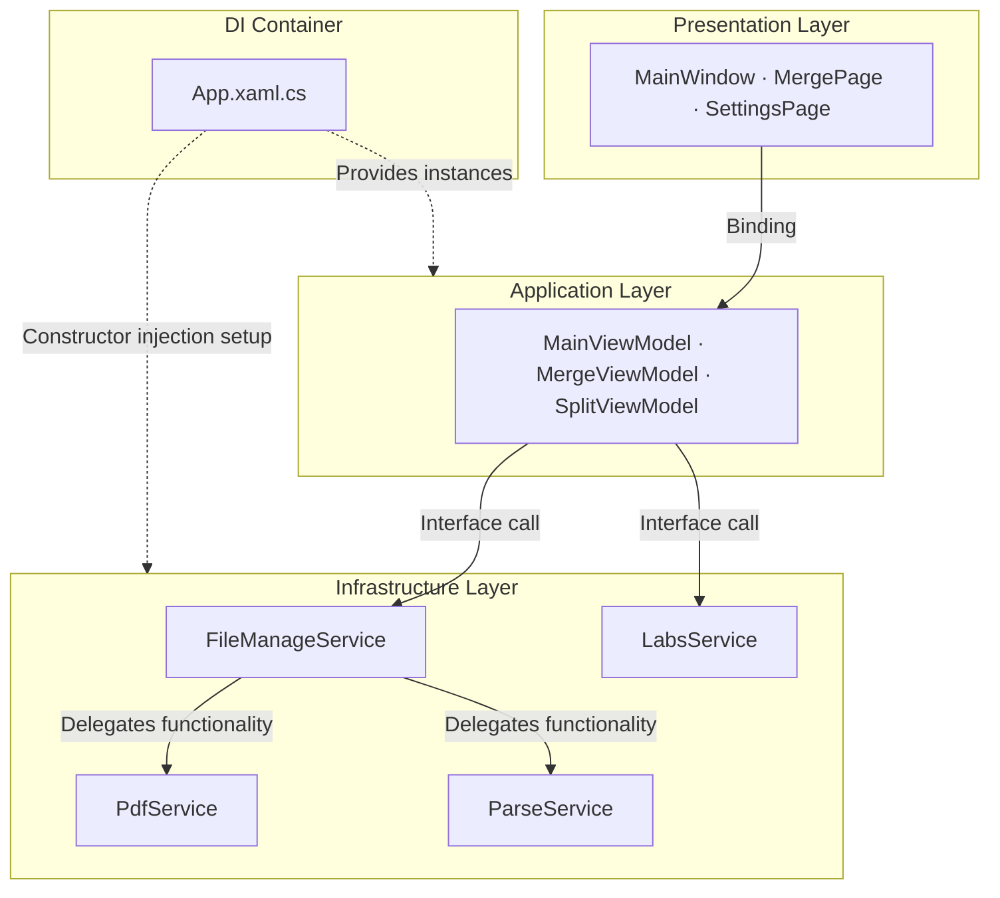

---
image:
    path: /2026-04-02-pascal-devlog/preview-image.webp
    lqip: data:image/webp;base64,UklGRj4AAABXRUJQVlA4IDIAAADQAQCdASoQAAgAAUAmJZwCdAEPDuQrCAD+/crO2PZZpBuP/xETb+8eyANti2KhVUAAAA==
    alt: "The temporary program name was 'Pascal'"

title: "Development Retrospective of a WinUI 3-Based PDF Editor"
authors: ["dev"]

categories: [마일스톤, 기타 개발]
tags: [마일스톤, 기타 개발, WinUI 3, MVVM, XAML, C#]
start_with_ads: true

toc: true

date: 2026-04-02 11:14:00 +0900
last_modified_at: 2026-06-23 16:47:00 +0900

mermaid: true
---

## **Development Motivation**

> "Thanks, but we're a public institution — we can't just use any external program"

There was a problem at the office during my alternative civilian service. It's covered in more detail in [my alternative service log post](https://hyngng.github.io/posts/sabok-logs/), but to summarize, I was once told that public institutions cannot arbitrarily use external programs without a license, and that experience led to the motivation for developing this program. However, it wasn't just a simple "let's build it ourselves" idea. I also wanted to use C#, which I had first encountered through Unity, in a different context, and I wanted to properly work on a Windows program, which gave me the courage to start a new project.

The program is named Pascal because it initially aimed to implement PDF compression. In the end, the compression feature was not implemented since my discharge was approaching and it didn't seem worthwhile, but PDF manipulation was realized through two features: merging and splitting.

## **Program Introduction**

{: .light }
{: .dark }
*Screenshots of the four completed pages. As you can see from the credits window, this is not a very serious program*

Pascal is a program that performs PDF merging and splitting. It was developed over about two months during my alternative service period, and fortunately, [a fellow server who also aspired to be a developer](https://github.com/din-c) was there, so we opened a dedicated Notion page and did some minor collaboration during spare time at work. Originally, I planned to integrate multiple office-related features into this program — PDF text extraction, JPG conversion, compression, etc. — but considering career reasons and the limited time left in service, I implemented only a few basic features and wrapped up.

While the Military Manpower Administration discourages disclosing information that could identify a specific institution, and I respect that stance, I can briefly describe how it was used without going into exact details. First, the sense of owning this program was psychologically helpful. Second, it streamlined raw workflows — like having to manually modify `config.yaml` values each time before running a Python script — into a few button clicks.

- Working Features
	- Merge multiple PDF files
    - Adjustable merge order
    - Selectable pages to merge
	- Split multiple PDF files simultaneously
    - Configurable split unit
    - Configurable split range
	- Display Windows update screen (Labs)

## **Development Challenges and Adaptation**

### **WinUI 3 Framework**

I had no prior knowledge or experience developing Windows programs, so choosing a framework was difficult from the start. Initially, I looked into [Electron.NET](https://github.com/ElectronNET/Electron.NET) hoping to reuse my frontend development experience, but the project's own maintainers asking "Wait — you host a .NET Core app inside Electron? Why?" gave me the impression that it was far from the conventional approach. Around the same time, I discovered Microsoft's [Fluent 2](https://fluent2.microsoft.design/) design language, so I switched to a WPF project using the [ModernWPF](https://github.com/Kinnara/ModernWpf) library. During development, however, I felt the legacy environment was outdated by 2025 standards, so I migrated again to the latest framework, WinUI 3.

There's one thing worth reflecting on from this experience. From what I've gathered, Microsoft has released a flood of new frameworks over the past twenty-plus years — starting with WinForms, then WPF, UWP, WinUI 3, and most recently MAUI — none of which are fully backward-compatible with their predecessors. So it's fair to say that, unlike development in mobile, web, or gaming, the Windows development framework space lacks a clear standard. Looking back now as I write this, I think my struggles were somewhat of a rite of passage.

|Frontend Web Development|WinUI|
|---|---|
|HTML|XAML|
|CSS|XAML Style|
|JavaScript|C#|

Still, one thing that left a good first impression was how similar the development experience of WPF and WinUI 3 is to frontend web development. It was actually quite interesting. Defining UI components and properties in XAML and writing detailed logic in C# works the same way as HTML and JavaScript, and style definitions aren't difficult if you've worked with CSS or SCSS, so I was able to adapt to the UI framework quickly.

However, the WinUI 3 ecosystem is still relatively sparse despite Microsoft's ongoing support. For instance, browsing the [WinUI-3-Apps-List project](https://github.com/DesignLipsx/WinUI-3-Apps-List?tab=readme-ov-file) shows a decent quantity but low quality. Open-source code is especially rare, making it hard to see how others actually work with this framework. So figuring out how to structure a WinUI 3 project meant I had to wrestle with the [official Microsoft documentation](https://learn.microsoft.com/en-us/windows/apps/winui/winui3) and work deductively. The Korean translation was of poor quality, leaving the English docs as the only real option, and LLMs weren't much help in this area either. There was a significant initial learning cost.

### **IDE, .NET, and Libraries**

I liked the cleanliness of VSCode, so Visual Studio — its distant relative — felt somewhat unfamiliar, especially for an unfamiliar framework like WinUI 3. Getting accustomed to terms like solution, NuGet, and Designer, as well as the features offered in the menu bar, was the first bottleneck. Understanding the structure of the development environment before even implementing features took more time than expected.

Looking at other open-source projects like [WinUI-Gallery](https://github.com/microsoft/WinUI-Gallery), [DevWinUI.Gallery](https://github.com/ghost1372/DevWinUI/tree/main/dev/DevWinUI.Gallery), and [Files](https://github.com/files-community/files), I noticed they follow a kind of dialect with folders like `Services`, `Helpers`, and `Modules`. This was unfamiliar at first since I hadn't seen this approach much in Unity, Python, or frontend projects. Beyond learning the features, I had to explore how to read the project structure itself and translate and apply my existing sensibilities to this new context.

What helped me settle into the WinUI 3 environment despite all this were the excellent control libraries: [Windows Community Toolkit](https://github.com/CommunityToolkit/WindowsCommunityToolkit) and [DevWinUI](https://github.com/ghost1372/DevWinUI). In .NET development environments dealing with UI, UI elements are called controls, and since both libraries provide a wide variety of controls, I could implement most features without much difficulty, except for things like `DataTable`. This helped reduce the initial entry cost.

### **The Quite Unfamiliar MVVM Pattern**

This was the most unfamiliar part. Beyond knowing XAML or C# syntax, I needed a sense of MVVM. MVVM itself is not a strict requirement for WinUI development, but since the framework is designed with MVVM in mind, not following it makes code maintenance dramatically harder. This is what made the experience so different from Unity development.

The concept of reducing dependencies between code was familiar, but I needed to study how MVVM actually achieves this — what Model, View, and ViewModel can and cannot do, where the boundaries lie, and how to distinguish between them. And honestly, even as I write this, my understanding is still a bit fuzzy. For example, having a dedicated ViewModel for complex pages while omitting one for simple pages, or using code-behind as a bridge for cases like file drag-and-drop that are hard to handle with binding alone — I think these are the best ways to stay faithful to MVVM. But I'm not sure if this is truly the best approach, and even if it is, I haven't fully felt its benefits.

Separately, the [MVVM Toolkit](https://learn.microsoft.com/en-us/dotnet/communitytoolkit/mvvm/) package is practically essential for WinUI 3 development. This package helps the view communicate with the ViewModel without going through code-behind from the UI markup file, allowing for a more intuitive program design structure.

## **Reflections on Collaboration and Productivity**

### **Collaboration**

I've habitually used Notion, Figma, and GitHub for a long time, and I naturally wanted to use them for this project as well. My fellow server told me they hadn't used these tools before, so I briefly explained how they work and why I use them. This time, I also tried the PARA methodology in Notion, hoping to build a systematic collaboration structure.

However, aside from GitHub, there wasn't as much engagement as I had hoped, which was a bit awkward. It wasn't because my colleague was lazy — rather, the new environment of WinUI 3 was already demanding enough, and I think I failed to convincingly explain why Notion and Figma were necessary. While I believed that resource management systems are always necessary because they enable sustained development over the long term, my colleague seemed to view that costs not directly related to development could be discarded as needed. And gradually, I came to think that perspective was correct in this context. Just like the utility of object-oriented programming, good tools and good patterns also have a scale at which they are justified. I think I was blindly trusting good tools out of inertia.

Although the format changed, the collaboration itself ran smoothly. We divided the work so that I handled the View and ViewModel while my fellow server handled the ViewModel and Model, and we shared and reviewed changes, iterating with mutual secondary revisions. Just being able to exchange perspectives was a satisfying experience. The added bonus was that our coding habits were nearly identical, so there was little friction.

### **Productivity**

A few years ago, I read about an overseas writer who wanted to quit their job to focus fully on their work. When a commenter advised, "Even if it's for what you want to do, quitting your job for any reason is not a good idea," the writer strongly replied, "I already regret letting my imagination die in a job I don't even like," effectively ending the debate.

This anecdote came to mind during development. Strictly speaking, my situation is different — creating a program doesn't require the same spiritual resonance or desperate need for self-actualization that comes with making art. But I could relate to how an environment of draining daily tasks wears down the will to create and push forward with work.

In fact, this project progressed slowly for that very reason. While I was imagining how to use a particular UI control, I'd get called away for work tasks, and after returning to my desk 20 minutes later to reconstruct the context, the desk phone would ring. It wasn't just during moments requiring creativity — even simple debugging tasks like reviewing dependency flows between M-V-VM were hard to focus on with frequent interruptions. I'm not trying to complain that the situation was unfair. But this was the first time I experienced firsthand how much productivity can drop when the environment doesn't provide enough room for focus.

## **Archive**

### **Various Screenshots**

{: .w-75 }
*Early 2025, a program my fellow server built directly in Python. One of the goals was to replace this with something more polished*

{: .light .border }
{: .dark }
*Late 2024, a primitive design draft for a program performing nearly the same functions*

*During a period of trying various things. Once features were implemented, actual usage ran in parallel with development*

### **Simplified Architecture**

### **Libraries Used**

- UI and Framework Extensions
    - `Windows Community Toolkit`[MIT License](https://github.com/CommunityToolkit/Windows/blob/main/License.md)
    - `DevWinUI`[MIT License](https://github.com/ghost1372/DevWinUI/blob/main/LICENSE)
- PDF Document Processing
    - `PDFsharp`[MIT License](https://github.com/empira/PDFsharp/blob/master/LICENSE), handles PDF merging and splitting
    - `PdfPig`[Apache-2.0 License](https://github.com/BobLd/PdfPig.Rendering.Skia/blob/master/LICENSE.txt), handles text extraction

### **Documents That Helped Development**

- Icons
	- [Symbol Enum](https://learn.microsoft.com/en-us/uwp/api/windows.ui.xaml.controls.symbol?view=winrt-26100)
	- [fluentui-system-icons](https://github.com/microsoft/fluentui-system-icons)
	- [Segoe MDL2 Assets icons](https://learn.microsoft.com/en-us/windows/apps/design/style/segoe-ui-symbol-font)
	- [FluentIcons.Wpf](https://www.nuget.org/packages/FluentIcons.WPF/)
- WinUI3
	- [Quickstart: Set up your environment and create a WinUI 3 project](https://learn.microsoft.com/en-us/windows/apps/winui/winui3/create-your-first-pascal-devlog3-app?source=recommendations#unpackaged-create-a-new-project-for-an-unpackaged-c-or-c-pascal-devlog-3-desktop-app)
	- [Windows App SDK Namespaces](https://learn.microsoft.com/en-us/windows/windows-app-sdk/api/winrt/?view=windows-app-sdk-1.7)
	- [Template Studio for WinUI](https://marketplace.visualstudio.com/items?itemName=TemplateStudio.TemplateStudioForWinUICs)
- MVVM
	- [Introduction to the MVVM Toolkit](https://learn.microsoft.com/en-us/dotnet/communitytoolkit/mvvm/)
- .NET 9
	- [Advanced .NET Programming Documentation](https://learn.microsoft.com/en-us/dotnet/navigate/advanced-programming/)
	- [What's new in WPF for .NET 9](https://learn.microsoft.com/en-us/dotnet/desktop/wpf/whats-new/net90)

## **Closing**

:::tip
You can explore more details on [GitHub](https://github.com/hyngng/pascal.drill)!
:::

Among the libraries, DevWinUI is maintained entirely by Mahdi Hosseini, an Iranian developer who goes by [ghost1372](https://github.com/ghost1372). Based on publicly available information, he works as a teacher and resides in the city of Qeydar, Iran. And this is an unbelievable story, but on December 28, 2025, large-scale protests erupted across Iran, and the hardline conservative regime began to violently suppress them.

According to Wikipedia, protests were also reported in the city of Qeydar where he resides. A few days later, when the Iranian government cut off internet access nationwide, ghost1372's commit history stopped at that point, making his future uncertain. Since DevWinUI contributes significantly to the WinUI 3 ecosystem, we joked that Microsoft should send a helicopter to rescue him, but at the time, I remember being worried because there was no way to confirm whether he was alive. Fortunately, commits have resumed now, so he appears to be safe.

- Other Notes
	- While working on this project, Visual Studio 2026 was releasedNovember 11, 2025.
	- DevWinUI's version went from `9.4.0` to `9.8.0`.
