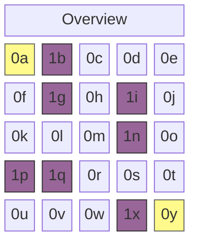
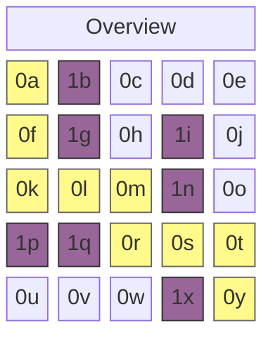

The A* algorithm is a graph search algorithm for finding the shortest path between two specific points. Its characteristics can be summarized in a single expression, where $n$ denotes a node:

$$
f(n) = g(n) + h(n)
$$

## **Open List and Closed List**

When computing the shortest path, the A* algorithm examines the cost of traversable adjacent nodes. It first adds candidates to the Open List, then moves nodes that have been fully examined to the Closed List.

```python
open_list = []
closed_set = set()
```

Two data structures are used to implement this process. The Open List uses a priority queue, and the Closed List uses a Set data structure.

## **$g(n)$: Cost of Moving One Step**

$g(n)$ is a function that measures the cost of moving to a candidate node registered in the Open List. If the map is represented as a grid, the cost of moving up, down, left, or right is $1$, and if diagonal movement is allowed, the diagonal movement cost can be calculated as $\sqrt{2} \approx 1.4$. The code I wrote only considers up/down/left/right movement.

```python
# Assuming the node is defined as follows
class Node:
    def __init__(self, position, parent=None):
        # ...
        self.g = 0

# This can be expressed as follows
neighbor.g = current_node.g + 1
```

## **$h(n)$: Distance to the Destination**

$h(n)$ is a function that estimates the travel cost from a candidate node in the Open List to the destination node. Going to a busy restaurant or estimating the exchange rate at around 1,200–1,400 won when buying something from overseas are examples of heuristics, which is why this is also called a heuristic estimate. Choosing an appropriate value for the given problem is known to help improve the algorithm's performance, and it can generally be obtained in the following ways.

- Example 1: Manhattan distance $h(n) = |x_1 - x_2| + |y_1 - y_2|$
```python
def heuristic(start_node, end_node):
    return abs(
        end_node[x] - start_node[x]) + abs(end_node[y] - start_node[y]
    )
```
- Example 2: Euclidean distance $h(n) = \sqrt{(x_1 - x_2)^2 + (y_1 - y_2)^2}$
```python
def heuristic(start_node, end_node):
    return math.sqrt(
        (end_node['x'] - start_node['x'])**2 + (end_node['y'] - start_node['y'])**2
    )
```

## **Algorithm Implemented in Python**

```python
import heapq

class Node:
    def __init__(self, position, parent=None):
        self.position = position
        self.parent = parent

        self.g = 0
        self.h = 0
        self.f = 0

    def __lt__(self, other):
        return self.f < other.f

def heuristic(a, b):
    return abs(a[0] - b[0]) + abs(a[1] - b[1])

def astar(grid, start, end):
    open_list = []
    closed_set = set()

    start_node = Node(start)
    end_node = Node(end)

    heapq.heappush(open_list, start_node)

    while open_list:
        current_node = heapq.heappop(open_list)
        closed_set.add(current_node.position)

        if current_node.position == end_node.position:
            path = []
            while current_node:
                path.append(current_node.position)
                current_node = current_node.parent
            return path[::-1]

        x, y = current_node.position
        neighbors = [(x+dx, y+dy) for dx, dy in [(-1,0), (1,0), (0,-1), (0,1)]]

        for next_pos in neighbors:
            nx, ny = next_pos
            if not (0 <= nx < len(grid) and 0 <= ny < len(grid[0])):
                continue
            if grid[nx][ny] != 0:
                continue
            if next_pos in closed_set:
                continue

            neighbor = Node(next_pos, current_node)
            neighbor.g = current_node.g + 1
            neighbor.h = heuristic(next_pos, end)
            neighbor.f = neighbor.g + neighbor.h

            if any(n.position == neighbor.position and n.f <= neighbor.f for n in open_list):
                continue

            heapq.heappush(open_list, neighbor)

    return None
```

## **Algorithm Execution Example**

This algorithm treats a node value of $0$ as a path and $1$ as an obstacle. For example, consider the following map. The yellow-highlighted 0a and 0y are the start and destination, respectively.



```python
grid = [
    [0, 1, 0, 0, 0],
    [0, 1, 0, 1, 0],
    [0, 0, 0, 1, 0],
    [1, 1, 0, 0, 0],
    [0, 0, 0, 1, 0]
]

start = (0, 0)
end = (4, 4)

path = astar(grid, start, end)
```

With a $5 \times 5$ map where the start is set to `(0, 0)` and the destination to `(4, 4)`, with walls placed appropriately in between, the shortest path `path` is output as follows:



```bash
[(0, 0), (1, 0), (2, 0), (2, 1), (2, 2), (3, 2), (3, 3), (3, 4), (4, 4)]
```
