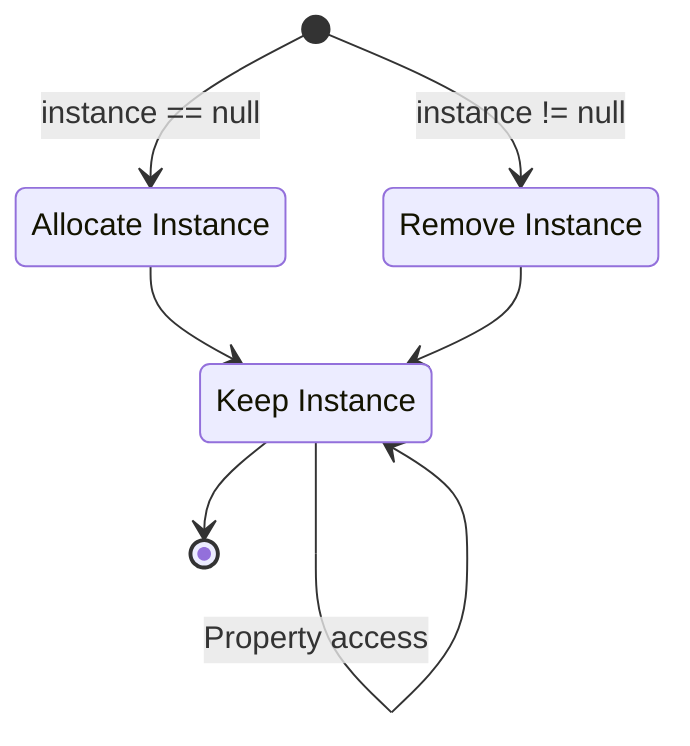

## **Introduction**

As I develop games, I increasingly feel that there are many concepts that need organizing. I frequently use Notion and Obsidian, but it's different from taking the time to properly organize things.

Originally, I deliberately avoided writing detailed technical posts because I was worried the blog would become too stiff. But recently I learned that "blog" originates from "Web + Log," and I thought that posts organizing what I've studied would be nice too. So from now on, whenever something needs separate documentation, I plan to go through it in depth once and systematically organize it here on the blog.

The first thing I'll organize is the Singleton pattern. The Singleton pattern is a design pattern that ensures only one instance of a particular class exists, and it's mainly used for the following advantages:

- Maintains consistent overall game state across multiple scripts or scenes
- Manages data like audio, sprites, and objects without duplication
- Improves performance by avoiding redundant use of heavy code across individual classes

I'm introducing the Singleton pattern first because it's intuitive. When learning game development, once you feel comfortable writing code, many people encounter this pattern — it's that simple in concept and easy to use.

## **Structure Visualization**



## **Basic Code**

```cs
public class Singleton : MonoBehaviour
{
    private static Singleton instance = null;
    public static Singleton Instance
    {
        get
        {
            if (instance == null)
                return null;
                
            return instance;
        }
    }

    void Awake()
    {
        if (instance == null)
        {
            instance = this;

            DontDestroyOnLoad(this.gameObject);
        }
        else
            Destroy(this.gameObject);
    }
}
```

The Singleton pattern can be summarized by two rules:

- Ensures that a class can only instantiate one instance of itself
- Gives easy global access to that single instance

This is why the Singleton pattern is implemented very simply in Unity. Both the property at the top and the `Awake()` method at the bottom merely ensure that only one instance exists. Since the script's instance is declared as `static`, fields and methods of a script using the Singleton pattern can be accessed from external classes using the `ScriptName.Instance` syntax.

## **Instance Creation**

```cs
public class Singleton : MonoBehaviour
{
    private static Singleton instance = null;
    public static Singleton Instance
    {
        get
        {
            if (instance == null)
            {
                GameObject gameObj = new GameObject();
                instance = gameObj.AddComponent<Singleton>();
                DontDestroyOnLoad(gameObj);
            }
                
            return instance;
        }
    }
}
```

Previously, when no singleton instance existed, it was simply treated as `null` without creating a new one, requiring external scripts to check whether `Instance` exists before accessing it. If this is inconvenient, you can modify the property as shown above to include instantiation code.

This way, the instance is automatically created whenever the property is accessed, so external scripts no longer need to check for the instance's existence. Accessing the singleton instance is as simple as calling `Singleton.Instance`.

## **Creating Multiple Instances**

```cs
public class Singleton<T> : MonoBehaviour where T : MonoBehaviour
{
    private static T instance;
    public static T Instance
    {
        get
        {
            if (instance == null)
                return null;

            return instance;
        }
    }

    private void Awake()
    {
        if (instance == null)
        {
            instance = this as T;
            DontDestroyOnLoad(gameObject);
        }
        else
            Destroy(gameObject);
    }
}
```

```cs
public class GameManager : Singleton<GameManager>
{
    /* Code here */
}
```

Since a singleton script's instance is fundamentally kept to one, you conceptually cannot use multiple singleton instances simultaneously. You could technically copy the code, but it would be inefficient. Instead, if you want multiple different singleton instances, you can use generics in the form `Singleton<T>` to create multiple different singleton scripts.

This also allows other classes to be easily converted into singletons through inheritance. For example, if you want to apply the singleton pattern to `GameManager.cs`, you can inherit from `Singleton<T>` as shown above.

## **Usage Example**

```cs
public class GameManager : MonoBehaviour
{
    /* Singleton declaration */

    public int Score;

    public void ResetScore()
    {
        Score = 0;
    }
}
```

```cs
public class Player : MonoBehaviour
{
    void AttackEnemy()
    {
        Enemy.TakeDamage();

        if (Enemy.HP <= 0)
        {
            Destroy(Enemy);

            GameManager.Instance.Score += 100;
        }
    }

    void Dead()
    {
        GameManager.Instance.ResetScore();
    }
}
```

The characteristic of being universally present across all scenes and maintaining a single instance makes the Singleton pattern well-suited for `GameManager.cs`, since scripts that oversee game data or state are typically kept as a single instance. The example above demonstrates how to use the Singleton pattern with a game manager.

It simulates a scenario where the player fights enemies: killing an enemy increases the score, and dying resets it. The game manager defines `Score` and `ResetScore()`, and `Player.cs`, as an external class, directly accesses these through the singleton instance. When an enemy dies, `Player.cs` directly increases the score; when the player dies, it directly resets the score.

This configuration is possible without the hassle of creating a `GameManager` instance because external classes can directly access class members. Using this characteristic, if you apply the singleton pattern to manager scripts like `GameSystem.cs`, you could structure fields and methods as follows:

- Fields
	- `Score`, `CurrentLevel`, `EnemyCount`: To store major game states like level, score, or remaining enemy count
	- `isGamePaused`, `IsMusicEnabled`: To store whether the game is paused or background music is enabled
- Methods
	- `StartGame()`, `QuitGame()`: Used when the game starts or ends
	- `PauseGame()`, `ResumeGame()`: Used when the game is paused or resumed
	- `LoadScene()`, `LoadLevel()`: Used to load specific scenes or levels

## **Cautions**

However, the Singleton pattern is a controversial programming pattern because it is prone to overuse. Its convenience can lead to scripts taking on too many roles or too much data, creating tight coupling between the singleton instance and other classes. Messy code makes it difficult to identify who changed the instance or when.

Therefore, it's important to carefully consider whether alternatives exist before using it. Just like general coding practices, once a Singleton pattern is overused for too long, it becomes hard to undo. If you do use the Singleton pattern, it's best to ensure that only a small number of scripts can access the singleton instance.

Still, the Singleton pattern remains easy to use, and because it avoids redundant calls to heavy functions like `GetComponent()` or `Find()`, it's well worth using depending on the project's scale.
