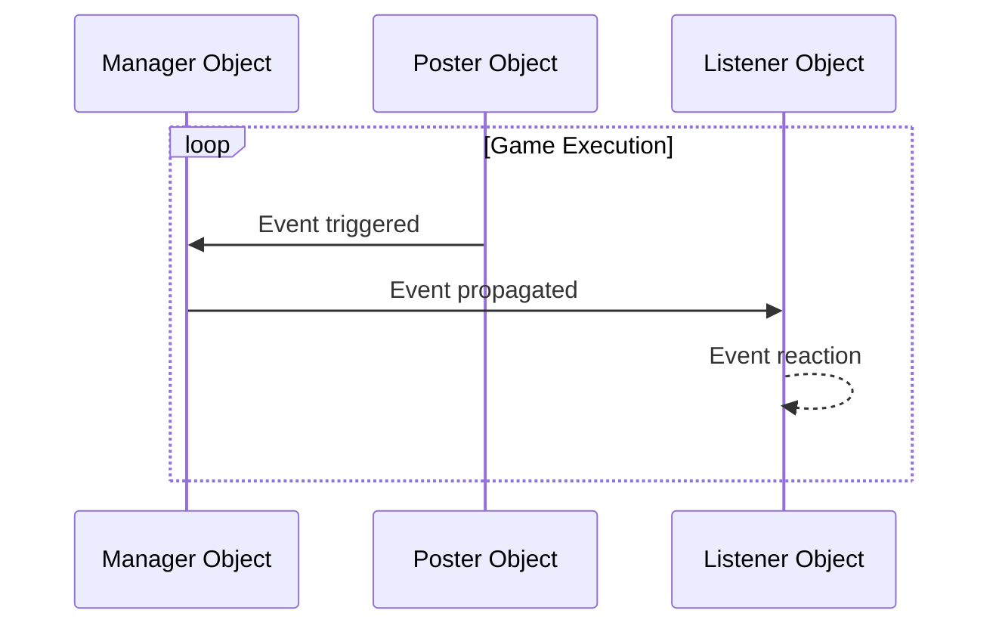

## **Introduction**

Event-Driven Programming is a programming paradigm where the flow of a program is determined by events. It manages the occurrence, handling, and execution of events to improve code extensibility, readability, and maintainability. Since it proved very helpful during [another game development project](https://hyngng.github.io/en/dev/armonia-first-devlog/), I'm documenting it here as I expect to use it frequently going forward.

## **Basic Concepts**

- Event-Driven Programming is implemented through three concepts:
	- Manager: Propagates events to specific objects
	- Listener: Reacts to specific events
	- Poster: Triggers specific events

The Manager role is typically handled by a single manager script such as `GameObject.cs`, but for Listener and Poster roles, a single object can handle all roles or just one of the two.

For example, consider a scenario where an explosion sound is heard and nearby NPCs look toward the source. The object that triggers the explosion sound acts as a Poster, and nearby objects act as Listeners. But if the object triggering the explosion sound is also an NPC reacting to the event, it can handle both Poster and Listener roles.

## **Structure Visualization**



## **Basic Code**

### **Event Manager**

:::info
The code is a bit long!
:::

```cs
public enum EventType
{
    FirstExampleEvent,
    SecondExampleEvent,
    /* ... */
}
```

```cs
public class EventManager : MonoBehaviour
{
    public static EventManager Instance { get { return instance; } }    
    private static EventManager instance = null;

    public delegate void OnEvent(EventType eventType, Component Sender, object Param = null);
    private Dictionary<EventType, List<OnEvent>> Listeners
        = new Dictionary<EventType, List<OnEvent>>();

    void Awake()
    {
        if (instance == null)
        {
            instance = this;
            DontDestroyOnLoad(gameObject);
            return;
        }
        DestroyImmediate(gameObject);
    }

    public void AddListener(EventType eventType, OnEvent Listener)
    {
        List<OnEvent> ListenList = null;

        if (Listeners.TryGetValue(eventType, out ListenList))
        {
            ListenList.Add(Listener);
            return;
        }

        ListenList = new List<OnEvent>();
        ListenList.Add(Listener);
        Listeners.Add(eventType, ListenList);
    }

    public void PostNotification(EventType eventType, Component Sender, object param = null)
    {
        List<OnEvent> ListenList = null;

        if (!Listeners.TryGetValue(eventType, out ListenList))
            return;

        for(int i = 0; i < ListenList.Count; i++)
             ListenList?[i](eventType, Sender, param);
    }

    public void RemoveEvent(EventType eventType) => Listeners.Remove(eventType);

    public void RemoveRedundancies()
    {
        Dictionary<EventType, List<OnEvent>> newListeners
            = new Dictionary<EventType, List<OnEvent>>();

        foreach(KeyValuePair<EventType, List<OnEvent>> Item in Listeners)
        {
            for (int i = Item.Value.Count - 1; i >= 0; i--)
                if(Item.Value[i].Equals(null))
                    Item.Value.RemoveAt(i);

            if (Item.Value.Count > 0)
                newListeners.Add(Item.Key, Item.Value);
        }

        Listeners = newListeners;
    }

    public void RemoveListener(Event eventType, OnEvent listener)
    {
        List<OnEvent> listenList = null;

        if (Listeners.TryGetValue(eventType, out listenList))
            listenList.Remove(listener);
    }

    void OnLevelWasLoaded()
    {
        RemoveRedundancies();
    }
}
```

This approach uses delegates. It also utilizes the [Singleton pattern](https://hyngng.github.io/posts/singleton-pattern/) so that listener objects can use some methods, and events are defined using `enum`. Although the code is nearly 80 lines, it's not difficult since it's composed of 5 individual methods.

- Delegate and Fields
	- `OnEvent()`: A delegate that registers event reaction methods for event listeners.
	- `Listeners`: A dictionary with event types as keys and `List<OnEvent>` as values. It connects specific events to their corresponding reactions.
- Methods
	- `AddListener()`: Registers a specific object's reaction to an event in method form.
	- `PostNotification()`: Used by poster objects to trigger events.
	- `RemoveEvent()`: Removes a specific event from the `Listeners` dictionary.
	- `RemoveRedundancies()`: A kind of integrity check that removes events with no associated actions.
	- `RemoveListener()`: Removes an object from the `Listeners` dictionary when a listener object is destroyed, preventing `NullReferenceException` errors.

### **Event Listener**

```cs
public class ListenerObject : MonoBehaviour
{
    void Start()
    {
        EventManager.Instance.AddListener(Event.ObjectAccessed, OnEvent);
    }

    public void OnEvent(EventType EventType, Component Sender, object Param = null)
    {
        switch (EventType)
        {
            case EventType.FirstExampleEvent:
                /* Event action code here */
                break;
        }
    }

    void OnDestroy()
    {
        EventManager.Instance.RemoveListener(Event.ObjectAccessed, OnEvent);
    }
}
```

When the game starts or an object is created, a listener is added using the `EventManager.AddListener()` method to detect desired events. When the object is destroyed, the registered method is removed using `EventManager.RemoveListener()` to prevent minor errors or unnecessary event calls.

The `OnEvent()` method is called when an event occurs. It receives the event type, the object that triggered the event, and optional parameters as arguments, and uses a `switch` statement to handle different logic depending on the event type. In this example, it's set up to execute specific logic for the `FirstExampleEvent`.

## **Usage Example**


An example from a [game I'm developing](https://hyngng.github.io/en/dev/armonia-first-devlog/). When a specific object is selected, some interactable objects are highlighted in yellow, and when deselected, they return to their original state. This was implemented using Event-Driven Programming.
