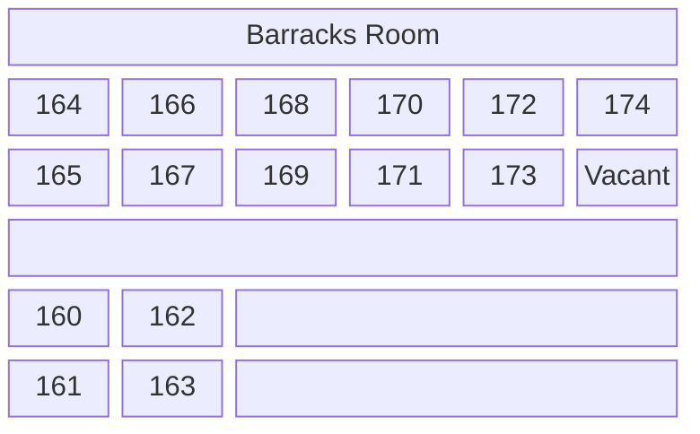

I feel dazed. The time that had been flowing slowly was suddenly all gone, and now I'm out of Yeonmugwan — the main administration building of the Army Training Center — writing from home.

Timing-wise, I enlisted right after the May 21, 2024 grenade explosion accident and the May 23, 2024 trainee death caused by a company commander's abuse of power — I was in the first cohort to enter right after those incidents. Perhaps because I was also supplementary service personnel, there were noticeable accommodations made for us at the training camp. It wasn't so much that the training itself was easy, but rather that they'd find shaded spots for the same instruction whenever possible, or soften the intensity of military discipline.

The supplementary service curriculum and atmosphere were also more relaxed compared to active duty. Unlike active duty soldiers whose postings depend on their training camp performance, supplementary service personnel enter the camp with their post-completion plans already decided — I think that contributed to the atmosphere. Not everyone was that way, but in my barracks room, there was even an unusual peer my age who had heard the training camp was fun and came on purpose, ahead of being transferred to wartime labor personnel status after a long wait.

I brought a notebook and a pencil case to the training camp and consistently kept a diary of each day. It came out to 14 pages in total, which I later refined and transcribed into a blog post at home after graduation.

## **Pre-Training Camp Preparations**

I brought a few items with me. Having completed the course, I think I'd have been fine going in empty-handed, but some of the things were useful nonetheless. Here's what I brought:

|Item|Reason for Bringing|Was It Actually Useful?|
|---|---|---|
|Casio F-91W-1 wristwatch|Checking the time|Useful everywhere. Really great|
|Daizo insoles (2 pairs)|To put inside military boots|Feels great inside combat boots|
|3M earplugs (2 pairs)|Spares|Incomparable to the issued earplugs|
|Notepad and pencil case|For diary writing and drawing|Used them a few times, but ended up being luggage|
|Shampoo, body wash|Spares|Nice to have, but all-in-one is better|
|2 books|To pass boredom|Used briefly during night watch, otherwise luggage|
|1 roll of toilet paper|Spares|Didn't even finish the issued toilet paper|
|Toothbrush case|An acquaintance insisted I bring it|Issued a toothbrush case anyway, so no use|

Looking at people in my barracks, most brought just a light set of shampoo and body wash, but there were also people who brought Kanu or Pocari Sweat powder to share. In particular, the specialized research personnel sometimes brought a few papers or books. In my case too, having heard that training camp life gets boring, I brought two books.

One item I personally wish I had brought is a sleep mask. The red sleeping light that gets turned on is bright enough to disturb light sleepers.

## **Summary of a Day at Training Camp**

Before writing the log, I first organized the common thread that repeats every day. The daily schedule at the training camp goes as follows:

```mermaid
gantt
    title Normal Daily Schedule
    dateFormat HH:mm
    axisFormat %H:%M

    section Morning Roll Call
    Sleep: 00:00, 06:30
    Wake Up & Wash: 06:30, 07:00
    Morning Roll Call & Breakfast: 07:00, 09:00

    section Morning Schedule
    Morning Education & Training: 09:00, 12:00
    Lunch: 12:00, 13:00

    section Afternoon Schedule
    Afternoon Education & Training: 13:00, 17:30
    Dinner: 17:30, 18:30
    Shower & Personal Time: 18:30, 20:30

    section Evening Roll Call
    Cleaning & Roll Call Prep: 20:30, 21:30
    Evening Roll Call: 21:30, 22:00
    Sleep: 22:00, 2h
```

The basic daily schedule runs as above, but from the June cohort onward, the training center ran its hot-weather schedule — an early wake-up, early bedtime rotation designed to avoid the midday heat. This variant schedule is as follows:

```mermaid
gantt
    title Hot-Weather Schedule
    dateFormat HH:mm
    axisFormat %H:%M

    section Pre-Nap Schedule
    Sleep: 00:00, 03:00
    Wake Up & Wash: 03:00, 03:30
    Education & Training: 03:30, 07:00
    Breakfast: 07:00, 08:00
    Education & Training: 08:00, 12:00
    Lunch: 12:00, 13:00
    Personal Time: 13:00, 14:00
    Afternoon Nap: 14:00, 16:00
    Education: 16:00, 17:30
    Dinner: 17:30, 18:30
    Shower & Personal Time: 18:30, 19:30

    section Evening Roll Call
    Cleaning & Roll Call Prep: 19:30, 20:30
    Evening Roll Call: 20:30, 21:00
    Sleep: 21:00, 3h
```

The defining feature of the hot-weather schedule is that bedtime is adjusted to 9 PM and wake-up to 3 AM. It starts before the first week is even over — it's quite demanding, but you have to go along with it.

## **Archive**

- 26th Regiment, 24-24 Cohort (Enlisted June 13, Graduated July 4)

## **Training Camp Log**

### **Week 1**

#### **Day 1**

The first day of enlistment. The enlistment ceremony was held briefly at the Army Training Center's Entry Screening Hall — we sang the national anthem, saluted briefly, and it was over.

There's a widespread rumor that the moment parents leave, the drill instructors instantly turn into demons, but in reality, various administrative procedures began in a calm atmosphere. After the parents exited, we moved to the area where they had been seated and went through several inspections and surveys — verifying our identity with the Nara Sarang Card (the military-issued service ID and payment card) and national ID we had brought, and filling out 4 to 5 mental health questionnaires covering depression, suicide, and similar topics.

While filling out the questionnaires, the entry procedures at the training camp continued. First, we received a 500mL iced water bottle and a training camp identification number tag. The drill instructors went around measuring head sizes with a tape measure for beret distribution, and simultaneously we installed the infamous Defense Mobile Security app. With both trainees and drill instructors flustered, after handling various procedures including directing those who urgently needed the restroom, we dragged our carry-ons to the designated regiment. The distance to the regiment wasn't far in a straight line, but since it wound through the Entry Battalion and Yeonmugwan, we ended up walking quite a ways — a tense atmosphere set in, with only the rumbling sound of carry-on wheels breaking the unfamiliar environment and awkward silence.

After arriving at our assigned regiment and training battalion, they blew the dust off our gear with a compressor and we entered our barracks. Once inside, we immediately put covers on our beds. The material was extremely rough and tight, so every single person ended up with the skin on their middle and ring finger second joints scraped raw. After a certain amount of time, we moved to our company's lecture hall and received two sets each of fatigue tops and bottoms in our sizes for use over the next three weeks. We changed into them immediately, then stacked our carry-ons neatly in the vacant bed spots in each barracks room like a game of Tetris.

On the first day, there was no special training or education; instead, we filled out several more mental health questionnaires with a tone very similar to the ones we'd done at the Entry Screening Hall. After checking the baskets hidden under our beds containing basic supplies like toothpaste, toothbrushes, soap, and towels, we had dinner. After the meal, we showered at the external bathhouse, and the day ended with a truly unfamiliar feeling.

It was a day of feeling blank and awkward after a long time. Silence lingered among people who were still strangers to each other, and I didn't know whether I was allowed to take out the items I'd brought from home — in my case, books, a notepad, and a pencil case — so I just kept pointlessly checking the time on my wristwatch and eventually fell asleep.

#### **Day 2**

The first wake-up at training camp, and the day of drill training.

We woke up at 6:30 to the famous reveille bugle, and our first morning roll call was held. Half-asleep, we quickly washed up, grabbed our Recruit Training Guidebook, formed up in three rows on the road next to the training battalion building by small barracks room, and once headcount was confirmed, moved to the parade ground for company-wide headcount and health checks to begin the morning roll call.

I remember the first morning roll call — held in a slightly chilly atmosphere — surprised me with how loud and powerful the platoon leader and company commander's voices were. Seeing the chain of commands relayed swiftly in booming voices from squad leader to platoon leader to company commander to battalion commander was the "military" I had only heard about in stories. It was the moment I truly realized I was actually in the military.

After morning roll call and breakfast, we received basic drill training in the barracks. Normally, this training would be conducted outdoors on the parade ground, but since our June cohort was on the hot-weather schedule, the training was held indoors. The squad leader taught us basic commands — attention, at ease, stand at ease, rest, left face, about face, about turn — and we were evaluated in groups of about four per barracks room. The evaluation wasn't very strict; if they judged that you understood the movements well enough, you passed.

Also on this day, squad leader trainees and assistant squad leader trainees were selected. While the assistant squad leader is a nominal role with no real presence, the squad leader ends up being called around and worked hard, so I expected a battle of wits to avoid the position — but in my barracks, someone volunteered because "if you get picked as squad leader trainee, you get benefits like snacks and smoke breaks," so it was settled easily.

After lunch, we went to another battalion building's armory and received rifles matching our respective trainee numbers. It was the moment I saw the famous K2 rifle in person for the first time. I'd heard the real rifle was heavy, and it was exactly as heavy as I'd expected — with plenty of scratches and dents on the handguard and stock. This real rifle would be carried during training and stored in the barracks rifle locker when not in use, right up until the day before graduation.

I don't remember exactly when, but one of my barracks room peers requested and received two days of emergency leave for family matters. He was a head of household with a child — it was probably related to that.

For snacks that day, we got ABC Cookies & Cream chocolate biscuits, Pizza Chips, and Starbucks canned coffee.

#### **Day 3**

The day we were taught formation drill and rifle drill.

It was my first time standing night watch. For night watch, you wake up, take over the day's watchword (that day's was "Nylon Essence") and any special notes from the person already awake, then stay awake at your designated time for an hour — literally just spacing out and remaining "vigilant."  
After 30 minutes, you check the temperature and humidity of your assigned barracks zone, report to the trainee at the duty desk recording the readings, at 45 minutes you wake the next person, and once they come out, you hand over and go back to sleep. However, there was someone in my barracks who snored incredibly loudly, so I spent the rest of that night with my eyes mostly open.

Saturday is, in principle, a day without training, but the first Saturday is an exception. A run was added to the morning roll call, but it was simplified — we just walked the course of the upcoming 1.5km run fitness test rather than actually running it.

That day was structured roughly as: before lunch, formation drill; after lunch, rifle drill. For formation drill, we moved to Yeonmugwan, learned basic formation movements — arm intervals, individual intervals, close intervals, left/right dressing, opening and closing ranks in two-file columns — practiced by barracks unit, took a test from the squad leader, and returned to the barracks once we passed. For rifle drill, we moved back to Yeonmugwan, learned basic rifle movements — order arms, present arms, shoulder arms — and then immediately proceeded to the rifle award ceremony. The ceremony was brief: all trainees lined up in rows and columns, performed present arms toward the company commander a few times, and it was over.

This was also the day people gradually started introducing themselves in detail — where they were from, what they did — and the atmosphere in the barracks began to thaw. At the same time, communication started flowing between the trainees and the active-duty squad leaders.

I don't remember the exact time, but we received our combat uniforms (commonly called training combat uniforms) and combat boots on this day.

The snack that day was canned Coke.

:::info
Anecdotes from this day
- A 29-year-old specialized research personnel trainee in my barracks was called to the duty desk during bedtime to give a "good job today" wrap-up message, and from that day on, he earned the nickname "Radio Soldier."
- During personal time, a peer with nothing to do was spotted at the desk playing a makeshift game of pocket bottle cap billiards to pass the time.
:::

#### **Day 4**

The first real day off as a trainee. Though it was a day off, the schedule wasn't entirely empty — we pulled up our mattress pads to air them out in the sun, and received canteens that the squad leaders had steam-sterilized themselves that day.

This was also the first day phone restrictions were lifted — from 2:30 to 3:30 PM, a one-hour window. Given the timing of our enlistment, an announcement came over the duty desk speaker: "Given the circumstances, please be sure to call your parents and check on them." I spent 30 minutes calling my parents and the remaining time catching up on webtoons I'd missed. Others generally killed time watching YouTube or Instagram, but interestingly, the ones with children were showing each other photos of their kids.

After the phone time ended, we had a fill-in-the-blank exercise session from the Recruit Training Guidebook. The questions weren't hard, but the volume was considerable and you had to search through various parts of the book. In my barracks, we divided the parts among ourselves, with the specialized research personnel taking on a larger share, and once everyone finished, we passed books around to copy from.  
The squad leaders tried to motivate us by saying we'd get to watch TV if we finished quickly, but given the large volume and the time it took to copy everything, we ended up only catching a brief glimpse of an aespa video.

The trainee who had been granted emergency leave two days earlier returned that day. It was nothing special, but everyone was genuinely happy to see him and welcomed him back.

Snacks were distributed that day too, but I didn't leave any specific notes about them.

:::info
Anecdotes from this day
- During a basic textbook inspection, other trainees showed my handwriting to the squad leader, saying it was nice, and I got a compliment: "Hey, nice handwriting!" From then on, I was called the "Ghostwriter Soldier" in the barracks.
- There was a survey for those who wanted to receive tetanus and other vaccinations. In my barracks, when the specialized research personnel who was a pharmacy PhD candidate mentioned that getting vaccinated would be beneficial in various ways, the reaction was: "It's a hassle, but I guess we should all go get it then."
- Memorable quotes from barracks peers that made me laugh: "If they make it harder, I'm going to steal all the Coke," "Give me two Cokes and I'll show you the solved problems," "They said you'd get constipated in the army, but I'm shitting like a waterfall."
:::

#### **Day 5**

A day for health screenings and training preparation.

Before morning roll call that day, I tried putting the Daizo insoles I'd brought into my combat boots, and the difference in comfort was night and day — surprisingly plush. It significantly reduced the strain on my feet and legs during the morning run and later during marches and long-distance movement to training grounds.

After the run, we received a powdered hydration supplement called Re:high Mix in the barracks. Everyone was curious and mixed it right away to try it — the unanimous verdict from the entire barracks was that it tasted terrible. It was supposedly pomegranate-flavored, but the taste was more of an indescribable mediocrity, and from then on until graduation, no one ever touched it again.

Next came a urine test and tuberculosis screening after breakfast. The process itself was simple, but with so many people, we spent most of the morning waiting. The screening went as it does in school — shuttling between the training battalion building hallway and the tuberculosis screening bus.  
After lunch, we moved to a building outside the battalion for meningococcal and tetanus vaccinations, and upon returning, spent the time until dinner solving the grenade and first aid sections in the Recruit Guidebook.

After dinner, each barracks received leather ID tags (called 레자 at the training camp) to attach to our fatigue tops and army caps, along with sewing kits. The leather ID tags had our affiliation info — regiment, company, trainee number — and in my case, I received a `26-1-XXX` tag for my top and a `01-XXX` tag for my cap. Honestly, nobody was good at sewing. According to the manual, you're supposed to sew X-shaped stitches at six points along the tag's silhouette, but everyone just quickly stitched straight lines to hold it in place.

Personally, by this day, the tension of the first day had largely eased, and movements like drill and saluting felt more natural — I was getting quite accustomed to training camp life.

The snacks that day were BINCH cookies and Monster Zero (White).

:::info
Anecdotes from this day
- On the way to lunch, a former squad leader trainee got caught by a squad leader and was made to do drill practice. "Trainees, you think drill is a joke? You here to play? We'll keep at it until you get it right. Mark time, march! Hit! One! Two! Three! Four! ..." The funny part was that as the drill went on, the trainee timidly confessed "I'm slow at this," and the squad leader misheard him as "I'm bald" — the situation almost escalated because of the misunderstanding.
- This trainee peer seriously told the squad leader after evening roll call that he wanted to go home. He was the one serving as squad leader trainee, and he said that contrary to what he'd heard from outside, there were no real benefits, and he was honestly frustrated about the lunchtime incident. The squad leader listened and calmed him down, saying he couldn't send him home right now but to get some sleep and think it over.
:::

#### **Day 6**

The day of the "View of the Enemy" education session.

I had night watch at 3 AM. Between the snoring and being unable to fall back asleep after my shift, I barely slept, which is why — despite having drunk the Monster Zero from the day before — I was exhausted the entire day. That morning's roll call was unusual: instead of the run, only my barracks was singled out — probably due to low merit/demerit scores — and we were sent to pick up trash around the battalion building.

After breakfast, we attended the "View of the Enemy" education indoors via TV, in our training uniforms, for both the morning and afternoon sessions. The education was mostly along the lines of "Our main enemy is North Korea," and afterward, we wrote an essay on "Why the Republic of Korea is precious and with what resolve you will defend the homeland." Then came another session of Recruit Guidebook problem-solving.

The squad leader visited the barracks to check on anyone with health issues — those with scoliosis or abnormal urine test results from the day before — asking if they wanted to go home and surveying nicotine patch demand. During this visit, the squad leader shared a few stories related to the training camp atmosphere, roughly as follows:

- "It's hard to describe the CS gas, but it's roughly like eating wasabi dipped in coal dust."
- "The fragmentation grenade — because of the recent accident, even active duty soldiers can't throw it now. You guys will only get to throw practice grenades. I've thrown a live grenade on a hill, and no lie, the ground let out this deep thud and my entire body broke out in goosebumps."
- "The march goes: walk 5km, rest, walk another 5km, rest. When I was a trainee, there was a guy who weighed 48kg, and he asked whether he really had to carry a pack that was half his weight. But he ended up finishing the march too. Personally, I was waddling around for three days after the march ended."
- "Just a few cohorts before you guys, they spent the first week in quarantine because of COVID. And back in the old days, there was a time when the entire three weeks were done over Zoom."

The snacks that day were Cukdak cookies and 2% apple juice in a can. I don't remember the exact time, but we received a rifle disassembly diagram that day, and because of the hot-weather schedule, we went to sleep at 9 PM.

:::info
Anecdotes from this day
- The trainee who wanted to go home yesterday slept on it and calmed down.
- Because I was called out for drill the previous day, I tightened up my form and ended up receiving a merit point.
- During personal time, I ghostwrote a letter for another trainee.
:::

#### **Day 7**

The day of the fitness test and rifle disassembly training.

The hot-weather schedule began this day — we woke up at 3 AM. The plan was fitness testing and rifle disassembly training. Following the hot-weather schedule, we waited in our PT uniforms, went through a simplified morning roll call, then started with the 1.5km run time trial. Once the run was done, we took a short break and proceeded to sit-ups and push-ups behind the battalion building.  
Each event had a passing standard; failing even one required remedial training. In my case, I passed sit-ups (59 reps) and push-ups (30 reps), but I failed the run (134th place — though placement didn't matter; the standard was based on time), so I had to undergo remedial training.

Under the hot-weather schedule, by the time the morning session ended, it was exactly breakfast time. After eating, we gathered in a ㄷ-shape in front of the mess hall and were taught rifle disassembly — from the gas regulator to the bolt carrier. During a break, the platoon leader shared a few stories from the training camp, roughly as follows:

- "The K2 is good overall, but its center of gravity is off, making it feel heavier than it is. The M4 the US military uses has balanced left-right weight around the magazine well, but the K2 is much heavier on the handguard side. Because of this, one of the NCO hazing punishments was holding the K2 by the neck of the stock, keeping it level with the ground with one hand, for 40 seconds."
- "I'm getting discharged on medical grounds for leg problems. The reason is I don't want other people's pain to become my job. I've trained about a division's worth of trainees so far, and I've seen trainees who pierced four fingers with a needle during bedtime, and ones who outright committed suicide — I don't like that."
- "When gripping your rifle, hold it however is comfortable for you. The military has this thing about correcting everyone to the same aiming posture, but the manual itself says it's better for the shooter to take a comfortable stance, and I agree."

After lunch and a shower, we had an afternoon nap from 2 to 4 PM. After waking up, we watched a personal weapon training video in the lecture hall, then waited briefly in the barracks before receiving new uniforms called "Class A."

The snacks that day were Pringles Sour Cream & Onion and Pocari Sweat.

:::info
Anecdotes from this day
- The youngest in the barracks lost at rock-paper-scissors and had to do chores — counting and sorting trays and utensils for the next day's shooting training at another company, then wrapping them in plastic wrap.
:::

### **Week 2**

#### **Day 8**

This day's training covered rifle disassembly, shooting positions, and rifle safety inspection.

After morning roll call, we moved to a nearby training ground wearing assault gear and received instruction on rifle disassembly, basic shooting positions, and rifle safety checks. For rifle disassembly, everyone in each barracks had to disassemble the rifle — from gas regulator to firing pin — and reassemble it in reverse order within a time limit, then pass inspection by the squad leader. Similarly for shooting positions: the entire barracks learned and practiced three positions — standing, kneeling, and prone — and had to pass the squad leader's evaluation.

Personally, I had a few issues that day. The assault gear was tighter than expected, making breathing slightly difficult. Also, while trying to disassemble the rifle quickly, I pinched the index finger of my right hand between the upper and lower receiver, bursting a blood vessel. And during the standing shooting position, holding the K2 rifle was heavier than I expected, making it hard to hold steady during the inspection.

Back in the barracks, we filled out surveys about the type of soldier we aspired to be, satisfaction with the mess hall and food, and bowel movement frequency. After dinner, the squad and shooter assignments for the next day's shooting exercise were posted. The squad leader emphasized that we must never forget our assignments — a few people in my barracks even wrote theirs on their hands with a pen. I was assigned to Squad 5, Shooter 3.

I don't remember the exact timing, but we received earplugs for the next day's shooting. They were thin, hard, and torn, so I didn't use them.

The snack that day was strawberry-flavored wafer sticks.

:::info
Anecdotes from this day
- The trainee who wanted to go home reported to the platoon leader, who told him: "You dummy, if you're going to go, you should go quickly. You'll end up saying 'Should I at least do the shooting first before going?' and then 'Should I try the grenade throw too?' and before you know it, you're in week 2, week 3." And sent him off.
- Rumor had it that in the neighboring Barracks 10, someone was caught playing bully — "If I get called out by the squad leader again, I'm done" — and was busted.
- The ring finger I scraped from putting on the bed cover on the first day had mostly healed.
- Someone kept getting called out for drill posture on the way to meals and eventually received a penalty.
:::

#### **Day 9**

The first shooting day. We moved to the zeroing range wearing assault gear — with a rifle disassembly diagram in the left bag pocket, a 500mL water bottle in the right pocket, and a ballistic helmet inside the bag. What I remember vividly is the highway underpass road we saw in the morning air, and the pedestrian overpass built above it. The moment we crossed that bridge toward the range for the first time, everyone must have had the same thought watching civilian cars moving beneath — someone actually cried out, "Man, I just want to jump off." I later learned that this bridge is officially named Soryong Pedestrian Bridge, but its nickname is the "Bridge of Tears" — quite famous.

Walking between the villages and houses near Nonsan Training Camp, we eventually arrived at the zeroing range. We'd been told beforehand it was 3km from the battalion, and it felt like about that distance — quite far. Upon arrival, the zeroing live-fire exercise proceeded as follows:

1. We waited for the first squads to finish their shooting, received military-issue earplugs, and were briefed on precautions.
2. When our turn came, we put on earplugs, underwent a safety check, and entered the range in sequence.
3. Even after entering, we watched the shooters ahead of us while waiting for our turn. As our turn approached, we followed the control tower's commands with loud repetitions.
4. The shooting process proceeded in sequence under the control tower's commands and assistance from designated expert marksmen: "Bolt carrier lock back — Magazine handover — Magazine insert — Selector to semi — Commence fire — One, two, three, cease fire — Selector to safe." The position was limited to prone.
5. After each shooting round, we went through: "Shooter, put down rifle, kneel and wait — Check target — Adjust sight (click adjustments)," repeated three times.
6. After shooting was complete, we picked up our target sheet, exited the range, and performed a safety check: "Bolt carrier lock back — Chamber check — Bolt forward — Trigger dry fire — Three times bolt pull back and forward — Trigger dry fire."
7. We were evaluated with our target sheets. Hitting two out of three shots within the target circle across three rounds = pass; otherwise = fail with a re-fire.
8. Those who passed had breakfast first, then cleaned their rifles. Those who failed repeated the process until they passed.

The sound of live fire was genuinely explosive. The noise was so loud my body kept flinching, and until my turn came, I kept getting startled by others' shots. Strangely though, when I was shooting, the sound was more of a thud, thud, thud — not that loud. Perhaps because I'd worn my earplugs properly, there was no tinnitus afterward either. A few things I want to note about the shooting:

- The recoil felt like someone quietly pushing my shoulder three times.
- Unlike how it's depicted in games or movies, I saw no muzzle flash at all — neither when others shot nor when I did.
- Surprisingly, there was no brass catcher.

It was only 25 meters, but I was a fairly good shot. When I went to check my target sheet after the first round, my heart pounding, the bullet holes were clustered tightly together — I was a bit surprised. I remember the squad leader saying, "Oh~... Trainee can shoot, huh? Adjust three clicks right, seven clicks down. Trainee shoots well, just focus on your breathing." And the expert marksman trainee who heard this added, "He doesn't usually say things like that — you must have shot really well." It was nothing big, but that day I felt oddly proud and happy.

Thanks to that, I passed shooting in one go — 2 out of 3 shots in the target circle. About 1/3 of the first-time shooters passed. Some of my peers failed even the 2nd, 3rd, and 4th attempts, with one trainee firing about 36 rounds total. Since each shooting round took a long time, breakfast finished while we waited, and I chatted extensively with my fellow passing peer as we waited for the training to end. After the 4th round, no further re-fire sessions were held (likely due to time constraints), and we returned to the battalion where only those who failed were called out for remedial training instead.

On the way back to the barracks, we were told to prepare ice for cooling — put 3 to 4 pieces inside our patrol caps before moving. I'm not sure if it was the official term or a nickname, but at the training camp, this system was called the "Oasis." As we walked with the ice inside, the melted ice water trickled down and dripped cold droplets onto the backs of our necks. By the time the soaked clothes and gear had nearly dried in the sun, we crossed the overpass and received fresh ice. By the time that ice had melted, we had arrived at the battalion building. Once back, we gathered on the parade ground and heard the platoon leader's words of encouragement: "Today's assault gear weight was 5.8kg including the rifle. Some of you might have found it tough — good work." Then we returned to the barracks.

The snacks that day were dried sausage (jerky-style), Nuneul Gamja potato chips, and a 250ml can of Milkis.

:::info
Anecdotes from this day
- While taking out the trash in the evening, I accidentally peeled up the nail on my right thumb while tearing open a box.
:::

#### **Day 10**

A day that started with night watch at 1 AM — a welcome day off.

It rained that day, so we wore ponchos every time we went to eat. Once used, the ponchos were hung on coat racks in the battalion lecture hall to dry. All the ponchos from every barracks were mixed together, so every time we went to eat, we ended up grabbing a different one.

At 2 PM, we visited the PX for the first time. The PX felt like a regular convenience store — we grabbed baskets and shopped for a set amount of time. I spent about ₩50,000 on two Dokdo skincare products and two Loca-Ti shirts, while others in the barracks spent ₩140,000, ₩150,000, and even up to ₩600,000 on gifts. The most popular items were Meokgol (a carbonated barley drink), canned coffee, and snacks — things we couldn't get from the snack distribution — along with skincare products and Loca-Ti shirts.

Back in the barracks, we received our phones again from 3 PM for one hour. I spent the first 30 minutes calling my parents, and the remaining 30 minutes sending survival check-ins to acquaintances and catching up on webtoons — though with the time limit, the webtoon content didn't really register. Others similarly spent their time on phone calls, YouTube, and Instagram.

After that, TV was allowed. There was only one TV and many people, so while we were gathering opinions on what to watch, one peer said, "Oldboy would be perfect on a rainy day." The response was positive, so we actually watched Oldboy and spent the time that way.

I don't remember the exact timing, but there were surveys for blood donation volunteers and religious event participation.

#### **Day 11**

A day off with cleaning duty.

The cleaning crew participated in morning roll call only up to the headcount report, then peeled off for cleaning prep. They were in charge of dishwashing and cleanup related to meal service, specifically assigned to positions: tray, soup bowl, multi-purpose, food waste, and trash. In my barracks, positions were decided by lottery in advance. The roles were as follows:

|Name|Role|
|---|---|
|Tray|Washes the trays, literally|
|Soup Bowl|Washes the soup bowls, literally|
|Multi-Purpose|A helper with no specific role — called to wherever bottlenecks occur|
|Food Waste|The hardest job — empties the food waste bucket|
|Trash|The easiest job — holds a bag for bread wrappers and yogurt containers as they come up, just stands there|

The final cleanup was extremely hard, and every time we did cleaning duty, our clothes reeked of food waste. Once assigned to cleaning duty, that was your entire day. Especially important was the combination with the NCO who inspected the cleaning quality. Once we got caught by a strict training NCO — even if we cleaned thoroughly, if he saw even one or two grains of rice, he'd make us do it all over again. We ended up doing meaningless re-cleans 2 to 3 times.

After the final cleaning was done, we moved to the battalion lecture hall to watch the next day's CBR training video that we missed due to cleaning duty. The speakers weren't working, so we watched the video without sound.

I remember the shower that day felt especially good.

:::info
Anecdotes from this day
- After cleaning, the training NCO dumped leftover ice cream from breakfast on us. We were wondering what to do with it when a barracks peer asked the squad leaders if we could freeze it in the black freezer. The squad leader asked who gave it to them, and when the peer described the rank and appearance, three squad leaders simultaneously reacted with "Ah, sh~it, that disabled bitch." The ice cream was disposed of through the squad leaders.
- Among squad leaders from other companies, there was one who poured leftover soup into the sink area where people were washing their spoons and cups. One of my barracks mates tried to go find him to confront him, but others held him back and let it go.
- Before leaving for lunchtime cleaning duty, we forgot to tidy the mats in the barracks and received demerit points. It was a deflating end to a hard day's work, and the mood in the barracks wasn't good.
:::

#### **Day 12**

The famous CBR training day.

The CBR training ground was about 4km from the battalion — quite far. In civilian clothes, it was arguably a walkable distance, but wearing assault gear with a rifle, marching in two-file formation round trip, was a significant burden. Because of this, the day before, they emphasized the distance and accepted volunteers for a slower-paced differential group — I volunteered, but it didn't help much.

The training covered how to prepare for a nuclear attack and how to wear a gas mask, followed by practice and inspection. They said the goal was to put on the gas mask within 9 seconds, but since that's realistically very difficult, they just checked whether everyone had properly learned the technique and moved on.

Wearing the gas mask felt like having slightly limited vision and significantly more difficult breathing — enough that it could be problematic for people with poor lung capacity. There was actually a near-accident: one of my trainee peers struggled to breathe after putting on the mask and couldn't take it off by himself, so those around him had to hurriedly remove it. The company commander, who was conducting the training nearby, saw this trainee drooling and struggling to breathe and pulled him out of the exercise.

After the mask-wearing training, we ate breakfast in an air-conditioned indoor space. After the meal, we had the gas chamber exercise. Entering the gas chamber felt like being in a dark warehouse filled with mosquito coil smoke. As instructed beforehand, we weren't told to remove our masks, and since there was no issue with my mask fitting, I didn't inhale any gas. Inside the gas chamber, we only detached and reattached the gas mask filter.

That said, I did inhale a little gas right before and right after entering the chamber. Personally, it felt spicier than capsaicin in a dirtier way, with a sensation of something being chewed in my mouth or stuck in my throat. After exiting the chamber, we swung our arms up and down as we moved slowly to shake off particles. If the gas had gotten on the skin and stung, we could wash it off with water. We were instructed never to touch our faces at this point. I was fine, but quite a few trainees' skin turned red and stung — probably from capsaicin particles.

Back in the barracks, after the afternoon nap, we watched video lectures on grenades and emergency first aid, took a short break, and ended the day with dinner.

The snacks that day were Tartelettes (strawberry flavor), Max-Bong sausages, and a can of Coke Zero.

:::info
Anecdotes from this day
- After returning from the training ground, one of my peers developed inflammation in his right ankle and couldn't walk properly. He had to be carried even to go eat. The problem was, when he reported to the squad leader saying "I think I need to be sent to the ER or somewhere," the response was: "I get the situation, but our options are limited. The ER isn't what you think it is." Frustrated, another peer reported it once more to the platoon leader, who came to the barracks with two squad leaders. The platoon leader asked the trainee to try standing, and when he couldn't, he checked his current symptoms and whether he'd had similar issues before. Then he called someone on his phone, stated his rank and name, booked an appointment at the district hospital, and simultaneously sent a squad leader to get temporary crutches. He asked if any further action was needed, and when told no, he left the barracks — and naturally, applause broke out. The quick response was probably because the platoon leader had seen him struggling to walk at the CBR training ground earlier. About two minutes after the platoon leader left, all the squad leaders (except those controlling trainees) were called to the platoon leader's office — likely for a related warning.
:::

#### **Day 13**

The day of grenade training.

I'm not sure about the time since I didn't leave notes, but it was a day that started with night watch. Combining a cold with night watch was truly exhausting — to the point where my body responded slowly and my eyes kept closing.

We were told the grenade training ground was closer than the CBR one, but personally, it still felt far. The grenade throwing training, like the zeroing range shooting, was organized by squad and shooter number following the control tower's commands with loud repetitions, step by step.

When it came time for grenade throwing, the squad leader called out the trainee's name and cheered them on: "You can do it," "You're doing great." The grenade throwing sequence was: "Receive grenade — Identify target — Remove safety clip — Hook finger through safety ring — Pull safety ring, throw! — One, two, three, confirm target." During the waiting time before our turn, we kept repeating these movements to practice.

You had to throw four grenades — if even one cleared the barbed wire barrier installed at the training ground, you passed. If all four failed, you were marked for remedial training. Most people passed without much trouble, but my case was a bit dicey. My first grenade hit the ground directly in front of me, and my second and third also fell short of the standard. I barely managed the last one and passed.

After grenade training, we arrived back at the battalion, where the company commander pulled the 1st Company personnel aside to the parade ground and gave us a warning: "I've been watching from behind the whole time — your discipline and drill are a complete mess. Is this a joke? You here to play?" I understood the situation and listened without complaint, but the company commander deflated the moment by ending with, "And sorry for getting angry at you all~" — I found it a bit puzzling, as if he was intentionally going easy on us.

The breakfast we ate after that day's training was the worst I've ever had. It consisted of soft tofu, soy sauce, cubed radish kimchi, a strange stew with oil swimming on top, and one rolled omelet. One of my barracks mates refused to eat, and I could empathize with that reaction.

After the afternoon nap, we moved to the lecture hall to watch a video on individual combat training, took a break, ate dinner, and ended the day.

The snack that day was one 500ml can of Birak Sikhye (sweet rice drink).

:::info
Anecdotes from this day
- The trainee who had been complaining about tooth pain went to the district hospital for root canal treatment that day. When he came back, he reported that a tall trainee who went with him to the PX area tried to run away but was caught by a squad leader and brought back within 20 minutes.
:::

#### **Day 14**

The day of the 3km run test and individual combat position practice.

I didn't have night watch that day and finally got a good night's sleep, but I was still tired all day.

After morning roll call, the 3km run test was held. Before the test started, they took volunteers to opt out of the run and receive alternative physical training instead. Since I had struggled so much with the previous 1.5km run, I opted out from the start. The alternative training was simplified to Armed Forces Calisthenics.

Individual combat training involved several physically demanding positions — low crawl, high crawl, and others — that placed a heavy burden on the body. Of all the training sessions so far, this one had the highest intensity: I felt briefly dizzy when standing up afterward. The training went as follows: the squad leader demonstrated first, then lined up the trainees in rows and columns, and pushed us hard with chants like "Didn't you learn tough stuff in civilian life? Push! Pull! Push! Pull!"

In individual combat training, after each movement, we got about 10 minutes of rest. Two things stand out from those breaks. One was a trainee provoking active-duty trainees by shouting, "Hey, I'm going home next week! You guys keep suffering!" The other was that, amid all that, the training camp scenery felt several times more peaceful and beautiful than usual.

During the afternoon nap, I skipped it due to my cold and went to the medical clinic instead. The clinic had a huge number of people waiting, and interestingly, there was graffiti all over the clinic chairs: "I'm going — you guys do individual combat," "Food service duty is the jackpot," etc. During the consultation, since I was already there for my cold, I claimed my back hurt (with the upcoming march the next day) and managed to get a prescription for pain patches along with differential marching status for the next day.

The snack that day was Honey Butter Baguette chips and a can of Monster Black.

:::info
Anecdotes from this day
- I heard there was a soccer player in my cohort. During the run test that day, I actually saw one trainee come in with an overwhelming first-place finish.
:::

### **Week 3**

#### **Day 15**

The day of individual combat training practice and the march.

I was in really bad shape. My throat was swollen and I was extremely drowsy.

Starting before dawn, we took our rifles from the gun locker, assembled, and departed for the individual combat training ground. The training consisted of teams passing through prepared obstacle courses stage by stage, running as they went. There were exercises like crawling under tires, lying face-up to pass under barbed wire, and ending with running and shouting, from what I recall.

After individual combat training, each barracks was evaluated on their response to various combat scenarios: enemy contact, friendly casualties, enemy aircraft at 6 o'clock, and so on. It wasn't difficult — actually, it was one of the more enjoyable parts of training.

After the individual combat evaluation, we waited briefly in front of the lecture hall, had breakfast, and then received training on sentry duties. After the sentry lecture, the platoon leader taught us bayonet drill. Interestingly, the platoon leader himself seemed unenthusiastic about bayonet training, noting that these days there's something called CQB instead. Bayonet drill consisted of repeating a few positions — thrust, strike, turn — and ended without any inspection.

After individual combat training, we had our last afternoon nap at the training camp. With the march scheduled right after, I slept soundly from 2 PM to 6 PM — four full hours — and it really helped with the fatigue. Then we had dinner. As we came out of the mess hall, the sun was setting beautifully. The shadows cast by the clouds, the contrasting density of orange and purple on the left and right sides of the sky — the scenery was truly beautiful.

For the march, I remember trying to pack as lightly as possible. I removed the canteen from my gear and the gas mask from its pouch. The march went from 9 PM to 3 AM, running back and forth along the running course six times, with each round trip taking about 45 minutes. There was supposed to be a gear inspection, but given the training camp's relaxed atmosphere at the time — possibly because they were trying to cut us slack — not everyone was inspected. After the first round, they told us to swap our ballistic helmets for patrol caps because it was too hot, and when we went back to the barracks, many took that as "this means lighten your load as much as possible" and left their helmets and heavy gear behind. There was no second gear inspection before departure.

At the start of the march, I spotted the Big Dipper and started off enjoying myself, but the squad leader told us to watch the road ahead and stay quiet because of the risk of injury in the dark. After about the first half of the first round, everyone was walking in complete silence. In my case, after the first round, I got so bored that I ended up counting my steps in a foreign language to pass the time.

After the fourth round, during a break, we received Powerade, pizza bread, and beef jerky. Personally, I was so sleepy and tired that I had no appetite — I only had a little Powerade and the pizza bread.

During the fifth round, on a break, I closed my eyes for a moment, and the person next to me from another barracks asked, "Want some candy? To wake you up," and handed me an extra-sour candy. When I tried to take the wrapper, they said, "Give me the trash, I'll throw it away," and took it. He looked like a troublemaker — and in fact, there were rumors he was the problem child — but that kindness still stands out in my memory.

After the march ended, we set our sweat-soaked vests and gear on the ground to dry in the sun and went into the barracks. After the march, they handed out Shin Ramyun, boiled eggs, and Pocari Sweat. I deliberately didn't take any, thinking it would just be extra luggage. Most of my peers seemed to only take the Pocari Sweat.

I heard about two people among those who marched with full gear were injured. One of them stepped into a drainage ditch while walking sleepily, and according to a barracks mate nearby, it sounded like something was breaking.

After the march, a private first class squad leader told me, "I've made sure hot water will run — go take a shower and take as long as you want." But when I got to the bathhouse, cold water came out. I got to see a fellow barracks mate who was a specialized research personnel get genuinely, silently angry.

Sleep time was given from 4 AM until 11 AM the next morning. Despite waking up twice due to the cold and snoring, the time was generous enough that I felt okay after waking up.

:::info
Anecdotes from this day
- During the march, everyone was carrying their rifles tucked into their magazine pouches on their gear, so I tried it too — it was definitely much more convenient.
- Thanks to the clear weather during the march, the Big Dipper was exceptionally visible.
:::

#### **Day 16**

The day of cleaning equipment after the march.

We woke up at 11 AM and had lunch immediately, then retrieved the vests and gear we'd left out the day before. Back in the barracks, we cleaned the combat vest, magazines, ballistic helmet, and canteen, wiped the dirt off the canteen caps, the bottoms of the 5 magazines, and the gas mask, then had them inspected. The vests and gas mask pouches were soaked in water again and laid out on the ground next to the barracks to dry, organized by barracks room. These vests and pouches weren't collected until after evening hours.

At the training camp, each barracks is assigned either cleaning duty or food service duty once. Since the number of barracks was insufficient, each barracks sent one representative to the duty desk to play rock-paper-scissors for which barracks would work one more time. Our barracks sent the youngest as a substitute, and he lost. So we started assigning food service positions for the next day. The food service positions were: tray & utensils, rice, side dishes, soup, and snacks — most were side dishes. In our barracks, the pick order was determined by a ladder game, and we drew slips from a ballistic helmet. I drew soup with the 6th pick.

Other than that, there was no special schedule that day. We just lazed around, cleaned, had evening roll call, and ended the day leisurely.

:::info
Anecdotes from this day
- From this day on, there was a palpable "finally going home" atmosphere.
:::

#### **Day 17**

A day off after a long time, but with the previously announced food service duty.

During morning roll call, there was an announcement that from the end of all training until graduation, a lot of people get discharged due to accidents, so if we wanted to graduate safely, we should be careful all the way until graduation. During this period, squad leader control also loosens, and emotional conflicts among trainees happen frequently.

Food service duty is _far, far_ easier than cleaning duty — both in terms of physical labor and grossness. Aside from having to wear a hat, vinyl gloves, and arm covers, there's no discomfort. There's literally nothing else to do except serve food, and the work atmosphere isn't chaotic either. An added bonus is that while the cleaning crew eats the earliest, the food service crew eats last — which means they can take as much as they want.

The physical remedial training for those who failed the 1.5km run was held that day. The instructor said, "It's better to take _something_ away from training camp, isn't it?" We did 2 to 3 sets of 10 or 20 reps each of squats, push-ups, jumping jacks, and partner leg lifts while lying down. The intensity wasn't high.

After lunch, we watched the movie _Oldboy_ all the way to the ending — the one we'd had to pause earlier. It was my first time watching it, and it left an impression.

:::info
Anecdotes from this day
- In the military, meals are prepared for 1.2 to 1.5 portions per person, so an enormous amount of uneaten food waste is generated every time. We're not allowed to take it, so that day we had to discard three perfectly good bags of Corn Frost cereal.
- I got to take a warm shower for the first time in a while. It sounds like nothing, but after washing and lying on the bed, I was very happy.
:::

#### **Day 18**

A rare relaxed day off.

One of my barracks mates was opening his locker to put away laundry when it fell off. When he reported it to the squad leader, another squad leader came over with a drill and fixed the locker in place. I remember the squad leader bragging while working: "Hey, I'm a human drill. Geez... why am I so good at this kind of thing?"

It was a rainy, windy day due to a typhoon. Again, we had to wear ponchos when going to eat. A few people in the barracks couldn't be bothered and went in just their fatigues without ponchos. On the way back, a squad leader spotted them, shouting "Hey! What company are you?!" and ran over to give them a warning.

With major training and education all done, nothing much happened that day besides washing our training uniforms and bringing them back. We spent time in the barracks gathering leftover snacks and chatting, or in my case, writing in my reading journal for the books I'd brought. After TV time was allowed, we watched movies like _The Piper_, _The Handmaiden_, and _Faust_ to pass the time.

:::info
Anecdotes from this day
- The trainee in the bunk to my left had long hair and was wondering "Will they make me cut it?" The barracks crew conspired to approach one of the squad leaders, using all sorts of arguments to get him to look the other way. Eventually, they got the verdict: "Oh, that length is fine." That trainee ended up graduating without getting a haircut.
:::

#### **Day 19**

The first day of July — my first weekday after training ended.

After breakfast, we checked the equipment inventory and received pain relief spray to wipe off graffiti on the beds. You might wonder if anyone actually drew on the beds — a few people in my barracks did. But the barracks next door used so much spray that the smell became overpowering. Someone in our barracks shouted, "Stop spraying pain relief spray!!" and we nearly got into a fight with them. It ended amicably, but there was a barracks-level consensus about accumulated grievances, so this incident prompted us to write an anonymous complaint letter. With the help of the specialized research personnel, we crafted it with great care, and one person went out as a substitute to secretly drop it in the letter box.

The rest of the day didn't have much scheduled. Each barracks brought one set of fatigues (top and bottom) for group laundry. However, another locker fell from a different spot in the barracks. This time, they said they didn't have a drill and told us to just make do carefully.

The leisure time passed, and after evening roll call, when the lights went out and we were lying in bed, one of the sergeant squad leaders broadcast from the duty desk: "This squad leader's last — duty day is today." Applause erupted from every barracks room. Then, apparently following training camp tradition, he said he'd take 10 minutes of Q&A about himself. The Q&A revealed that his ideal type was NMIXX's Haewon, and that his favorite squad leaders were such-and-such.

The snack that day was Pringles Smokey BBQ and Monster White Zero Sugar.

:::info
Anecdotes from this day
- During evening cleaning, I went out of the battalion building quite late with a battle buddy to return bathroom cleaning supplies. We had to run because the squad leaders hadn't communicated properly and the door might have been locked before we got back.
- One barracks mate made a weather charm asking to minimize going outside in the rain and hung it up.
- During free time, we swapped name tags for fun, ate leftover snacks, and spent a relaxed time.
:::

#### **Day 20**

A day that started with night watch at 4 AM. The night watch at this hour was the worst — it cut sleep from 8 hours down to 6. One funny thing: the watchword that day was supposed to be "Bumper and Calendar" but I'd heard it as "Culture and Bumper, Calendar" — longer than usual. When I checked after waking up, it was confirmed that the original was just "Bumper and Calendar." My guess is that the person who relayed it heard "문어가 범퍼" (octopus and bumper) but didn't know what "문어" meant, so it got corrupted to "문화와 범퍼" (culture and bumper).

By Week 3, as graduation approached, everyone had become much closer. Previously quiet people also started joining conversations. We'd sit in a circle, open up the snacks we'd received, and chat about all sorts of topics. Some people propped their legs up on each other — it was a truly comfortable atmosphere.

From 1:30 PM, we attended a lecture by a North Korea studies PhD for an hour and a half. The theme was "Why Peace Through Strength Matters," covering recent North Korean trends and military readiness. I was interested in international politics and genuinely curious about North Korean studies, so I listened attentively, but the content itself was fairly standard. The barracks mates sitting next to me seemed bored — I noticed them discussing their post-graduation plans instead.

The previous day's anonymous complaint letter was dismissed by the platoon leader. Apparently, a few other letters had accumulated as well. The platoon leader called the platoon members to the lecture hall and said: "Now that training is ending, you're starting to poke at each other. If this goes the right way, about six of you would get discharged. But I want you to taste the sweetness of graduation. You've all worked hard for three weeks, so I'm going to quietly bury this. I'll call in the problem individuals separately — don't argue with my decision." Then he dismissed them, and everyone silently returned to their barracks.

:::info
During night watch, I saw peers from other barracks reading books, so I took out my own book to read. A training NCO came by and warned me: "Night watch! Night watch! No reading! When you're on duty, don't do other things!" (This NCO was notoriously disliked even among the squad leaders.)
:::

#### **Day 21**

The day before graduation.

By this point, everyone could feel that it was really time to go home. There wasn't much on the schedule. After morning roll call, we returned our rifles to the neighboring battalion's armory, and all trainees moved to Yeonmugwan for graduation ceremony rehearsal — continuously practicing our marching step. We must have been made to sit and stand about 10 times because our steps weren't synchronized — the most intense discipline training of the entire camp.

For the last time, there was a recreation event called "Trainee's Day." The 26th Regiment was said to have outdated facilities, so they borrowed a lecture hall from the 27th Regiment building. The program and atmosphere were similar to a school festival. On a side note, the 27th Regiment building I saw then was noticeably different from the 26th. While the 26th had been repaired over many years — or conversely, felt outdated — the 27th looked modern and clean, comparable to a neighborhood school facility.

When all cohorts of trainees had entered the cool, air-conditioned lecture hall, Pappico ice cream was distributed and the event began. The content included trainees performing choreography and skits to military songs, calling up four company commander trainees for talent shows, and squad leaders singing. The highlights were definitely when a company commander trainee did the Zerto dance and when a squad leader hit high notes while singing — the response was explosive.

After Trainee's Day ended and we returned to the barracks, the platoon leader called the platoon to the lecture hall around 4 to 5 PM. He said, "I've called you to say a final farewell as fellow soldiers connected by a shared bond in the military." He shared several stories — how the battalion commander and regiment commander had paid close attention to this cohort after two unfortunate incidents in a row; how he himself had lived as a delinquent, stealing motorcycles and committing school violence, then in his twenties started worrying about making a living. He ended up becoming a soldier and found that he liked the structured life of following rules, so he applied to become a non-commissioned officer and eventually became our platoon leader. After sharing a few stories, he said he couldn't attend the graduation ceremony and shook hands with every single platoon member one last time. When it was my turn, the feeling of the platoon leader's hand was a warm, typical adult hand — soft palm, rough fingers. Back in the barracks, I packed my belongings before evening roll call.

After evening roll call, the squad leaders reportedly visited each room to share stories too. I say "reportedly" because I heard they were coming to the barracks, waited along with everyone, but got too tired and fell asleep first. When I woke up the next day, I was told the squad leaders had visited in turn and shared various stories about training camp characters and other tales.

Personally, I honestly felt a bit of regret and heaviness. I hated the training, the grounds, and the barracks — but I liked the atmosphere of everyone cheering each other on during training, and I really enjoyed the camp's vibe of eating at regular mealtimes, facing people without smartphones, and chatting occasionally. Of course, that was thanks to being lucky enough to meet good people in the barracks.

#### **Day 22**

The day of graduation from the training camp.

After morning roll call, the fatigues were collected by size. Back in the barracks, I moved the small items I'd packed the day before — toothbrush, PT shoes — into my carry-on and organized everything.

The last meal at the training camp was breakfast, and it was truly unremarkable — just seaweed, rice, soup, meat, and kimchi. But I ate it all. Back in the barracks, we washed up, changed into Class A combat uniforms, and exited the battalion building with our carry-ons, receiving our phones in sequence. The weather that day was perfectly clear, and the temperature was a bit warm.

Once we'd formed two columns, each barracks lined up their carry-ons along the exterior of the building in front of Yeonmugwan. We practiced the graduation ceremony marching formation once, then went inside the building and waited in the hallway until 9:50. When the time came, we stepped in, matching our left foot to the bass and kick, followed the drill we'd practiced the day before, sang the national anthem and the Army Training Center song — and the last official event at the training camp, the graduation ceremony, was over. Maybe that's why I felt a slight lump in my throat when singing the national anthem.

My barracks got along well, so we'd agreed beforehand to gather at the exemption waiting area after the ceremony for one last group photo. We took several photos as promised, exchanged final goodbyes — "Great work!!", "You did well~" — and parted ways. Afterward, I went outside the building, took a few photos with my family, headed home, unpacked, and organized all the training camp items like the dog tag and rubber rings.

:::info
Anecdotes from this day
- When they told us to wave at our parents, I turned my head and there were my family. My first thought was, "Wait, why is my family here at the training camp...?"
- As I'd assumed from indirect information, the squad leaders were all born in 2004.
:::

## **Thoughts After Graduation**

Though it looks short when summarized in writing, the training camp environment was so different from everyday life that the felt duration was more than three weeks. It feels comparable in weight to spending a month and a half or two months in daily life. Since coming home, the atmosphere has been so peaceful and quiet that the training camp life feels almost surreal.

Personally, I gained quite a bit of weight. I sometimes dream about squad leaders or barracks mates. I came out quite a bit healthier — forced dopamine detox, sleep schedule correction, and all. As for weight, I was curious whether I'd gain or lose given how much I exercised but also how much I ate — turns out I gained nearly 5kg, breaking the steady inertia I'd maintained since middle and high school and hitting an unprecedented high for the first time in my life. The dopamine quickly returned to baseline, but the sleep schedule corrected at the training camp has held up pretty well — I still go to bed around 10:30 or 11 PM.

As for people — setting aside the snoring — the company commander, the platoon leader, and everyone in the barracks were all good people. I was lucky, and I came out mentally healthy. In particular, there was a peer my age who kept the atmosphere fun, and the specialized research personnel seniors helped maintain a wholesome vibe. Considering what I heard from other companies and barracks — troublemakers, dark moods — I was truly fortunate.

The squad leaders came in all types: those who just wanted to coast through service, those with glazed-over eyes like convenience store cashiers, those annoyed by everything, those who took military life _very_ seriously, those who were tough and stern in front of everyone but instantly became kind once training was over, and relaxed senior soldiers whose every expression showed ease. But most of them were diligent about their own position and circumstances.

In the end, thanks to a combination of luck, my memories of the training camp aren't bad, and I intend to keep them as good ones. I'm especially satisfied with the sleep schedule — the pre-enlistment pattern of sleeping at 1-2 AM has been properly corrected to 10-11 PM, which I consider a lasting trace of the training camp.