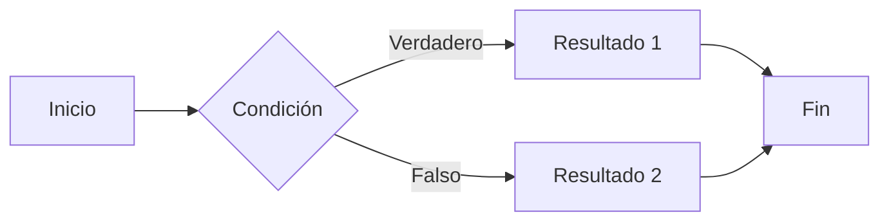

:::info
Este artículo fue escrito cuando usaba el framework Jekyll. ¡Ahora he migrado a Astro!
:::

## **Introducción**

Ha pasado casi dos años desde que abrí el blog tras el [primer post](https://hyngng.github.io/posts/first-post/). La verdad es que, para dos años, no es que haya escrito muchos artículos, pero no significa que no le haya tomado cariño. A veces he estado ocupado con asuntos públicos o privados, y otras veces mi propia actividad ha sido escasa, pero así, periódicamente, he ido gestionando el blog.

Recientemente, al renovar el blog y solicitar el registro en los motores de búsqueda, empecé a sentir que me había familiarizado bastante con la plataforma de GitHub Pages, más que antes. Ahora escribo artículos con mucha más comodidad que antes, y el tiempo libre que me queda lo dedico a decorar el blog. Personalmente, creo que, aunque elegir GitHub Pages fue una apuesta, estoy disfrutando de la personalidad propia de la plataforma, así que me gustaría resumir qué ventajas de GitHub Pages me resultan atractivas.

## **Personalización libre**

{: .light .border }
{: .dark }
*La función de eliminar el contenido de etiquetas específicas añadida recientemente, y la pantalla con la función aplicada con éxito.*

GitHub Pages tiene, en general, un nivel de dificultad de operación muy alto en comparación con otras plataformas. Hay muchas molestias que requieren prestar atención y configurar varias cosas directamente, pero a pesar de ello, la razón por la que se elige GitHub Pages es porque la experiencia de gestionar el blog es muy libre.

GitHub Pages me da constantemente una sensación de apertura y flexibilidad, a diferencia de otras plataformas de blogs. Mientras que otras plataformas son entornos cerrados donde solo se pueden usar las funciones que admiten dentro de ciertos límites, GitHub Pages proporciona toda la información que compone la página en un estado modificable, por lo que, especialmente si se tienen conocimientos básicos de frontend, se puede implementar la mayoría de las funciones uno mismo. Principalmente se utilizan los siguientes lenguajes.

- Ruby
- Liquid
- SCSS
- JavaScript

En mi caso, ya he escrito dos artículos al respecto: uno sobre [varios ajustes de personalización](https://hyngng.github.io/posts/first-blog-customization/) y otro sobre la [implementación de una función específica](https://hyngng.github.io/posts/blog-content-remove/). Además, aunque no he escrito un artículo aparte, recientemente añadí algunos elementos como imágenes de vista previa LQIP, un icono de Instagram y un botón de aplausos.

Precisamente porque la personalización es tan libre, tiene su gracia decorarlo, y eso me motiva a seguir gestionando el blog con cariño. Constantemente pienso en cómo podría mejorarlo al verlo, o busco otros blogs similares para ver qué cosas buenas podría incorporar al mío.

## **Los artículos se escriben en Markdown**

*Pantalla de redacción del párrafo que se está viendo ahora.*

Otra de las características más destacadas de GitHub Pages es que se usa Markdown, un lenguaje de marcado, para escribir los artículos. Markdown tiene varias ventajas y desventajas, pero personalmente creo que tiene más cosas buenas.

Porque, una vez que te adaptas a Markdown, desaparece la molestia de tener que hacer clic en los botones del editor cada vez que quieres insertar elementos como negritas, citas o líneas separadoras. Cuando te familiarizas lo suficiente con la sintaxis, puedes concentrarte por completo: las manos solo en el teclado y los ojos solo en la pantalla.
Además, el tema que uso admite bien módulos externos utilizables en documentos Markdown, como [MathJax](https://www.mathjax.org/) para expresar fórmulas y [Mermaid](https://mermaid.js.org/) para representar diagramas y esquemas, por lo que hay pocas limitaciones al escribir y, más bien, puedo centrarme en la calidad del artículo tanto como quiera.

Por ejemplo, con un poco de cuidado, se pueden insertar limpiamente fórmulas o diagramas como los siguientes en el cuerpo del artículo.

**MathJax**
$$
\begin{equation}
  \sum_{n=1}^\infty 1/n^2 = \frac{\pi^2}{6}
  \label{eq:series}
\end{equation}
$$

**Mermaid**

Además, tiene la ventaja de que se puede compatibilizar sin problemas con programas basados en Markdown como Obsidian. Aunque es algo incómodo, si se sincroniza Obsidian con el móvil, es posible editar artículos también en el entorno móvil.

## **Funciones útiles propias del tema**

*Parte de la pantalla de configuración del tema Chirpy (_config.yml)*

Elegí esta plantilla que estoy usando ahora porque me gustaron su diseño limpio, el soporte de alternancia de modo oscuro y la función de recomendación de artículos relacionados, pero al usarla, las pequeñas funciones que ofrece el tema en sí son bastante potentes. Si estás pensando en abrir un blog de GitHub y usar esta plantilla, te recomiendo que conozcas y aproveches los siguientes elementos.

- Integración con Google Search Console y Analytics
- Distinción de imágenes para modo oscuro y modo claro
- LQIP (imagen de vista previa de baja calidad), PWA (aplicación web)
- Función de comentarios basada en GitHub como utterances o giscus

Estas funciones son aspectos que se suelen pasar por alto, pero si se aprovechan bien, pueden mejorar la calidad de la experiencia general tanto para quien escribe como para quien lee el blog. Si se utilizan adecuadamente, se pueden crear experiencias especiales como manejar suavemente el momento de carga de las imágenes o instalar una aplicación dedicada a mi blog en el smartphone.

Además, el tema ofrece funciones de gran utilidad como añadir sombras al borde de las imágenes o alinear imágenes y texto en paralelo, y también admite bien MathJax y Mermaid, que ya he mencionado, a nivel de plantilla del blog, por lo que he podido usarlos de forma provechosa.

## **Conclusión**

Sin embargo, como contrapartida, es un poco difícil. Si no eres desarrollador, necesitas conocer algunos aspectos técnicos de GitHub o de la composición de las páginas web con los que no se está familiarizado para poder gestionarlo sin problemas, y como se puede ver en la [guía oficial de escritura de artículos de Chirpy](https://chirpy.cotes.page/posts/write-a-new-post/), incluso para simplemente escribir un artículo hay que conocer parte de la sintaxis. La inserción de anuncios o la exposición de los artículos también requieren procedimientos externos complicados al no haber servicios de conexión separados.

A pesar de todo, creo que GitHub Pages puede ser la mejor experiencia para quienes quieran reducir la dependencia de la plataforma o tengan una fuerte curiosidad técnica. Ciertamente es difícil, pero el 90% de las funciones ya vienen implementadas, por lo que no es desesperadamente complicado. Además, la dependencia de la plataforma es baja y se puede gestionar el blog a tu manera, así que si consigues familiarizarte, no solo es llevadero, sino que tiene una sensación de logro y diversión inigualables por sí mismo.
