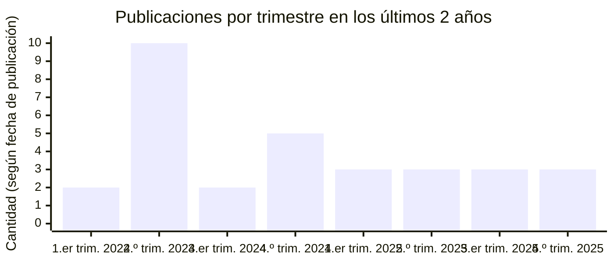
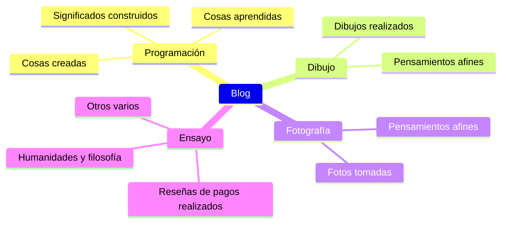

## **Por qué empecé un blog**

He escrito un total de 42 artículos, sin contar este. Si miro atrás al momento de abrir el blog, la motivación en sí tuvo una influencia externa. Me parecía admirable ver a otros bloggers reunir en un solo lugar lo que habían estudiado, diversos conocimientos técnicos, métodos de resolución de problemas diseñados por ellos mismos, etc., y de forma natural mi blog también se orientó hacia un blog técnico. La verdad es que esa corriente no está mal, y todavía mantengo esa dirección a propósito. Tengo previsto seguir publicando regularmente artículos que recojan experiencias relacionadas con la programación y las dificultades encontradas en el proceso.

En segundo lugar, quería tener un espacio que me describiera bien. En algún momento, me resultó agotador explicar a las personas que conocía por primera vez qué tipo de persona soy. Que este lugar sea un blog, y no las redes sociales de uso común como X, Threads, Facebook o Instagram, responde a esa misma razón. Porque las redes sociales son favorables para la difusión de contenido ligero, pero no son un buen entorno para usar la razón, y no logran describir a una persona con autenticidad.

Yendo al grano, creo que estoy logrando estos dos objetivos bastante bien, y siento una pequeña sorpresa, cierta emoción, al ver los artículos que escribí antes. Aunque requiere mucho tiempo y esfuerzo, mantener el blog es sin duda algo bueno que tengo ahora.

## **Mi trayectoria, breve y extensa**

### **Principios para una escritura constante**

Si resumo la cantidad de artículos escritos desde el año pasado hasta ahora, en periodos de dos meses, queda como se muestra arriba. La verdad es que desde que abrí el blog me he preguntado con qué frecuencia debía escribir. El año pasado me fijé implícitamente el objetivo de un artículo cada dos semanas, y llegué a escribir 4 o 5 artículos al mes, pero tuve que hacer concesiones en la frecuencia de publicación por las siguientes razones. No se trata de que cuantos más artículos, más nutrido esté el blog. Cuanto mayor es la dependencia del blog, más difícil resulta concentrarse en la vida real, y cuanto mayor es el objetivo de publicación, más difícil resulta escribir artículos de calidad.

En 2025, solo varía si es a principios de mes o no, pero mantengo una frecuencia de un artículo al mes. Esto también es un patrón implícito, por lo que no es necesario cumplirlo estrictamente, pero tras mantener este ritmo durante aproximadamente un año, he podido alternar adecuadamente entre la vida cotidiana ocupada y el blog. Considerando que 12 artículos al año no es una cantidad pequeña, creo que este nivel es sostenible a largo plazo, y a menos que haya una ocasión especial, probablemente los nuevos artículos seguirán subiendo con este ritmo.

### **Personalización continua del blog**

Quizá porque los archivos de configuración del blog están siempre a mano, cada vez que escribo un artículo suelo revisar la estructura de la página y hacer cambios con frecuencia. Ya había [hecho varias modificaciones antes](https://hyngng.github.io/es/blog/first-blog-customization/), y a día de hoy sigo ajustándolo según mis gustos. Un ejemplo reciente: desactivé la animación de transición entre modo oscuro y claro. El tema no ofrece una opción para desactivarla, pero me resultaba tan molesta que busqué el atributo donde se define el efecto de cambio de tema, como `id="post-preview"`, y lo sobrescribí con `transition: none !important`. Ahora la transición es limpia.

A continuación, con la versión `v7.3.1` del tema, descubrí un bug por el que el efecto de desenfoque no se reproducía cuando la imagen de vista previa de la página de inicio pasaba de LQIP a la original. Tras un largo proceso de depuración, lo resolví y [publiqué un issue](https://github.com/cotes2020/jekyll-theme-chirpy/issues/2537) en el repositorio oficial. Al cabo de unas dos semanas y media, el desarrollador confirmó el problema y poco después se creó [un nuevo commit que reflejaba mi perspectiva](https://github.com/cotes2020/jekyll-theme-chirpy/pull/2551), y enseguida se lanzó la nueva versión [v7.4.0](https://github.com/cotes2020/jekyll-theme-chirpy/blob/master/docs/CHANGELOG.md#740-2025-10-19), con lo que el bug se corrigió oficialmente.

### **Divagaciones sobre los motores de búsqueda**

Ya he [escrito un artículo al respecto antes](https://hyngng.github.io/es/blog/webmasters-and-seo/), así que agradecería que lo leyeran como una nota al margen. Primero, al tratar con las herramientas para webmasters, hubo que tener paciencia. Hubo que tener mucha paciencia. En particular, Google Search Console puede tardar hasta medio año en mostrar resultados de búsqueda normales tras el registro, e incluso después de haber transcurrido suficiente tiempo, si la autoridad de la página es baja, el funcionamiento del rastreador puede verse bastante degradado. Puede que mi impresión no sea precisa, pero tengo la sensación de que, más que lo bien implementada que esté la optimización para motores de búsqueda, la autoridad del dominio es muy importante para la generación de índices.

En Bing, hubo un momento en que el índice se canceló de repente. Para ser exactos, Bing clasifica las páginas en «indexadas», «con errores», «con advertencias» o «excluidas» en su propia terminología, y todas las páginas de mi blog se movieron a «excluidas» y desaparecieron de los resultados de búsqueda de Bing. Como no había problemas propios de la página, como el alojamiento o `robots.txt`, el 13 de agosto [envié una consulta al equipo de soporte de Bing Webmaster Tools](https://www.bing.com/webmasters/support). El 30 de agosto recibí un correo de respuesta diciendo «We have reviewed your site and sent it to our Product Review group for further assessment.», y el 3 de octubre, «I am happy to inform you that the issue related to your site has been resolved». Aunque requirió aproximadamente un mes y medio, el índice se ha recuperado casi por completo y ahora la exposición en los resultados de búsqueda funciona correctamente.

## **Principios personales de escritura**

### **Naturaleza heterogénea del blog**

A fecha de escribir este artículo, los temas que trata el blog se resumen aproximadamente como se muestra arriba. Es bastante variopinto; dicho de forma positiva, es rico, pero dicho de forma negativa, se podría decir que su carácter es ambiguo. Mezclar muchos temas es realmente desventajoso desde el punto de vista del SEO, pero aun así, escribo sobre temas diversos con ciertos fundamentos. La premisa es la siguiente: el blog es un espacio personal para escribir libremente, y no debería tener que andarme con cuidado en mi propia página. Si mis intereses están realmente repartidos en múltiples áreas, es natural que mis artículos también se escriban así.

Puede que suene un poco crítico, pero creo que los casos que se ven a menudo, como gestionar el blog priorizando las preferencias ajenas —temas populares en redes sociales o de alto valor publicitario—, acaban desvirtuando a largo plazo el significado de un blog personal. Considerando que, al fin y al cabo, en el momento de escribir un artículo se alcanza en parte la condición de escritor en el sentido lexicográfico, es necesario priorizar la subjetividad del escritor sobre los gustos del lector en una proporción de 51:49 aproximadamente. Como este lugar tiene sentido en la medida en que crea un espacio que me describe bien, tratar múltiples temas es algo intencionado en este contexto.

### **Distinción deliberada del estilo de escritura**

Al principio escribía en estilo 해체 (informal), con el escritor como sujeto, y después, pensando en los posibles lectores, probé a usar el estilo 하십시오체 (formal cortés). Al cambiar de estilo, notaba incomodidad en ambos lados, pero entonces descubrí que en las críticas de la crítica de cine Kim Hyeri, a quien admiro, en algunos casos el estilo de escritura era libre. Tanto la idea de que cada obra tiene su formato adecuado como la filosofía de que esa idea merece llevarse a la práctica me resultaron convincentes y quise adoptarlas.

Nunca había hecho algo así antes, así que es un poco una apuesta en cuanto a cómo lo percibirán los demás. Pero en [artículos recientes como este](https://hyngng.github.io/posts/finding-camus-in-goryeo-history/) he estado usando, aunque sea de forma tímida, una forma de concluir las frases diferente a la de otros artículos. Me permite ser un poco más sincero con el texto y el proceso de escritura también resulta más divertido, así que tengo una buena impresión. En el futuro, al escribir, quiero ir más allá de la forma de concluir las frases y buscar la diversidad en lugar de la uniformidad —en la composición de los párrafos, la extensión, el punto de vista narrativo, etc.— e intentar escribir algo novedoso siempre que sea posible.

### **Elección de expresiones antiautoritarias**

Del mismo modo que en programación reflexiono sobre los nombres de las variables, al escribir también suelo dudar entre varias expresiones. Para mí, el criterio de una buena expresión no es el brillo retórico, sino la claridad del significado, es decir, en qué medida se puede reducir el grado de abstracción del contexto. Intento aplicar este criterio con seriedad. Como incluso las frases ya escritas muestran aspectos mejorables con el tiempo, busco y refino las expresiones que perjudican la transmisión del significado, como el estilo vogo (burocrático) o las traducciones literales, y más cuidadosamente, las frases cercanas al estilo ampuloso.

En un sentido similar, soy consciente de la jerarquía lingüística al elegir las palabras. En la medida de lo posible, priorizo las palabras nativas coreanas y uso vocablos sino-coreanos y extranjerismos según sea necesario. El argumento es simple: las palabras nativas pertenecen a un léxico clásico probado, mientras que los extranjerismos corren el riesgo de ser modas pasajeras relativamente. Más que creer ciegamente esta tendencia, es importante elegir en cada caso la expresión que transmita el significado con mayor precisión. Sin embargo, un artículo con una alta proporción de estos últimos puede dar la impresión de alardear de experiencia técnica, por lo que evito deliberadamente los extranjerismos cuando no son más precisos que las palabras nativas. En las situaciones que requieren tales expresiones técnicas, primero considero si no sería mejor explicarlas con palabras.

### **Respeto al lector, ritmo pausado**

Evito el uso de la negrita. La negrita tiene la ventaja de aclarar la transmisión del significado, pero su efecto se realiza cómodamente mediante un énfasis visual. Y esto tiene el efecto secundario de priorizar cierta subjetividad del escritor más de lo necesario. Por supuesto, hay entornos donde es necesario, como en los carteles de películas o la publicidad de productos, que tienen un carácter comercial. Pero en un entorno de carácter archivístico como este, es preferible que el escritor se esfuerce cortésmente por lograr una composición lingüística convincente. Usar al mínimo los recursos que se pueden emplear en las frases mediante la sintaxis de Markdown —cursiva, tachado, etc.— también responde a razones similares.

Del mismo modo, mantengo un estilo de escritura de respiración larga. Evito el hábito de terminar los textos de forma breve, y cuando tengo que incluir información nueva, en lugar de publicarla como un artículo nuevo e independiente, la añado a un artículo existente. Esto también va en contra de la tendencia actual, donde el contenido corto y directo, centrado en el móvil, es efectivo. La razón por la que asumo esta desventaja a sabiendas es que espero que los artículos que escribo ahora no se desvanezcan en el futuro y sigan siendo buenos textos.

### **Enfoque conservador hacia la IA**

A diferencia del código, en la escritura mantengo un enfoque lo más tradicional posible, sin ayuda de servicios de inteligencia artificial como ChatGPT, Gemini o Claude. Como las razones por las que escribo son la revisión, la mejora de mis capacidades y el apego, no tendría sentido delegar la escritura en otros. Si puedo abordar el tema suficientemente, puedo escribir un artículo de calidad sin ayuda externa, y si no es así, creo que lo primero es familiarizarme con el tema. Sin embargo, no lo descarto por completo; reflexiono sobre el uso saludable de la IA generativa. Por ejemplo, recientemente la estoy usando para comparar y analizar borradores que estoy escribiendo con artículos que me han impresionado, o para revisar expresiones concretas.

En particular, las respuestas de modelos recientes como ChatGPT 5 o Claude 4.5 tienen un nivel que merece la pena consultar. Sobre todo Gemini 2.5 Pro me da a menudo la sensación de tener un alto dominio del lenguaje desde su lanzamiento. Presenta bien la impresión general del texto y sus problemas, alternativas para palabras concretas, versiones abreviadas y expandidas de las frases, por lo que si se consulta bien un diccionario, es excelente como herramienta de revisión. Sin embargo, con las alucinaciones hay que mantener una vigilancia firme. Cuanto más reciente es el lanzamiento, más tiende a presentar conceptos erróneos en campos minoritarios, así que yo consulto guías oficiales o, en casos excepcionales, libros o algunos artículos académicos antes de incorporarlos al texto.

## **Sigo abierto como siempre**

Cuando abrí el blog, tenía muchos materiales interesantes de campos diversos para enriquecerlo: teorías básicas de relaciones internacionales como el realismo político y el idealismo político; varios puntos clave de la lingüística, como la familia indoeuropea y la tipología lingüística, el parentesco entre la escritura mongola y la manchú, y el origen de las pronunciaciones sino-coreanas modernas; historias de dibujo que entrelazaran el rápido desarrollo de la IA; o los límites físicos de los sensores de imagen CMOS y las estrategias para superarlos. Mirando atrás, es una lástima no haber publicado realmente artículos sobre estos temas por falta de tiempo, pero mi interés se mantiene constante. Probablemente algún día publique artículos sobre temas similares.

Una cosa más: se dice que, con el reciente avance de la IA, la actividad de búsqueda en internet se está contrayendo y que el blog tradicional ha terminado. De hecho, se ve a no pocas personas perdiendo la motivación para gestionar sus blogs al debilitarse la relación de cooperación mutua con los motores de búsqueda y reducirse los ingresos por publicidad. Como se basa en muchos indicadores, es un hecho consumado que mi blog también será descubierto con menos frecuencia. Sin embargo, en mi caso, como el carácter autoconsumista es lo primero, por encima del propósito de compartir información, creo que podré seguir con la actividad sin grandes sobresaltos.

He leído en alguna parte que hay muy pocos blogs que se mantienen durante más de un año. Si eso es cierto, yo estoy a punto de pasar del tercer año al cuarto en años de actividad, así que el primer obstáculo ya lo superé hace tiempo. Personalmente, espero seguir gestionándolo durante mucho, mucho tiempo.
