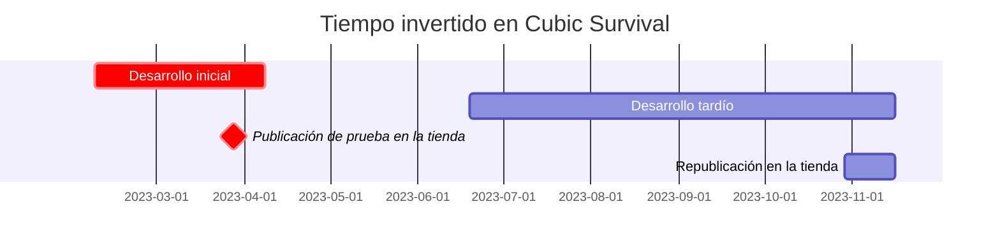

---
image:
    path: /2023-12-22-palette-first-devlog/gameplay.webp
    lqip: data:image/webp;base64,UklGRrYAAABXRUJQVlA4TKoAAAAvD8ABAHW4jWxbbfp4JJmZmSml0LH7L0Mq4pgVtG3DuOOPdQge4zaSFHVVH9P78o+T+j8BbhLNGhMUUL7GTwDFP6j3DTiLqMug0k4+RlwpOQFUC2jKxL/yzX0tKUApmm8sxu7n4LvlOeUbSBnGjBjAWUR/xmX1IQt/X/KSXVS1BnsLKLMeGqGJGl7KM5cUhbtrZyZYxL+CgfcTwNUUcJMaRE0DKQrAqa8oAA==
    alt: Gameplay de ejemplo
    
title: "'Cubic Survival', proceso de concepción y desarrollo"
authors: ["dev"]

categories: [마일스톤, 게임 개발]
tags: [마일스톤, 게임 개발, 유니티, C#, URP, 큐빅 서바이벌, 기획, 개발일지]
start_with_ads: true

toc: true

date: 2023-12-20 19:18:00 +0900
last_modified_at: 2023-12-22 20:42:00 +0900

mermaid: true
---

## **Creando un juego**

En el Año Nuevo de 2023, necesitaba encontrar algo que hacer. Pensé que, a ser posible, quería crear algo que me ayudara a mejorar mi habilidad en programación y que además disfrutara. Así que después de que sonaran las campanas de Nochevieja, al día siguiente hice algunos planes.

Considerando varias ideas, se me ocurrieron: una librería de Python basada en las 6W (qué, quién, cuándo, dónde, por qué, cómo — Who, What, When, Where, Why, How), una aplicación de cámara estilo mirrorless, y un juego 2D para móvil. Cada una derivaba de [un programa en Python](https://hyngng.github.io/es/dev/astp-devlog/), de la experiencia haciendo una aplicación sencilla con Android Studio, o de [un proyecto anterior de Unity](https://hyngng.github.io/es/dev/lavad-devlog/).

Pero el desarrollo de juegos me parecía demasiado divertido. La experiencia previa con Unity me había impresionado, y la idea de poder usar recursos autogestionados me parecía muy interesante. Aunque fuera un trabajo duro, el tema de crear un programa con material propio que no se encuentra en otros lugares me resultaba muy atractivo, y como justo estaba disfrutando de la orientación a objetos, quería usar un lenguaje orientado a objetos en serio, así que empecé a desarrollar un juego 2D para móvil.

## **Resumen del proyecto**



Como el periodo de desarrollo se divide en fase inicial y tardía, voy a revisar brevemente cada una en dos publicaciones separadas. Por lo tanto, esta entrada contiene el contenido del desarrollo inicial, resaltado en rojo en el gráfico anterior.

Al principio, empecé a crearlo con la intención ligera de repasar rápidamente las características de la orientación a objetos, así que no imaginaba que terminaría encariñándome tanto con este proyecto. Por eso, este proyecto no tenía un plan ni objetivos sistemáticos; más bien, a nivel abstracto, esperaba vagamente lo siguiente:

- [x] Quiero crear un diseño visualmente minimalista.
- [x] Quiero implementar un movimiento de cámara suave.
- [x] Quiero aplicar eficazmente un diseño orientado a objetos.
- [x] Quiero usar corrutinas.

Dado que el periodo de desarrollo fue largo, al final fui logrando estos objetivos uno tras otro. Dónde y cómo se logró cada uno es una historia larga, por lo que la trataré en detalle a lo largo de esta entrada y la siguiente.

## **Proceso de desarrollo inicial**

{: w="960" }
*Al principio pensé que cada vez que eliminara unos cuantos enemigos ocurriría algún evento*

Empecé con un clon. Es decir, pensé en intentar copiar algún juego famoso entre los pequeños que fuera factible de replicar.

Primero, tomé como referencia Brawl Stars, que recordaba haber disfrutado con amigos en el instituto. Pero más que copiar el sistema del juego, me sirvió para entender cosas como «así es la sensación de una plataforma 2D para móvil».

### **Joystick**

{: w="960" }

Quería implementar un joystick que pudiera aparecer en un juego 2D para móvil típico, y creé un joystick para el movimiento del jugador a la izquierda y otro para apuntar a la derecha.

Para crearlo, utilicé la clase `OnScreenStick` del paquete `Unity​Engine.​Input​System.​On​Screen`, creando dos nuevos scripts basados en esta clase que hacen que el jugador y un objeto transparente de puntería se desplacen con `Translate()` según la diferencia de fase. Como había pocos materiales en coreano sobre el paquete `​On​Screen`, consulté mucho la [documentación oficial](https://docs.unity3d.com/Packages/com.unity.inputsystem@1.7/api/UnityEngine.InputSystem.OnScreen.OnScreenStick.html?q=OnScreenStick).

Como nota adicional, tenía muchas ideas que quería implementar, como conectar visualmente el stick y el punto central mediante un LineRenderer, que el stick volviera al centro con efecto elástico, o que el manejo del joystick variara según el arma, pero en ese momento me faltaba habilidad y algunas chocaban con la estructura del juego, así que no pude implementarlas. En su lugar, hice que diera una retroalimentación de vibración al presionar y soltar el joystick.

### **Generación y comportamiento de enemigos**

{: w="960" }
```cs
void spawnEnemy(GameObject Enemy, float east, float west, float south, float north)
{
    float spawnPointX = Random.Range(west, east);
    float spawnPointY = Random.Range(south, north);

    instantiatedEnemy = Instantiate(
        enemy,
        player.transform.position + new Vector3(spawnPointX, spawnPointY),
        transform.rotation
    );
}

IEnumerator spawnEnemies()
{
    for (int i = 0; i < data.spawnCount; i++)
    {
        spawnEnemy(Enemy, east, west, south, north);
        yield return new WaitForSeconds(spawnDelay);
    }
}
```

Al principio, creé un objeto portal para que los enemigos se instanciaran en puntos específicos, pero me pareció que después de creados se vería demasiado monótono, así que escribí el código anterior para que los enemigos se generaran alrededor del jugador.

Basándome en los cuatro parámetros `east`, `west`, `south` y `north`, genero coordenadas aleatorias a una distancia determinada del jugador. Para que los enemigos no aparecieran de repente junto al jugador, las coordenadas se establecen fuera del área renderizada por la pantalla.

En Unity, no hay una forma simple de poner un retardo como `Delay()`, y en su lugar la mayoría recomienda usar corrutinas, así que esta fue la primera vez que usé una. Creé una corrutina que genera enemigos a intervalos del valor `spawnDelay`.

```cs
void Move()
{
    dirTowardsPlayer = (player.transform.position - gameObject.transform.position).normalized;
    transform.Translate(dirTowardsPlayer * speed * Time.deltaTime);
}

void OnCollisionEnter2D(Collision2D collider)
{
    if (collider.gameObject.tag == "player")
    {
        player.hp -= damage;

        Vibration.Vibrate((long)20);
        Destroy(gameObject);
    }
}
```

Los enemigos se mueven hacia el jugador por defecto, y al colisionar con él, reducen la salud del jugador en `damage` con retroalimentación de vibración y se destruyen con `Destroy()`.

### **Inventario y objetos**

A medida que la estructura del juego iba tomando forma, pensé que sería bueno tener un inventario donde pudiera obtener y almacenar objetos para usarlos más tarde. Esta fue una parte en la que reflexioné bastante, porque en muchos juegos el inventario se implementa como una ventana separada o como un botón de alternancia, y ninguna de las dos opciones me satisfacía.

En su lugar, me propuse crear un inventario que pudiera contener varios objetos sin que su interfaz perjudicara la experiencia de juego. Por eso, sustituí la función de puntería manual asignada al joystick derecho por puntería automática, y le asigné una nueva función de acceso al inventario. Funciona de modo que al mantener presionado el joystick derecho se abre el inventario, y al soltarlo se cierra.

{: w="960" }
```cs
public struct InventoryData
{
    public string[]     Code;
    public GameObject[] UI;
    public GameObject[] ItemUI;
    public GameObject   Weapon;
    public int[]        Rounds;
}

for (int i = 0; i < InventoryData.InventoryUI.Length; i++)
    InventoryData.UI[i].transform.position = Vector3.Lerp(currentPos, targetPos[i], 2*t);
```

El inventario utiliza 8 objetos que se despliegan alrededor del jugador al acceder a él. Para ello, creé una estructura como la anterior que gestiona los datos necesarios al acceder al inventario (identificador del objeto, objeto del inventario, objeto del objeto, datos del arma, munición, etc.).

Los objetos se dividieron en uno que aparece en el campo y otro que funciona como UI, de modo que cuando el jugador obtiene un objeto de campo, el objeto UI se añade al array `ItemUI`.

|Objeto|ID|
|---|---|
|Pistola|WPPSTL|
|Escopeta|WPPASG|
|Ametralladora|WPMING|
|Pasiva de velocidad de movimiento|PVMSPD|
|Pasiva de velocidad de ataque|PVATKR|
|...|...|

Los identificadores de objeto se crearon con dos dígitos que indican el tipo seguidos de cuatro dígitos que indican el nombre del objeto. Lo curioso es que cuando lo hice no me daba cuenta, pero a medida que aumentaban los objetos, pensar naturalmente «¡tengo que crear un código único para distinguirlos!» resultó ser, según supe después, el concepto de «identificador». Me pareció bastante útil y planeo seguir usándolo en el futuro.

### **Disparo de armas**

{: w="960" }
```cs
if (shotTimer > fireThreshold)
{
    for (int i = 0; i < bulletCount; i++)
    {
        instantBullet = Instantiate(
            bullet,
            FirePosition.transform.position,
            Quaternion.Euler(
                0, 0, transform.rotation.eulerAngles.z + Random.Range(MOA * -1, MOA) + 180
            )
        );
        Destroy(instantBullet, 1);
    }
}

shotTimer += Time.deltaTime;
```
```cs
void hasHitEnemy()
{
    hit = Physics2D.Raycast(transform.position, transform.right, 100);

    if (hit.collider != null && hit.distance < 1)
    {
        if (hit.collider.gameObject.tag == "enemy")
        {
            if (hit.collider.GetComponent<Enemy>().HP > 0)
                Destroy(gameObject);
            /* ... */
        }
    }
}
```

Las balas se crean en el objeto secundario `FirePosition` del arma, avanzan en la dirección en la que apunta el jugador y desaparecen tras 1 segundo desde su creación. Para implementar la dispersión de las balas, al generarse, se corrige ligeramente el valor del eje Z del ángulo con `Random.Range()` dentro del valor `MOA` especificado para cada arma.

La detección de colisiones se realizó mediante raycast. Sin embargo, quizás porque la velocidad de las balas era demasiado alta, la detección de colisiones con raycast no funcionaba correctamente y las balas atravesaban a los enemigos. Este problema no se solucionaba aumentando la longitud del rayo o ampliando el rango del collider, pero pude resolverlo añadiendo la condición `hit.distance < 1`.

Después de implementarlo todo, descubrí que en casos de instanciación frecuente de objetos, como el disparo de balas, se puede usar una técnica de optimización llamada object pooling. Me gustaría aplicarla en el futuro cuando tenga tiempo.

## **Diseño de experiencia de usuario**

Si los párrafos anteriores trataban sobre «quiero hacer un juego de acción donde se recorra el campo eliminando enemigos», este apartado trata sobre «quiero implementar una experiencia de usuario suave y singular». Creo que la mayor parte del trabajo visual serio se realizó en la fase de desarrollo tardío, por lo que lo trataré en la siguiente entrada.

### **Cámara**

{: w="960" }
```cs
void Move()
{
    transform.position = Vector3.Lerp(
        transform.position,
        player.transform.position,
        Time.deltaTime * moveSpeed
    );
}

void Vignette()
{
    targetVignetteValue = inventoryIsOpen ? 0.35f : 0f;

    vignette.intensity.value  = Mathf.Lerp(
        vignette.intensity.value,
        targetVignetteValue,
        Time.deltaTime * vignetteSpeed
    );
}
```

Hay una opción llamada viñeteado (Vignette) que he observado con atención al editar [fotos](https://hyngng.github.io/posts/photos-of-imin/). Esta función oscurece los bordes de la pantalla para concentrar la mirada en el centro. Como en el [postprocesado](https://docs.unity3d.com/kr/2020.3/Manual/PostProcessingOverview.html) de Unity también existe la misma opción, pensé que sería perfecto aplicar este efecto al abrir el inventario.

Así que hice que al acceder al inventario, el valor de viñeteado fuera de aproximadamente 0.35. Al igual que el movimiento de la cámara, el viñeteado se procesa suavemente mediante Lerp. Durante el desarrollo, me costó ajustar los parámetros como `vignetteSpeed` y `moveSpeed` que recibe Lerp para que dieran la sensación que quería; estuve jugando y modificando, jugando y modificando, y cuando trabajaba en otras partes y no quedaba satisfecho, volvía a ajustarlos, esforzándome durante todo el desarrollo por encontrar el valor deseado.

### **URP**

{: w="960" }
*Cada vez que se dispara un arma, se proyecta una sombra detrás del enemigo.*

Al principio, intentaba usar el efecto de luz básico del entorno Unity 2D, pero había varias carencias. Como alternativa, apliqué [URP (Universal Render Pipeline)](https://unity.com/srp/universal-render-pipeline) y el aspecto visual mejoró muchísimo. Ofrece efectos de luz suaves y bonitos por defecto, y además permite, por ejemplo, ajustar la opción Falloff Strength para crear luces más sutiles o vistosas, o usar la opción Shadows para efectos de luz y sombra como el anterior, por lo que lo encontré muy útil.

Sin embargo, más tarde, al añadir Light2D a cada bala o enemigo, el teléfono se calentaba rápidamente. Parece que consume bastantes recursos de la GPU, así que no pude usarlo de forma intensiva y lo dejé solo para enriquecer el efecto de llama al disparar.

## **Para concluir**

He resumido brevemente las actividades de desarrollo inicial. Mientras escribo, me doy cuenta de que, en realidad, no recuerdo muy bien lo que sentí durante este periodo. Parece que no he logrado plasmar todos los pensamientos y esfuerzos, así que la próxima vez intentaré tomar notas con frecuencia durante el proceso.

Aun así, al implementar varias cosas directamente, me di cuenta de que crear un juego es un trabajo más meticuloso de lo que pensaba. En particular, me parecen realmente admirables otros juegos que no siguen las tendencias populares y buscan nuevos paradigmas, y que además los implementan con éxito. Y personalmente, como alguien que encuentra eso genial, sentí un poco de ambición.
