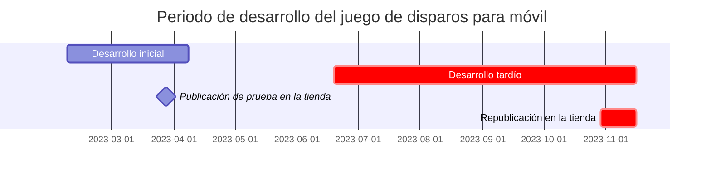
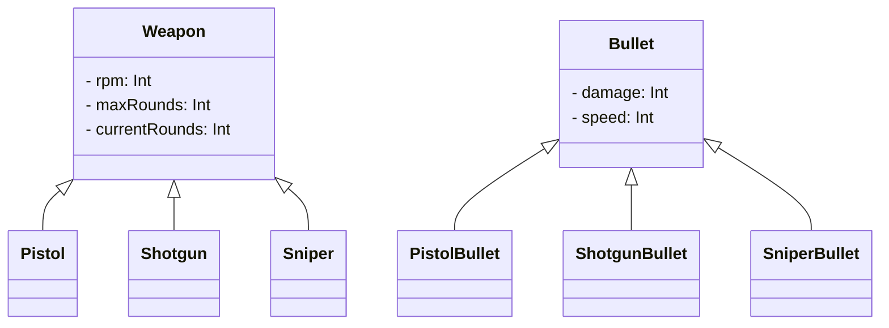

---
image:
    path: /2023-12-24-palette-second-devlog/gameplay.webp
    lqip: data:image/webp;base64,UklGRp4AAABXRUJQVlA4TJIAAAAvD8ABAHW4jW07cZZZFK05opg5dwVuh0KP63YPX9K8r/lX2LZtQ/9/b7pH/6uQQTkldeJfaiu1Vm5md+y6VXAnB01t6GKRzP0ax2haSBXAIpUOphDguA1NYDEqXRj3wIgpeMdtNWAhXjfv2IdZJp2CutpKacCzQSqv6wO8mG9t+BciZqCmJINcWYVt8M57GziHAA==
    alt: Gameplay de ejemplo
    
title: "'Cubic Survival', proceso de desarrollo y lanzamiento"
authors: ["dev"]

categories: [마일스톤, 게임 개발]
tags: [마일스톤, 게임 개발, 유니티, C#, URP, 큐빅 서바이벌, 개발, 개발일지]
start_with_ads: true

toc: true

date: 2023-12-22 22:38:00 +0900
last_modified_at: 2024-03-20 17:38:00 +0900

mermaid: true
---

## **Por qué retomé el desarrollo**

:::info
Continúa desde [la entrada anterior](https://hyngng.github.io/es/dev/palette-first-devlog/).
:::



En marzo, cuando comenzó el nuevo semestre, durante el primer mes más o menos seguí creando sistemas básicos del juego como el inventario del jugador, pero al acercarse la época de exámenes, el flujo de desarrollo se interrumpió por la presión. Sin embargo, después de los exámenes finales de junio, volví a tener tiempo libre y decidí retomar el juego que había estado haciendo antes.

Durante los dos meses de vacaciones de verano, me interesé mucho por el aspecto visual, como los assets de imagen y los efectos de partículas. Además de la impresión de que el juego mejoraba eficazmente, el hecho de buscar una sensación singular que no se encuentra en otros lugares me pareció muy único. Como parece que no es fácil tener esta experiencia, en el segundo semestre decidí hacer una gran apuesta a modo de prueba: seguir asistiendo a clase y a los exámenes, pero dedicar el máximo tiempo posible al desarrollo del juego.

Por lo tanto, en esta entrada he organizado principalmente qué y cómo hice todo lo demás durante ese periodo.

## **Creación de armas**

### **Animación de disparo** {#weapon-animation}


```cs
if (shotTimer > fireThreshold)
{
    WeaponAnimator.SetTrigger("Fire");
}

shotTimer += Time.deltaTime;
```

Creé una animación de disparo utilizando el componente de animación de Unity. El componente de animación que proporciona Unity no solo permite la animación de corte tradicional mediante el intercambio de imágenes de sprite, sino que también admite la creación de animaciones que ajustan directamente la posición de los objetos secundarios, por lo que utilicé ambos tipos adecuadamente para que, al disparar un arma, se reprodujera una animación de retroceso correspondiente.

El efecto de llama que se reproduce frente al cañón se procesó con desenfoque en la propia imagen, y para reducir la artificialidad, exageré el tamaño del sprite y le apliqué el efecto de luz de URP y el efecto Bloom del postprocesado. Gracias a ello, pude crear un efecto llamativo que capta la atención, reduciendo la impresión de ser soso.

{: w="480" }
{: w="480" }

Las imágenes que componen el efecto de animación de la llama se crearon utilizando la función de animación de Clip Studio. Como crear sprites de animación manualmente es, al fin y al cabo, un trabajo digital tedioso, consideré usar activos oficiales proporcionados por Unity, pero al buscar no encontré ninguno con el estilo que quería, así que los dibujé yo mismo y los utilicé. Al crearlos, fui consultando lentamente [otra animación de disparos](https://www.youtube.com/watch?v=kAafHZcT2fc) fotograma a fotograma para conseguir el efecto deseado.


Para reducir la falta de naturalidad al cambiar de arma, también creé una animación de verificación de recámara específica para cada arma que se reproduce solo al cambiar o adquirir un arma nueva. Al manipular el arma, introduje un breve retardo en el control del jugador; tras aplicarlo, la experiencia de juego se sintió mucho más orgánica y quedé satisfecho.

### **Efecto de impacto en enemigo**


```cs
public void Hit()
{
    ParticleSystem hitEnemyParticle = hit.collider.GetComponent<ParticleSystem>();
    hitEnemyParticle.Emit(particleNumber);
}
```

El efecto de impacto se creó mediante el sistema de partículas. Al principio lo implementé de forma sencilla, con partículas que se movían en direcciones aleatorias y disminuían gradualmente su velocidad, pero el resultado me pareció más artificial de lo esperado, así que lo pensé.

Curiosamente, lo resolví por casualidad: al configurar la velocidad lineal y la velocidad orbital en Velocity over Lifetime como Random between two curves y retorcer el gráfico dos veces, se creó un efecto similar a una nube de polvo, que fue el que utilicé. Se ve bien y la sensación de impacto es bastante buena.

### **Sistema de munición**


```cs
public virtual void Update()
{
    if (roundsCurrent > 0)
        Fire();
    else if (!WeaponAnimationInfo.IsTag("Weapon_Reload"))
        WeaponAnimator.SetTrigger("RoundIsEmpty");
    else
        roundsCurrent = roundsMax;
}

public virtual void Fire()
{
    if      (currentRounds == 1) WeaponAnimator.SetTrigger("FiredLastRound");
    else if (currentRounds > 0)  WeaponAnimator.SetTrigger("Fired");

    roundsCurrent -= 1;
}
```

Creé una función que muestra las balas restantes. Cuando las balas llegan a 0, se reproduce la animación de recarga, y al finalizar esta, la munición vuelve al valor máximo establecido en el objeto del arma. Al igual que la salud del jugador, la UI de munición se muestra de forma simplificada como un objeto de juego sobre la cabeza del jugador.

También añadí un pequeño detalle: si el arma cambia antes de que termine la animación de recarga, al volver a coger esa arma más tarde se reproduce la animación `GainedEmpty`, distinta de la animación `Gained`. La diferencia es que en `GainedEmpty`, el cierre está retenido hacia atrás, mostrando la recámara, y la recarga comienza en ese estado. Lo tomé de muchos juegos FPS que implementan este detalle.

### **Efecto de daño**


El efecto de daño en sí ya se había implementado en el desarrollo inicial, pero como su funcionamiento estaba basado en código y no en un componente de animación, y su aspecto visual dejaba mucho que desear, lo rehíce. Cambié el simple efecto de desvanecerse gradualmente para que el tamaño y la velocidad de desplazamiento del efecto también se ajustaran de forma dinámica.

Al hacerlo, también implementé un sistema de crítico, de modo que cuando el daño se duplica de forma probabilística se reproduce una animación específica. Para que se note fácilmente que se ha infligido daño crítico, la animación se diferencia de la animación de daño normal en tamaño y color.

### **Diversificación de armas**


```cs
public abstract class Weapon : MonoBehaviour
{
    protected int   RPM;
    protected int   maxRounds, currentRounds;

    public virtual void Awake()
    {
        /* ... */
    }
}
```
```cs
public class Pistol : Weapon
{
    public override void Awake()
    {
        base.Awake();
        
        maxRounds     = 10;
        rotationSpeed = 40;
    }
}
```

Al principio no pensaba crear armas principalmente, pero al intentar reutilizar lo que ya había hecho, terminé creando varias armas basadas en armas de fuego. Al hacerlo, fui consciente del polimorfismo de la programación orientada a objetos: escribí en la clase padre `Weapon.cs` los elementos básicos como `RPM`, `maxRounds` y `currentRounds`, y luego hice que clases de armas específicas como `Minigun.cs`, `Shotgun.cs` y `SMG.cs` las heredaran para funcionar.

Era la primera vez que usaba herencia, y definitivamente fue más eficiente que mi forma anterior de escribir código. Me pareció novedoso y curioso que unificar el código repetitivo en un nivel inferior y llamarlo desde el código terminal fuera completamente diferente a usar una librería.

## **Creación de animaciones**

### **Movimiento del jugador**


Usar la forma cuadrada básica que proporciona Unity como jugador me parecía de muy poca dedicación, así que añadí un torso nuevo y piernas en movimiento. Según si el jugador arrastra el joystick al máximo o no, se reproduce adecuadamente una animación de caminar o de correr.

Para reducir la artificialidad de la animación, hice que la velocidad de reproducción de la animación de caminar variara según la intensidad con que se arrastra el joystick, y también añadí la función de que el jugador camine hacia atrás según la dirección de puntería. Por ejemplo, si el jugador camina hacia la izquierda pero el enemigo está a la derecha, el jugador camina lentamente hacia atrás mientras apunta al enemigo. Como resultado, el movimiento no se ve forzado y resulta bastante natural.

### **Sistema de experiencia**


Para aliviar un poco el aburrimiento durante el juego, creé un sistema de experiencia. Al eliminar enemigos, el jugador gana experiencia; al alcanzar cierta cantidad de experiencia, sube de nivel y el jugador se fortalece; el nivel acumulado se muestra como puntuación en la pantalla de resultados al finalizar la partida.

Al principio hice que el jugador tuviera que recoger directamente las partículas de experiencia para obtenerla, pero a medida que avanzaba la partida, el aumento de enemigos saturaba la pantalla, así que lo cambié para que la experiencia se obtuviera inmediatamente al eliminar un enemigo. Tras aplicarlo, el sistema actual resultó ser mucho más limpio, hasta el punto de parecer el estándar.

### **Entrada a la pantalla de juego**


Personalmente, me gusta más que la transición entre escenas sea suave en lugar de cortante, ya que da la sensación de que el programa te cuida. Quería aplicar esto también a mi juego.

Así que, al pulsar el botón de jugar, en lugar de simplemente cambiar de escena, hice que el jugador apareciera a partir de un objeto con la misma forma de botón del mismo tamaño. Al presionar el botón, la UI de la escena principal desaparece suavemente, y la UI de la escena de juego aparece desde los bordes de la pantalla. Aunque se notan las imperfecciones propias de un aficionado, me siento un poco orgulloso de haber creado una experiencia única que no se encuentra en otros juegos.

## **Desarrollo tardío: otros trabajos**

### **Assets de imagen**


*Dibujado con una Galaxy Tab*

Como [expliqué antes](#weapon-animation), los assets de imagen no se obtuvieron de Unity Asset Store, sino que todos los hice yo mismo. Al dibujar primero las armas en pixel art, la sensación no era forzada, así que también hice otros elementos como enemigos, efectos de impacto, joystick y barra de experiencia en pixel art. El pixel art no resulta especialmente pesado de dibujar, por lo que tuve bastante libertad para crear varios bocetos o renovar las imágenes que estaba usando.

Principalmente, exportaba las imágenes desde Clip Studio en formato PNG con fondo transparente, las recortaba al tamaño de cada imagen y las importaba. Todas las imágenes importadas se configuraron como Sprite (2D and UI), con Filter Mode en Point (no filter) y Max Size ajustado a la resolución de la imagen.

### **Cámara**

Descubrí a través de mi [afición a la fotografía](https://hyngng.github.io/posts/photos-of-imin/) que se puede expresar mucho con el ángulo de visión, y quise aplicarlo a mi juego. Como el entorno 2D de Unity muestra la escena en proyección ortográfica, aunque conceptualmente hay diferencias, pensé que desde una perspectiva abstracta de cuánto más se abarca, también hay aspectos que considerar en 2D.


Así que, al crear el juego, hice que el valor `Camera.orthographicSize`, que afecta al campo de visión de la cámara, pudiera cambiarse al valor deseado en cada momento. Por ejemplo, pensé que sería interesante que al recargar o al iniciar una nueva partida se expresara una sensación de impotencia y tensión, así que hice que el ángulo de visión se estrechara. Al compilar la aplicación de prueba y jugar directamente, me quedé satisfecho porque la intención se expresaba bien y, además, hacía que el juego resultara único.

### **Audio**

{: .light .border }
{: .dark }
*Sonido de efecto crítico*

Los aspectos relacionados con el sonido, como la música de fondo y los efectos, resultaron ser algo desconcertantes de manejar por mí mismo. A diferencia de dibujar o programar, no sabía absolutamente nada sobre audio: ni de dónde ni cómo obtener archivos de audio, ni cómo editarlos.

Finalmente, después de buscar de todo sin mucho criterio, obtuve archivos de audio gratuitos de [Pixabay](https://pixabay.com/ko/sound-effects/) y [GDC Game Audio](https://sonniss.com/gameaudiogdc), y luego los edité ligeramente con el programa de edición de audio [Audacity](https://www.audacityteam.org/), reduciendo ruidos o aumentando los graves.

Aunque el resultado no quedó mal, la parte del sonido fue bastante desconcertante, y creo que si vuelvo a hacer un juego, debería conseguir primero los efectos de sonido y la música de fondo antes de desarrollarlo.

### **Anuncios in-app**


```cs
void PlayerDied()
{
    ShowInterstitialAd();
}
```

Fue una de las primeras funciones que implementé en el desarrollo tardío. Como al hacer el [simple automatizador de trading de acciones](https://hyngng.github.io/es/dev/astp-devlog/) me interesaba usar módulos distribuidos externamente, como APIs o SDKs, por curiosidad creé la función de llamada a anuncios. Cuando el jugador muere y pasa a la pantalla de resultados, aparece un anuncio intersticial.

Lo hice consultando la [documentación oficial de Google AdMob](https://developers.google.com/admob/unity/banner?hl=ko), y siguiendo lentamente la guía oficial resultó mucho más fácil de lo que esperaba. El resultado funcionó de forma limpia y me pareció sorprendente.

### **Compras in-app**

{: .light .border }
{: .dark }
```cs
void Purchase()
{
    if (playerDonateKimbab)
    {
        DonateKimbab();
        playerDonateKimbab = false;
    }
}
```

También quería implementar la función de compras in-app por el mismo motivo. Sin embargo, como el juego no tiene moneda ni objetos que se usen dentro del juego, lo hice en forma de donación. Concebí tres alimentos: kimbap, buldak y bistec, solicité productos in-app en Google Console e hice que la compra se realizara sin recompensa dentro del juego.

Durante la implementación, me dijeron que al implementar compras in-app hay que tener cuidado con la seguridad. Como este proyecto tiene un carácter marcadamente de prueba y no se hizo con ánimo de lucro, no tiene mayor importancia, pero pensé que si implemento compras in-app en el futuro, debería hacerlo con más cuidado.

## **Registro en la tienda**

### **Preparación para el registro**

{: .light .border .w-25 }
{: .dark .w-25 }
*Logotipo de la aplicación*

Para mantener la coherencia, el logotipo de la aplicación se hizo con la misma imagen que el botón de jugar. Para este proyecto, el registro en la tienda tenía un significado más simbólico que el deseo de atraer atención con este juego, así que decidí asumir que la imagen no fuera muy intuitiva. El nombre del paquete de la aplicación se tomó de la cuenta de desarrollador y del nombre personal que usaba para el proyecto, quedando como `com.payang.palette`.

### **Registro en la tienda**

{: .light .border w="960" }
{: .dark w="960" }
*Campos de información del registro en la tienda en Google Console*

El registro de la aplicación se limitó a Play Store, por lo que usé Google Console. De hecho, ya la había registrado una vez durante [la fase de desarrollo inicial](https://hyngng.github.io/es/dev/palette-first-devlog/), pero fue por curiosidad, para ver cómo era el proceso de registro y si mi aplicación realmente aparecía en la tienda; una vez que confirmé que se registraba correctamente, la desactivé inmediatamente.

Pasados más de seis meses, sentí que seguir invirtiendo tiempo en este proyecto se estaba volviendo una carga, y también consideré que el nivel de finalización del juego había mejorado bastante respecto al principio, así que decidí actualizar la aplicación y reactivarla. Durante el registro, reescribí el nombre y la descripción de la aplicación, y también actualicé el icono, las imágenes gráficas y las capturas de pantalla propias.

{: .light .border w="960" }
{: .dark w="960" }
*Pantalla del juego subido a Google Play Store*

Finalmente, la aplicación se reactivó y está disponible para descargar. Ya ha pasado aproximadamente una semana desde la reactivación, y al buscar el título aparece sin problemas.

### **Promoción y comentarios**

Sinceramente, decir que hice una actividad de promoción adecuada sería vergonzoso, y como nunca había pensado en la promoción, tuve dificultades. Pero como lo que había creado era un «juego», pensé que estaría bien que hubiera gente que lo jugara, así que empecé a buscar dónde y cómo promocionarlo.

Sin embargo, como este juego no se creó desde el principio para que otros lo jugaran, sino que más bien empecé divirtiéndome con un proyecto de prueba y la escala se fue ampliando, me preocupaba si era correcto promocionarlo. Además, aunque el proceso de desarrollo fue divertido, la promoción era otro asunto y me daba vergüenza dar a conocer lo que había hecho.

{: .light .border w="960" }
{: .dark w="960" }

Aun así, reuní valor y publiqué un breve mensaje en el [subreddit Unity2D](https://www.reddit.com/r/Unity2D/comments/17p1toj/my_first_game_is_now_on_google_play_what_do_you/). Lo publiqué pensando que me sentiría muy agradecido si lo veían unas 100 personas, pero en una semana las visitas superaron las 20.000, y al cabo de un mes, casi 100.000 personas habían mostrado interés. Me sorprendió muchísimo.

{: .light .border w="960" }
{: .dark w="960" }

Algunas personas, afortunadamente, jugaron y dejaron comentarios tan detallados como estos. Recibí comentarios como: «La posición del joystick está fija y no se puede ajustar, es incómodo», «El efecto Bloom es demasiado intenso», «Se parece a otros juegos».

Estoy de acuerdo con los comentarios en parte, pero de momento no quiero seguir desarrollando, así que los tendré en cuenta para cuando tenga tiempo de hacer pequeñas correcciones o para cuando emprenda el próximo proyecto.

## **Para concluir**

:::tip
Puedes descargarlo y jugarlo en [Play Store](https://play.google.com/store/apps/details?id=com.payang.palette&hl=ko-KR).
:::

Con esto termina el proyecto al que dediqué mucho tiempo y esfuerzo. Pasé aproximadamente medio año dedicándole atención, y al ver la pantalla de la aplicación registrada, pienso muchas cosas, pero personalmente hay tres cosas que sentí con más fuerza.

- Crear animaciones es divertido y gratificante, pero requiere muchísimo tiempo porque hay que hacerlo manualmente una por una. A menos que seas un animador profesional, crear la animación con el efecto deseado es algo que requiere preparación mental, y además, hacer animaciones específicas para cada objeto es ineficiente. Creo que es más eficiente hacer que varios objetos puedan compartir la misma animación en la medida de lo posible.

- Crear un proyecto sin planificación, de forma espontánea y ascendente, puede ser divertido en un contexto pequeño, pero tiene límites claros. Ocurrió con frecuencia que el flujo se interrumpía al desarrollar, se interrumpía al hacer animaciones, y si no quedaba satisfecho, deshacía o eliminaba el trabajo realizado y volvía a empezar.  
Por eso, sigo lamentando que si hubiera preparado una planificación meticulosa al principio, podría haber evitado estas ineficiencias. Así que la próxima vez, intentaré hacer una planificación sólida al inicio.

- Por último, la gestión del tiempo. Este proyecto comenzó originalmente con la intención de hacerlo en unas vacaciones de invierno, como máximo en un mes, pero como era divertido, se convirtió en un proyecto de vacaciones de verano, y luego casi en otro de vacaciones de invierno.  
Mientras combinaba el desarrollo con el semestre, el juego era tan divertido que el estudio pasó a un segundo plano psicológico en ocasiones. Naturalmente, afectó a mis notas y lamento no haber gestionado bien el tiempo.

Aun así, el proceso de creación fue tan divertido y gratificante que probablemente no pase mucho tiempo antes de que retome Unity para crear el siguiente hito, corrigiendo las carencias. También quiero aplicar los consejos y patrones que fui aprendiendo durante el desarrollo, y como la primera vez fue difícil, la segunda no debería serlo tanto. Pero si retomo el desarrollo, me gustaría llevar el juego al siguiente nivel con un plan y una preparación más sistemáticos.
