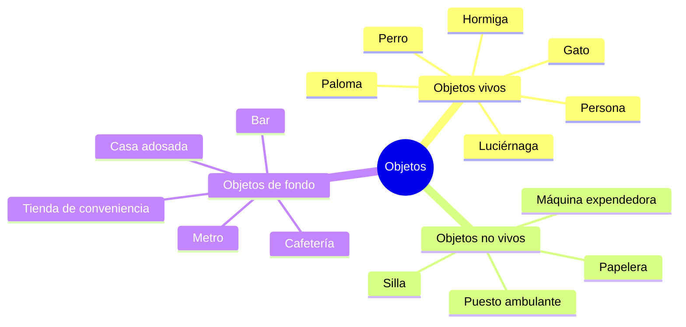
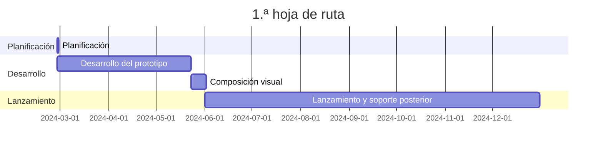

---
image:
    path: /2024-03-22-armonia-devlog-planning/preview-image.webp
    lqip: data:image/webp;base64,UklGRoAAAABXRUJQVlA4THMAAAAvD8ABAJUwiiRJkZtjZmbGF9s5Kyd1ScY8FbRt5MYA/F79RFEjSWpSxn2Zbw+m+z8BjqBzPlDmvL+4+00yVxL5ht9jZKHMSM22JRAbkUChuDviWIX4O+VnNh9jixzr0LjyndMjOUfNsQQDkKGXf/yfCzAGAA==
    alt: "Algo así"

title: "'Waybound', planificación del juego"
authors: ["dev"]

categories: [마일스톤, 게임 개발]
tags: [마일스톤, 게임 개발, 유니티, 행선지, 기획, 개발일지]
start_with_ads: true

toc: true
toc_sticky: true

date: 2024-03-22 19:24:00 +0900
last_modified_at: 2024-04-30 18:58:00 +0900

mermaid: true
---

## **Introducción**

Al terminar [la experiencia anterior](https://hyngng.github.io/posts/palette-developing/) y estar a punto de empezar un nuevo proyecto de Unity, volví a ver una película tranquila que había visto hacía 10 años y me puse a pensar sobre la influencia que tienen las experiencias. Una vez que mis pensamientos se ordenaron un poco, pensé que, así como una buena película se convierte en una buena experiencia, a mí también me gustaría crear algo así. Además, siempre tengo ganas de hacer y expresar cosas.

{: .w-50 }
*Boceto conceptual y planificación hechos mientras charlaba con un amigo*

Centrándome en la experiencia, concebí un entorno en el que, incluso si el jugador no realiza ninguna acción, los objetos dentro de la escena interactúan entre sí por sí solos. Un juego en el que simplemente se observa y se deambula, sin puntuación ni condiciones de fin de juego.  
A partir de esta idea, hice un dibujo rápido, y la sensación era mejor de lo esperado y la reacción de quienes lo vieron fue positiva, así que empecé a desarrollar la planificación basándome en ello.

## **Planificación**

Lo que más lamenté de la vez anterior fue la falta de planificación. Sin indicadores de referencia ni un plan a largo plazo, era difícil establecer la dirección del juego a nivel macro, y a nivel micro, era difícil pensar en aspectos como la retención o la rentabilidad. Por eso, esta vez quiero configurar primero la planificación hasta cierto punto.

Buscando si existía algún concepto útil para la planificación de juegos, descubrí el GDD (Game Design Document). Es una especie de especificación del juego, y como no hay un formato fijo, quiero tomar como referencia el [GDD elaborado por Unity](https://connect-prd-cdn.unity.com/20201215/83f3733d-3146-42de-8a69-f461d6662eb1/Game-Design-Document-Template.pdf) y describir de antemano solo las partes necesarias.

### **GDD simplificado**

- Descripción básica
	- Nombre: 행선지 (en inglés: waybound)
	- Género: Aventura de scroll lateral
	- Formato: Móvil 2.5D
- Jugabilidad
	- El jugador se convierte en un ser vivo que compone el entorno —como una persona, un perro, un gato, una hormiga, etc.— en un entorno de las afueras de una ciudad, y realiza las interacciones propias de ese ser vivo. Por ejemplo, una persona saca una bebida de una máquina expendedora y la bebe; un perro huele un banco en la calle.
	- Incluso si el jugador no controla específicamente a los seres vivos, estos interactúan entre sí y componen el ambiente de las afueras de la ciudad, y cada ser vivo tiene una personalidad visual dentro de un rango determinado.
- Características principales
	- Varias interacciones entre objetos
	- Imágenes dibujadas a mano y animaciones de corte
	- Experiencia que varía según el clima, como lluvia o nieve

### **Ejemplos de objetos**



### **Ejemplos de interacciones**

```mermaid
graph TD;
    Persona -- Comprar bebida --> Máquina expendedora;
    Persona -- Pasear --> Perro;
    Persona -- Acariciar --> Gato;
    Persona -- Mirar --> Luciérnaga;
    Persona -- Sentarse --> Silla;
    Persona -- Comprar comida --> Puesto ambulante;
```

## **Objetivos**

### **Objetivos técnicos**

Hasta ahora, tenía mucha confusión al escribir nombres de variables y funciones. No lograba mantener ni consistencia ni intuición, por lo que cada vez me resultaba más pesado leer y modificar el código.

Entonces, me topé con [un artículo sobre convenciones de nomenclatura](https://unity.com/how-to/naming-and-code-style-tips-c-scripting-unity) en el blog de Unity y me llevé una pequeña sorpresa. Si lo hubiera sabido desde el principio, habría sido mucho más cómodo. Como resultado, pude entender claramente cuándo y qué usar en C# para nombres de variables y funciones, y cómo no deberían escribirse.

Buscando si había más prácticas que debiera conocer, descubrí además el E-book ["Level up your code with game programming patterns"](https://blog.unity.com/games/level-up-your-code-with-game-programming-patterns) publicado por Unity. Lo leí con atención y aprendí que existen diversas técnicas aplicables como los principios SOLID, el patrón de fábrica, el patrón de estado, etc., y a partir de ahí, buscando patrones derivados, surgieron cosas que quería probar para lograr un diseño de código más sistemático. Resumiendo, puedo organizarlo así:

- PlasticSCM
- Programación dirigida por eventos
- Animación procedural
- Convenciones de nomenclatura estrictas

De estos, PlasticSCM es un sistema de control de versiones (VCS) para sustituir a GitHub, y planeo usarlo para guardar el trabajo de vez en cuando durante el desarrollo. La programación dirigida por eventos, las convenciones de nomenclatura, etc., son el núcleo de las capacidades de desarrollo que quiero obtener con este proyecto. Además, tengo pequeños objetivos como utilizar mejor conceptos que aún no me son familiares, como el patrón singleton, las corrutinas, los delegados y las propiedades get set.

### **Objetivos artísticos**

El objetivo básico es describir el ambiente cotidiano que nos rodea a través de la experiencia de ver líneas y dibujos en movimiento. Me gustaría expresar esas cosas de una manera que sea suficientemente visible pero no agresiva. En la medida de lo posible, aspiro a una puesta en escena similar a la de las producciones audiovisuales, y concretamente quiero utilizar lo siguiente:

- Animaciones de corte
- Profundidad de campo dinámica
- Curvas tonales

En general, me gustaría poder hacer que el juego sea interesante incluso si el usuario se limita a mirar fijamente la pantalla sin hacer nada. Sin embargo, me preocupa si tengo la capacidad suficiente para ello; en particular, me han dicho que dibujar el movimiento de animales como perros, gatos y palomas mediante animaciones de corte es territorio de animadores profesionales. No necesito dibujar animaciones tan precisas, pero como no tengo conocimientos ni experiencia, creo que habrá pruebas y errores.

## **Hoja de ruta**


