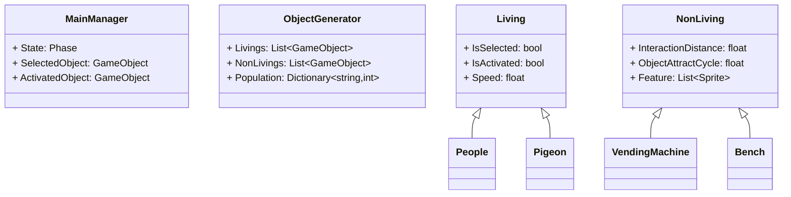
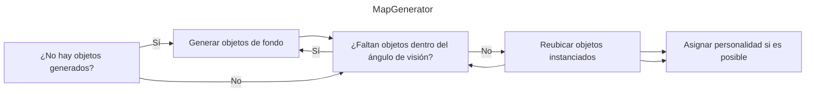
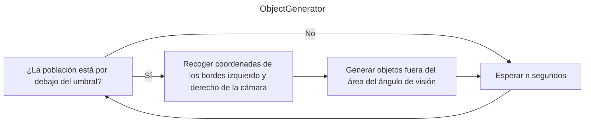
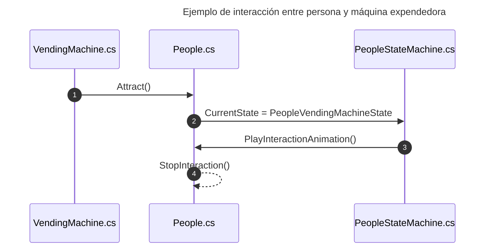
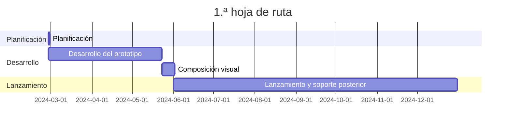

---
image:
    path: /2024-04-30-armonia-first-devlog/gameplay.webp
    lqip: data:image/webp;base64,UklGRiQBAABXRUJQVlA4TBgBAAAvD8ABAM1kRP9jE+UpQv/D4CCSJEXqOXpmBhts/1W8BGZa6B0bG44kyW2bnQUUHM7+//t8zQmA2wiMHEXSexc+ENN/QdRAxJC9WSlicZYaCiHEiBEEBULCMMoQhMMi0bv93TqZbAMSDEWRd+s75TKrKm4VicC+vLm9fnxs++PKnIq5yl2/HI/H7Znt/PFTbA+vP6RcraP+/u4u769YybUSgygQFMaTzCmCmruS9R8Wur+T874jmH1RRSUTIWlnwwMxK3/FTqFkkIRu7it/NDlMKxKqKhJtqW+MXnKWekjlKoNGylt4ripQbry6Ou5Me5Ctq6J0E8qGQe2+v3Tlrj/5bLz7VimPuFYRKZDFKkBIEQUROUhNEJEA
    alt: Prototipo en desarrollo
    
title: "'Waybound', primera crónica de desarrollo intermedio"
authors: ["dev"]

categories: [마일스톤, 게임 개발]
tags: [마일스톤, 게임 개발, 유니티, C#, 행선지, 개발, 개발일지]
start_with_ads: true

toc: true
toc_sticky: true

date: 2024-04-30 18:14:00 +0900
last_modified_at: 2024-05-23 23:11:00 +0900

mermaid: true
---

## **Introducción**

> Continúa desde [la entrada anterior](https://hyngng.github.io/posts/armonia-devlog-planning/).
:::

Esta es la crónica de desarrollo de mi [cuarto hito](https://hyngng.github.io/categories/%EB%A7%88%EC%9D%BC%EC%8A%A4%ED%86%A4/), al que me enfrenté de nuevo porque me resultaba divertido. Necesitaba hacer un balance intermedio y organizar notas mientras desarrollaba, así que he resumido brevemente los resultados de aproximadamente un mes de trabajo. Lo creado en esta fase de desarrollo es lo siguiente:

- Sistema del juego
	- [x] Movimiento suave de la cámara mediante entrada táctil
	- [x] Selección, control e interacción de objetos en pantalla
	- [x] Garantizar que los objetos se controlen por debajo de un número determinado
	- [x] Algunos objetos adquieren personalidades aleatorias dentro de un rango determinado
	- [x] Garantizar que los objetos solo existan dentro del ángulo de visión de la cámara

- Objetos añadidos
	- [x] 2 tipos de objetos vivos: personas, palomas
	- [x] 7 tipos de objetos de fondo: casas, metro, etc.
	- [x] 6 tipos de objetos callejeros: hidrantes, conos de tráfico, etc.

## **Archivo**

{: .w-75 }
_Cuando implementé a las personas. El jugador puede convertirse en cualquier objeto e interactuar con el entorno circundante._

## **Creación de activos**

### **Activos de imagen**


_Imágenes de fondo dibujadas_

Para crear un fondo que pareciera de las afueras, busqué y consulté ilustraciones urbanas, fotos de edificios del vecindario o road views, y creé activos de imagen de fondo. Queriendo dejar abierta la posibilidad de localización, como traducción de idiomas, no incluí elementos con texto como carteles publicitarios, periódicos o letreros con caligrafía. También quería que se notara la sensación de haber sido dibujado a mano, así que usé líneas de textura rugosa y evité deliberadamente el uso de herramientas de línea recta. Como resultado, quedó ligeramente torcido pero limpio, y estoy satisfecho.

Ahora que lo veo, me siento orgulloso y contento, pero creo que la resolución es demasiado alta. Intenté reducir la escala de las imágenes, pero como no fueron creadas originalmente en baja resolución, se pixelaban mucho y no quedaban bien. Creo que podría haber conseguido la misma sensación dibujando a una resolución un poco más baja, así que lamento este aspecto.

### **Shader de sprite**

Durante el desarrollo, me encontré con un obstáculo. Los objetos de este proyecto utilizan comúnmente el componente Sprite, pero entre los shaders básicos de Unity no hay ninguno para sprites que pueda recibir sombras (Receive Shadow), así que estoy usando uno hecho por otra persona.

Al usarlo, este shader funciona bien, pero como es un shader Unlit por defecto, no genera sombras (Cast Shadow). Quería que los objetos proyectaran sombras entre sí, pero al investigar más, descubrí que los shaders Unlit no pueden implementar la función Cast Shadow en absoluto. Necesito un shader que sea aplicable a sprites y que genere sombras sin reflejo de luz, pero como soy un lego en shaders, me resulta difícil de implementar. Tendré que investigar más sobre esto.

### **Activos de animación**

{: .light .w-25 .border }
{: .dark .w-25 }
_Paloma volando_

También dibujé las animaciones yo mismo. Por ejemplo, para el movimiento de la paloma, como era difícil de resolver con el componente de animación de Unity, dibujé fotograma a fotograma como si fuera una animación tradicional, y los uní. Nunca había dibujado antes el movimiento de un animal en animación, así que busqué vídeos de palomas caminando y volando, los observé y los dibujé.

Al hacerlo, en lugar de crear y usar una animación simple única, segmenté el flujo de la animación en fases. Por ejemplo, para el vuelo de la paloma, la dividí en tres conjuntos separados: una animación EnterFly que asciende al cielo, una animación BeingFly que se mantiene en el aire, y una animación EndFly que aterriza en el suelo, y las vinculé con un patrón de estado. Gracias a ello, el resultado se ve bastante convincente, como se puede apreciar en el [Archivo](#archivo) anterior.


_Persona caminando y luciérnaga ambiental_

Sin embargo, básicamente utilicé el componente de animación de Unity de esta manera. El ejemplo anterior es una escena en la que, según el cambio de posición de la persona, la animación de caminar se invierte horizontalmente o su velocidad de reproducción se ajusta automáticamente. Aunque no se aprecia bien porque no dejé material previo, sin animación de corte, la cabeza, el torso y las extremidades se ensamblan por piezas y sus posiciones se ajustan por separado.

Como nota al margen, creo que el trabajo relacionado con la animación es lo más difícil. En particular, a diferencia de la programación, la animación no tiene un gran punto de inflexión a nivel individual, y esto me impacta cada vez. La eficiencia del trabajo depende completamente de la habilidad personal. No sé cómo hacen los animadores profesionales este tipo de trabajo.

## **Proceso de desarrollo**

Hubo un esfuerzo por mejorar los aspectos que [la experiencia anterior](https://hyngng.github.io/posts/palette-developing/) había dejado insatisfactorios. En particular, fui consciente de los principios SOLID para no descuidar la mantenibilidad del código. Cuando sentía que una clase se estaba haciendo demasiado grande, la dividía sin falta para cumplir con el principio de responsabilidad única, usaba con más cuidado las palabras clave de modificadores de acceso, y a un nivel más detallado, también utilicé activamente los atributos de clase y `#region`.

Pensando que necesitaba hacer copias de seguridad de vez en cuando, también probé [Unity Version Control (VCS)](https://www.plasticscm.com/) y me resultó muy cómodo. Si estás familiarizado con GitHub, te adaptas rápidamente, y en particular, me gustó que se puede subir el trabajo en cualquier momento desde la interfaz interna de Unity.

### **Diseño de clases**



Antes de comenzar el desarrollo, esbocé un marco básico considerando el rol de las clases y las relaciones entre ellas. Sin embargo, no llegué al nivel de dibujar diagramas UML; lo formalicé lo suficiente como para evitar que se creara una estructura compleja debido a un diseño demasiado improvisado a nivel personal. Hay contenido sobre otras clases además de las anteriores, pero si lo incluyera todo, el diagrama sería demasiado grande y complejo, así que solo he seleccionado las más representativas.

Además de los miembros de los scripts, tuve en cuenta de antemano que `MainManager` se usaría como singleton con programación dirigida por eventos, y que `Living` y `NonLiving` usarían un patrón de estado como scripts padre, y lo llevé a la práctica tal cual.

Aunque durante el desarrollo hubo muchos cambios en la forma real —como introducir varios patrones de programación o separar el código táctil, que se había vuelto demasiado grande en `MainManager.cs`, a `TouchManager.cs`—, el hecho de haber fijado primero el marco general fue definitivamente cómodo. Me resultó muy útil esta vez, así que si tengo que desarrollar algo en el futuro, intentaré dibujar al menos un diagrama simple.

### **Generación y gestión del mapa**

{: .w-75 }



```cs
void GenerateObjects(List<GameObject> instantiated, List<GameObject> instantiable)
{
    GameObject tempInstantiated = instantiated[instantiated.Count - 1];

    for (int i=instantiated.Count - 1; i>0; i--)
        instantiated[i] = instantiated[i - 1];
    instantiated[0] = tempInstantiated;
    
    instantiated[0].transform.position = new Vector3(
        instantiated[1].transform.position.x - objectSize, 0, 0
    );

    /* ... */
}
```

En cuanto a la generación del mapa, era la primera vez que lo hacía yo mismo. Antes había buscado algoritmos de generación de mapas procedurales como BSP, pero me parecieron alejados de lo que quería hacer, y además no creía que necesitara un sistema tan complejo, así que lo hice yo mismo.

- Cumple las siguientes condiciones:
	- El mapa, una vez generado, se conserva hasta el final de la partida.
	- Los objetos relacionados con el mapa solo se ven dentro de la pantalla.
	- En cada partida, se baraja el orden de la lista para que el mapa sea diferente.

Como resultado, creé un procedimiento de generación de mapas por etapas que funciona basándose en el ángulo de visión para que pueda operar independientemente de la relación de aspecto de cada dispositivo. Utilizando una lista de gameObjects, el primer valor de la lista se mantiene como el objeto en el extremo izquierdo y el último como el objeto en el extremo derecho, y los objetos se instancian o reordenan según el ángulo de visión de la cámara. Está funcionando mejor de lo esperado.

### **Generación de objetos**



```cs
void GenerateObject(GameObject targetObject)
{
    bool spawnAtLeft = Random.value > .5f;
    float spawnPosX = spawnAtLeft
                    ? MainCamera.GetRenderWidth(gameObject).Left - 1.8f
                    : MainCamera.GetRenderWidth(gameObject).Right + 1.8f;

    GameObject generatedObject = Instantiate(
        targetObject,
        new Vector3(
            spawnPosX,
            targetObject.GetComponent<BoxCollider>().size.y / 2,
            Random.Range(-3.5f, 3.5f)
        ),
        Quaternion.identity
    );
    generatedObject.transform.parent = standardObject.transform;
    GeneratedObjects.Add(generatedObject);
}

IEnumerator ManagePopulation()
{
    while (true)
    {
        GenerateLiving(LivingToGenerate);
        yield return new WaitForSeconds(GenerationDelay);
    }
}
```

La generación de objetos no fue muy difícil porque había escrito un código similar antes. La instanciación de objetos se realiza fuera del ángulo de visión utilizando `ViewportToWorldPoint()`, y los objetos, una vez instanciados, desaparecen si pasan n segundos fuera del ángulo de visión.

Sin embargo, todavía hay aspectos que mejorar. Por ejemplo, si la cámara se mueve rápidamente hacia un lado, se puede ver un pueblo vacío sin gente, y con el tiempo empiezan a aparecer una o dos personas desde los lados, lo que resulta muy artificial. Creo que debería solucionarse manteniendo constante la densidad de objetos en las zonas izquierda y derecha de la cámara.

### **Interacción**



En cuanto a la interacción entre objetos, que es el núcleo de este juego, hice que el objeto que inicia la interacción la invocara. En una corrutina, a intervalos regulares, se obtienen los objetos dentro de un rango usando `Physics.OverlapBox`, y se invoca una interacción sobre un objeto aleatorio de entre ellos. Se utilizó un patrón de estado y, en detalle, funciona como se muestra arriba.

Sin embargo, no sé si es porque aún no estoy familiarizado con el patrón de estado, pero tengo la sensación de que el proceso está demasiado enredado. Me pregunto si habrá una forma más sencilla de implementar la interacción.

## **Para concluir**

Hasta ahora, al avanzar con el desarrollo, siento que el desarrollo de juegos es definitivamente divertido y gratificante. Primero concebir un sistema, recopilar materiales basándose en el plan concebido, crear y aplicar los materiales si son insuficientes, y el resultado de ese proceso complejo se presenta como una retroalimentación visual clara, lo que me hace sentir una sensación de logro diferente.

- Quedan las siguientes tareas pendientes:
	- [ ] Añadir audio de efectos de sonido
	- [ ] Utilizar animación procedural
	- [ ] Diversificar objetos e interacciones
- O me gustaría probar lo siguiente:
	- [ ] Notificaciones Toast
	- [ ] Perspectiva aérea

Durante el desarrollo, perdí unas dos semanas redecorando el blog. Espero poder concentrarme sin distracciones durante el mes que queda y finalizarlo bien dentro del plazo.


