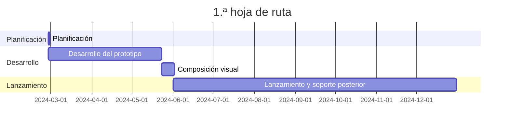

---
image:
    path: /2024-05-31-armonia-second-devlog/gameplay.webp
    lqip: data:image/webp;base64,UklGRlYAAABXRUJQVlA4IEoAAADwAQCdASoQAAgAAUAmJQBOgB8xi/GXoBAA/vuITP1jzd5vh9i82itNyxKJOlCBXvOebik8444+JnSUJik6FdPY8GR+D5jZO/WAAA==
    alt: Prototipo en desarrollo
    
title: "'Waybound', segunda crónica de desarrollo intermedio"


categories: [마일스톤, 게임 개발]
tags: [마일스톤, 게임 개발, 유니티, C#, 행선지, 개발, 개발일지]
start_with_ads: true

toc: true

date: 2024-05-31 22:53:00 +0900
last_modified_at: 2025-12-26 11:40:00 +0900

mermaid: true
---

## **Introducción**

:::info
Continúa desde [la entrada anterior](https://hyngng.github.io/posts/armonia-first-devlog/).
:::

Esta es la crónica de desarrollo de mi [cuarto hito](https://hyngng.github.io/categories/%EB%A7%88%EC%9D%BC%EC%8A%A4%ED%86%A4/). He organizado los resultados de otro mes de trabajo. Este mes, el trabajo se centró principalmente en la expansión del sistema y el contenido del juego. En detalle, lo creado en esta fase es lo siguiente:

- Sistema del juego
	- [x] Estratificación de objetos de fondo
	- [x] Optimización mediante sustitución del shader graph
	- [x] Ventana de configuración accesible mediante pellizco para alejar
	- [x] Interacción de objetos mediante animación procedural
- Objetos añadidos
	- [x] 2 tipos de objetos de edificio que actúan como fondo

## **Archivo**

{: .w-75 }
*Grabado durante la prueba de entrada a la ventana de configuración*

## **Creación de activos**

### **Activos de imagen**

{: .light .w-25 .border }
{: .dark .w-25 }
*Paloma picoteando el suelo*

Seguiré añadiendo animaciones en formato de keyframes. En esta ocasión, creé una animación para la paloma con el fin de implementar la acción de picotear el suelo. La cantidad de animación era corta y, sobre todo, como ya tenía [activos creados anteriormente](https://hyngng.github.io/posts/armonia-developing-first/#%EC%95%A0%EB%8B%88%EB%A9%94%EC%9D%B4%EC%85%98-%EC%97%90%EC%85%8B), no tuve la presión de tener que buscar otros vídeos de palomas para encontrar sus características e imitarlas como antes.

De forma similar a la vez anterior, creé `DigState.cs` y lo vinculé con el patrón de estado, por lo que el movimiento se ve natural. La interacción se activa al tocar el suelo mientras se tiene seleccionada la paloma.

### **Archivos de shader**

Como explicaré en detalle más adelante, había un problema de coste de GPU, así que cambié el shader de sprites 2D que estaba usando por uno más ligero. El problema es que este shader no tiene función de generación de sombras (Cast shadow) y no se aplica el efecto de profundidad de campo (DOF) del postprocesado. Me gustaría mejorarlo, pero aún no estoy familiarizado con los shaders, así que tendré que estudiarlos a fondo o renunciar a las funciones de puesta en escena.

## **Proceso de desarrollo**

### **Implementación de una ventana de configuración con estilo de cámara**

{: .w-75 }
*Entrando a la ventana de configuración con un pellizco para alejar. Todavía es un prototipo.*

Para preservar al máximo una pantalla limpia sin UI y conseguir una puesta en escena un poco más interesante, hice que la ventana de configuración se accediera mediante un pellizco para alejar, sin mostrar ninguna UI adicional. El pellizco funciona de forma gradual: dentro de un cierto rango, actúa como un zoom normal de la cámara, pero al superar ese rango, se accede a la ventana de configuración con una retroalimentación de vibración. Una vez dentro, se puede salir de la ventana de configuración con un pellizco para acercar.

La UI de la ventana de configuración se diseñó para que parezca una cámara. A veces, al tomar fotos, mientras veía vídeos de fotografía callejera en primera persona (POV Street Photography), sentía que la escena dentro de la pantalla sostenida en la mano atravesaba la barrera entre el sujeto y yo, conectando la escena de forma realista, y quise imitar esa experiencia.

Para la batería y la hora, utilicé `SystemInfo.batteryLevel` y `DateTime.Now` para mostrar el estado real de la batería y la hora. La velocidad de obturación y la apertura planeo que funcionen como opciones que controlan el desenfoque de movimiento y la profundidad de campo del postprocesado, respectivamente.

Aunque aún quedan partes por completar, como que el texto se muestra con la fuente predeterminada, la sensación de que la experiencia es única ya con lo creado hasta ahora me resulta satisfactoria de momento.

### **Aplicación de animación procedural**

{: .w-75 }
*Si hay una paloma cerca, la miran de vez en cuando*

Al crear [el hito anterior](https://hyngng.github.io/posts/palette-second-devlog/), vi que se usaba animación procedural para crear animaciones orgánicas que interactúan con el entorno, y pensé que era realmente genial, así que lo recordé bien y lo probé esta vez. Pensaba que se implementaba con condiciones técnicamente sofisticadas, pero como se proporciona como paquete de Unity, resultó más fácil de lo esperado; sin embargo, controlarlo mediante código fue más complejo de lo que imaginaba.

A diferencia de la paloma, la persona tiene la cabeza, el cuerpo y las piernas como objetos independientes separados, así que utilicé el componente `Multiple Aim Constraint` del [paquete Animation Rigging](https://docs.unity3d.com/Packages/com.unity.animation.rigging@1.1/manual/index.html) para implementar, a modo de prueba, la función de que el objeto de la cabeza de la persona mire hacia una paloma dentro de una cierta distancia.

```cs
public void ChangeSourceObject(GameObject discoveredObject)
{
    WeightedTransformArray sourceObjects = Constraint.data.sourceObjects;
    WeightedTransformArray newSourceObjects = new WeightedTransformArray(sourceObjects.Count);
    
    newSourceObjects[0] = new WeightedTransform();
    WeightedTransform wt = newSourceObjects[0];

    /* ... */

    newSourceObjects[0] = wt;
    
    data.sourceObjects = newSourceObjects;

    Animator.enabled = false;
    rigBuilder.Build();
    Animator.enabled = true;
}
```

Para implementar esta función, era necesario intercambiar la propiedad `sourceObject` del componente `Multi Aim Constraint` con un objeto de la escena, y este proceso tuvo muchas dificultades. Si alguien quiere cambiar el `sourceObject` de una animación procedural mediante código, espero que lo siguiente le sea de ayuda:

- La propiedad `sourceObjects` es de solo lectura. Hay que definir los datos en una variable local diferente y luego asignar el nuevo valor a `data.sourceObjects`.
- Una vez realizada la asignación, hay que desactivar el animator del objeto, construir el `rigBuilder` y luego reactivar la animación para que se aplique correctamente.
- Si un objeto está registrado como `sourceObject` de otro objeto, al eliminar ese objeto, hay que cambiar la propiedad `sourceObject` en la que está registrado a `None`.

Aunque hubo muchas situaciones difíciles porque había comportamientos y errores que eran difíciles de resolver incluso consultando la [documentación oficial](https://docs.unity3d.com/Packages/com.unity.animation.rigging@1.0/api/UnityEngine.Animations.Rigging.html), al final creo que lo logré bien. Una vez implementado, ciertamente parece tener el efecto de hacer que la atmósfera del juego sea más flexible. Si alguna vez hago un proyecto 3D de prueba, me gustaría aprovecharlo aún mejor.

### **Intento de optimización con el Profiler**

{: .w-75 }
*Ejemplo de datos medidos con el Profiler de Unity*

Extrañamente, mi juego tenía un calor excesivo tras la compilación, hasta el punto de no mantener un nivel de 40 FPS. Aunque mi código no es perfecto, creía que estaba cumpliendo con lo básico, como evitar funciones pesadas como `GetComponent()` o `Find()`, y asegurarme de que los códigos con bucles como `for`, `foreach` o corrutinas no se ejecutaran de forma forzada. Sin embargo, no entendía por qué los fotogramas bajaban en un proyecto 2.5D que debería ser ligero.

Durante la depuración, el teléfono se calentaba rápidamente y resultaba incómodo, así que por primera vez intenté optimizar usando el Profiler. El proceso fue más simple de lo que pensaba: se trataba de encontrar qué operación se estaba ejecutando más en las secciones donde el Profiler de Unity registraba fotogramas altos y mejorar esa parte.

En mi caso, `Semaphore.WaitForSignal` ocupaba entre el 50 y el 70% del tiempo. Al leer un artículo que recomendaba cambiar el shader por uno más ligero en estos casos, sustituí [el archivo de shader que había encontrado antes](https://hyngng.github.io/posts/armonia-first-devlog/#%EC%8A%A4%ED%94%84%EB%9D%BC%EC%9D%B4%ED%8A%B8-%EC%85%B0%EC%9D%B4%EB%8D%94) por uno más ligero, y pude experimentar un aumento considerable de FPS y una reducción significativa del calor.

## **Criterios de lanzamiento**

### **Necesidad de objetivos para completar el proyecto**

Crear animaciones e interacciones para cada uno de los diversos objetos es, en principio, divertido e interesante, pero sentí que requería más tiempo y esfuerzo del que pensaba. Pensé que mi eficiencia aumentaría con la experiencia y los conocimientos, y de hecho mejoró mucho, pero escribir código o crear animaciones con keyframes sigue requiriendo un esfuerzo físico mínimo, como teclear o dibujar líneas en la pantalla.

A medida que el proyecto crecía y aumentaban los activos que debía gestionar, empecé a notar que la carga que soportaba era cada vez mayor. Recuerdo haber leído una vez un consejo en un informe de la industria del videojuego publicado por Unity: «No bites more than you can chew» (No muerdas más de lo que puedas masticar), y me pregunté si mi situación actual no estaría yendo en esa dirección.

Por eso, pensé que necesitaba un criterio de lanzamiento como punto de referencia, y decidí fijarme como objetivo, por el momento, alcanzar un nivel que permitiera solicitar [Google Featuring](https://play.google.com/console/about/guides/featuring/). Google Featuring establece criterios claros para aplicaciones y juegos de alta calidad, entre los que se incluyen, de forma representativa, los siguientes:

- [Alta calificación de los usuarios](https://support.google.com/googleplay/android-developer/answer/138230?hl=en)
- [Cumplimiento de las políticas de Google Play](https://play.google/developer-content-policy/#!?modal_active=none)
- [Puntuación alta en Android Vitals](https://support.google.com/googleplay/android-developer/answer/9844486?hl=en&visit_id=638527380779176477-2227653483&rd=1)
- [Cumplimiento de las pautas de calidad esencial para aplicaciones de Android y Google Play](https://developer.android.com/quality?hl=ko)

En particular, [Android Developers](https://developer.android.com/quality?hl=ko) presenta criterios y ejemplos sobre la buena experiencia de usuario, como usabilidad (copia de seguridad y restauración, etc.), accesibilidad, localización, deep links (traducción, etc.), atractivo visual y artesanía (animación, audio, controles...), entre muchos otros. Aunque necesito detallarlos más, creo que son buenos como criterio general de referencia.

### **Otros criterios detallados propuestos**

- Aplicación
	- [ ] Icono de aplicación
	- [ ] Sonido 3D
	- [ ] Tutorial sencillo
	- [ ] Localización de texto interno
- Objetos
	- [ ] 5 o más tipos de objetos
	- [ ] 2 o más personalidades por objeto
	- [ ] 3 o más interacciones por objeto
- Fondo
	- [ ] Sistema meteorológico con lluvia, nieve, etc.
	- [ ] Skybox dinámico con nubes
	- [ ] Garantizar 3 o más objetos de fondo en pantalla

## **Para concluir**



En la hoja de ruta original, el objetivo era completarlo hoy o mañana, coincidiendo con la fecha de publicación de esta entrada, pero parece que me falta capacidad, ya que estoy muy lejos. Creo que debo presentar una nueva hoja de ruta y, sobre todo, definir con más detalle los roles y objetivos trimestrales.

Además, como en junio comienza el servicio militar como objetor de conciencia (servicio suplementario), tendré que dejar el desarrollo por un tiempo e ir al centro de entrenamiento. Aún no sé cómo será la situación futura, así que no sé si será posible, pero me gustaría seguir desarrollando poco a poco con el objetivo de alcanzar un nivel que permita el registro en la tienda.
