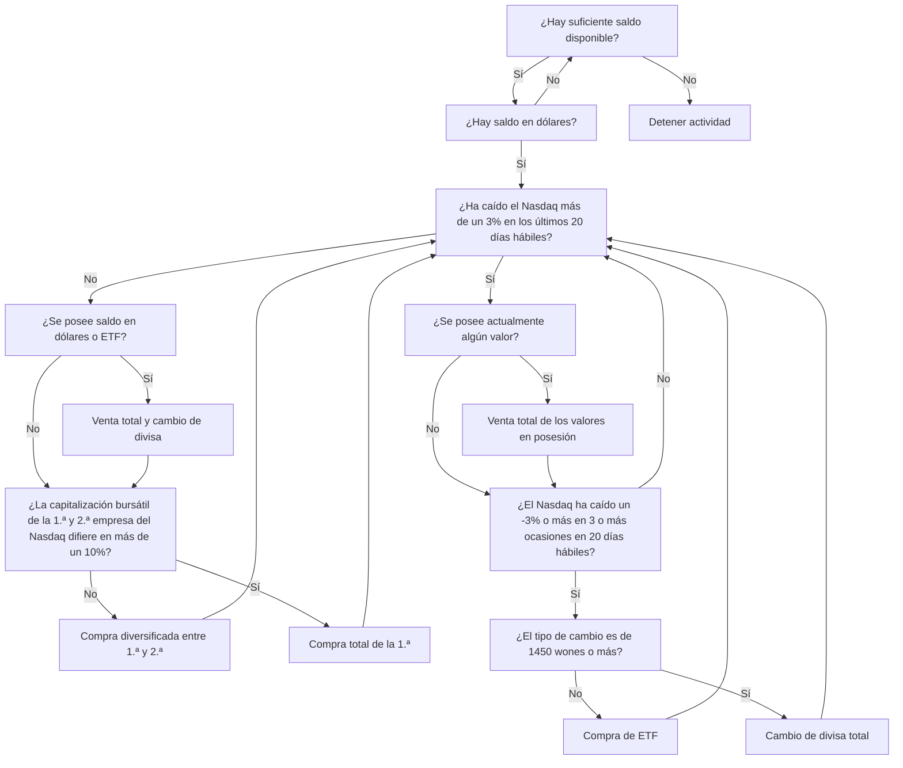

## **ASTP, el automatizador de trading de acciones**

ASTP (Auto Stock Trading Program) es un programa creado en torno al tema de la compraventa automatizada de acciones según un algoritmo interno, y constituye [mi segundo hito](https://github.com/hyngng/astp/tree/legacy). Tras el segundo semestre de primer año, quería crear un programa por mi cuenta, y cuando un conocido mencionó la idea de un automatizador de trading de acciones, me interesé y decidí desarrollarlo. El programa está hecho en Python, y la parte relacionada con las acciones se desarrolló con la ayuda de ese conocido, siguiendo una estrategia básica sencilla.

## **Características del programa**

Se utilizó la [OpenAPI](https://www.truefriend.com/main/customer/systemdown/OpenAPI.jsp?cmd=TF04ea01200) de Korea Investment & Securities. Era la primera vez que creaba un programa que utilizara una API, y me sorprendió la cantidad de cosas que se podían hacer, más de las que imaginaba. La estrategia de trading sigue los dos principios siguientes y opera en el Nasdaq.

- Resumen del algoritmo
	- **Compra de acciones**: compra acciones considerando el índice NDX y la proporción de las empresas mejor y segunda mejor clasificadas del Nasdaq.
	- **Venta de acciones**: si el índice NDX se desploma o el tipo de cambio won-dólar sube excesivamente, vende todas las acciones en posesión y detiene la actividad de trading durante 20 días hábiles. La detección del desplome del NDX se realiza comparando los valores máximo y mínimo del NDX registrados en Excel al inicio y al cierre de la sesión bursátil.
- Librerías utilizadas
	- `mojito`: módulo envoltorio de Python para la OpenAPI de Korea Investment & Securities.
	- `yfinance`: se utiliza para obtener la clasificación por capitalización bursátil del Nasdaq.
	- `BeautifulSoup`: se utiliza para obtener mediante scraping los valores del NASDAQ-100, que no están disponibles en ningún módulo relacionado con acciones.

## **Estructura y código de ejemplo**



```python
# Scraping del NDX
def get_ndx():

    if response.status_code == 200:
    
        html = response.text
        soup = BeautifulSoup(html, 'html.parser')

        ndx_class = soup.find(class_ = 'Fw(b) Fz(36px) Mb(-4px) D(ib)')
        ndx = re.sub(r'[^0-9]', '', ndx_class.get_text())

    else:
        print(response.status_code)
    
    return ndx

# Verificación de caída del NDX del -3%
def ndx_collapsed():

    df_ndf_data['ndx_index'] = df_ndf_data['ndx_index'].astype(float)
    ndx_decrse_3per = False

    ndx_max = df_ndf_data['ndx_index'].max()
    ndx_min = df_ndf_data['ndx_index'].min()

    if 100 * (ndx_max - ndx_min) / ndx_max > 3:
        ndx_decrse_3per = True
        print("\nLa variación del valor NDX es severa.\n")
    else:
        print("\nEl valor NDX es estable.\n")

    return ndx_decrse_3per
```

## **Ejemplo de funcionamiento del programa**

{: .w-75 }
*Pantalla de ejemplo del funcionamiento del programa tras comprar una acción de Apple*

Al ser un programa simple de Python sin interfaz de usuario, se ejecuta sin problemas a través del símbolo del sistema; una vez ejecutado, el programa realiza órdenes de compra y venta de forma autónoma hasta que se lo detenga manualmente. Las órdenes de venta ejecutadas pueden verificarse tanto en la ventana del símbolo del sistema como a través de la aplicación de Korea Investment & Securities, tal como se muestra en la captura de pantalla, pudiendo confirmar si se ha comprado y el estado de las acciones en posesión.

## **Precauciones y limitaciones**

- Dado que el mercado bursátil estadounidense abre de 23:30 a 06:30 (hora coreana), el ASTP, basado en acciones extranjeras, tiene la limitación de que el horario en el que se puede verificar el funcionamiento del código es restringido, a diferencia de los programas convencionales.
- Para utilizar los servicios proporcionados por Korea Investment & Securities, se requieren dos tareas previas fuera del programa.
    1. Abrir una cuenta en Korea Investment & Securities y solicitar la [OpenAPI](https://apiportal.koreainvestment.com/intro). En la página de solicitud se emiten una `key` y un `secret`, que deben almacenarse junto con el número de cuenta virtual en el archivo `mock.key` del proyecto para su uso.
    2. Instalar el programa [eFriend Expert](https://www.truefriend.com/main/customer/systemdown/OpenAPI.jsp?cmd=TF04ea01200) proporcionado por Korea Investment & Securities para gestionar el envío y recepción de órdenes y la consulta de saldos.
-  Además, dado que el módulo de certificado compartido no admite entornos de 64 bits, es necesario [construir un entorno virtual de 32 bits](https://hyngng.github.io/posts/virtual-32bit/) aunque resulte incómodo, y ejecutar el código en ese entorno.

## **Para concluir**

:::tip
Puede explorar más detalles en [GitHub](https://github.com/hyngng/astp/tree/legacy).
:::

Al crear este hito, el objetivo principal fue experimentar el uso de módulos externos como API y librerías, y al utilizarlos directamente, pude comprender claramente que aprovechar activamente los módulos ya existentes permite hacer muchas más cosas. También aprendí el proceso de ordenar y mostrar datos como los indicadores del Nasdaq y la capitalización bursátil de cada empresa.

Aunque el programa se completa con unas 237 líneas de código simple, pensé que si más adelante amplío el programa, sería bueno refinar con más precisión las condiciones de compra y venta, y añadir el esfuerzo de organizar el código de forma más concisa mediante la creación de clases.
