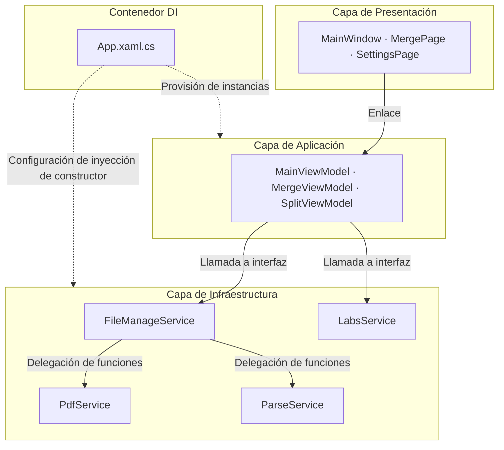

---
image:
    path: /2026-04-02-pascal-devlog/preview-image.webp
    lqip: data:image/webp;base64,UklGRj4AAABXRUJQVlA4IDIAAADQAQCdASoQAAgAAUAmJZwCdAEPDuQrCAD+/crO2PZZpBuP/xETb+8eyANti2KhVUAAAA==
    alt: "El nombre temporal del programa era 'Pascal'"

title: "Retrospectiva del desarrollo de un editor PDF basado en WinUI 3"
authors: ["dev"]

categories: [마일스톤, 기타 개발]
tags: [마일스톤, 기타 개발, WinUI 3, MVVM, XAML, C#]
start_with_ads: true

toc: true

date: 2026-04-02 11:14:00 +0900
last_modified_at: 2026-06-23 16:47:00 +0900

mermaid: true
---

## **Motivación del desarrollo**

> "Gracias, pero como somos una institución pública, no podemos usar programas externos sin permiso"

Durante mi servicio social militar, surgió un problema en la oficina. Está detallado más extensamente en [la entrada sobre el servicio social militar](https://hyngng.github.io/es/essay/sabok-logs/), pero en resumen, se me señaló que las instituciones públicas no pueden usar programas externos sin licencia, y esa experiencia me llevó a desarrollar este programa. Sin embargo, no comencé solo con la idea de «hagámoslo nosotros mismos». También quería usar C#, que había conocido antes con Unity, en otro contexto, y deseaba experimentar con un programa serio para Windows, así que me animé a abrir un nuevo proyecto.

El programa se llama Pascal porque inicialmente se desarrolló con el objetivo de comprimir PDF. Aunque finalmente la función de compresión no se implementó porque el licenciamiento estaba a punto de finalizar y no compensaba, el contexto de manipulación de archivos PDF se implementó primero con dos funciones: fusionar y dividir.

## **Presentación del programa**

{: .light }
{: .dark }
*Capturas de las 4 páginas terminadas. Como se puede ver en la ventana de créditos, no es un programa extremadamente serio*

Pascal es un programa que realiza la fusión y división de archivos PDF. Se desarrolló durante unos dos meses del periodo de servicio social, y por suerte, [había un compañero de servicio social que aspiraba a ser desarrollador](https://github.com/din-c), por lo que aprovechamos el tiempo libre en el trabajo para abrir una página dedicada en Notion y realizar una pequeña colaboración. Originalmente planeaba integrar en este programa varias funciones ofimáticas como extracción de texto de PDF, conversión a JPG y compresión, pero considerando razones de carrera profesional y el poco tiempo restante de servicio, implementé solo algunas funciones básicas y lo finalicé.

La Administración de Asuntos Militares no recomienda publicar información que pueda identificar a la institución, y respetando esa postura, aunque es difícil describir exactamente en qué situación y cómo se utilizó, creo que puedo mencionarlo brevemente. En primer lugar, la sensación de poseer este programa fue un gran apoyo psicológico. En segundo lugar, hubo la ventaja de que las tareas que antes se realizaban de forma rudimentaria —como modificar manualmente los valores de configuración en `config.yaml` antes de ejecutar scripts de Python— se simplificaron gratamente a unos pocos clics.

- Funciones operativas
	- Fusionar varios archivos PDF
    - Posibilidad de cambiar el orden de fusión
    - Posibilidad de especificar páginas a fusionar
	- Dividir varios archivos PDF simultáneamente
    - Posibilidad de especificar la unidad de división
    - Posibilidad de especificar el rango de división
	- Mostrar pantalla de actualización de Windows (laboratorio)

## **Complejidad del desarrollo y esfuerzo de adaptación**

### **El framework WinUI 3**

No tenía conocimientos ni experiencia previa en el desarrollo de programas para Windows, y desde la fase de elección del framework me costó tomar una dirección. Primero pensé en reutilizar mi experiencia en desarrollo frontend y busqué [Electron.NET](https://github.com/ElectronNET/Electron.NET), pero me encontré con que los propios creadores preguntaban «Espera, ¿estás ejecutando una aplicación .NET Core dentro de Electron? ¿Por qué?», lo que me dio la impresión de que estaba muy alejado del enfoque convencional. Entonces, al conocer el lenguaje de diseño [Fluent 2](https://fluent2.microsoft.design/) de Microsoft, cambié a un proyecto WPF que usaba la librería [ModernWPF](https://github.com/Kinnara/ModernWpf), pero durante el desarrollo sentí que el entorno heredado estaba desactualizado para 2025, así que trasladé el entorno de desarrollo al framework más moderno, WinUI 3.

Con la retrospectiva, hay un punto que merece mencionarse. Según lo que he investigado, Microsoft ha lanzado en los últimos 20 años una gran cantidad de nuevos frameworks que no son completamente compatibles con las plataformas anteriores, desde WinForms, pasando por WPF, UWP, WinUI 3, hasta el reciente MAUI. Por eso, es cierto que en el desarrollo de programas para Windows, a diferencia del desarrollo en otras áreas como móvil, web o videojuegos, el criterio sobre qué tomar como estándar es ambiguo, y mirando atrás ahora mientras escribo esto, creo que mis dificultades fueron en cierto modo un rito de iniciación.

|Desarrollo frontend web|WinUI|
|---|---|
|HTML|XAML|
|CSS|Estilo XAML|
|JavaScript|C#|

Aun así, lo que me causó una buena primera impresión fue que la experiencia de desarrollo con WPF y WinUI 3 es muy similar al desarrollo frontend web. Fue bastante interesante. El proceso de definir elementos y propiedades de la interfaz con XAML y escribir la lógica detallada con C# es igual que cómo funcionan HTML y JavaScript, y la definición de estilos tampoco resulta difícil si se ha trabajado antes con CSS o SCSS, por lo que pude adaptarme rápidamente al framework de interfaz.

Sin embargo, el ecosistema de WinUI 3 sigue siendo bastante pobre a pesar del soporte continuo de Microsoft. Por ejemplo, si se observa el proyecto [WinUI-3-Apps-List](https://github.com/DesignLipsx/WinUI-3-Apps-List?tab=readme-ov-file), la cantidad es considerable pero la calidad no es alta. Especialmente, los casos en los que el código se publica como open source son aún más raros, por lo que fue difícil saber cómo otros manejan realmente este framework. Así que tuve que resolver las dudas sobre cómo dirigir un proyecto WinUI 3 de forma deductiva, enfrentándome a [la documentación oficial de Microsoft](https://learn.microsoft.com/ko-kr/windows/apps/winui/winui3), pero la calidad de la traducción al coreano era baja, por lo que los documentos en inglés eran prácticamente la única opción, y los LLM tampoco fueron de gran ayuda en este ámbito. Fue una parte que requirió un coste de aprendizaje inicial.

### **IDE, .NET y librerías**

Como me gustaba la limpieza de VSCode, Visual Studio me resultaba un primo lejano bastante desconocido. Además, nunca había intentado trabajar con un framework tan novedoso como WinUI 3. Acostumbrarme a términos como solución, NuGet, diseñador y a las funciones ofrecidas en la barra de menú fue el primer cuello de botella; tuve que dedicar más tiempo del que imaginaba a entender la estructura del entorno de desarrollo antes de implementar cualquier funcionalidad.

En particular, al examinar otros proyectos open source como [WinUI-Gallery](https://github.com/microsoft/WinUI-Gallery), [DevWinUI.Gallery](https://github.com/ghost1372/DevWinUI/tree/main/dev/DevWinUI.Gallery) o [Files](https://github.com/files-community/files), se observa que siguen una especie de jerga como `Services`, `Helpers` y `Modules`. Era un enfoque que no había visto mucho en proyectos de Unity, Python o frontend, así que al principio me resultó bastante extraño. Aparte de aprender las funcionalidades, tuve que explorar la forma misma de leer el proyecto, y traducir y aplicar mis conocimientos anteriores a este proyecto.

A pesar de todo, pude asentarme bien en el entorno WinUI 3 gracias a excelentes librerías de controles como [Windows Community Toolkit](https://github.com/CommunityToolkit/WindowsCommunityToolkit) y [DevWinUI](https://github.com/ghost1372/DevWinUI). En el entorno de desarrollo .NET para interfaces, los elementos de UI se denominan controles, y como ambas librerías ofrecen una gran variedad de ellos, pude implementar casi todo sin mucha dificultad, excepto quizás `DataTable». Fue un aspecto que redujo el coste de entrada inicial.

### **El patrón MVVM, bastante desconocido**

Fue la parte más novedosa. Además de conocer la sintaxis de XAML y C#, hacía falta tener sensibilidad con MVVM. MVVM en sí mismo no es un requisito necesario para el desarrollo en WinUI, pero como el framework está diseñado asumiendo MVVM, si no se sigue, la dificultad de mantenimiento del código aumenta drásticamente. Es un aspecto que hace que la experiencia de desarrollo difiera enormemente de la de Unity.

El concepto de reducir la dependencia entre códigos me era familiar, pero necesité estudiar cómo MVVM lo logra realmente, hasta dónde pueden llegar cada uno de los tres ámbitos —modelo, vista y viewmodel—, qué no deben hacer, y cómo distinguir la diferencia entre ambos. Y la verdad, incluso ahora mientras escribo, mi comprensión sigue siendo un poco ambigua. Por ejemplo, poner un ViewModel dedicado para páginas complejas y omitirlo en páginas simples, o usar code-behind como puente en casos difíciles de manejar solo con bindings, como arrastrar y soltar archivos, creo que son las mejores prácticas para cumplir bien con MVVM. Pero no estoy seguro de que sea realmente la mejor opción bien construida, y aunque lo fuera, no termino de sentir claramente sus ventajas.

Independientemente de esto, el paquete [MVVM Toolkit](https://learn.microsoft.com/en-us/dotnet/communitytoolkit/mvvm/) es prácticamente indispensable para el desarrollo con WinUI 3. Este paquete ayuda a que la vista pueda comunicarse con el viewmodel sin pasar por el code-behind del archivo de marcado de UI, lo que permite mejorar la estructura de diseño del programa haciéndola más intuitiva.

## **Reflexiones sobre la colaboración y la productividad**

### **Colaboración**

Habitualmente vengo usando Notion, Figma y GitHub por costumbre, y quería usarlos también en este proyecto, como es natural. Mi compañero de servicio social me dijo que nunca había usado estas herramientas, así que le expliqué brevemente cómo usarlas y por qué estas herramientas, y además, en esta ocasión, quise probar la metodología PARA en Notion para crear una estructura de colaboración sistemática propia.

Sin embargo, aparte de GitHub, no hubo la respuesta que esperaba, y la verdad, me sentí un poco incómodo. No era porque mi compañero fuera perezoso; creo que mi argumentación sobre por qué eran necesarias herramientas como Notion y Figma, además del nuevo entorno WinUI 3 que ya de por sí era abrumador, no fue lo suficientemente convincente. Mientras que yo pensaba que un sistema de gestión de recursos es siempre necesario porque permite mantener el desarrollo a largo plazo, mi compañero parecía considerar que los costes no relacionados directamente con el desarrollo podían descartarse según la necesidad. Y poco a poco, empecé a pensar que esa idea era la correcta. Al igual que con la utilidad de la orientación a objetos, me di cuenta de que las buenas herramientas y los buenos patrones también tienen una escala que los justifica. Parece que confiaba ciegamente en las herramientas por inercia, pensando que lo bueno es bueno.

Aunque la forma cambió, la colaboración en sí funcionó de manera satisfactoria. Dividimos el ámbito de trabajo de modo que yo me encargara de la vista y el viewmodel, y mi compañero del viewmodel y el modelo; luego compartíamos y revisábamos las modificaciones, y realizábamos correcciones mutuas de segundo nivel. Fue una experiencia satisfactoria simplemente por el hecho de poder intercambiar perspectivas. El hecho de que nuestros hábitos de escritura de código fueran casi iguales, lo que redujo los roces, fue un plus.

### **Productividad**

Hace unos años, leí un artículo sobre un escritor extranjero que quería dejar su trabajo para concentrarse plenamente en su obra. Cuando un lector le comentó: «Aunque sea por lo que quieres hacer, creo que no es bueno dejar el trabajo por ningún motivo», el escritor respondió con una frase contundente: «Ya lamento haber dejado que mi imaginación muriera en una oficina de un trabajo que ni siquiera me gusta», y ahí terminó el debate.

Durante el desarrollo del programa, recordé esta anécdota. Estrictamente hablando, mi situación no es la misma, ya que la sintonía mental, la urgencia de la autorrealización que suele acompañar a la creación de obras de arte no son necesarias para el desarrollo de programas. Sin embargo, pude comprender hasta qué punto un entorno en el que hay que manejar tareas desgastantes a diario puede agotar la voluntad creativa y el impulso de trabajo.

De hecho, el proyecto avanzó con dificultad por esa razón. Cuando estaba imaginando cómo usar un determinado control de UI, me llamaban para algo relacionado con el trabajo, y veinte minutos después, cuando volvía a mi puesto y trataba de recuperar el contexto, sonaba el teléfono fijo. No solo en los momentos que requerían creatividad, sino también en tareas simples de depuración como revisar el flujo de dependencias entre M-V-VM, las interrupciones frecuentes dificultaban la concentración. No es que quiera quejarme de que fuera una situación injusta. Solo que fue la primera vez que comprobé hasta dónde puede caer la productividad laboral cuando no hay holgura ambiental.

## **Archivo**

### **Capturas varias**

{: .w-75 }
*A principios de 2025, un programa que mi compañero de servicio social creó directamente en Python. También tenía el objetivo de sustituirlo por algo más sofisticado*

{: .light .border }
{: .dark }
*A finales de 2024, un diseño primitivo para un programa que realizaba funciones casi idénticas*

*Cuando estaba probando varias cosas. Una vez implementadas las funciones, combiné el uso real con el desarrollo*

### **Arquitectura resumida**

### **Librerías utilizadas**

- UI y extensión del framework
    - `Windows Community Toolkit`[Licencia MIT](https://github.com/CommunityToolkit/Windows/blob/main/License.md)
    - `DevWinUI`[Licencia MIT](https://github.com/ghost1372/DevWinUI/blob/main/LICENSE)
- Procesamiento de documentos PDF
    - `PDFsharp`[Licencia MIT](https://github.com/empira/PDFsharp/blob/master/LICENSE), responsable de fusión y división de PDF
    - `PdfPig`[Licencia Apache-2.0](https://github.com/BobLd/PdfPig.Rendering.Skia/blob/master/LICENSE.txt), responsable de extracción de texto

### **Documentos útiles para el desarrollo**

- Iconos
	- [Enumeración Symbol](https://learn.microsoft.com/ko-kr/uwp/api/windows.ui.xaml.controls.symbol?view=winrt-26100)
	- [fluentui-system-icons](https://github.com/microsoft/fluentui-system-icons)
	- [Segoe MDL2 Assets icons](https://learn.microsoft.com/en-us/windows/apps/design/style/segoe-ui-symbol-font)
	- [FluentIcons.Wpf](https://www.nuget.org/packages/FluentIcons.WPF/)
- WinUI3
	- [Inicio rápido: Configuración del entorno y creación de un proyecto WinUI 3](https://learn.microsoft.com/ko-kr/windows/apps/winui/winui3/create-your-first-pascal-devlog3-app?source=recommendations#unpackaged-create-a-new-project-for-an-unpackaged-c-or-c-pascal-devlog-3-desktop-app)
	- [Espacio de nombres Windows App SDK](https://learn.microsoft.com/ko-kr/windows/windows-app-sdk/api/winrt/?view=windows-app-sdk-1.7)
	- [Teamplate Studio for WinUI](https://marketplace.visualstudio.com/items?itemName=TemplateStudio.TemplateStudioForWinUICs)
- MVVM
	- [Introducción a MVVM Toolkit](https://learn.microsoft.com/ko-kr/dotnet/communitytoolkit/mvvm/)
- .NET 9
	- [Documentación de programación avanzada de .NET](https://learn.microsoft.com/ko-kr/dotnet/navigate/advanced-programming/)
	- [Novedades de WPF para .NET 9](https://learn.microsoft.com/ko-kr/dotnet/desktop/wpf/whats-new/net90)

## **Para concluir**

:::tip
¡Puede explorar más detalles en [GitHub](https://github.com/hyngng/pascal.drill)!
:::

De las librerías, DevWinUI es gestionada completamente por el desarrollador iraní Mahdi Hosseini, conocido como [ghost1372](https://github.com/ghost1372). Según la información pública, parece que esta persona trabaja como profesor y reside en la ciudad de Qeydar, Irán. Y es una historia increíble, pero el 28 de diciembre de 2025, se produjeron protestas masivas en todo Irán, y el gobierno conservador de línea dura comenzó a reprimirlas por la fuerza.

Según Wikipedia, también se reportaron protestas en la ciudad de Qeydar, donde reside esta persona. Y unos días después, cuando el gobierno iraní cortó el internet en todo el país, el historial de commits de ghost1372 también se interrumpió en ese momento, y su futuro se volvió incierto. Como DevWinUI contribuye significativamente al ecosistema WinUI 3, bromeábamos diciendo que Microsoft debería enviar un helicóptero para rescatar a esta persona, pero recuerdo que en ese momento estábamos preocupados porque no había forma de verificar si estaba a salvo. Afortunadamente, ahora los commits han vuelto a aparecer, por lo que parece que está bien.

- Otras anécdotas
	- Durante el desarrollo de este proyecto, se lanzó Visual Studio 202611 de noviembre de 2025.
	- DevWinUI actualizó su versión de `9.4.0` a `9.8.0`.
