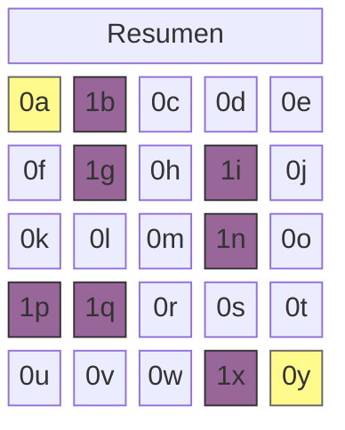
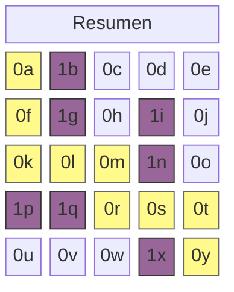

El algoritmo A* es un algoritmo de búsqueda en grafos para encontrar la ruta más corta entre dos puntos concretos. La característica de este algoritmo se puede resumir en una sola ecuación, donde $n$ es un nodo:

$$
f(n) = g(n) + h(n)
$$

## **Lista abierta y lista cerrada**

El algoritmo A* examina el coste de los nodos adyacentes transitables al calcular la distancia más corta. Primero añade los candidatos a la lista abierta (Open List) y, a medida que termina de examinarlos, los mueve a la lista cerrada (Closed List).

```python
open_list = []
closed_set = set()
```

Para implementar este proceso se usan dos listas. La lista abierta utiliza una cola de prioridad, y la lista cerrada, un conjunto (Set).

## **$g(n)$: coste de moverse un paso**

$g(n)$ es una función que mide el coste de moverse a un nodo candidato registrado en la lista abierta. Si el mapa es una cuadrícula, el coste de moverse en las cuatro direcciones (arriba, abajo, izquierda, derecha) es $1$, y si se permite el movimiento diagonal, se puede calcular como $\sqrt{2} \approx 1.4$. En el código que he escrito, solo se considera el movimiento en las cuatro direcciones.

```python
# Suponiendo que el nodo está definido de la siguiente manera
class Node:
    def __init__(self, position, parent=None):
        # ...
        self.g = 0

# Se puede expresar así
neighbor.g = current_node.g + 1
```

## **$h(n)$: distancia hasta el destino**

$h(n)$ es una función que estima de forma aproximada el coste de movimiento desde un nodo candidato registrado en la lista abierta hasta el nodo de destino. Al elegir un restaurante, ir al que tiene más clientes, o al comprar un producto extranjero, calcular el tipo de cambio aproximadamente entre 1200 y 1400 wones, son ejemplos de heurística. Por eso también se denomina valor heurístico. Se sabe que calcular este valor adecuadamente según la situación del problema contribuye a mejorar el rendimiento del algoritmo, y generalmente se puede obtener mediante los siguientes métodos:

- Ejemplo 1: Distancia de Manhattan $h(n) = |x_1 - x_2| + |y_1 - y_2|$
```python
def heuristic(start_node, end_node):
    return abs(
        end_node[x] - start_node[x]) + abs(end_node[y] - start_node[y]
    )
```
- Ejemplo 2: Distancia euclidiana $h(n) = \sqrt{(x_1 - x_2)^2 + (y_1 - y_2)^2}$
```python
def heuristic(start_node, end_node):
    return math.sqrt(
        (end_node['x'] - start_node['x'])**2 + (end_node['y'] - start_node['y'])**2
    )
```

## **Algoritmo implementado en Python**

```python
import heapq

class Node:
    def __init__(self, position, parent=None):
        self.position = position
        self.parent = parent

        self.g = 0
        self.h = 0
        self.f = 0

    def __lt__(self, other):
        return self.f < other.f

def heuristic(a, b):
    return abs(a[0] - b[0]) + abs(a[1] - b[1])

def astar(grid, start, end):
    open_list = []
    closed_set = set()

    start_node = Node(start)
    end_node = Node(end)

    heapq.heappush(open_list, start_node)

    while open_list:
        current_node = heapq.heappop(open_list)
        closed_set.add(current_node.position)

        if current_node.position == end_node.position:
            path = []
            while current_node:
                path.append(current_node.position)
                current_node = current_node.parent
            return path[::-1]

        x, y = current_node.position
        neighbors = [(x+dx, y+dy) for dx, dy in [(-1,0), (1,0), (0,-1), (0,1)]]

        for next_pos in neighbors:
            nx, ny = next_pos
            if not (0 <= nx < len(grid) and 0 <= ny < len(grid[0])):
                continue
            if grid[nx][ny] != 0:
                continue
            if next_pos in closed_set:
                continue

            neighbor = Node(next_pos, current_node)
            neighbor.g = current_node.g + 1
            neighbor.h = heuristic(next_pos, end)
            neighbor.f = neighbor.g + neighbor.h

            if any(n.position == neighbor.position and n.f <= neighbor.f for n in open_list):
                continue

            heapq.heappush(open_list, neighbor)

    return None
```

## **Ejemplo de ejecución del algoritmo**

El algoritmo considera que un valor de nodo de $0$ indica un camino y $1$ un obstáculo. Por ejemplo, supongamos el siguiente mapa. Los nodos 0a y 0y resaltados en amarillo son el punto de partida y el destino, respectivamente.



```python
grid = [
    [0, 1, 0, 0, 0],
    [0, 1, 0, 1, 0],
    [0, 0, 0, 1, 0],
    [1, 1, 0, 0, 0],
    [0, 0, 0, 1, 0]
]

start = (0, 0)
end = (4, 4)

path = astar(grid, start, end)
```

Si en un mapa de $5 \times 5$ se establece el origen en `(0, 0)` y el destino en `(4, 4)`, colocando muros adecuadamente en el camino, la ruta más corta `path` se mostrará de la siguiente manera:



```bash
[(0, 0), (1, 0), (2, 0), (2, 1), (2, 2), (3, 2), (3, 3), (3, 4), (4, 4)]
```
