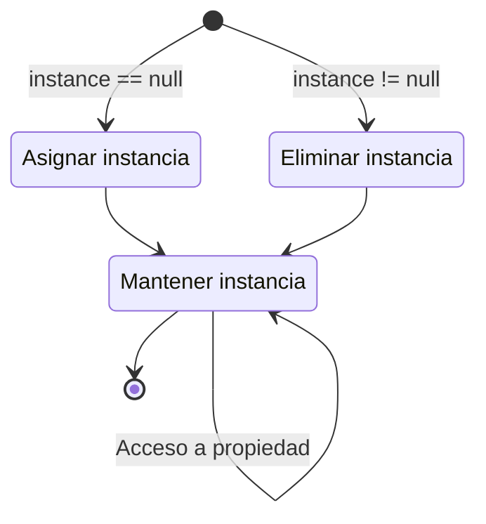

## **Introducción**

A medida que desarrollo juegos, cada vez siento más que hay muchos conceptos que necesitan ser organizados. Aunque uso Notion y Obsidian con frecuencia, la diferencia con dedicar tiempo a organizarlos adecuadamente es notable.

Sin embargo, originalmente evitaba escribir publicaciones detalladas sobre conceptos técnicos por miedo a que el blog se volviera demasiado rígido, pero recientemente descubrí que la etimología de «blog» es Web + Log, y pensé que tampoco estaría mal tener artículos que organicen lo que he estudiado. Así que, de ahora en adelante, planeo ir ordenando poco a poco en el blog aquellas cosas que necesiten un registro aparte, abordándolas en profundidad de paso.

Lo primero que voy a organizar es el patrón singleton. El patrón singleton es un diseño que garantiza que solo exista una única instancia de una clase determinada, y se utiliza principalmente por las siguientes ventajas:

- Permite mantener el estado general del juego de forma consistente entre múltiples scripts o escenas.
- Permite gestionar datos como audio, sprites y objetos sin duplicación.
- Evita la duplicación innecesaria de código pesado en clases individuales, mejorando el rendimiento.

Presento el patrón singleton primero porque es intuitivo. Cuando se aprende desarrollo de juegos, una vez que uno se siente cómodo escribiendo código, muchas personas se topan con este patrón. Es igualmente sencillo en concepto y fácil de usar.

## **Visualización de la estructura**



## **Código básico**

```cs
public class Singleton : MonoBehaviour
{
    private static Singleton instance = null;
    public static Singleton Instance
    {
        get
        {
            if (instance == null)
                return null;
                
            return instance;
        }
    }

    void Awake()
    {
        if (instance == null)
        {
            instance = this;

            DontDestroyOnLoad(this.gameObject);
        }
        else
            Destroy(this.gameObject);
    }
}
```

Las reglas del patrón singleton se pueden resumir en dos:

- Garantiza que una clase solo pueda instanciarse a sí misma una vez (Ensures that a class can only instantiate one instance of itself)
- Proporciona acceso global a esa única instancia (Gives easy global access to that single instance)

Por eso, en Unity el patrón singleton se implementa de forma muy sencilla. Tanto la propiedad de arriba como el método `Awake()` simplemente garantizan que exista una única instancia. Como la instancia del script se declara como `static`, los campos y métodos del script que usa el patrón singleton son accesibles desde clases externas mediante `NombreScript.Instance`.

## **Creación de la instancia**

```cs
public class Singleton : MonoBehaviour
{
    private static Singleton instance = null;
    public static Singleton Instance
    {
        get
        {
            if (instance == null)
            {
                GameObject gameObj = new GameObject();
                instance = gameObj.AddComponent<Singleton>();
                DontDestroyOnLoad(gameObj);
            }
                
            return instance;
        }
    }
}
```

Hasta ahora, cuando no existía una instancia singleton, se trataba como `null` y no se creaba una nueva, por lo que los scripts externos debían verificar si `Instance` existía al acceder a ella. Si eso resulta incómodo, se puede modificar la propiedad como se muestra arriba para que también cree la instancia.

De este modo, cada vez que se accede a la propiedad, la instancia se crea automáticamente, eliminando la necesidad de que los scripts externos comprueben su existencia. Con solo llamar a `Singleton.Instance` ya se puede acceder a la instancia singleton.

## **Crear múltiples**

```cs
public class Singleton<T> : MonoBehaviour where T : MonoBehaviour
{
    private static T instance;
    public static T Instance
    {
        get
        {
            if (instance == null)
                return null;

            return instance;
        }
    }

    private void Awake()
    {
        if (instance == null)
        {
            instance = this as T;
            DontDestroyOnLoad(gameObject);
        }
        else
            Destroy(gameObject);
    }
}
```

```cs
public class GameManager : Singleton<GameManager>
{
    /* Escribir código */
}
```

Como la instancia de un script singleton se mantiene única por definición, conceptualmente no se pueden usar varias instancias singleton a la vez. Aunque se podría copiar el código de alguna manera, resulta ineficiente. En su lugar, si se desean usar múltiples instancias singleton diferentes, se puede recurrir a los genéricos con la forma `Singleton<T>` para crear varios scripts singleton distintos.

Esto también permite que otras clases se conviertan fácilmente en singletons mediante herencia. Por ejemplo, para aplicar el patrón singleton a `GameManager.cs`, se puede heredar de `Singleton<T>` como se muestra arriba.

## **Ejemplo de uso**

```cs
public class GameManager : MonoBehaviour
{
    /* Declaración del singleton */

    public int Score;

    public void ResetScore()
    {
        Score = 0;
    }
}
```

```cs
public class Player : MonoBehaviour
{
    void AttackEnemy()
    {
        Enemy.TakeDamage();

        if (Enemy.HP <= 0)
        {
            Destroy(Enemy);

            GameManager.Instance.Score += 100;
        }
    }

    void Dead()
    {
        GameManager.Instance.ResetScore();
    }
}
```

Que un objeto exista de forma universal en todas las escenas y se mantenga como una única instancia también lo hace adecuado para usarlo en `GameManager.cs`, ya que el script que supervisa los datos o el estado del juego generalmente se maneja con una sola instancia. En este contexto, se puede usar el patrón singleton para un game manager, como en el ejemplo anterior.

Se simuló una situación en la que, durante un combate entre el jugador y un enemigo, si el jugador derrota al enemigo, la puntuación aumenta, y si el jugador muere, la puntuación se reinicia. El game manager define `Score` y `ResetScore()`, y `Player.cs`, como clase externa, accede directamente a `Score` y `ResetScore()` del game manager a través de la instancia singleton. Cuando el enemigo muere, `Player.cs` incrementa la puntuación directamente, y cuando el jugador muere, la reinicia directamente.

Como es posible acceder directamente a los miembros de la clase desde fuera, esta configuración es viable sin necesidad de un tedioso proceso de creación de instancias de `GameManager`. Aprovechando esta característica, si se usa un script de gestión como `GameSystem.cs` como singleton, se pueden configurar campos y métodos como los siguientes:

- Campos
	- `Score`, `CurrentLevel`, `EnemyCount`: para almacenar el estado principal del juego, como nivel, puntuación o número de enemigos restantes.
	- `isGamePaused`, `IsMusicEnabled`: para almacenar si el juego está en pausa o si la música de fondo está activada.
- Métodos
	- `StartGame()`, `QuitGame()`: se usan al iniciar o finalizar el juego.
	- `PauseGame()`, `ResumeGame()`: se usan al pausar o reanudar el juego.
	- `LoadScene()`, `LoadLevel()`: se usan para cargar una escena o nivel específico.

## **Precauciones**

Sin embargo, el patrón singleton es un patrón de diseño polémico porque es fácil de abusar. Es tan cómodo de usar que, si un script termina asumiendo demasiadas responsabilidades o datos, el acoplamiento entre la instancia singleton y otras clases se vuelve muy fuerte, y el código enmarañado dificulta saber quién o cuándo modifica la instancia.

Por lo tanto, antes de usarlo, conviene pensar si no hay alternativas. Como ocurre con la escritura de código en general, el patrón singleton, si se usa en exceso durante mucho tiempo, es difícil de revertir. Si se decide usar el patrón singleton, es recomendable que solo unos pocos scripts puedan acceder a la instancia.

Aun así, sigue siendo fácil de usar y evita la ejecución redundante de funciones pesadas como `GetComponent()` o `Find()`, por lo que, dependiendo del tamaño del proyecto, vale la pena considerarlo.
