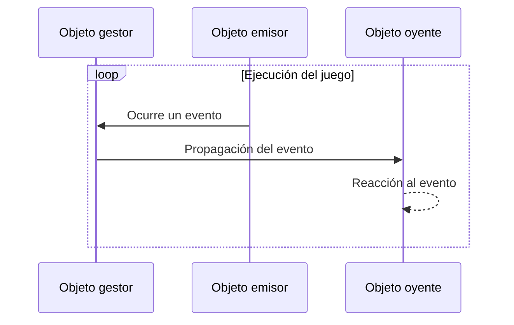

## **Introducción**

La programación dirigida por eventos (Event Driven Programming) es un paradigma en el que el flujo del programa está determinado por eventos. Gestiona la ocurrencia, administración y ejecución de eventos, y se utiliza para aumentar la extensibilidad del código y mejorar la legibilidad y el mantenimiento. Me resultó de gran ayuda en [otro proceso de desarrollo de juegos](https://hyngng.github.io/posts/armonia-first-devlog/) y creo que seguirá siendo útil en el futuro, así que lo dejo por escrito.

## **Conceptos básicos**

- La programación dirigida por eventos se implementa mediante tres conceptos:
	- Gestor (Manager): se encarga de propagar eventos a objetos específicos.
	- Oyente (Listener): reacciona a eventos concretos.
	- Emisor (Poster): genera eventos concretos.

El rol de gestor suele recaer en un único script de gestión, como `GameObject.cs`, mientras que los roles de oyente y emisor pueden recaer ambos en un mismo objeto, o cada uno en objetos distintos.

Por ejemplo, supongamos una situación en la que se oye una explosión y los NPC cercanos miran hacia el lugar del sonido. El objeto que genera la explosión sería el emisor, y los objetos circundantes serían oyentes, cada uno con un rol. Pero si el objeto que genera la explosión también es un NPC que reacciona al evento, ese objeto podría desempeñar tanto el rol de emisor como el de oyente.

## **Visualización de la estructura**



## **Código básico**

### **Gestor de eventos**

:::info
¡El código es un poco extenso!
:::

```cs
public enum EventType
{
    FirstExampleEvent,
    SecondExampleEvent,
    /* ... */
}
```

```cs
public class EventManager : MonoBehaviour
{
    public static EventManager Instance { get { return instance; } }    
    private static EventManager instance = null;

    public delegate void OnEvent(EventType eventType, Component Sender, object Param = null);
    private Dictionary<EventType, List<OnEvent>> Listeners
        = new Dictionary<EventType, List<OnEvent>>();

    void Awake()
    {
        if (instance == null)
        {
            instance = this;
            DontDestroyOnLoad(gameObject);
            return;
        }
        DestroyImmediate(gameObject);
    }

    public void AddListener(EventType eventType, OnEvent Listener)
    {
        List<OnEvent> ListenList = null;

        if (Listeners.TryGetValue(eventType, out ListenList))
        {
            ListenList.Add(Listener);
            return;
        }

        ListenList = new List<OnEvent>();
        ListenList.Add(Listener);
        Listeners.Add(eventType, ListenList);
    }

    public void PostNotification(EventType eventType, Component Sender, object param = null)
    {
        List<OnEvent> ListenList = null;

        if (!Listeners.TryGetValue(eventType, out ListenList))
            return;

        for(int i = 0; i < ListenList.Count; i++)
             ListenList?[i](eventType, Sender, param);
    }

    public void RemoveEvent(EventType eventType) => Listeners.Remove(eventType);

    public void RemoveRedundancies()
    {
        Dictionary<EventType, List<OnEvent>> newListeners
            = new Dictionary<EventType, List<OnEvent>>();

        foreach(KeyValuePair<EventType, List<OnEvent>> Item in Listeners)
        {
            for (int i = Item.Value.Count - 1; i >= 0; i--)
                if(Item.Value[i].Equals(null))
                    Item.Value.RemoveAt(i);

            if (Item.Value.Count > 0)
                newListeners.Add(Item.Key, Item.Value);
        }

        Listeners = newListeners;
    }

    public void RemoveListener(Event eventType, OnEvent listener)
    {
        List<OnEvent> listenList = null;

        if (Listeners.TryGetValue(eventType, out listenList))
            listenList.Remove(listener);
    }

    void OnLevelWasLoaded()
    {
        RemoveRedundancies();
    }
}
```

Es un enfoque que utiliza delegados. También emplea el [patrón singleton](https://hyngng.github.io/posts/singleton-pattern/) para que los objetos oyentes puedan usar algunos métodos, y los eventos se definen mediante `enum`. Aunque el código tiene casi 80 líneas, se compone de 5 métodos individuales, por lo que no es complicado.

- Delegados y campos
	- `OnEvent()`: delegado que registra el método de reacción al evento del oyente.
	- `Listeners`: diccionario cuya clave es el evento y el valor es una `List<OnEvent>`. Conecta un evento específico con su reacción.
- Métodos
	- `AddListener()`: registra la reacción de un objeto específico a un evento en forma de método.
	- `PostNotification()`: método que usa el objeto emisor para generar un evento.
	- `RemoveEvent()`: elimina un evento concreto del diccionario `Listeners`.
	- `RemoveRedundancies()`: una especie de verificación de integridad. Si no hay nada que ejecutar para un evento determinado, lo elimina.
	- `RemoveListener()`: elimina un objeto del diccionario `Listeners` al destruirlo para evitar el error `NullReferenceException`.

### **Oyente de eventos**

```cs
public class ListenerObject : MonoBehaviour
{
    void Start()
    {
        EventManager.Instance.AddListener(Event.ObjectAccessed, OnEvent);
    }

    public void OnEvent(EventType EventType, Component Sender, object Param = null)
    {
        switch (EventType)
        {
            case EventType.FirstExampleEvent:
                /* Espacio para escribir el código de la acción del evento */
                break;
        }
    }

    void OnDestroy()
    {
        EventManager.Instance.RemoveListener(Event.ObjectAccessed, OnEvent);
    }
}
```

Cuando el juego comienza o se crea un objeto, se añade un oyente mediante el método `EventManager.AddListener()` para que pueda detectar el evento deseado, y cuando el objeto se destruye, se elimina el método registrado con `EventManager.RemoveListener()` para evitar errores menores o invocaciones innecesarias de eventos.

El método `OnEvent()` se invoca cuando ocurre un evento. Recibe como argumentos el tipo de evento, el objeto que lo desencadenó y un parámetro adicional, y mediante una sentencia `switch` puede procesar distinta lógica según el tipo de evento. En este ejemplo está configurado para escribir una lógica concreta para el evento `FirstExampleEvent`.

## **Ejemplo de uso**


Ejemplo utilizado en [el juego que estoy desarrollando](https://hyngng.github.io/posts/armonia-first-devlog/). Al seleccionar un objeto concreto, algunos objetos interactuables se resaltan en tonos amarillos, y al deseleccionarlos, vuelven a su estado original. Está implementado mediante programación dirigida por eventos.
