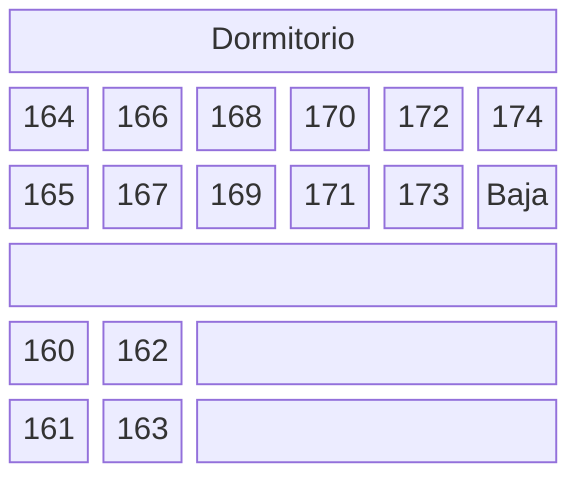

Me siento desconcertado. El tiempo, que fluía lentamente, de repente se ha ido, y estoy escribiendo esto en casa después de salir del Yeonmugwan.

Por el contexto temporal, fui de la primera hornada en ingresar justo después de que coincidieran el accidente de granada de mano del 21 de mayo de 2024 y el fallecimiento de un recluta por maltrato del capitán de compañía el 23 de mayo de 2024, y además era de servicio complementario; quizá por eso hubo áreas en las que se nos dio un trato visiblemente más favorable en el campo de entrenamiento. No es que el entrenamiento en sí fuera más fácil, sino que, por ejemplo, las mismas instrucciones se impartían en el lugar más fresco posible o se suavizaba la intensidad de la disciplina militar.

También influyó que el propio plan de estudios y el ambiente del servicio complementario eran más relajados que los del servicio activo. A diferencia de los soldados en activo, cuyo destino depende de su rendimiento en el campo de entrenamiento, los de servicio complementario ingresan con los planes posteriores ya definidos, así que quizá fuera por eso. No todo el mundo era así, pero en mi dormitorio había un compañero de la misma edad que, según dijo, había entrado voluntariamente porque le habían contado que el campo de entrenamiento era divertido, estando a la espera de ser transferido a la reserva de servicio de guerra por inactividad prolongada.

Llevé al campo de entrenamiento una libreta y un estuche, y cada día escribí un diario de forma constante. Se acumularon catorce páginas, y tras la graduación, en casa, retoqué esos registros para convertirlos en esta entrada del blog.

## **Preparativos para el campo de entrenamiento**

Llevé algunos artículos. Una vez graduado y fuera, creo que se podría haber entrado sin nada y no habría pasado nada grave, pero aun así algunos objetos resultaron útiles. Lo que llevé fue lo siguiente:

|Artículo|Motivo|¿Fue realmente útil?|
|---|---|---|
|Reloj de pulsera Casio F-91W-1|Para saber la hora|Útil en todas partes. Muy bueno|
|Dos pares de plantillas de Daiso|Para ponerlas dentro de las botas militares|Puestas en las botas de combate, resultaron geniales|
|Dos pares de tapones para oídos 3M|De repuesto|Incomparables con los tapones de dotación|
|Libreta y estuche|Para escribir el diario y dibujar|Las usé un par de veces, pero al final lastraban|
|Champú y gel de baño|De repuesto|Están bien, pero un todo-en-uno es mejor|
|Dos libros|Para matar el aburrimiento|Salvo leer un rato durante la guardia nocturna, al final lastraban|
|Un rollo de papel higiénico|De repuesto|Ni siquiera gasté el papel de dotación|
|Funda para cepillo de dientes|Un conocido insistió en que la llevara|Resultó innecesaria porque dieron una de dotación|

Entre los que compartían mi dormitorio, lo más habitual era traer solo champú y gel de baño, pero también hubo quien trajo café instantáneo o polvos de Pocari Sweat para compartir, y en el caso de los investigadores profesionales (Jeonmunyeonguyeogwon), algunos trajeron artículos académicos o libros. Yo también llevé dos libros porque me dijeron que la vida en el campo de entrenamiento era aburrida.

Un artículo que personalmente habría sido bueno llevar es un antifaz para dormir. Encienden una luz roja de noche, y para los sensibles es lo bastante brillante como para dificultar el sueño.

## **Resumen de la rutina diaria en el campo de entrenamiento**

Antes de escribir el diario, primero recopilé los denominadores comunes que se repetían cada día. La rutina diaria en el campo de entrenamiento es la siguiente:

```mermaid
gantt
    title Rutina ordinaria
    dateFormat HH:mm
    axisFormat %H:%M

    section Revista matutina
    Sueño: 00:00, 06:30
    Levantarse, aseo y lavado de pies: 06:30, 07:00
    Revista matutina y desayuno: 07:00, 09:00

    section Turno de mañana
    Instrucción y entrenamiento matutinos: 09:00, 12:00
    Comida: 12:00, 13:00

    section Turno de tarde
    Instrucción y entrenamiento vespertinos: 13:00, 17:30
    Cena: 17:30, 18:30
    Ducha y tiempo personal: 18:30, 20:30

    section Revista nocturna
    Limpieza y espera para la revista: 20:30, 21:30
    Revista nocturna: 21:30, 22:00
    Sueño: 22:00, 2h
```

La rutina diaria básica es la que se muestra arriba, pero según el reglamento del campo, a partir de la hornada de junio se clasifica como promoción de calor y se aplica la rutina de temporada de calor. Esta variante es la siguiente:

```mermaid
gantt
    title Rutina de temporada de calor
    dateFormat HH:mm
    axisFormat %H:%M

    section Antes de la siesta
    Sueño: 00:00, 03:00
    Levantarse, aseo y lavado de pies: 03:00, 03:30
    Instrucción y entrenamiento: 03:30, 07:00
    Desayuno: 07:00, 08:00
    Instrucción y entrenamiento: 08:00, 12:00
    Comida: 12:00, 13:00
    Tiempo personal: 13:00, 14:00
    Siesta: 14:00, 16:00
    Instrucción: 16:00, 17:30
    Cena: 17:30, 18:30
    Ducha y tiempo personal: 18:30, 19:30

    section Revista nocturna
    Limpieza y espera para la revista: 19:30, 20:30
    Revista nocturna: 20:30, 21:00
    Sueño: 21:00, 3h
```

La característica de la rutina de temporada de calor es que la hora de dormir se adelanta a las 9 de la noche y la de levantarse a las 3 de la madrugada. Comienza incluso antes de que termine la primera semana, y aunque supone una carga considerable, hay que seguirla.

## **Archivo**

- 26.º Regimiento, 24-24.ª Promoción (ingreso el 13 de junio, graduación el 4 de julio)

## **Diario del campo de entrenamiento**

### **1.ª semana**

#### **Día 1**

Es el primer día de ingreso. La ceremonia de ingreso se celebró brevemente en la Oficina de Evaluación de Ingreso del Campo de Entrenamiento del Ejército; cantamos el himno nacional, saludamos un momento y ya estaba.

Se dice que, en cuanto los padres se marchan, los instructores se convierten en demonios, pero en realidad, en un ambiente tranquilo, comenzaron varios trámites administrativos. Cuando los padres se retiraron, nos trasladamos cerca de donde habían estado sentados y pasamos por diversas pruebas y encuestas: verificaron que éramos los candidatos al ingreso con la tarjeta Nara Sarang Card y el documento de identidad que llevábamos, y rellenamos de 4 a 5 cuestionarios de salud mental sobre depresión, suicidio, etc.

Mientras rellenábamos los cuestionarios, los trámites de ingreso continuaban. Primero nos entregaron una botella de agua con hielo de 500 mL y una placa con el número de alumno; un instructor midió el perímetro de nuestra cabeza con una cinta métrica para la boina, y al mismo tiempo instalamos la famosa aplicación de seguridad móvil del Ministerio de Defensa Nacional. Entre el caos de reclutas e instructores, tras gestionar incluso a quienes necesitaban ir al baño, arrastramos las maletas hacia el regimiento asignado. La distancia en línea recta no era mucha, pero había que rodear pasando por el batallón de ingreso y el Yeonmugwan, así que el trayecto era bastante largo; en un entorno desconocido y un silencio incómodo, solo se oía el ruido de las maletas rodando, creando una atmósfera tensa.

Al llegar al regimiento y al batallón de instrucción asignados, nos quitamos el polvo con un compresor y entramos en nuestro dormitorio. Al llegar, lo primero fue poner las fundas a las camas, pero el material era tan áspero y ajustado que a todos se nos rozó y despellejó la segunda falange de los dedos corazón y anular. Al cabo de un rato, nos trasladamos al aula de la compañía para recibir dos conjuntos de uniforme de faena (camiseta y pantalón) de la talla correspondiente, que usaríamos durante las tres semanas; nos cambiamos inmediatamente y guardamos las maletas en los espacios vacíos de cada dormitorio, apilándolas como en un Tetris.

El primer día, sin entrenamiento ni instrucción especial, rellenamos varios cuestionarios de salud mental con un tono muy similar a los que ya habíamos recibido en la Oficina de Evaluación; comprobamos la cesta escondida bajo la cama con los artículos básicos de aseo (pasta de dientes, cepillo, jabón, toalla, etc.) y cenamos. Después de cenar, nos duchamos en los baños públicos exteriores, y el día terminó con una sensación de profunda extrañeza.

Fue un día realmente aturdido y extraño después de mucho tiempo. El silencio se alargó entre personas que no se conocían, y no sabía si podía sacar los objetos que había traído de casa —en mi caso, libros, libreta y estuche— así que me quedé mirando sin sentido la hora en el reloj de pulsera hasta que me dormí.

#### **Día 2**

Es el primer día de levantamiento en el campo de entrenamiento y el día de instrucción en orden cerrado.

Nos levantamos a las 6:30 al son de la famosa trompeta de diana, y se celebró la primera revista matutina. Medio dormidos, nos lavamos la cara y los pies rápidamente, cogimos el manual de instrucción para reclutas, nos alineamos en tres filas junto a la carretera al lado del batallón, y si no faltaba nadie, nos dirigimos al patio de armas para pasar lista y verificar el estado de salud de la compañía, dando inicio a la revista matutina.

Recuerdo la primera revista matutina, con un ambiente algo fresco; me sorprendió lo fuertes y enérgicas que eran las voces del jefe de pelotón y del capitán de compañía. Ver por primera vez cómo las órdenes se transmitían rápidamente en la secuencia jefe de escuadra-jefe de pelotón-capitán de compañía-jefe de batallón fue realmente lo que siempre había oído llamar «ejército». Fue el momento en que realmente tomé conciencia de que estaba en el ejército de verdad.

Tras la revista matutina y el desayuno, recibimos instrucción básica de orden cerrado en el dormitorio. Normalmente la instrucción se habría realizado al aire libre, en el patio de armas, pero a partir de nuestra promoción de junio nos clasificaron como «promoción de calor» y la instrucción se impartió en el dormitorio. El instructor nos enseñó posiciones básicas (firmes, descanso, a discreción, giro a la izquierda, giro a la derecha, media vuelta, etc.) y la evaluación se hacía por grupos de unos cuatro por dormitorio; no era muy estricta: si consideraban que entendías bien los movimientos, te daban el aprobado.

Además, ese día se eligió al recluta jefe de escuadra y al recluta subjefe de escuadra. Mientras que el subjefe es un puesto meramente formal sin presencia, el jefe de escuadra acaba siendo llamado de aquí para allá y lo pasa mal, así que pensé que empezaría una guerra de miradas para evitarlo, pero en mi dormitorio alguien se ofreció voluntario diciendo que «si te eligen jefe de escuadra, puedes obtener beneficios como comida o tiempo para fumar», así que la elección fue fácil.

Después de la comida, nos dirigimos al arsenal de otro edificio del batallón para recibir el fusil correspondiente a nuestro número de alumno. Era el momento de ver por primera vez en persona el famoso fusil K2. Había oído que el fusil real pesaba, y pesaba exactamente lo que esperaba; el guardamanos y la culata tenían muchos arañazos y golpes. El fusil recibido lo llevábamos durante los entrenamientos hasta el día antes de la graduación, y cuando no había entrenamiento se guardaba en el armario del dormitorio.

No recuerdo exactamente cuándo, pero un compañero del mismo dormitorio solicitó y obtuvo dos días de permiso por asuntos familiares. Este compañero era padre de familia, y supongo que estaba relacionado con sus hijos.

Ese día, como avituallamiento, nos dieron galletas ABC Kuank, patatas fritas Pizza Chip y café en lata de Starbucks.

#### **Día 3**

Es el día de instrucción en formaciones y manejo del fusil.

Fue mi primera noche de guardia. Al despertar, recibía del que ya estaba despierto el santo y seña del día (el de ese día era «nailon esencia») y cualquier novedad, y luego me levantaba a la hora asignada para velar, literalmente, durante una hora, sin hacer nada.  
Al cabo de 30 minutos, comprobaba la temperatura y humedad de la zona del dormitorio a mi cargo, iba a informar al recluta encargado de registrar los datos en la mesa de guardia, a los 45 minutos iba a despertar al siguiente, y cuando este salía, le relevaba y me iba a dormir. Sin embargo, en mi dormitorio había una persona que roncaba muy fuerte, así que el resto de la noche la pasé prácticamente en vela.

En teoría, el sábado es un día sin entrenamiento, pero el primer sábado es una excepción y se realiza entrenamiento. A la revista matutina se añadió una carrera, pero ese día se limitó a ir andando al recorrido de la futura prueba de 1,5 km para familiarizarnos con él.

Ese día, la instrucción se dividió aproximadamente en formaciones antes de la comida y manejo del fusil después de la comida. Las formaciones consistían en trasladarse al Yeonmugwan, aprender formaciones básicas (intervalo de dos brazos, intervalo individual, intervalo reducido, alineación a izquierda y derecha, formación en columna de dos, dispersarse y reunirse, etc.), practicar por dormitorios, ser evaluados por el jefe de escuadra, y si aprobaban, regresar al dormitorio. El manejo del fusil consistía en ir de nuevo al Yeonmugwan, aprender las posiciones básicas (fusil al frente, fusil en tierra, presentar armas, etc.), y luego pasar directamente a la ceremonia de entrega de fusiles. La ceremonia de entrega consistió en que todos los reclutas, formados en filas y columnas, presentaran armas varias veces hacia el capitán de compañía, y terminó rápidamente.

Ese día también fue cuando la gente empezó a contarse más detalles sobre de dónde venían y qué habían hecho, y el ambiente en el dormitorio comenzó a distenderse; al mismo tiempo, también empezó a haber comunicación entre los reclutas y los instructores en activo.

No recuerdo la hora exacta, pero ese día nos entregaron el uniforme de combate (lo que comúnmente se llama «uniformes de entrenamiento») y las botas de combate.

Ese día, como avituallamiento, nos dieron Coca-Cola en lata.

:::info
Anécdota del día
- Un recluta investigador profesional (Jeonmunyeonguyeogwon) de 29 años de nuestro dormitorio fue llamado a la mesa de guardia durante la hora de dormir para decir una frase de cierre del día, como «gracias por vuestro esfuerzo de hoy», y desde ese día empezaron a llamarlo «el recluta de la radio».
- Durante el tiempo personal, un compañero, sin nada que hacer, se entretenía en el escritorio jugando al billar con tapones de botella o al juego de monedas.
:::

#### **Día 4**

Es el primer día festivo real como recluta. Aunque es festivo, no carece por completo de actividades: hay que sacar los colchones al sol para ventilarlos, y nos entregan las cantimploras, que ese día los instructores han desinfectado con vapor.

También es el primer día en que se permite el uso del móvil durante una hora, de 2:30 a 3:30. Dado el contexto de la fecha de ingreso, en la mesa de guardia emitieron un aviso: «dado cómo están las cosas, aseguraos de llamar a vuestros padres para saber de ellos». Yo llamé 30 minutos y el resto del tiempo lo pasé viendo webtoons atrasados; otros solían ver YouTube o Instagram, pero los que tenían hijos, curiosamente, se mostraban mutuamente fotos de sus hijos.

Después del tiempo de móvil, hubo una sesión de resolución de ejercicios de rellenar huecos en el manual de instrucción para reclutas. Por supuesto, los ejercicios no eran difíciles, pero la cantidad era considerable y había que buscar por todo el libro, así que en mi dormitorio nos repartimos las secciones entre todos, y los investigadores profesionales se encargaron de una parte mayor; cuando todos terminaban, nos intercambiábamos los libros.  
Los instructores nos animaban diciendo que si terminábamos rápido nos pondrían la tele, pero como había mucho que copiar y llevaba tiempo, al final solo vimos un poco del vídeo de aespa y se acabó.

Ese día regresó el recluta que había salido de permiso dos días antes. No era nada del otro mundo, pero todos se alegraron de verle y le dieron la bienvenida.

Ese día también hubo avituallamiento, pero no lo anoté específicamente.

:::info
Anécdota del día
- Durante la revisión de los manuales básicos, otros reclutas le mostraron al instructor que mi letra era bonita, y el instructor me felicitó diciendo «¡oye, qué buena letra!». Desde entonces me llamaron «el recluta escriba» en el dormitorio.
- Hubo una encuesta sobre quiénes deseaban vacunarse contra el tétanos, etc. En mi dormitorio, un investigador profesional que cursa un doctorado en Farmacia dijo que vacunarse traía muchas ventajas, y la cosa acabó en «qué pereza, pero bueno, vayamos todos».
- Frases memorables de compañeros de dormitorio: «Si me ponéis las cosas más difíciles, os robo toda la Coca-Cola», «Si me dais dos Cocas, os enseño los ejercicios resueltos», «Decían que en el ejército te estriñes, pero a mí me sale una cagalera que no para».
:::

#### **Día 5**

Fue el día del reconocimiento médico y los preparativos para el entrenamiento.

Ese día, antes de la revista matutina, me puse las plantillas de Daiso que había traído dentro de las botas de combate y me sorprendió lo mucho más cómodas que resultaban, una diferencia abismal. Redujeron significativamente la presión sobre los pies y las piernas, no solo durante la carrera de la revista matutina, sino también en los desplazamientos posteriores a campos de entrenamiento lejanos y en las marchas.

Después de la carrera, nos dieron en el dormitorio un suplemento de hidratación en polvo llamado LIHI Mix. Todos, por curiosidad, lo probamos de inmediato, y la opinión unánime de todo el dormitorio fue que no sabía bien. Supuestamente era de granada, pero el sabor era extraño e indescriptible; a partir de entonces, hasta la ceremonia de graduación, nadie volvió a probarlo.

A continuación, después del desayuno, hubo análisis de orina y prueba de tuberculosis. El proceso era sencillo, pero éramos mucha gente, así que pasamos casi toda la mañana esperando. Las pruebas se realizaban igual que en el colegio, yendo y viniendo por los pasillos del edificio del batallón y el autobús de la prueba de tuberculosis.  
Después de la comida, nos trasladamos a un edificio fuera del batallón para vacunarnos contra el meningococo y el tétanos; al volver, hasta la hora de la cena, pasamos el tiempo resolviendo las secciones de granadas de mano y primeros auxilios del manual del recluta.

Después de la cena, cada dormitorio recibió unas placas de identificación de cuero (que en el campo llamaban «reja») para coser en la camiseta y la gorra del ejército, junto con el kit de costura. Las placas de cuero llevaban información de pertenencia: regimiento, compañía, número de alumno, etc.; en mi caso, recibí una placa `26-1-XXX` para la camiseta y una `01-XXX` para la gorra. La verdad es que casi nadie sabía coser bien; según el manual, había que coser en forma de X en seis puntos siguiendo el contorno de la placa, pero todos lo hicieron a su manera, con puntadas rectas para fijarla.

Personalmente, a partir de ese día la tensión del primer día se había disipado bastante, y cosas como el orden cerrado y los saludos me salían de forma natural; ya estaba bastante acostumbrado a la vida en el campo.

Ese día, el avituallamiento fue BINCH y Monster Zero (blanco).

:::info
Anécdota del día
- Yendo a comer, el antiguo jefe de escuadra fue pillado por el instructor y tuvo que hacer ejercicios de orden cerrado. «¡Reclutas! ¿Os parece un juego el orden cerrado? ¿Habéis venido de excursión? ¡Hasta que lo hagáis bien! ¡Marcha en el sitio, ya! ¡Uno, dos, tres, cuatro!...» Lo gracioso fue que, como el entrenamiento se alargaba, el recluta confesó tímidamente «es que soy torpe», y el instructor entendió mal «¿que eres qué?» y la cosa casi empeora.
- Ese mismo compañero, tras la revista nocturna, le confesó al instructor que quería irse a casa. Decía que ser jefe de escuadra no le daba ningún beneficio, y que lo del mediodía le había enfadado. El instructor lo escuchó y le dijo que no podía dejarle marchar, que primero durmiera y lo pensara.
:::

#### **Día 6**

Fue el día de la instrucción sobre el enemigo potencial.

Tuve guardia a las 3 de la madrugada. Había ronquidos y, después de la guardia, no podía conciliar el sueño, así que pasé la noche prácticamente en vela; a pesar de haber bebido el Monster Zero del día anterior, ese día estuve cansadísimo todo el día. La revista matutina de ese día —supongo que por bajas puntuaciones en el sistema de puntos—, a la hora de la carrera, solo nuestro dormitorio fue excluido y enviado a dar una vuelta al edificio del batallón recogiendo basura; fue algo peculiar.

Después del desayuno, vestidos con el uniforme de entrenamiento, tanto por la mañana como por la tarde recibimos instrucción sobre el enemigo potencial en el interior, viendo la televisión. La instrucción tenía un tono general de «nuestro principal enemigo es Corea del Norte», y después escribimos una redacción sobre «por qué Corea del Sur es valiosa y con qué espíritu piensas defender tu patria». Luego hubo otra sesión de resolución de ejercicios del manual del recluta.

El instructor visitó el dormitorio para preguntar a quienes tuvieran escoliosis o anomalías en el análisis de orina del día anterior si querían irse a casa, y para encuestar la demanda de parches de nicotina. El instructor contó algunas historias sobre el ambiente del campo de entrenamiento, más o menos como sigue:

- «El gas NBQ es difícil de describir, pero imagina que mojas wasabi en carbón y te lo comes».
- «La granada de fragmentación, por el accidente reciente, ni siquiera los soldados en activo la lanzan; vosotros solo lanzaréis granadas de instrucción. Yo lancé una granada real cuesta abajo, y no os miento: la tierra retumbó y se me puso la piel de gallina».
- «La marcha consiste en andar 5 km, descansar, y otros 5 km, descansar. Cuando yo era recluta, un compañero que pesaba 48 kg preguntó si era normal llevar un equipo que pesaba la mitad que él, pero al final también completó la marcha. Yo, después de la marcha, estuve tres días andando como un pato».
- «Vuestra promoción anterior, por la COVID, pasó la primera semana en cuarentena; hubo una época en que se pasaban las tres semanas enteras por Zoom».

Ese día, el avituallamiento fue Cookdas y refresco al 2% en lata. No recuerdo la hora exacta, pero ese día recibimos el diagrama de despiece del fusil, y como había rutina de temporada de calor, nos acostamos a las 9.

:::info
Anécdota del día
- El compañero que el día anterior quería irse a casa se calmó después de dormir.
- Por lo del orden cerrado del día anterior, lo ajustamos bien y nos dieron puntos positivos.
- Durante el tiempo personal, hice de escriba para las cartas de otro recluta.
:::

#### **Día 7**

Fue el día de la prueba de condición física y la instrucción de despiece del fusil.

Ese día comenzó la rutina de temporada de calor, y nos levantamos a las 3 de la madrugada. Ese día había prueba de condición física y despiece del fusil; según la rutina de temporada de calor, esperábamos en ropa de deporte, y después de una revista matutina simplificada, la prueba de condición física comenzaba con la medición de los 1,5 km de carrera; al terminar, tras un breve descanso, hacíamos abdominales y flexiones detrás del edificio del batallón.  
Cada ejercicio tenía un mínimo para aprobar; si se suspendía uno de los tres, había que recibir entrenamiento complementario. En mi caso, hice 59 abdominales y 30 flexiones, cumpliendo el mínimo, pero en la carrera quedé en el puesto 134 y no alcancé la marca (aunque el aprobado se basa en el tiempo, no en la posición), así que tuve que hacer entrenamiento complementario.

Durante la rutina de temporada de calor, cuando terminaban las actividades de la madrugada, ya era hora de desayunar. Después de comer, nos reuníamos en forma de ㄷ delante del comedor y nos enseñaban el despiece del fusil, desde el regulador de gases hasta el portacerrojo. Durante un descanso, el jefe de pelotón nos contó algunas historias del campo, más o menos así:

- «El K2 está bien, pero el centro de gravedad no está equilibrado, así que se siente más pesado de lo que es. El M4 de los soldados estadounidenses tiene el peso equilibrado a ambos lados del cargador, pero el K2 es mucho más pesado del lado del guardamanos. Por eso, un castigo habitual entre nuestros oficiales era levantar el K2 sujetándolo por el cuello de la culpa con una mano, manteniéndolo en horizontal, durante 40 segundos.»
- «Yo mismo estoy preparando la baja por problemas en las piernas. La razón es que no quiero que el dolor ajeno se convierta en mi trabajo. He visto pasar por aquí a divisiones enteras de reclutas, y entre ellos he visto a uno que se atravesó cuatro dedos con una aguja durante la hora de dormir, o a otro que se suicidó; esas cosas no me gustan.»
- «A la hora de coger el fusil, cogedlo como os resulte cómodo. Por la naturaleza del ejército, se corrige a todo el mundo para que adopte la misma postura de puntería, pero en realidad el manual dice que es mejor que el tirador adopte la postura que le resulte cómoda, y yo también creo que es lo correcto.»

Después de la comida y la ducha, tuvimos siesta de 2 a 4 de la tarde. Al despertar, vimos un vídeo instructivo sobre el armamento individual en el aula; tras esperar un rato en el dormitorio, nos entregaron los nuevos uniformes, llamados «de clase A».

El avituallamiento fue Pringles de cebolla agria y Pocari Sweat.

:::info
Anécdota del día
- El más joven del dormitorio perdió al piedra-papel-tijera y tuvo que hacer las tareas: alinear y envolver con film las bandejas y cubiertos que usaría al día siguiente otro batallón para su entrenamiento de tiro.
:::

### **2.ª semana**

#### **Día 8**

Ese día recibimos instrucción sobre despiece del fusil, posiciones de tiro e inspección de seguridad del fusil.

Después de la revista matutina, con el equipo de asalto puesto, nos trasladamos a un campo de entrenamiento cercano para recibir instrucción sobre despiece, posiciones básicas de tiro e inspección de seguridad. El despiece consistía en que todo el personal del dormitorio, en un tiempo determinado, separara desde el regulador de gases hasta el percutor del portacerrojo y luego los volviera a montar en orden inverso; al terminar, el instructor evaluaba y daba el aprobado si lo hacían correctamente. Las posiciones básicas de tiro eran similares: por dormitorios, aprendíamos y practicábamos las tres posiciones (de pie, de rodillas, tendido) y luego el instructor evaluaba y aprobaba.

Personalmente, ese día tuve varias molestias. El equipo de asalto apretaba bastante más de lo que esperaba, hasta el punto de dificultar un poco la respiración; además, al intentar desmontar el fusil rápidamente, me pillé los dos dedos índice de la mano derecha en la separación de las dos mitades del cuerpo del fusil, rompiéndome un vaso sanguíneo; y en la posición de pie, al sostener el K2, el fusil pesaba bastante más de lo que pensaba, y me costó aguantar durante la evaluación.

De vuelta en el dormitorio, hubo encuestas sobre el tipo de soldado que queríamos ser, la satisfacción con el comedor y la comida, y la frecuencia de las deposiciones, entre otras cosas. Después de la cena, nos dieron los números de grupo y orden de tiro para el día siguiente. El instructor insistió en que no los olvidáramos, y algunos compañeros se los apuntaron en la mano con bolígrafo. Yo era del grupo 5, orden 3.

No recuerdo la secuencia exacta, pero ese día recibimos los tapones para los oídos que usaríamos en el tiro. Sin embargo, eran finos, duros y estaban rotos, así que no los usé.

Ese día, el avituallamiento fue barquillos de fresa.

:::info
Anécdota del día
- El recluta que quería irse a casa fue a informar al jefe de pelotón, y este le dijo: «Tonto, si te vas, tienes que irte rápido. ¿Te vas solo después del tiro? ¿Y después de lanzar la granada también te vas? Así, sin darte cuenta, ya estás en la segunda semana, en la tercera», y lo tranquilizó.
- Se rumoreaba que en el dormitorio 10 de al lado habían estado haciendo novatadas y los habían pillado, con comentarios del tipo «la próxima vez que el instructor me riña, me caso».
- La rozadura del dedo anular del primer día, al poner las fundas de las camas, ya casi se había curado.
- Por corregirme continuamente la postura al ir a comer, al final recibí una sanción.
:::

#### **Día 9**

Ese día fue el primer tiroteo.

Con el equipo de asalto puesto, con el diagrama de despiece en el bolsillo izquierdo de la mochila, una botella de agua de 500 mL en el derecho y el casco antibalas dentro de la mochila, nos dirigimos al campo de tiro de ajuste. Lo que más recuerdo es la autopista de peaje que vimos mientras respirábamos el aire del amanecer, y el paso elevado que la cruzaba. Al cruzarlo por primera vez hacia el campo, todos pensamos lo mismo al ver los coches particulares que circulaban debajo; de hecho, alguien soltó un grito de «uy, dan ganas de saltar». Más tarde supe que ese puente se llama oficialmente Puente Soryong, y extraoficialmente «Puente del Llanto», un puente muy famoso.

Pasando entre las aldeas cercanas al Campo de Entrenamiento de Nonsan y las casas particulares, se llega al campo de tiro de ajuste. Nos habían informado de que estaba a 3 km del batallón, y la distancia real parecía ser esa, así que era bastante lejos. Una vez en el campo, el tiro de ajuste se desarrolló en el siguiente orden:

1. Mientras esperábamos a que el primer grupo terminara de disparar, nos entregaron los tapones militares y nos dieron las instrucciones de seguridad.
2. Cuando llegó nuestro turno, con los tapones puestos, pasamos una inspección de seguridad y entramos en el campo de tiro por orden.
3. Una vez dentro, esperábamos nuestro turno observando los movimientos de los que disparaban antes, y cuando se acercaba nuestro turno, seguíamos las instrucciones de la torre de control repitiendo la orden en voz alta.
4. El proceso de tiro seguía las indicaciones de la torre de control y la asistencia de los tiradores especializados seleccionados entre los reclutas (retroceso y fijación del portacerrojo, entrega del cargador, acoplamiento del cargador, selector de disparo a tiro a tiro, inicio del disparo, uno, dos, tres, fin del disparo, selector de seguridad). La posición se limitaba a tendido.
5. Al terminar una serie de disparos, se procedía a (soltar el fusil, arrodillarse y esperar, comprobación de la diana, ajuste de clic) y se repetía tres veces.
6. Al terminar el tiro, se salía del campo con la propia diana y se realizaba la inspección de seguridad (retroceso y fijación del portacerrojo, comprobación de la recámara, avance del portacerrojo, disparo en seco, tres ciclos de retroceso-avance, disparo en seco).
7. Tras la inspección de seguridad, se evaluaba con la diana. Si de tres disparos, dos o más acertaban dentro del círculo de la diana, se aprobaba; de lo contrario, se consideraba suspenso y había que repetir.
8. Primero desayunábamos; los que aprobaban limpiaban el fusil; los que suspendían repetían el proceso hasta aprobar.

El sonido real de los disparos era como una explosión. Era tan fuerte que el cuerpo no dejaba de sobresaltarse, y hasta que llegaba mi turno, me asustaba con los disparos de los demás. Sin embargo, lo curioso fue que cuando disparé yo, el sonido no era tan fuerte, como un tun, tun, tun. Supongo que fue porque llevaba bien puestos los tapones; después de disparar, no tuve acúfenos. Sobre el tiro, quiero destacar lo siguiente:

- El retroceso se sentía como si alguien te empujara el hombro silenciosamente tres veces.
- El fogonazo de la boca del cañón, al contrario que en los juegos o las películas, no se veía en absoluto, ni cuando disparaban otros ni cuando disparaba yo.
- Sorprendentemente, no había recogedor de casquillos.

Aunque eran solo 25 m, disparé bastante bien. Cuando fui a comprobar la diana después del primer disparo, con el corazón latiendo fuerte, los agujeros de las balas estaban agrupados de forma compacta, y me sorprendió un poco. Recuerdo que el instructor dijo: «Oh... recluta, ¿disparas bien? Ajusta el clic tres a la derecha y siete abajo. Recluta, como disparas bien, solo preocúpate de la respiración». Y el tirador especializado que lo oyó dijo: «Normalmente no suele decir esas cosas; debes de haber disparado muy bien». No era gran cosa, pero ese día me sentí orgulloso y contento sin motivo.

Gracias a eso, en la primera serie, dos de tres disparos acertaron dentro del círculo de la diana, y aprobé el tiro a la primera. La proporción de aprobados en la primera serie fue de aproximadamente un tercio; algunos compañeros no aprobaron ni en la segunda, tercera o cuarta series, y hubo quien llegó a disparar unas 36 balas. Como cada serie llevaba tiempo, mientras esperaba, desayuné y, junto con los compañeros que también habían aprobado, estuvimos charlando animadamente esperando a que terminara el entrenamiento. Después de la cuarta serie, por falta de tiempo, ya no se realizaron más repeticiones; se volvía al batallón y solo los suspensos recibían instrucción complementaria por separado.

De vuelta al batallón, nos indicaron que, para refrescarnos, metiéramos de 3 a 4 cubitos de hielo dentro del casco multifunción; no sé si es el término oficial o un apodo, pero en el campo lo llamaban «oasis». Al caminar con el hielo dentro, el agua derretida goteaba por la correa y caía en la nuca, empapándola; cuando el uniforme y el equipo ya estaban casi secos al sol, cruzábamos el paso elevado y recibíamos hielo nuevo. Cuando este hielo se derretía, llegábamos al edificio del batallón; al volver, nos reuníamos en el patio de armas, el jefe de pelotón nos animaba diciendo «el peso del equipo de asalto de hoy, incluyendo el fusil, era de 5,8 kg. Algunos lo habréis pasado mal, pero buen trabajo», y regresábamos al dormitorio.

Ese día, el avituallamiento fue salchichón estilo cecina, patatas fritas Nuneul Gamja y Milkis de 250 ml en lata.

:::info
Anécdota del día
- Al tirar la basura por la noche, al abrir mal una caja, me levanté un poco la uña del pulgar derecho.
:::

#### **Día 10**

Comenzó con guardia a la 1 de la madrugada, y era un día festivo, cosa rara.

Ese día llovía, así que cada vez que íbamos a comer, nos poníamos el poncho. Los ponchos se colgaban en el perchero del aula del batallón para que se secaran; como los ponchos de todo el dormitorio se mezclaban, cada vez que íbamos a comer cogíamos uno diferente.

A las 2 de la tarde, por primera vez, fuimos al PX. El PX era como un supermercado normal; cogíamos una cesta y comprábamos durante un tiempo determinado. Yo gasté unos 50.000 wones en dos productos de cosmética de Dokdo y dos camisetas ROCA; otros compañeros gastaron 140.000, 150.000 e incluso hasta 600.000 wones en regalos. Los productos más populares eran los refrescos McCol, café en lata y galletas, que no se podían obtener como avituallamiento, y también los cosméticos y las camisetas ROCA.

De vuelta en el dormitorio, otra vez, de 3 a 4 de la tarde, nos devolvieron los móviles durante una hora. Los primeros 30 minutos llamé a mis padres para saber de ellos; los otros 30, avisé a conocidos de que seguía vivo y vi webtoons atrasados, pero como el tiempo era limitado, no lograba concentrarme en el contenido. Los demás hacían algo parecido: llamar, ver YouTube o Instagram.

Después, nos permitieron ver la televisión; como solo había un televisor para tanta gente, estábamos discutiendo qué ver cuando un compañero dijo: «Con la lluvia, Oldboy es perfecto», la idea tuvo buena acogida y de verdad vimos Oldboy.

No recuerdo la secuencia exacta, pero hubo una encuesta sobre quiénes querían donar sangre y quiénes participar en actos religiosos.

#### **Día 11**

Es un día festivo con equipo de limpieza de cocina.

El equipo de limpieza solo participa en la revista matutina hasta el pase de lista, y luego se retira para preparar la limpieza. Se encargan de fregar los platos y de las tareas posteriores relacionadas con la comida; concretamente, los puestos son: bandejas, cuencos de sopa, apoyo, cubos de basura orgánica y basura general. En mi dormitorio, los puestos se sortearon de antemano, y las funciones son las siguientes:

|Nombre|Función|
|---|---|
|Bandejas|Fregar las bandejas, literalmente|
|Cuencos|Fregar los cuencos de sopa, literalmente|
|Apoyo|Personal de apoyo sin función específica. Se les llama donde haya cuello de botella|
|Cubos de basura orgánica|El más duro. Vacían los restos de comida|
|Basura general|El más cómodo. Recogen las bolsas de pan o los envases de yogur que van saliendo; solo hay que estar quieto sujetando la bolsa|

La limpieza final es muy dura, y cada vez que se hace equipo de limpieza, la ropa apesta a restos de comida. Una vez asignado, se puede decir que el día se pasa solo limpiando. Especialmente importante es la combinación con el suboficial que inspecciona el estado de la limpieza; una vez nos pilló un instructor muy estricto, y aunque limpiáramos con muchas ganas, si veía uno o dos granos de arroz, nos hacía limpiar de nuevo, repitiendo la misma limpieza sin sentido dos o tres veces.

Después de la última limpieza, nos trasladamos al aula del batallón para ver la instrucción en vídeo sobre NBQ del día siguiente, que nos habíamos perdido por la limpieza. Como los altavoces no funcionaban, vimos el vídeo sin sonido.

Recuerdo que la ducha de ese día fue muy agradable.

:::info
Anécdota del día
- Después de la limpieza, el instructor nos endosó los helados que habían salido en el desayuno. Discutiendo cómo gestionarlos, un compañero le preguntó a los instructores si podían usar el congelador negro para conservarlos; los instructores preguntaron quién se los había dado, y al describir el rango y el aspecto, tres instructores dijeron a la vez «ah, la puta esa con discapacidad». Los helados se desecharon a través de los instructores.
- Un instructor de otra compañía, en la zona de lavado de cubiertos y vasos, vertía los restos de sopa y se iba. Un compañero de dormitorio quiso ir a discutir, pero lo contuvieron y pasaron por alto.
- Antes de salir a la limpieza de la comida, nos penalizaron por no haber recogido las esterillas del dormitorio. Malas noticias después de haber estado todo el día currando, y el ambiente en el dormitorio se torció.
:::

#### **Día 12**

Es el día del famoso entrenamiento NBQ.

El campo NBQ está a unos 4 km del batallón, bastante lejos. En ropa de civil quizás sería una distancia razonable para ir andando, pero con el equipo de asalto puesto y el fusil al hombro, en columna de dos, la ida y vuelta suponía una gran carga. Por eso, el día anterior nos animaron a apuntarnos al sistema de escalonamiento para ir más despacio; yo me apunté, pero no sirvió de gran ayuda.

La instrucción consistía en enseñarnos cómo protegernos de un ataque nuclear y cómo ponerse la máscara antigás, practicar y luego ser evaluados. Decían que el objetivo era ponerse la máscara en menos de 9 segundos, pero como es un estándar poco realista, solo comprobaban que supiéramos ponérnosla correctamente.

La sensación de llevar la máscara antigás es que la visión se reduce un poco y respirar se vuelve mucho más difícil. Puede ser problemático para quienes tienen poca capacidad pulmonar. De hecho, casi ocurre un accidente: un compañero, después de ponerse la máscara, tenía dificultades para respirar y no podía quitársela por sí mismo; los que estaban cerca tuvieron que quitársela rápidamente, y el capitán de compañía, que estaba dando la instrucción al lado, lo retiró del entrenamiento mientras el recluta, babeando y jadeando, apenas podía respirar.

Después de la instrucción sobre la máscara, desayunamos en un espacio interior con aire acondicionado; después de comer, hubo entrenamiento en la cámara de gas. La sensación al entrar en la cámara de gas era la de un almacén oscuro lleno de humo de mosquitera; como no nos ordenaron quitarnos la máscara y no había anomalías en su uso, no llegamos a inhalar gas. Dentro de la cámara, solo nos quitaron y pusieron el filtro.

Sin embargo, justo antes y justo después de entrar en la cámara, probamos un poco de gas. Personalmente, sentí un picor más desagradable que el de la capsaicina, y una sensación de algo que se masticaba en la boca o se atascaba en la garganta. Al salir de la cámara, agitábamos los brazos arriba y abajo mientras nos movíamos lentamente para sacudirnos las partículas; quienes tenían la piel irritada por el gas podían lavarse con agua. Nos advirtieron de que no nos tocáramos la cara. Yo estaba bien, pero varios reclutas tenían la piel muy enrojecida y escocida, probablemente por las partículas de capsaicina.

De vuelta en el dormitorio, después de la siesta, vimos vídeos instructivos sobre granadas de mano y primeros auxilios para personal; tras un breve descanso, cenamos y terminamos el día.

Ese día, el avituallamiento fue Tartelettes de fresa, salchichas Maxbong y Coca-Cola Zero en lata.

:::info
Anécdota del día
- Un compañero, después de volver del campo, tenía una inflamación en el tobillo derecho que le impedía andar bien. Había que llevarlo en brazos incluso para ir a comer. El problema fue que, al informar al instructor: «creo que deberían enviarlo a urgencias o algo», la respuesta fue: «Entiendo la situación, pero lo que podemos hacer es limitado. Urgencias no es lo que os imagináis». Frustrado, otro compañero fue a informar al jefe de pelotón, que vino al dormitorio con dos instructores.
El jefe de pelotón le pidió que se levantara, y al ver que no podía, le preguntó por los síntomas actuales y si había tenido problemas similares antes; luego llamó por teléfono a algún sitio, dio su rango y nombre, reservó cita en el hospital de la zona y, al mismo tiempo, hizo que un instructor le consiguiera muletas temporales. Preguntó si necesitaba algo más, y al decir que no, salió del dormitorio. Naturalmente, estallaron los aplausos.
Supongo que el jefe de pelotón ya lo había visto cojear en el campo NBQ, por lo que pudo actuar con rapidez. Unos dos minutos después de irse, convocó a todos los instructores (excepto los que estaban controlando reclutas) a su oficina; probablemente para llamarles la atención al respecto.
:::

#### **Día 13**

Es el día del entrenamiento con granadas de mano.

No recuerdo bien la hora porque no lo anoté, pero el día empezó con guardia. La combinación de resfriado y guardia fue realmente dura; literalmente, el cuerpo respondía con retraso y no dejaba de cerrárseme los ojos.

Nos dijeron que el campo de granadas estaba un poco más cerca que el NBQ, pero personalmente seguí sintiéndolo lejano. El entrenamiento de lanzamiento de granadas, al igual que el tiro de ajuste, se organizaba por grupos y órdenes según el número de alumno, siguiendo las instrucciones de la torre de control paso a paso, repitiendo en voz alta.

Cuando llegaba el turno de lanzamiento, el instructor decía el nombre y animaba con frases como «puedes hacerlo», «lo estás haciendo bien». El proceso era: «entrega de la granada, comprobación del objetivo, quitar el clip de seguridad, meter el dedo en la anilla, quitar la anilla, ¡lanzar! uno, dos, tres, comprobación del objetivo». Mientras esperaba el turno, no dejaba de practicar la secuencia una y otra vez.

Se lanzaban cuatro granadas; si al menos una superaba la alambrada del campo, se aprobaba; si ninguna alcanzaba el mínimo, había que recibir instrucción complementaria. La mayoría aprobaba sin problemas, pero mi caso fue algo justo: la primera granada la clavé en el suelo, la segunda y la tercera tampoco alcanzaron el mínimo, pero la última la superé por los pelos, así que aprobé.

Al terminar el entrenamiento con granadas y llegar al batallón, el capitán de compañía sacó a la 1.ª compañía al patio de armas y nos llamó la atención: «Os he estado observando desde atrás, y la disciplina, el orden cerrado, es un desastre. ¿Estáis de broma? ¿Habéis venido de excursión?». Yo entendía la situación y lo escuché sin quejarme, pero el capitán terminó con un «y siento haberos gritado, chicos~», desinflando el momento. Me pareció un poco extraño, como si lo hiciera a propósito.

El desayuno de ese día, después del entrenamiento, fue el peor de todos: sopa de tofu blando con salsa de soja, danmuji (rábano encurtido), un guiso raro con aceite flotando y una tortilla de huevo. Hubo compañeros que no quisieron comer, y yo compartía esa reacción.

Después de la siesta, nos trasladamos al aula para ver un vídeo sobre combate individual; tras un descanso, cenamos y dimos el día por terminado.

Ese día, el avituallamiento fue una lata de 500 ml de Sikhye (Birak).

:::info
Anécdota del día
- El compañero que se quejaba de dolor de muelas fue ese día al hospital de la zona y le hicieron una endodoncia. Al volver, contó que el recluta alto que le acompañaba se había escapado por la zona del PX, pero el instructor lo atrapó a los 20 minutos y lo trajo de vuelta.
:::

#### **Día 14**

Es el día de la prueba de 3 km de carrera y la práctica de posiciones de combate individual.

Ese día no hubo guardia y pude dormir bien por primera vez en mucho tiempo, pero aun así estuve cansado todo el día.

Después de la revista matutina, hubo prueba de 3 km de carrera. Antes de la prueba, se aceptaron solicitudes de quienes querían quedar exentos de la carrera y hacer entrenamiento físico en su lugar; como en la prueba anterior de 1,5 km lo había pasado muy mal, desde el principio opté por la exención. El entrenamiento físico consistió en algo de calistenia militar, de forma simplificada.

El combate individual incluía posturas que suponían un esfuerzo físico considerable, como el avance a gatas o el avance alto. Fue el entrenamiento de mayor intensidad de todos los que habíamos hecho hasta entonces; al estar de pie después del ejercicio, notaba un ligero mareo. La instrucción comenzaba con una demostración del instructor, luego alineaban a los reclutas en filas y columnas, y nos presionaban con frases como «¿no aprendisteis esto fuera, que es tan duro? ¡Empuja! ¡Tira! ¡Empuja! ¡Tira!».

En el combate individual, tras cada movimiento, descansábamos unos 10 minutos. Recuerdo dos cosas de ese momento: una, que durante el descanso, un recluta provocó a otro en activo diciendo «yo me voy la semana que viene, ¡seguid currando!»; y otra, que, en medio de todo, el paisaje del campo de entrenamiento me pareció varias veces más pacífico y bonito de lo habitual.

Durante la hora de la siesta, alegando el resfriado, me salté la siesta y solicité ir a la enfermería. Había mucha gente esperando en la enfermería, y lo curioso fue que había muchos grafitis en las sillas, como «yo me voy, vosotros al combate individual», «el equipo de cocina es una miel». Durante la consulta, como ya que estaba allí por el resfriado y al día siguiente había marcha programada, dije que me dolía la espalda, y me dieron parches y me apuntaron al escalonamiento de la marcha del día siguiente.

El avituallamiento fue Honey Butter Baguette y una lata de Monster Black.

:::info
Anécdota del día
- Había oído que en mi promoción había un futbolista; ese día, en la prueba de carrera, se vio a un recluta que llegó primero de forma aplastante.
:::

### **3.ª semana**

#### **Día 15**

Es el día de la práctica de combate individual y la marcha.

Mi estado físico era realmente malo. Tenía la garganta inflamada y mucho sueño.

Desde la madrugada, sacamos los fusiles del arsenal, formamos y salimos hacia el campo de entrenamiento de combate individual. El combate individual consistía en ir superando obstáculos preparados por grupos, corriendo. Había que pasar gateando por debajo de neumáticos, o tumbarse boca arriba bajo alambradas, y recuerdo que al final había que salir corriendo gritando.

Al terminar el combate individual, se evaluaba por dormitorios la respuesta a diversas situaciones de combate: encuentro con el enemigo, compañero herido, aeronave enemiga a las 6, etc. No era difícil y, de hecho, era de lo más entretenido del entrenamiento.

Después de la evaluación de combate individual, esperamos un rato frente al aula, desayunamos, y luego recibimos instrucción sobre las misiones de centinela. Al terminar la instrucción de centinela, el jefe de pelotón nos enseñó técnicas de bayoneta; me pareció curioso que el propio jefe de pelotón no parecía muy convencido, diciendo que hoy en día existe el CQB. La instrucción de bayoneta consistió en repetir varias veces las posturas de clavar, golpear y girar, y terminó sin evaluación.

Después del combate individual, tuvimos la última siesta en el campo de entrenamiento. Como la marcha estaba programada para justo después, dormimos profundamente de 2 a 6 de la tarde, cuatro horas, y la verdad es que la fatiga se alivió bastante. Luego cenamos; al salir del comedor, el sol se estaba poniendo de forma preciosa. Las sombras alargadas sobre las nubes, la densidad del naranja y el púrpura que se invertían en los lados izquierdo y derecho del horizonte... el paisaje era realmente hermoso.

Para la marcha, recuerdo que intentamos aligerar el equipo todo lo posible: quitamos la cantimplora del equipo y la máscara antigás de su funda. La marcha se realizó de 9 de la noche a 3 de la madrugada, yendo y viniendo 6 veces por el recorrido de carrera; cada ida y vuelta llevaba unos 45 minutos. Aunque había inspección del equipo, debido al ambiente relajado que se respiraba entonces en el campo, no todo el mundo fue inspeccionado; además, después de la primera vuelta, como hacía demasiado calor, nos ordenaron cambiar el casco antibalas por el casco multifunción en el dormitorio y salir de nuevo; muchos interpretaron esto como «nos están diciendo que aligeremos el equipo» y salieron sin parte de él. De hecho, no nos reunieron para una nueva inspección antes de partir.

Al principio de la marcha, disfrutábamos viendo la Osa Mayor, pero como había peligro de lesiones en la oscuridad, el instructor ordenó mirar al frente y guardar silencio, y a mitad de la primera vuelta, todo el mundo caminaba sin decir una palabra. En mi caso, después de la primera vuelta, me aburrí tanto que empecé a contar los pasos en otro idioma para pasar el tiempo.

Después de la cuarta vuelta, durante el descanso, nos dieron Powerade, pan de pizza y cecina. Personalmente, entre el sueño y el cansancio, no tenía apetito, así que solo tomé un poco de Powerade y el pan de pizza.

En la quinta vuelta, durante el descanso, estaba dormitando y un compañero de otro dormitorio me dijo: «¿Quieres un caramelo? Para despertarte», y me dio un caramelo superácido. Cuando iba a guardar el envoltorio, me dijo: «Déjeme el envoltorio, yo lo tiro». Tenía pinta de macarra, y de hecho se rumoreaba que era un problemático, pero, en cualquier caso, aquel gesto amable se me quedó grabado.

Al terminar la marcha, dejamos los chalecos y el equipo empapados de sudor en el suelo para que se secaran al sol y entramos en el dormitorio. Después de la marcha, nos repartieron Shin Ramyun, huevos cocidos y Pocari Sweat; yo no cogí nada porque me pareció que solo iba a ser lastre. La mayoría de los compañeros cogieron solo el Pocari Sweat.

Al parecer, entre los que llevaban el equipo completo, hubo un par de heridos. Se decía que uno, caminando con sueño, metió el pie en una alcantarilla, y según un compañero cercano, se oyó un ruido como de romperse un hueso.

Al terminar la marcha, el instructor, un soldado de primera, nos dijo: «He hablado para que salga agua caliente; id a la ducha y disfrutad todo lo que queráis». Fuimos a la ducha y salió agua fría. Ver al compañero investigador profesional de mi dormitorio enfadarse en silencio fue toda una experiencia.

El tiempo de sueño fue de 4 de la madrugada a 11 de la mañana del día siguiente. Aunque me desperté un par de veces por el frío y los ronquidos, como eran muchas horas, al levantarme me encontraba bastante bien.

:::info
Anécdota del día
- Durante la marcha, vi que muchos llevaban el fusil enganchado al cargador del equipo, y yo también lo hice; era mucho más cómodo, sin duda.
- El cielo despejado durante la marcha permitió ver la Osa Mayor con total claridad.
:::

#### **Día 16**

Fue el día de limpieza del equipo después de la marcha.

Nos levantamos a las 11, comimos directamente y recogimos los chalecos y el equipo que habíamos dejado el día anterior. De vuelta en el dormitorio, limpiamos el chaleco de combate, los cargadores, el casco antibalas y la cantimplora; frotamos la tapa de la cantimplora, la parte inferior de los cinco cargadores y la tierra de la máscara antigás, y pasamos inspección. Los chalecos y las fundas de la máscara se volvieron a mojar y se extendieron en el suelo junto al dormitorio, por dormitorios, para que se secaran. No se recogieron hasta después de la cena.

En el campo de entrenamiento, en lo relativo a la comida, cada dormitorio se encargaba una vez del equipo de limpieza o del equipo de cocina; como había menos dormitorios que necesidades, se enviaba a un representante de cada uno a la mesa de guardia para decidir a piedra-papel-tijera qué dormitorio trabajaría una vez más. El más joven de mi dormitorio fue como representante y perdió; así que al día siguiente empezamos a asignar los puestos del equipo de cocina. Los puestos de cocina eran: bandejas y cubiertos, arroz, guarniciones, sopa y avituallamiento; la mayoría eran guarniciones. En mi dormitorio, sorteamos el orden con el juego de la escalera y luego metimos papeletas en un casco; yo fui el sexto en elegir y saqué la sopa.

Fuera de eso, ese día no hubo nada especial; lo pasamos holgadamente: tonteando, limpiando, asistiendo a la revista nocturna, y el día terminó con tranquilidad.

:::info
Anécdota del día
- A partir de ese día, empezó a notarse un ambiente de «por fin nos vamos a casa».
:::

#### **Día 17**

Aunque era día festivo después de mucho tiempo, hubo equipo de cocina, como se había anunciado el día anterior.

Durante la revista matutina, nos advirtieron que, desde que termina el entrenamiento hasta la graduación, se producen muchas bajas por accidentes, así que si queríamos graduarnos sin novedad, tuviéramos cuidado hasta entonces. Dicen que durante este periodo el control de los instructores se relaja y se producen muchos conflictos entre los reclutas.

El equipo de cocina es mucho, mucho más llevadero que el equipo de limpieza, tanto en esfuerzo físico como en lo desagradable. Salvo tener que ponerse gorra, guantes de plástico y manguitos, no hay molestias; no hay más trabajo que servir la comida, y el ambiente de trabajo no es caótico. Una ventaja adicional es que, mientras que el equipo de limpieza come primero, el equipo de cocina come el último, por lo que pueden servirse la cantidad que quieran.

Ese día hubo entrenamiento físico complementario para los que no habían aprobado los 1,5 km de carrera. El instructor dijo: «¿No es mejor llevarse algo del campo de entrenamiento?», e hicimos sentadillas, flexiones, saltos de brazos y piernas, y elevaciones de piernas tumbados sujetando las piernas del compañero, en series de 10 o 20 repeticiones, 2 o 3 series. La intensidad no era alta.

Después de comer, vimos el final de la película Oldboy, que habíamos empezado y dejado a medias. Era la primera vez que la veía, y me impresionó.

:::info
Anécdota del día
- En el ejército, la ración de comida se prepara para 1,2 o 1,5 personas, por lo que siempre se tira una cantidad ingente de comida que ni siquiera se ha tocado. Como no permiten llevársela, ese día tiramos tres bolsas de Corn Flakes en perfecto estado.
- Por fin pudimos ducharnos con agua caliente después de mucho tiempo. No era gran cosa, pero después de ducharme y tumbarme en la cama, fui muy feliz.
:::

#### **Día 18**

Fue un día festivo relajado, después de mucho tiempo.

Uno de los compañeros del dormitorio, al abrir el armario para meter la colada, se le cayó la puerta. Al informar al instructor, otro instructor vino con un taladro y la fijó; recuerdo que mientras trabajaba, se vanagloriaba: «¡Oye, soy un taladro humano! ¿Por qué se me da tan bien esto?».

Ese día había tifón, con lluvia y viento. También para ir a comer había que ponerse el poncho; varios compañeros, por pereza, fueron sin poncho, solo con el uniforme de faena, y a la vuelta se encontraron con un instructor que venía corriendo gritando «¡Eh! ¿De qué compañía sois?», y les llamó la atención.

Ese día, los principales entrenamientos e instrucciones ya habían terminado, y no pasó gran cosa, salvo lavar el uniforme de entrenamiento. Pasamos el tiempo reuniéndonos en el dormitorio para comer las galletas que quedaban y charlar; en mi caso, escribí en el diario de lectura del libro que había traído, y después de que nos permitieran ver la televisión, vimos películas como El huésped, La doncella y Fausto.

:::info
Anécdota del día
- Al compañero de la cama de la izquierda le había crecido el pelo, y estábamos esperando a que se lo cortaran; los miembros del dormitorio se confabularon para convencer a un instructor de que se lo dejara pasar, y al final consiguieron un «bueno, así está bien». De hecho, este recluta se graduó sin que le cortaran el pelo.
:::

#### **Día 19**

Es el primer día del mes de julio, y el primer día laborable después de terminar los entrenamientos.

Después del desayuno, comprobamos la cantidad de equipo, y nos dieron parches para borrar los garabatos de las camas. Puede que os sorprenda que hubiera quien hiciera garabatos en las camas, pero en mi dormitorio también había algunos. Sin embargo, en el dormitorio de al lado usaron tantos parches que el olor era insoportable, y en nuestro dormitorio gritamos «¡dejad de echar parches!», y estuvimos a punto de pelearnos con los del otro dormitorio. Al final se arregló bien, pero como había cierto malestar acumulado, y este incidente generó solidaridad a nivel de dormitorio, decidimos escribir una «carta del corazón» (*maeumui pyeonji*). Con la ayuda de los investigadores profesionales, la redactamos con el máximo esmero, y uno de nosotros fue como representante a meterla en el buzón de las cartas del corazón.

El resto del tiempo no hubo mucha actividad; por dormitorios, llevamos un conjunto de camiseta y pantalón del uniforme de faena para lavarlos en grupo. Sin embargo, en otra litera del mismo dormitorio, la puerta del armario volvió a caerse; esta vez, como no tenían taladro, no la arreglaron y nos dijeron que nos apañáramos como pudiéramos.

Se acabó el tiempo libre, y después de la revista nocturna, cuando estábamos tumbados en la cama con las luces apagadas, un instructor sargento dijo por megafonía desde la mesa de guardia: «Este instructor tiene hoy su último día de servicio», y todos los dormitorios aplaudieron. Luego, como si fuera una tradición del campo, dijo que aceptaría preguntas durante 10 minutos. Las preguntas fueron cosas como que su ideal era Oh Hae-won de NMIXX, y quiénes eran sus instructores favoritos.

Ese día, el avituallamiento fue Pringles sabor barbecue ahumado y Monster White Zero.

:::info
Anécdota del día
- Durante la limpieza de la noche, fui con un compañero a dejar los utensilios de limpieza del baño fuera del edificio del batallón, y llegamos muy tarde; como los instructores no se habían coordinado y temíamos que cerraran la puerta antes, salimos corriendo.
- Un compañero del dormitorio colgó un amuleto del tiempo para que dejara de llover y no tener que salir.
- El tiempo libre lo pasamos intercambiándonos las placas de identificación y comiendo los avituallamientos sobrantes, tranquilamente.
:::

#### **Día 20**

El día comenzó con guardia a las 4 de la madrugada. La guardia a esa hora era el peor momento, porque reducía las 8 horas de sueño a 6. Además, algo gracioso: el santo y seña de ese día era «cultura y parachoques, calendario», que era más largo de lo normal; al levantarme, comprobé que en realidad era «parachoques y calendario». Supongo que originalmente era «pulpo (mun-eo) y parachoques, respuesta (dap-eo) y calendario», pero como nadie sabía qué era «mun-eo», se deformó a «cultura (mun-hwa) y parachoques».

Al llegar a la tercera semana y acercarse la graduación, todos se habían hecho más cercanos, y los que antes estaban callados también empezaban a hablar. Nos sentábamos en corro, abríamos los avituallamientos y charlábamos de todo tipo de temas, o nos sentábamos con las piernas estiradas; el ambiente era muy relajado.

De 1:30 a 3:00 asistimos a una conferencia de un doctor en Estudios Norcoreanos. El tema era «Por qué es importante la paz mediante la fuerza», y se centró en las tendencias recientes de Corea del Norte y la preparación militar. Como me interesaban las relaciones internacionales y los propios estudios norcoreanos me resultaban fascinantes, presté bastante atención, pero el contenido en sí era más bien básico. Los compañeros sentados a mi lado, quizá porque les pareció aburrido, estaban hablando de sus planes futuros después de la graduación.

La carta del corazón del día anterior fue enterrada por el jefe de pelotón. De hecho, había otras cartas del corazón acumuladas, pero el jefe de pelotón reunió al pelotón en el aula y dijo: «Ahora que el entrenamiento ha terminado, os estáis atacando unos a otros. Si llevo esto a mis superiores, creo que unos seis acabarían siendo expulsados. Pero quiero que todos probéis el dulce sabor de la graduación. Habéis trabajado duro durante tres semanas, así que voy a enterrar este asunto discretamente. A los que tengan problemas, los llamaré aparte para hablar. No cuestionéis mi decisión». Y disolvió la reunión; los miembros del pelotón volvieron a sus dormitorios en silencio.

:::info
Durante la guardia, vi que otros compañeros leían, así que saqué mi libro y me puse a leer; vino un instructor y me llamó la atención: «¡Guardia! ¡Guardia! No lea durante la guardia. Cuando esté de guardia, no haga otras cosas». (Este instructor era conocido por ser antipático incluso entre los propios instructores.)
:::

#### **Día 21**

Es el día antes de la graduación.

Todos sentimos que ya era hora de irse a casa. No había mucho programa; después de la revista matutina, devolvimos los fusiles al arsenal del batallón de al lado, y todos los reclutas nos trasladamos al Yeonmugwan para ensayar el paso para la ceremonia de graduación. Como no coordinábamos bien, estuvimos levantándonos y sentándonos unas diez veces; fue el ejercicio disciplinario más intenso que recibí en el campo.

Para despedida, hubo un tiempo de recreación llamado «Día del Recluta». El 26.º Regimiento, por tener instalaciones anticuadas, tomó prestado el aula del edificio del 27.º Regimiento; la organización y el ambiente eran similares a los de un festival escolar. Como anécdota, el edificio del 27.º Regimiento era bastante diferente al nuestro: mientras que el 26.º parecía viejo y remendado durante mucho tiempo, es decir, anticuado, el 27.º era moderno y limpio, como las instalaciones de un colegio normal.

Cuando todos los reclutas de todas las promociones estuvieron en el aula con el aire acondicionado fresco, nos dieron helados de cucurucho y comenzó el evento. Consistió en que los reclutas bailaban y actuaban al ritmo de canciones militares, cuatro reclutas de los capitanes de compañía hacían un concurso de talentos, los instructores cantaban, etc. Especialmente buena acogida tuvieron el capitán de compañía bailando Zero Two y el instructor que forzaba la voz al cantar.

Al terminar el Día del Recluta y volver al dormitorio, hacia las 4 o 5, el jefe de pelotón convocó al pelotón en el aula. Dijo: «Como personas unidas por el vínculo militar, os he llamado para despedirme», y contó varias historias: que después de dos incidentes desagradables consecutivos en el campo, el jefe del batallón de instrucción y el jefe del regimiento estaban muy pendientes de esta promoción; que él mismo había sido un macarra (robos de motos, acoso escolar) hasta los veinte, cuando empezó a preocuparse por cómo ganarse la vida, se hizo militar y le gustó la vida de seguir solo las reglas establecidas, por lo que se alistó como suboficial y terminó siendo su jefe de pelotón. Después de varias historias, dijo que no podría asistir a la ceremonia de graduación y fue uno a uno dándonos la mano a todos los miembros del pelotón. Cuando llegó mi turno, la mano del jefe de pelotón era la típica mano de un adulto: palma suave, dedos ásperos, pero cálida. Al volver al dormitorio, hicimos el equipaje antes de la revista nocturna.

Después de la revista nocturna, los instructores fueron a los dormitorios a contar también algunas historias. Esta frase va entre comillas porque, cuando dijeron que los instructores iban a visitar los dormitorios, yo esperé un rato, pero me entró sueño y me dormí primero. Al día siguiente me contaron que los instructores habían ido pasando por los dormitorios contando todo tipo de historias sobre los «vándalos» del campo.

Personalmente, sentí una mezcla de lástima y opresión en el pecho. No me gustaban ni el entrenamiento, ni el campo, ni el dormitorio, pero me gustaba el ambiente de la gente del dormitorio animándose mutuamente durante el entrenamiento, y también me gustaba bastante poder sentarme frente a frente sin teléfono móvil mientras comíamos y charlar de vez en cuando; sentía que lo echaba de menos. Por supuesto, todo gracias a haber tenido la suerte de conocer a buena gente en el dormitorio.

#### **Día 22**

Es el día de la graduación del campo de entrenamiento.

Después de la revista matutina, devolvimos los uniformes de faena por tallas. De vuelta en el dormitorio, trasladamos los objetos que habíamos ido guardando (cepillo de dientes, zapatillas de deporte, etc.) a las maletas y las organizamos.

El desayuno, la última comida en el campo de entrenamiento, fue realmente malo: algas, arroz, sopa, carne y kimchi; aun así, me lo comí todo. De vuelta en el dormitorio, nos lavamos la cara y los pies, nos cambiamos al uniforme de combate de clase A, cogimos las maletas y, al salir del edificio del batallón, fuimos recogiendo los móviles por orden. El día estaba muy despejado y la temperatura era un poco cálida.

Una vez formados en dos filas, dejamos las maletas en el exterior del edificio, frente al Yeonmugwan, por dormitorios; ajustamos la formación de desfile para la ceremonia de graduación y entramos en el pasillo del edificio, donde esperamos brevemente hasta las 9:50. A la hora, entramos al son de los graves y el bombo, marcando el paso con el pie izquierdo; siguiendo el ensayo del día anterior, ajustamos la formación, cantamos el himno nacional y la canción del campo de entrenamiento del ejército, y con eso terminó el último evento oficial en el campo: la ceremonia de graduación. Supongo que por eso, personalmente, al cantar el himno nacional, sentí un nudo en la garganta.

En mi dormitorio, nos llevábamos bien, así que antes habíamos quedado en reunirnos en la zona de espera para exentos después de la ceremonia y hacernos una foto final. Y, como prometimos, nos hicimos varias fotos y nos despedimos con «¡gracias por todo!», «¡buen trabajo!», etc. Luego salimos del edificio, nos hicimos unas fotos con la familia, emprendimos el camino a casa, deshicimos el equipaje y guardamos todos los objetos del campo: la placa de identificación, las anillas de goma, etc.

:::info
Anécdota del día
- Cuando nos indicaron que saludáramos a los padres, al girar la cabeza, allí estaba mi familia. Lo primero que pensé fue: «¿Qué hace mi familia aquí, en un campo de entrenamiento?».
- Como suponía, los instructores tenían todos 20 años (nacidos en 2004).
:::

## **Reflexiones después de la graduación**

Aunque escrito parece un periodo corto, el entorno del campo de entrenamiento es tan diferente que la percepción del tiempo fue de más de tres semanas. Se siente con un peso similar al de haber pasado mes y medio o dos meses en la vida cotidiana. Desde que llegué a casa, el ambiente es tan pacífico y tranquilo que la vida en el campo me parece un poco irreal.

Personalmente, he experimentado cambios: he ganado bastante peso, a veces sueño con el instructor o con compañeros del dormitorio, y he salido bastante más saludable, con una especie de terapia de dopamina forzada y un reajuste del horario de sueño. En cuanto al peso, en el campo te mueves mucho pero también comes mucho, así que no sabía si iba a ganar o perder; al final he ganado casi 5 kg, rompiendo la inercia que mantenía desde el instituto y alcanzando un máximo histórico sin precedentes. El dopamina volvió a la normalidad rápidamente, pero el horario de sueño ajustado en el campo todavía se mantiene bien: sigo acostándome a las 10:30 u 11.

En cuanto a la gente, en mi caso, dejando de lado los ronquidos, tuve la suerte de encontrar gente buena: el capitán de compañía, el jefe de pelotón y la gente del dormitorio, todos sin malas personas. En particular, había un compañero de la misma edad que animaba el ambiente en el dormitorio, y los investigadores profesionales también mantenían un ambiente sano, lo cual fue muy bueno. Teniendo en cuenta las noticias que llegaban de otras compañías o dormitorios, donde había problemáticos o el ambiente se volvía tenso, tuve mucha suerte.

Los instructores también eran de diversos tipos: algunos querían que la vida militar fuera llevadera desde el principio; otros tenían la mirada perdida como un empleado de tienda de conveniencia; otros estaban irritados por todo; otros eran muy aplicados en la vida militar; otros, aunque duros y estrictos delante de todos, se volvían muy amables en cuanto terminaba la jornada; otros, desde la expresión hasta los modales, eran soldados veteranos relajados; la mayoría eran personas honestas en cuanto a su posición y circunstancias.

Al final, gracias a la suerte en varios aspectos, mis recuerdos del campo no son malos, y quiero conservarlos como un buen recuerdo. Especialmente, la huella del campo en mi horario de sueño: mi patrón de acostarme a la 1 o 2 de la madrugada antes de ingresar se ha corregido a las 10 u 11, y estoy muy satisfecho.
