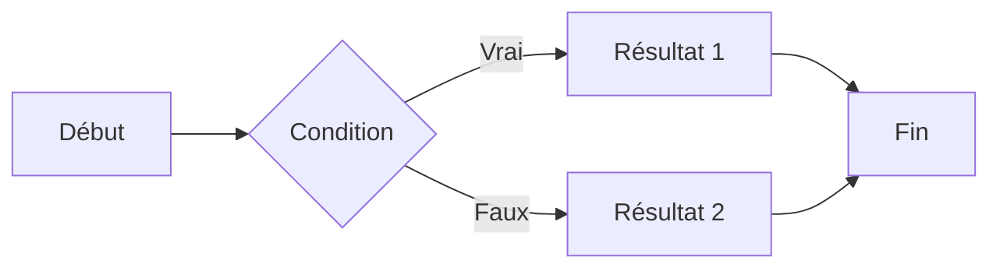

:::info
Cet article a été rédigé sous le framework Jekyll. Il a depuis migré vers Astro !
:::

## **Introduction**

Cela fait bientôt deux ans que j'ai ouvert ce blog depuis [mon premier article](https://hyngng.github.io/posts/first-post/). Pour deux ans, le nombre d'articles écrits jusqu'à présent n'est pas énorme, mais cela ne signifie pas que je n'y suis pas attaché. Entre les obligations professionnelles et personnelles, et les périodes où mon activité s'est ralentie, j'ai continué à gérer ce blog régulièrement.

Récemment, en remaniant le blog et en l'inscrivant aux moteurs de recherche, j'ai réalisé que je m'étais pas mal familiarisé avec la plateforme GitHub Blog. Écrire des articles est devenu bien plus facile, et le temps libre ainsi gagné me permet de peaufiner le blog. Personnellement, même si choisir GitHub Blog était un pari, j'ai l'impression d'apprécier le caractère unique de cette plateforme, et je voudrais résumer ce qui rend GitHub Blog si attrayant à mes yeux.

## **Une personnalisation libre**

{: .light .border }
{: .dark }
*La fonction récemment ajoutée de suppression de contenu par balise, et son application réussie*

GitHub Blog est globalement bien plus difficile à gérer que les autres plateformes. Il faut s'y intéresser et configurer soi-même un grand nombre de choses, ce qui est contraignant. Malgré cela, ceux qui choisissent GitHub Blog le font parce que l'expérience de gestion du blog y est très libre.

Contrairement aux autres plateformes de blog, GitHub Blog donne une impression d'ouverture et de flexibilité. Là où les autres plateformes offrent un environnement fermé où l'on ne peut utiliser que les fonctions supportées dans un cadre défini, GitHub Blog permet de modifier directement toutes les informations qui composent la page. Si l'on a des bases en front-end, on peut implémenter la plupart des fonctionnalités soi-même. Les langages principalement utilisés sont les suivants :

- Ruby
- Liquid
- SCSS
- JavaScript

Dans mon cas, j'ai déjà écrit deux articles à ce sujet : l'un sur [divers réglages de personnalisation](https://hyngng.github.io/posts/first-blog-customization/) et l'autre sur [l'implémentation d'une fonction spécifique](https://hyngng.github.io/posts/blog-content-remove/). Sans en faire un article à part, j'ai aussi récemment ajouté quelques gadgets comme les images LQIP, l'icône Instagram, et le bouton d'applaudissements.

La liberté de personnalisation rend l'embellissement du blog amusant, et c'est ce qui me motive à continuer à m'y intéresser et à le gérer régulièrement. Je passe mon temps à observer mon blog en me demandant comment l'améliorer, ou à chercher d'autres blogs similaires pour voir quelles bonnes idées je pourrais y importer.

## **Les articles en Markdown**

*L'écran de rédaction du paragraphe que vous lisez actuellement*

Une autre des grandes caractéristiques de GitHub Blog est l'utilisation de Markdown, un langage de balisage, pour écrire les articles. Markdown a ses avantages et ses inconvénients, mais personnellement je trouve qu'il a plus de qualités.

Une fois qu'on s'est adapté à Markdown, la corvée de cliquer sur les boutons de l'éditeur pour insérer du gras, des citations ou des séparateurs disparaît. Une fois la syntaxe bien maîtrisée, on peut garder les mains sur le clavier et les yeux sur l'écran, complètement concentré sur l'écriture.

De plus, le thème que j'utilise supporte bien les modules externes utilisables dans les documents Markdown, comme [MathJax](https://www.mathjax.org/) pour les formules mathématiques et [Mermaid](https://mermaid.js.org/) pour les diagrammes et schémas. Cela réduit les contraintes d'écriture et permet, au contraire, de se concentrer sur la qualité du contenu.

Par exemple, avec un peu d'attention, on peut insérer proprement des formules ou des diagrammes comme ceux-ci dans le corps du texte :

**MathJax**
$$
\begin{equation}
  \sum_{n=1}^\infty 1/n^2 = \frac{\pi^2}{6}
  \label{eq:series}
\end{equation}
$$

**Mermaid**

Un autre avantage est la compatibilité avec les programmes basés sur Markdown comme Obsidian, quasiment sans problème. Bien que ce soit un peu contraignant, en connectant Obsidian au mobile, on peut aussi éditer les articles depuis un environnement mobile.

## **Fonctions utiles propres au thème**

*Une partie de l'écran de configuration du thème Chirpy (_config.yml)*

J'ai choisi ce template pour son design épuré, son support du mode sombre et sa fonction de recommandation d'articles similaires. Mais en l'utilisant, j'ai découvert que les petites fonctionnalités offertes par le thème sont assez puissantes. Si vous envisagez d'utiliser ce template pour ouvrir un blog GitHub, je vous recommande vivement de vous familiariser avec les éléments ci-dessous et de les exploiter.

- Intégration avec Google Search Console et Analytics
- Distinction des images selon le mode sombre ou clair
- LQIP (images de prévisualisation basse qualité), PWA (application web progressive)
- Systèmes de commentaires basés sur GitHub comme utterances, giscus

Ces fonctionnalités sont souvent négligées, mais bien utilisées, elles peuvent améliorer la qualité de l'expérience globale, tant pour le rédacteur que pour le lecteur. Bien exploitées, elles permettent de créer des expériences uniques : transition fluide pendant le chargement des images, installation d'une application dédiée au blog sur son smartphone, etc.

En outre, le thème offre des fonctions très pratiques comme l'ajout d'ombres autour des images ou l'alignement parallèle du texte et des images, et supporte également MathJax et Mermaid, que j'ai utilisés avec profit.

## **Conclusion**

En contrepartie, c'est un peu difficile. Pour une gestion fluide, il faut connaître GitHub et certains aspects techniques des pages web, qui ne sont pas familiers aux non-développeurs. Comme le montre le [guide officiel de rédaction d'articles de Chirpy](https://chirpy.cotes.page/posts/write-a-new-post/), même la simple rédaction d'un article nécessite de maîtriser une certaine syntaxe. L'insertion de publicités et l'exposition des articles sont également plus complexes, car aucun service de liaison externe n'est fourni.

Malgré tout, je pense que GitHub Blog peut offrir la meilleure expérience à ceux qui souhaitent réduire leur dépendance à une plateforme ou qui ont une forte curiosité technique. C'est certes difficile, mais 90 % des fonctionnalités sont déjà en place, donc ce n'est pas décourageant. De plus, la faible dépendance à la plateforme et la possibilité de gérer le blog comme on l'entend — une fois qu'on s'y habitue — procurent un sentiment d'accomplissement et un plaisir inégalés.
