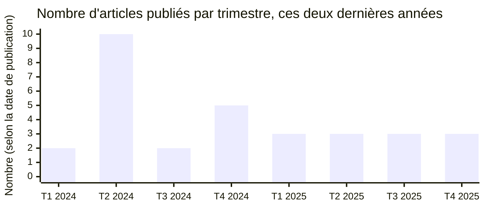
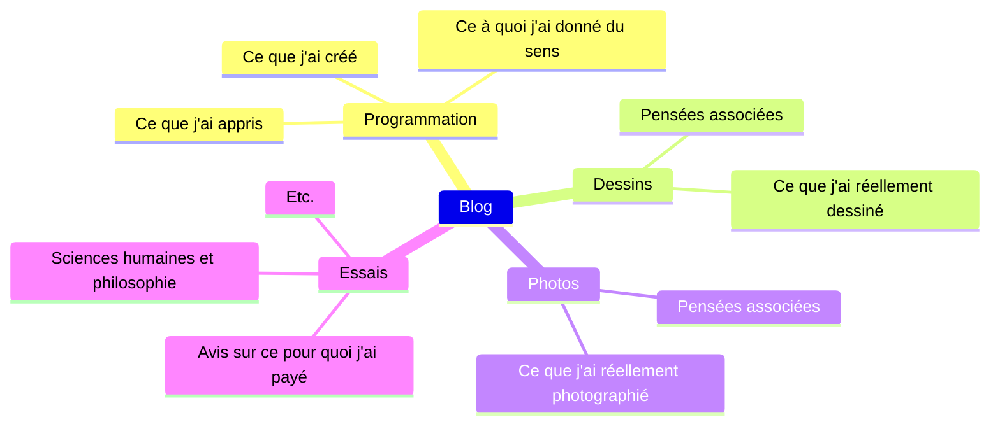

## **Pourquoi j'ai commencé un blog**

À ce jour, j'ai écrit 42 articles en comptant celui-ci. En revenant au moment de la création du blog, l'impulsion initiale a été influencée par des facteurs externes. Voir d'autres blogs rassembler leurs études, diverses notes techniques, et leurs propres méthodes de résolution de problèmes en un seul endroit me semblait impressionnant, et naturellement, mon blog s'est orienté dans une direction technique. Cette tendance n'était pas mauvaise, donc je la maintiens encore aujourd'hui. Je continuerai à publier régulièrement des articles sur mes expériences en programmation et les difficultés rencontrées en cours de route.

Deuxièmement, je voulais un espace qui me décrive bien. À un moment donné, j'ai commencé à trouver difficile d'expliquer aux personnes que je rencontre pour la première fois quel genre de personne je suis. C'est dans le même esprit que j'ai choisi un blog plutôt que les réseaux sociaux couramment utilisés comme X, Threads, Facebook ou Instagram. Les réseaux sociaux sont avantageux pour diffuser du contenu léger, mais ils ne sont pas un bon environnement pour faire usage de la raison, et ils ne permettent pas de décrire une personne avec sincérité.

Pour être honnête, j'atteins plutôt bien ces deux objectifs, et je ressens une petite surprise et une certaine émotion en relisant mes articles passés. Bien que cela demande beaucoup de temps et d'efforts, le fait de gérer ce blog est clairement une de mes qualités actuelles.

## **Bref historique jusqu'à présent**

### **Principes pour une écriture régulière**

Le nombre d'articles que j'ai écrits depuis l'année dernière, regroupés par bimestre, se présente comme ci-dessus. Depuis la création du blog, je me suis demandé à quelle fréquence je devais écrire. L'année dernière, je m'étais implicitement fixé un objectif d'un article toutes les deux semaines, et j'ai même écrit 4 à 5 articles par mois à certains moments. Mais j'ai dû trouver un compromis sur la fréquence de publication pour les raisons suivantes. Ce n'est pas parce qu'il y a beaucoup d'articles que le blog est plus riche. Plus la dépendance au blog augmente, plus il devient difficile de se concentrer sur sa vie réelle, et plus l'objectif de publication est élevé, plus il est difficile d'écrire des articles de qualité.

Depuis 2025, je maintiens une fréquence d'un article par mois, avec seulement une différence selon qu'il tombe en début ou en fin de mois. Ce n'est pas une règle absolue, mais après avoir maintenu ce rythme pendant environ un an, j'ai trouvé un bon équilibre entre une vie quotidienne chargée et le blog. Douze articles par an, ce n'est pas négligeable, et je pense que c'est un niveau tenable à long terme. Sauf circonstance particulière, les nouveaux articles continueront probablement à ce rythme à l'avenir.

### **Personnalisation continue du blog**

Peut-être parce que les fichiers de configuration du blog sont à portée de main, je modifie fréquemment la structure de la page à chaque fois que j'écris un article. J'avais déjà [effectué plusieurs modifications](https://hyngng.github.io/fr/blog/first-blog-customization/) par le passé, et je continue à les adapter à mes goûts. Un exemple récent : j'ai désactivé l'animation de transition entre les modes sombre et clair. Le thème ne propose pas d'option pour la désactiver, mais elle me dérangeait, alors j'ai cherché la propriété définissant l'effet de changement de thème, comme `id="post-preview"`, et l'ai remplacée par `transition: none !important`. La transition est désormais nette.

Ensuite, j'ai découvert un bug dans la version `v7.3.1` du thème : lorsque l'image de prévisualisation de la page d'accueil passait du LQIP à l'image originale, l'effet de flou ne se jouait pas. Après un long débogage, j'ai trouvé la solution et [j'ai soumis un problème](https://github.com/cotes2020/jekyll-theme-chirpy/issues/2537) sur le dépôt officiel. Environ deux semaines et demie plus tard, le développeur a confirmé le problème, un [nouveau commit intégrant ma perspective](https://github.com/cotes2020/jekyll-theme-chirpy/pull/2551) a été créé peu après, et la nouvelle version [v7.4.0](https://github.com/cotes2020/jekyll-theme-chirpy/blob/master/docs/CHANGELOG.md#740-2025-10-19) est sortie rapidement, corrigeant officiellement ce bug.

### **Digressions sur les moteurs de recherche**

J'ai déjà [écrit un article à ce sujet](https://hyngng.github.io/fr/blog/webmasters-and-seo/), donc considérez ceci comme une mise à jour. Tout d'abord, il faut être patient avec les outils pour webmasters. Vraiment très patient. Google Search Console, en particulier, peut prendre jusqu'à six mois après l'inscription pour une exposition normale dans les résultats de recherche, et même après un temps suffisant, si l'autorité de la page est faible, le comportement du crawler peut être considérablement réduit. Mon impression n'est peut-être pas exacte, mais j'ai eu le sentiment que l'autorité du domaine est bien plus importante pour l'indexation que la qualité de l'optimisation SEO.

Avec Bing, l'indexation a soudainement été annulée. Plus précisément, Bing classe les pages en « indexées », « erreur », « avertissement » et « exclues » dans sa propre terminologie. Toutes les pages de mon blog ont été basculées en « exclues » et supprimées des résultats de recherche Bing. Comme il n'y avait aucun problème inhérent à la page (hébergement du site, `robots.txt`, etc.), j'ai [contacté l'équipe de support de Bing Webmaster Tools](https://www.bing.com/webmasters/support) le 13 août. J'ai reçu un email de réponse le 30 août disant : « We have reviewed your site and sent it to our Product Review group for further assessment. » Puis le 3 octobre : « I am happy to inform you that the issue related to your site has been resolved. » Bien qu'il ait fallu environ un mois et demi, l'indexation a été presque entièrement restaurée et l'exposition dans les résultats de recherche fonctionne bien maintenant.

## **Principes personnels d'écriture**

### **Nature hétéroclite du blog**

Au moment où j'écris, les sujets abordés sur le blog se résument à peu près comme ci-dessus. C'est assez varié — ce qui peut être considéré comme une richesse ou, négativement, comme un manque de cohérence. Mélanger de nombreux sujets est effectivement désavantageux du point de vue du SEO, mais je continue à écrire sur des sujets variés pour une bonne raison. Le principe est le suivant : un blog est un espace personnel pour écrire librement, et je ne devrais pas avoir à me soucier du regard des autres sur ma propre page. Si mes centres d'intérêt sont réellement répartis sur plusieurs domaines, il est naturel que mes articles le soient aussi.

C'est peut-être un peu critique, mais gérer son blog en fonction des préférences des autres — par exemple, en suivant les sujets tendance sur les réseaux sociaux ou les thèmes à forte valeur publicitaire — finit par vider le blog de son sens à long terme. Après tout, au moment où l'on écrit, on devient en partie un auteur au sens littéral du terme. Il est donc nécessaire de donner la priorité à la subjectivité de l'écrivain par rapport aux goûts du lecteur, dans une proportion de 51:49 environ. Ce site ayant pour but de créer un espace qui me décrit bien, aborder plusieurs sujets est intentionnel dans ce contexte.

### **Division délibérée du style d'écriture**

Au début, j'écrivais à la première personne informelle, puis j'ai essayé le style formel en pensant aux lecteurs potentiels. En changeant de style, j'ai trouvé les deux assez maladroits, jusqu'au jour où j'ai découvert que la critique de cinéma Kim Hyeri, que j'apprécie, utilisait librement différents styles d'écriture selon les cas. L'idée que chaque œuvre a sa propre forme appropriée, et la philosophie selon laquelle cette idée mérite d'être mise en pratique, m'ont convaincu et j'ai voulu l'adopter.

N'ayant jamais essayé cela auparavant, c'est un peu un pari de voir comment les autres le percevront. Mais dans [des articles récents comme celui-ci](https://hyngng.github.io/posts/finding-camus-in-goryeo-history/), j'utilise timidement des terminaisons de phrases différentes des autres articles. Cela rend l'écriture un peu plus sincère, et le processus d'écriture lui-même devient plus intéressant, ce qui me donne une bonne impression. À l'avenir, pour la rédaction d'articles, j'aimerais chercher la diversité plutôt que l'uniformité — au-delà des terminaisons de phrases, dans la composition des paragraphes, la longueur, le point de vue narratif, etc. — et essayer d'écrire quelque chose d'original autant que possible.

### **Choix d'expressions non hiérarchiques**

Comme lorsque je réfléchis aux noms de variables en programmation, je pèse souvent différentes expressions quand j'écris. Pour moi, le critère d'une bonne expression n'est pas la sophistication rhétorique mais la clarté du sens — c'est-à-dire la capacité à réduire le degré d'abstraction du contexte — et j'essaie d'appliquer ce critère avec sérieux. Même dans les phrases déjà écrites, je trouve des points qui me déplaisent avec le temps. Je repère et corrige donc les expressions creuses, les traductions littérales qui nuisent à la transmission du sens, et plus minutieusement, les phrases proches du style prolixe.

Dans le même ordre d'idées, je suis conscient de la hiérarchie linguistique dans le choix des mots. Je privilégie autant que possible les mots coréens natifs, et j'utilise des mots sino-coréens ou des emprunts étrangers en fonction des besoins. L'argument est simple : les mots natifs appartiennent à un classique éprouvé, tandis que les emprunts étrangers risquent de n'être qu'une mode passagère. Sans être dogmatique, il est important de choisir l'expression qui transmet le sens le plus précisément possible à chaque occasion. Cependant, un texte où la part des emprunts étrangers est élevée peut donner l'impression d'exhiber son expertise. J'évite donc délibérément les emprunts quand ils ne sont pas plus précis que les mots natifs. Quand une expression technique est nécessaire, je réfléchis d'abord à s'il ne vaudrait pas mieux l'expliquer en langage courant.

### **Respect du lecteur, rythme lent**

J'évite le gras. Le gras a l'avantage de clarifier la transmission du sens, mais son effet se réalise commodément par un accent visuel. Cela a pour effet secondaire de donner une priorité excessive à la subjectivité de l'auteur. Il y a bien sûr des contextes où c'est nécessaire : les affiches de films ou les publicités de produits, par exemple, qui ont un caractère commercial. Mais dans un environnement à forte composante archivistique comme celui-ci, il est préférable que l'auteur s'efforce poliment de construire une argumentation convaincante. C'est pour des raisons similaires que j'utilise un minimum d'effets de style (italique, barré) que permet la syntaxe Markdown.

De même, j'adopte des articles à long souffle. J'évite l'habitude d'écrire des textes courts, et quand j'ai de nouvelles informations à inclure, je les ajoute à un article existant plutôt que d'en faire un nouvel article indépendant. C'est contraire à la tendance actuelle où le contenu court et percutant, centré sur le mobile, est efficace. Si j'accepte ce désavantage en connaissance de cause, c'est parce que je souhaite que les textes que j'écris aujourd'hui restent de bons articles, non éphémères, dans le futur.

### **Approche conservatrice de l'IA**

Contrairement au code, pour l'écriture, je m'en tiens autant que possible à une méthode traditionnelle, sans l'aide de services d'IA générative comme ChatGPT, Gemini ou Claude. Si j'écris, c'est pour la révision, l'amélioration de mes compétences et l'attachement ; confier l'écriture à autrui n'aurait pas de sens. Si je maîtrise suffisamment un sujet, je peux écrire un article de qualité sans aide extérieure ; sinon, je pense qu'il faut d'abord se familiariser avec le sujet. Cependant, je n'exclus pas complètement l'IA ; je réfléchis à des utilisations saines de l'IA générative. Par exemple, je l'utilise récemment pour comparer et analyser mon brouillon avec des articles que j'ai lus avec intérêt, ou pour vérifier certaines expressions.

Les réponses des modèles récents comme ChatGPT 5 ou Claude 4.5 sont suffisamment pertinentes pour être consultées. Gemini 2.5 Pro, en particulier, me donne souvent l'impression d'avoir une grande maîtrise de la langue depuis sa sortie. Il présente bien l'impression générale d'un texte, ses problèmes, des alternatives pour certains mots, des versions raccourcies ou développées de phrases. Associé à un bon dictionnaire de langue, il est excellent pour la révision. Cependant, les hallucinations restent un sujet de grande vigilance. Les modèles les plus récents ont tendance à présenter des concepts erronés dans des domaines de niche. Je consulte donc les lignes directrices officielles, ou plus rarement des livres ou quelques articles universitaires, avant de les intégrer dans mes écrits.

## **Je continue l'activité**

Lors de la création du blog, j'avais beaucoup de sujets intéressants qui auraient pu enrichir le blog : les théories de base des relations internationales comme le réalisme politique et l'idéalisme politique, la famille des langues indo-européennes et la typologie linguistique, les similitudes entre l'écriture mongole et l'écriture mandchoue, les origines des prononciations sinocoréennes modernes, des histoires de dessins entrelacés avec le développement rapide de l'IA, ou encore les limites physiques des capteurs d'image CMOS et les stratégies pour les surmonter. Avec le recul, c'est dommage que je n'aie pas publié d'articles sur ces sujets faute de temps, mais mon intérêt pour eux reste constant. Il est probable qu'un jour je publie des articles sur des thèmes similaires.

On dit aussi que l'essor récent de l'IA réduit l'activité de recherche sur Internet et que les blogs traditionnels sont finis. En effet, la coopération mutuelle avec les moteurs de recherche s'affaiblit et les revenus publicitaires diminuent, ce qui fait perdre leur motivation à pas mal de personnes pour gérer leur blog. Il est acquis que mon blog sera également plus difficile à découvrir, étant donné ces nombreux indicateurs. Mais dans mon cas, l'objectif premier étant l'autoconsommation plutôt que le partage d'informations, je pense pouvoir poursuivre mon activité sans grand changement.

J'ai lu quelque part que très peu de blogs durent plus d'un an. Si c'est vrai, je suis maintenant dans ma troisième année et bientôt ma quatrième, ce qui signifie que j'ai franchi le premier obstacle depuis longtemps. Personnellement, j'aimerais continuer à gérer ce blog encore longtemps.
