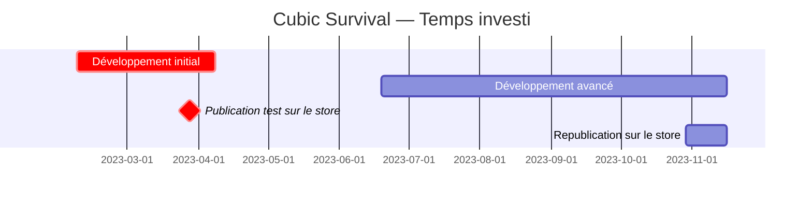

---
image:
    path: /2023-12-22-palette-first-devlog/gameplay.webp
    lqip: data:image/webp;base64,UklGRrYAAABXRUJQVlA4TKoAAAAvD8ABAHW4jWxbbfp4JJmZmSml0LH7L0Mq4pgVtG3DuOOPdQge4zaSFHVVH9P78o+T+j8BbhLNGhMUUL7GTwDFP6j3DTiLqMug0k4+RlwpOQFUC2jKxL/yzX0tKUApmm8sxu7n4LvlOeUbSBnGjBjAWUR/xmX1IQt/X/KSXVS1BnsLKLMeGqGJGl7KM5cUhbtrZyZYxL+CgfcTwNUUcJMaRE0DKQrAqa8oAA==
    alt: Gameplay d'exemple
    
title: "'Cubic Survival', conception et développement"
authors: ["dev"]

categories: [마일스톤, 게임 개발]
tags: [마일스톤, 게임 개발, 유니티, C#, URP, 큐빅 서바이벌, 기획, 개발일지]
start_with_ads: true

toc: true
toc_sticky: true

date: 2023-12-20 19:18:00 +0900
last_modified_at: 2023-12-22 20:42:00 +0900

mermaid: true
lang: fr
---

## **Créer un jeu**

Au Nouvel An 2023, je devais trouver quelque chose à faire. Je voulais créer quelque chose qui m'aiderait à améliorer mes compétences en programmation tout en restant amusant. Après le carillon de minuit, le lendemain, j'ai établi quelques plans.

En réfléchissant à quelques idées, j'avais une bibliothèque Python basée sur les 5W1H, une application photo de type mirrorless, et un jeu mobile 2D. Chacune découlait d'[un programme Python](https://hyngng.github.io/posts/astp-devlog/), d'une simple application Android Studio, ou de [mon précédent projet Unity](https://hyngng.github.io/posts/lavad-devlog/).

Mais le développement de jeu avait l'air trop amusant. L'expérience passée avec Unity m'avait marqué, et l'idée de pouvoir utiliser mes propres assets maison me semblait passionnante. Même si c'était difficile, le thème de créer un programme avec mon propre matériau qu'on ne trouve nulle part ailleurs me semblait très attrayant. Comme je commençais à apprécier l'orienté objet, j'ai voulu utiliser un langage orienté objet correctement, et j'ai donc commencé à créer un jeu mobile 2D.

## **Aperçu du projet**



La période de développement étant divisée en phases initiale et avancée, je vais les passer en revue brièvement dans deux articles distincts. Ce post couvre donc le développement initial, surligné en rouge dans le diagramme ci-dessus.

Au départ, je voulais simplement survoler rapidement les caractéristiques de l'orienté objet, sans savoir que je m'attacherais autant à ce projet. Il n'y avait donc pas de plan ou d'objectif systématique ; tout au plus avais-je quelques souhaits assez abstraits comme ceux-ci.

- [x] Créer un design visuellement minimaliste.
- [x] Implémenter un mouvement de caméra fluide.
- [x] Appliquer efficacement une conception orientée objet.
- [x] Utiliser des coroutines.

La période de développement étant longue, ces objectifs ont été atteints les uns après les autres. Les détails sur comment et où chacun a été réalisé étant longs à expliquer, je les aborderai en détail dans cet article et le suivant.

## **Développement initial**

{: w="960" }
*Au début, je pensais qu'un événement devrait se produire après avoir éliminé quelques ennemis*

J'ai commencé par du clone coding. L'idée était d'abord d'essayer de reproduire un jeu célèbre que je pourrais imiter à petite échelle.

J'ai d'abord consulté Brawl Stars, dont je gardais un bon souvenir d'y avoir joué avec des amis au lycée. Cependant, plutôt que de copier le système du jeu, il s'agissait surtout de comprendre ce qu'est une plateforme mobile 2D.

### **Joystick**

{: w="960" }

Je voulais implémenter un joystick typique des jeux mobiles 2D : un à gauche pour le déplacement du joueur, un à droite pour viser.

Pour le créer, j'ai utilisé la classe `OnScreenStick` du package `UnityEngine.InputSystem.OnScreen`, en créant deux scripts basés sur cette classe qui `Translate()` le joueur et un objet transparent de visée selon le déphasage. Comme il y avait peu de ressources coréennes sur le package `OnScreen`, j'ai beaucoup consulté la [documentation officielle](https://docs.unity3d.com/Packages/com.unity.inputsystem@1.7/api/UnityEngine.InputSystem.OnScreen.OnScreenStick.html?q=OnScreenStick).

En passant, j'avais beaucoup d'idées que j'aurais aimé implémenter : relier visuellement le stick et le point central via un LineRenderer, un retour élastique du stick vers le centre, ou des contrôles de joystick différents selon les armes. Mais mes compétences étaient insuffisantes à l'époque, et certaines idées entraient en conflit avec la structure du jeu. Je n'ai donc implémenté qu'un retour vibratoire à chaque pression et relâchement du joystick.

### **Apparition et comportement des ennemis**

{: w="960" }
```cs
void spawnEnemy(GameObject Enemy, float east, float west, float south, float north)
{
    float spawnPointX = Random.Range(west, east);
    float spawnPointY = Random.Range(south, north);

    instantiatedEnemy = Instantiate(
        enemy,
        player.transform.position + new Vector3(spawnPointX, spawnPointY),
        transform.rotation
    );
}

IEnumerator spawnEnemies()
{
    for (int i = 0; i < data.spawnCount; i++)
    {
        spawnEnemy(Enemy, east, west, south, north);
        yield return new WaitForSeconds(spawnDelay);
    }
}
```

Au début, j'avais créé un objet portail pour instancier les ennemis à des points définis, mais le résultat après apparition me semblait trop monotone. J'ai donc écrit le code ci-dessus pour que les ennemis apparaissent autour du joueur.

Les quatre paramètres `east`, `west`, `south`, `north` génèrent des coordonnées aléatoires à une certaine distance du joueur. Pour que les ennemis n'apparaissent pas soudainement autour du joueur, ces coordonnées sont spécialement traitées pour être en dehors de la zone rendue par l'écran.

Dans Unity, il n'existe pas de méthode simple comme `Delay()` pour introduire un délai ; la plupart des recommandations suggèrent d'utiliser des coroutines, ce qui a été ma première occasion d'en utiliser une. J'ai créé une coroutine qui spawn les ennemis à intervalles de `spawnDelay`.

```cs
void Move()
{
    dirTowardsPlayer = (player.transform.position - gameObject.transform.position).normalized;
    transform.Translate(dirTowardsPlayer * speed * Time.deltaTime);
}

void OnCollisionEnter2D(Collision2D collider)
{
    if (collider.gameObject.tag == "player")
    {
        player.hp -= damage;

        Vibration.Vibrate((long)20);
        Destroy(gameObject);
    }
}
```

Les ennemis se déplacent vers le joueur par défaut, et lors d'une collision avec le joueur, ils réduisent ses PV de `damage` avec un retour vibratoire, puis sont détruits via `Destroy()`.

### **Inventaire et objets**

Alors que la structure du jeu prenait forme, j'ai pensé qu'un inventaire pour stocker des objets et les utiliser plus tard serait utile. C'est une question sur laquelle j'ai beaucoup réfléchi : dans de nombreux jeux, l'interface d'inventaire se présente soit comme une fenêtre séparée, soit comme un bouton à bascule sans vraie interface. Les deux ne me satisfaisaient pas.

J'ai plutôt visé un inventaire capable de contenir plusieurs objets sans nuire à l'expérience de jeu. J'ai donc remplacé la visée manuelle assignée au joystick droit par un auto-aim, et j'y ai assigné une nouvelle fonction d'accès à l'inventaire. Maintenir le joystick droit enfoncé ouvre l'inventaire ; relâcher le doigt le ferme.

{: w="960" }
```cs
public struct InventoryData
{
    public string[]     Code;
    public GameObject[] UI;
    public GameObject[] ItemUI;
    public GameObject   Weapon;
    public int[]        Rounds;
}

for (int i = 0; i < InventoryData.InventoryUI.Length; i++)
    InventoryData.UI[i].transform.position = Vector3.Lerp(currentPos, targetPos[i], 2*t);
```

L'inventaire utilise 8 objets qui se déploient autour du joueur lors de l'accès. Pour centraliser les données nécessaires (identifiants d'objets, objets d'inventaire, objets d'items, données d'armes, munitions, etc.), j'ai créé la structure ci-dessus.

Les objets sont divisés en deux : un objet destiné à apparaître sur le terrain et un autre servant d'interface UI. Lorsque le joueur ramasse un objet sur le terrain, l'objet UI correspondant est ajouté au tableau `ItemUI`.

|Objet|ID|
|---|---|
|Pistolet|WPPSTL|
|Fusil à pompe|WPPASG|
|Minigun|WPMING|
|Passif de vitesse de déplacement|PVMSPD|
|Passif de vitesse d'attaque|PVATKR|
|...|...|

Les identifiants d'objets sont composés de 2 caractères indiquant le type suivis de 4 caractères pour le nom de l'objet. Ce qui était amusant, c'est que sur le moment, je ne m'en rendais pas compte, mais à mesure que les objets s'accumulaient, l'idée de créer des codes uniques pour les distinguer m'est venue naturellement — ce que j'ai découvert plus tard être le concept d'"identifiant". C'était assez utile, et je compte continuer à l'utiliser.

### **Tir d'armes**

{: w="960" }
```cs
if (shotTimer > fireThreshold)
{
    for (int i = 0; i < bulletCount; i++)
    {
        instantBullet = Instantiate(
            bullet,
            FirePosition.transform.position,
            Quaternion.Euler(
                0, 0, transform.rotation.eulerAngles.z + Random.Range(MOA * -1, MOA) + 180
            )
        );
        Destroy(instantBullet, 1);
    }
}

shotTimer += Time.deltaTime;
```
```cs
void hasHitEnemy()
{
    hit = Physics2D.Raycast(transform.position, transform.right, 100);

    if (hit.collider != null && hit.distance < 1)
    {
        if (hit.collider.gameObject.tag == "enemy")
        {
            if (hit.collider.GetComponent<Enemy>().HP > 0)
                Destroy(gameObject);
            /* ... */
        }
    }
}
```

Les balles sont générées depuis l'objet enfant `FirePosition` de l'arme, avancent en ligne droite dans la direction visée par le joueur, puis disparaissent après 1 seconde. Pour implémenter la dispersion des tirs, la valeur Z de l'angle est légèrement ajustée avec `Random.Range()` dans la limite de la variable `MOA` définie par arme lors de la génération de la balle.

La détection de collision utilisait un raycast. Cependant, la vitesse des balles étant trop élevée, la détection par raycast ne fonctionnait pas correctement et les balles traversaient les ennemis. Augmenter la longueur du Ray ou élargir la plage du Collider n'a pas résolu le problème, mais l'ajout de la condition `hit.distance < 1` a permis de le résoudre.

Après avoir tout implémenté, j'ai découvert qu'il existe une technique d'optimisation appelée object pooling pour les cas d'instanciation fréquente comme le tir de balles. Je compte l'appliquer plus tard quand j'aurai le temps.

## **Conception de l'expérience utilisateur**

Alors que la section précédente portait sur "créer un jeu d'action où l'on se déplace sur le terrain pour éliminer des ennemis", celle-ci concerne "implémenter une expérience utilisateur fluide et originale". La plupart des travaux visuels sérieux ayant eu lieu en phase de développement avancé, je les aborderai dans le prochain article.

### **Caméra**

{: w="960" }
```cs
void Move()
{
    transform.position = Vector3.Lerp(
        transform.position,
        player.transform.position,
        Time.deltaTime * moveSpeed
    );
}

void Vignette()
{
    targetVignetteValue = inventoryIsOpen ? 0.35f : 0f;

    vignette.intensity.value  = Mathf.Lerp(
        vignette.intensity.value,
        targetVignetteValue,
        Time.deltaTime * vignetteSpeed
    );
}
```

Il y a une option appelée vignettage que j'observe attentivement en [retouchant des photos](https://hyngng.github.io/posts/photos-of-imin/). Cette fonction assombrit les bords de l'écran pour concentrer le regard au centre. Le [post-processing](https://docs.unity3d.com/kr/2020.3/Manual/PostProcessingOverview.html) d'Unity ayant la même option, j'ai pensé qu'il serait parfait de l'appliquer à l'ouverture de l'inventaire.

J'ai donc fait en sorte que la valeur du vignettage passe à environ 0,35 lors de l'accès à l'inventaire. Comme pour le mouvement de la caméra, le vignettage est géré en douceur avec Lerp. Pendant le développement, trouver les bonnes valeurs pour `vignetteSpeed`, `moveSpeed` et autres paramètres était difficile. Je jouais, ajustais, rejouais, réajustais, et quand je n'étais pas satisfait en travaillant sur d'autres parties, je revenais modifier — j'ai cherché la bonne valeur tout au long du développement.

### **URP**

{: w="960" }
*Chaque fois qu'une arme tire, une ombre se projette derrière l'ennemi.*

Au début, j'utilisais tant bien que mal les effets de lumière de base d'Unity 2D, mais il y avait des insatisfactions à plusieurs endroits. En appliquant [URP (Universal Render Pipeline)](https://unity.com/srp/universal-render-pipeline) comme alternative, le rendu visuel s'est nettement amélioré. Il offre des effets lumineux agréables et doux par défaut, tout en permettant de régler l'option Falloff Strength pour créer une lumière plus subtile ou éclatante, ou d'utiliser l'option Shadows pour des effets de lumière et d'ombre comme ci-dessus — vraiment utile.

Cependant, en ajoutant Light2D à chaque balle ou ennemi, le téléphone chauffait rapidement. Cela semblait consommer pas mal de ressources GPU, donc je n'ai pas pu l'utiliser activement, ne le gardant que pour enrichir l'effet de flamme lors des tirs.

## **Conclusion**

J'ai brièvement résumé les activités de développement initial. En écrivant, je réalise que je ne me souviens pas très bien de ce que j'ai ressenti pendant cette période. N'ayant pas pu capturer toutes mes pensées et mes efforts, j'essaierai de prendre des notes plus souvent au cours du développement.

Malgré tout, en implémentant diverses choses moi-même, j'ai découvert que créer un jeu est bien plus complexe que je ne le pensais. En particulier, les autres jeux qui ne suivent pas les tendances populaires mais cherchent de nouveaux paradigmes, et qui les implémentent avec succès, sont vraiment impressionnants. Et personnellement, en tant que quelqu'un qui trouve cela admirable, cela m'a un peu donné envie.
