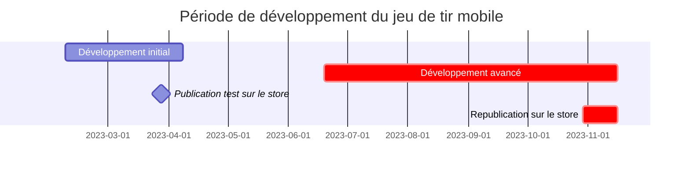
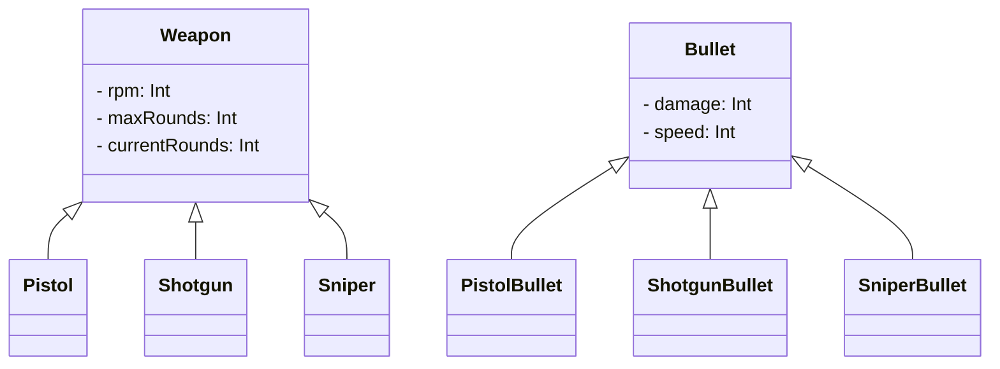

---
image:
    path: /2023-12-24-palette-second-devlog/gameplay.webp
    lqip: data:image/webp;base64,UklGRp4AAABXRUJQVlA4TJIAAAAvD8ABAHW4jW07cZZZFK05opg5dwVuh0KP63YPX9K8r/lX2LZtQ/9/b7pH/6uQQTkldeJfaiu1Vm5md+y6VXAnB01t6GKRzP0ax2haSBXAIpUOphDguA1NYDEqXRj3wIgpeMdtNWAhXjfv2IdZJp2CutpKacCzQSqv6wO8mG9t+BciZqCmJINcWYVt8M57GziHAA==
    alt: Gameplay d'exemple
    
title: "'Cubic Survival', développement et lancement"
authors: ["dev"]

categories: [마일스톤, 게임 개발]
tags: [마일스톤, 게임 개발, 유니티, C#, URP, 큐빅 서바이벌, 개발, 개발일지]
start_with_ads: true

toc: true
toc_sticky: true

date: 2023-12-22 22:38:00 +0900
last_modified_at: 2024-03-20 17:38:00 +0900

mermaid: true
lang: fr
---

## **Pourquoi j'ai repris le développement**

:::info
Cet article fait suite au [précédent](https://hyngng.github.io/posts/palette-first-devlog/).
:::



En mars, le nouveau semestre a commencé. Pendant environ le premier mois, j'ai continué à créer les systèmes de base du jeu comme l'inventaire du joueur, mais à l'approche des examens, le développement s'est interrompu sous la pression. Cependant, après les examens finaux de juin, j'ai retrouvé du temps libre et j'ai décidé de reprendre le jeu que j'avais commencé.

Pendant les deux mois de vacances d'été, je me suis fortement intéressé aux aspects visuels comme les assets image et les effets de particules. L'impression que le jeu s'améliorait efficacement, couplée à l'idée de créer une ambiance unique qu'on ne trouve nulle part ailleurs, me semblait très singulière. Cette expérience n'étant pas facile à vivre, j'ai tenté un pari un peu risqué au second semestre : suivre les cours et les examens correctement, mais investir autant de temps que possible dans le développement du jeu.

Ce post résume donc ce qui a été fait et comment sur toutes les autres parties durant cette période.

## **Création des armes**

### **Animation de tir** {#weapon-animation}


```cs
if (shotTimer > fireThreshold)
{
    WeaponAnimator.SetTrigger("Fire");
}

shotTimer += Time.deltaTime;
```

J'ai créé une animation de tir à l'aide du composant Animation d'Unity. Le composant Animation d'Unity permet non seulement l'animation cut traditionnelle par remplacement d'images de sprite, mais aussi l'animation en ajustant directement la position des objets enfants. J'ai utilisé les deux types de manière appropriée pour que l'animation de recul correspondante soit jouée lors du tir.

L'effet de flamme devant le canon a été flouté sur l'image elle-même, puis j'ai exagéré la taille du sprite et ajouté l'effet lumineux d'URP et l'effet Bloom du post-processing pour réduire l'aspect terne et créer un effet accrocheur et flamboyant.

{: w="480" }
{: w="480" }

Les images composant l'effet d'animation de flamme ont été créées avec la fonction d'animation de Clip Studio. Créer des sprites d'animation soi-même étant un travail numérique fastidieux, j'ai envisagé d'utiliser les assets officiels d'Unity, mais aucun n'avait le rendu que je voulais, donc je les ai dessinés moi-même. En les créant, j'ai lentement étudié [d'autres animations de tir](https://www.youtube.com/watch?v=kAafHZcT2fc) image par image pour obtenir le rendu souhaité.


Pour atténuer le côté artificiel du changement d'objet d'arme, j'ai également créé une animation de vérification de chambre spécifique à chaque arme, jouée uniquement lors du changement ou de l'obtention d'une nouvelle arme. Un léger délai est imposé aux contrôles du joueur pendant la manipulation de l'arme, ce qui rend l'expérience de jeu beaucoup plus organique et satisfaisante.

### **Effet de hit sur les ennemis**


```cs
public void Hit()
{
    ParticleSystem hitEnemyParticle = hit.collider.GetComponent<ParticleSystem>();
    hitEnemyParticle.Emit(particleNumber);
}
```

L'effet de hit a été créé avec le système de particules. Au début, je l'avais simplement implémenté avec des particules se déplaçant dans des directions aléatoires en ralentissant progressivement, mais le résultat était étrange, ce qui m'a posé problème.

La solution est venue un peu par hasard : en réglant la vitesse linéaire et la vitesse orbitale sur "Random between two curves" dans le module Velocity over Lifetime, puis en tordant deux fois la courbe, j'ai obtenu un effet de poussière qui s'élève, que j'ai adopté. Le rendu est correct et l'impact semble plutôt bon.

### **Système de munitions**


```cs
public virtual void Update()
{
    if (roundsCurrent > 0)
        Fire();
    else if (!WeaponAnimationInfo.IsTag("Weapon_Reload"))
        WeaponAnimator.SetTrigger("RoundIsEmpty");
    else
        roundsCurrent = roundsMax;
}

public virtual void Fire()
{
    if      (currentRounds == 1) WeaponAnimator.SetTrigger("FiredLastRound");
    else if (currentRounds > 0)  WeaponAnimator.SetTrigger("Fired");

    roundsCurrent -= 1;
}
```

J'ai créé un système d'affichage des balles restantes. Quand les balles atteignent zéro, l'animation de rechargement est jouée, et à la fin de celle-ci, les munitions reviennent à la valeur maximale définie sur l'objet de l'arme. Comme pour les PV du joueur, l'interface des munitions est affichée simplement sous forme d'objet de jeu au-dessus de la tête du joueur.

J'ai aussi ajouté un petit détail : si l'arme est changée avant la fin de l'animation de rechargement, une animation `GainedEmpty` distincte de l'animation `Gained` est jouée lorsqu'on reprend cette arme plus tard. La différence est que `GainedEmpty` commence le rechargement avec la culasse bloquée en position arrière, laissant la chambre visible. J'ai repris cela après l'avoir vu implémenté dans de nombreux FPS.

### **Effet de dégâts**


L'effet de dégâts lui-même avait été implémenté lors du développement initial, mais comme son comportement était codé plutôt qu'avec un composant Animation et que son rendu visuel laissait à désirer, je l'ai refait. Au lieu de simplement disparaître en devenant transparent, j'ai rendu la taille et la vitesse de déplacement de l'effet dynamiques.

En le créant, j'ai aussi implémenté un système de critique : quand les dégâts doublent de manière probabiliste, une animation spécifique est jouée. L'animation se distingue de l'animation de dégâts normaux par sa taille et sa couleur, pour signaler facilement qu'un coup critique a été infligé.

### **Diversification des armes**


```cs
public abstract class Weapon : MonoBehaviour
{
    protected int   RPM;
    protected int   maxRounds, currentRounds;

    public virtual void Awake()
    {
        /* ... */
    }
}
```
```cs
public class Pistol : Weapon
{
    public override void Awake()
    {
        base.Awake();
        
        maxRounds     = 10;
        rotationSpeed = 40;
    }
}
```

Au départ, je n'avais pas prévu de créer principalement des fusils, mais en réutilisant ce que j'avais fait au début, j'ai fini par en faire plusieurs, surtout des armes à feu. En les créant, j'ai été attentif au polymorphisme de la programmation orientée objet : j'ai écrit les éléments de base comme `RPM`, `maxRounds`, `currentRounds` dans la classe parente `Weapon.cs`, et des classes d'armes spécifiques comme `Minigun.cs`, `Shotgun.cs`, `SMG.cs` l'héritent.

C'était ma première utilisation de l'héritage, et le travail était nettement plus efficace qu'avant. L'idée de centraliser le code répété à un niveau bas pour l'appeler dans le code terminal était très différente de l'utilisation d'une bibliothèque, ce qui m'a paru à la fois étrange et fascinant.

## **Création d'animations**

### **Déplacement du joueur**


Utiliser la forme rectangulaire de base fournie par Unity comme joueur me semblait trop négligé, j'ai donc ajouté un corps et des jambes en mouvement. Selon que le joueur tire le joystick à fond ou non, l'animation de marche ou de course est jouée de manière appropriée.

Pour réduire l'aspect artificiel de l'animation, la vitesse de lecture de l'animation de marche varie dynamiquement selon la force de traction du joystick, et j'ai ajouté la possibilité pour le joueur de marcher en arrière selon la direction de visée. Par exemple, si le joueur marche vers la gauche mais que l'ennemi est à droite, le joueur recule lentement en visant l'ennemi. Résultat : le mouvement semble assez naturel, pas artificiel.

### **Système d'EXP**


Pour atténuer un peu l'ennui pendant le jeu, j'ai créé un système d'EXP. En éliminant des ennemis, le joueur gagne de l'EXP. Quand l'EXP atteint un certain seuil, le niveau augmente, le joueur est renforcé, et le niveau accumulé s'affiche sous forme de score dans l'écran de fin de partie.

Au début, le joueur devait collecter directement les particules d'EXP, mais plus la partie avançait, plus l'écran devenait encombré par le nombre croissant d'ennemis. J'ai donc changé pour que l'EXP soit acquise immédiatement à l'élimination d'un ennemi. Après application, cette méthode est bien plus propre, au point de sembler standard.

### **Transition vers l'écran de jeu**


Personnellement, je préfère les transitions fluides entre les scènes plutôt que des coupures brusques, car cela donne l'impression d'être pris en charge par le programme. Je voulais appliquer cela à mon jeu aussi.

Ainsi, lorsque l'on appuie sur le bouton de jeu, la scène ne se contente pas de changer : le joueur apparaît d'abord à partir d'un objet de la même forme que le bouton, de taille identique. Lorsque le bouton est pressé, l'UI de la scène principale disparaît en douceur, et l'UI de la scène de jeu apparaît depuis les bords de l'écran. Bien qu'on y voie des défauts typiques d'un amateur, je suis un peu fier d'avoir créé une expérience unique qu'on ne trouve pas dans d'autres jeux.

## **Développement avancé : autres travaux**

### **Assets image**


*Dessiné sur Galaxy Tab*

Comme [expliqué précédemment](#weapon-animation), tous les assets image ont été créés maison sans utiliser l'Unity Asset Store. Après avoir d'abord dessiné les armes en pixel art, le rendu n'étant pas artificiel, j'ai également créé d'autres images comme les ennemis, les effets de hit, le joystick, la barre d'EXP en pixel art. Le pixel art étant peu contraignant à dessiner, j'étais assez libre dans mon travail, pouvant créer plusieurs maquettes ou renouveler les images utilisées.

Je les ai principalement exportées depuis Clip Studio au format PNG avec fond transparent, découpées à la taille de chaque image, puis importées en tant que Sprite (2D and UI) avec le Filter Mode sur Point (no filter) et la Max Size adaptée à la résolution de l'image.

### **Caméra**

Grâce à [mon hobby photographique](https://hyngng.github.io/posts/photos-of-imin/), j'ai découvert qu'on pouvait exprimer beaucoup de choses avec l'angle de vue, et j'ai voulu l'appliquer à mon jeu. L'environnement 2D d'Unity affiche la scène en projection orthographique, donc le concept diffère, mais du point de vue abstrait de ce qui est inclus dans le cadre, j'ai estimé qu'il y avait aussi des considérations à prendre en compte en 2D.

<div class="row">
    <div class="col-md-6">
        
    </div>
    <div class="col-md-6">
        
    </div>
</div>

J'ai donc fait en sorte que la valeur `Camera.orthographicSize`, qui détermine le champ de vision de la caméra, puisse changer selon mes souhaits à différents moments. Par exemple, lors d'un rechargement ou au début d'une nouvelle partie, j'ai réduit l'angle de vue pour exprimer vulnérabilité et tension. En buildant une application de test et en jouant directement, j'ai constaté que l'intention était bien rendue et rendait le gameplay unique, ce qui m'a satisfait.

### **Audio**

{: .light .border }
{: .dark }
*Son de coup critique*

Gérer moi-même les éléments sonores comme la musique de fond et les effets sonores a été un peu déroutant. Contrairement au dessin ou au codage, je ne connaissais rien au domaine audio. Je ne savais pas où ni comment obtenir des fichiers audio, ni comment les éditer.

Finalement, après avoir cherché un peu partout, j'ai obtenu des fichiers audio gratuits depuis [Pixabay](https://pixabay.com/ko/sound-effects/) et [GDC Game Audio](https://sonniss.com/gameaudiogdc), puis je les ai édités avec [Audacity](https://www.audacityteam.org/) en réduisant le bruit ou en augmentant les graves selon les besoins.

Le résultat n'était pas mauvais, mais l'aspect sonore reste assez déconcertant. Si je devais refaire un jeu, je pense qu'il faudrait d'abord trouver les effets sonores et la musique de fond avant de commencer.

### **Publicité in-app**


```cs
void PlayerDied()
{
    ShowInterstitialAd();
}
```

C'est une fonctionnalité que j'ai implémentée assez tôt dans le développement avancé. Après avoir créé [un petit robot de trading automatique d'actions](https://hyngng.github.io/posts/astp-devlog/), je m'intéressais à l'utilisation de modules externes comme les API ou SDK, et par curiosité j'ai créé la fonction d'appel publicitaire. Lorsque le joueur meurt et passe à l'écran de fin, une interstitielle s'affiche entre-temps.

En suivant la [documentation officielle Google AdMob](https://developers.google.com/admob/unity/banner?hl=ko), le guide officiel étant très accessible, la création a été bien plus facile que prévu. Le résultat fonctionnait proprement, ce qui m'a étonné.

### **Achat in-app**

{: .light .border }
{: .dark }
```cs
void Purchase()
{
    if (playerDonateKimbab)
    {
        DonateKimbab();
        playerDonateKimbab = false;
    }
}
```

Je voulais aussi implémenter l'achat in-app dans le même esprit. Cependant, comme il n'y a ni monnaie ni objet in-game, j'en ai fait une forme de don. J'ai conçu trois aliments (kimbab, poulet épicé, steak), enregistré les produits in-app dans la Google Console, et configuré le paiement sans récompense dans le jeu.

Pendant l'implémentation, on m'a dit qu'il fallait faire attention à la sécurité pour les achats in-app. Ce projet étant un toy project sans but lucratif, ce n'était pas très grave, mais si je devais implémenter des achats in-app à l'avenir, je ferai plus attention.

## **Publication sur le store**

### **Préparation**

{: .light .border .w-25 }
{: .dark .w-25 }
*Logo de l'application*

Pour l'uniformité, le logo de l'application reprend la même image que le bouton de jeu. La publication sur le store avait une signification plutôt symbolique pour ce projet — je ne cherchais pas à attirer l'attention avec ce jeu — donc j'ai accepté le manque d'intuitivité. Le nom du package, `com.payang.palette`, vient du compte développeur et du nom informel du projet.

### **Publication sur le store**

{: .light .border w="960" }
{: .dark w="960" }
*Formulaire d'informations de publication dans la Google Console*

La publication s'est limitée au Play Store, via la Google Console. En fait, j'avais déjà publié une fois [en phase de développement initial](https://hyngng.github.io/posts/palette-first-devlog/), par curiosité pour voir si mon application serait vraiment mise en ligne. Après avoir confirmé la publication, j'avais immédiatement désactivé l'application.

Six mois plus tard, l'investissement de temps dans ce projet commençait à peser, et la qualité du jeu était devenue assez présentable. J'ai donc décidé de mettre à jour l'application et de la réactiver. Pour la publication, j'ai réécrit le nom et la description de l'application, et mis à jour l'icône, les images graphiques et les captures d'écran.

{: .light .border w="960" }
{: .dark w="960" }
*Le jeu affiché sur Google Play Store*

Finalement, l'application est réactivée et disponible en téléchargement. Une semaine environ après la réactivation, elle apparaît sans problème lorsqu'on recherche son titre.

### **Promotion et retours**

Honnêtement, j'aurais honte d'appeler ça une activité promotionnelle digne de ce nom. Je n'avais jamais pensé à faire de la publicité auparavant, donc c'était difficile, mais comme il s'agissait d'un "jeu", j'espérais que des gens y joueraient. J'ai donc commencé à chercher où et comment promouvoir.

Cependant, ce jeu étant plus un toy project qui a pris de l'ampleur par intérêt qu'un jeu conçu pour être joué dès le départ, je me demandais si le promouvoir était approprié. Le développement était amusant, mais la promotion était un autre problème — j'étais gêné à l'idée de faire connaître ce que j'avais créé.

{: .light .border w="960" }
{: .dark w="960" }

J'ai quand même pris mon courage et posté un court message sur le [subreddit Unity2D](https://www.reddit.com/r/Unity2D/comments/17p1toj/my_first_game_is_now_on_google_play_what_do_you/). Je l'ai posté en espérant qu'au moins une centaine de personnes le verraient, mais en une semaine les vues ont dépassé 20 000, et après un mois, près de 100 000 personnes s'y étaient intéressées — j'étais vraiment surpris.

{: .light .border w="960" }
{: .dark w="960" }

Certaines personnes, vraiment reconnaissantes, ont même joué et laissé des retours détaillés. Les retours portaient notamment sur : "la position du joystick est fixe et non personnalisable, ce qui est inconfortable", "le Bloom est excessif", "le jeu ressemble à d'autres jeux".

Je comprends certains de ces retours, mais je ne souhaite pas poursuivre le développement pour l'instant. Je les prendrai en compte plus tard, quand j'aurai du temps, ou dans un prochain projet.

## **Conclusion**

:::tip
Vous pouvez télécharger et jouer au jeu sur le [Play Store](https://play.google.com/store/apps/details?id=com.payang.palette&hl=ko-KR).
:::

Ainsi s'achève ce projet auquel j'ai consacré beaucoup de temps et d'attention. Après environ six mois à y travailler, voir l'application listée sur le store m'inspire diverses réflexions, mais trois choses m'ont particulièrement marqué.

- Créer des animations est amusant et gratifiant, mais cela demande énormément de temps car tout doit être fait à la main. À moins d'être un animateur professionnel, créer l'animation souhaitée nécessite une bonne préparation mentale, et créer des animations dédiées pour chaque objet est inefficace. Il serait plus efficace de faire partager la même animation à plusieurs objets.

- Créer un projet de manière improvisée, bottom-up, sans planification, peut être amusant dans un petit contexte, mais a clairement ses limites. Le flux de développement était souvent interrompu, le flux de création d'animations aussi, et quand je n'étais pas satisfait, je devais annuler ou supprimer le travail accompli pour recommencer.  
J'ai donc constamment regretté qu'une planification minutieuse initiale aurait pu éviter ces inefficacités. La prochaine fois, je m'efforcerai de bien planifier au départ.

- Enfin, la gestion du temps. Ce projet était initialement prévu pour les vacances d'hiver, pour durer au maximum un mois. Mais il est devenu tellement amusant qu'il est devenu un projet de vacances d'été, et a failli devenir un projet des vacances d'hiver suivantes.  
À faire du développement en parallèle des cours, le jeu était si amusant que les études sont passées au second plan psychologiquement. Cela a naturellement affecté mes notes, et je regrette de ne pas avoir bien géré mon temps.

Malgré tout, l'expérience de création a été trop amusante et gratifiante pour que je ne crée pas un prochain jalon avec Unity, en corrigeant les défauts. J'ai envie d'appliquer de nouveaux conseils et patterns appris en cours de route, et si le premier pas a été difficile, le second ne devrait pas l'être. Mais si je m'y remets, je veux faire évoluer le jeu d'un cran avec un plan et une préparation plus systématiques.
