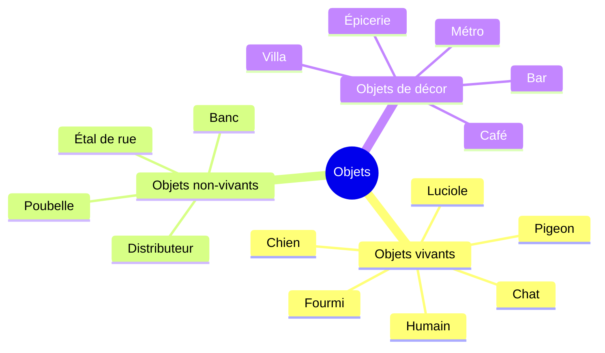
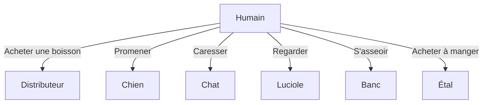
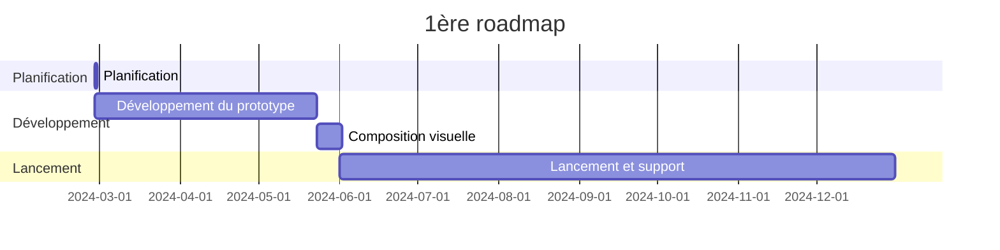

---
image:
    path: /2024-03-22-armonia-devlog-planning/preview-image.webp
    lqip: data:image/webp;base64,UklGRoAAAABXRUJQVlA4THMAAAAvD8ABAJUwiiRJkZtjZmbGF9s5Kyd1ScY8FbRt5MYA/F79RFEjSWpSxn2Zbw+m+z8BjqBzPlDmvL+4+00yVxL5ht9jZKHMSM22JRAbkUChuDviWIX4O+VnNh9jixzr0LjyndMjOUfNsQQDkKGXf/yfCzAGAA==
    alt: Dans cet esprit-là
    
title: "'Waybound', concevoir un jeu"
authors: ["dev"]

categories: [마일스톤, 게임 개발]
tags: [마일스톤, 게임 개발, 유니티, 행선지, 기획, 개발일지]
start_with_ads: true

toc: true
toc_sticky: true

date: 2024-03-22 19:24:00 +0900
last_modified_at: 2024-04-30 18:58:00 +0900

mermaid: true
lang: fr
---

## **Introduction**

Alors que j'étais sur le point de commencer un nouveau projet Unity après avoir terminé [l'expérience précédente](https://hyngng.github.io/posts/palette-developing/), j'ai revu un film apaisant vu il y a dix ans et j'ai réfléchi à l'influence des expériences. Une fois mes idées clarifiées, j'ai pensé que tout comme un bon film laisse une bonne expérience, je voulais créer quelque chose de similaire. J'avais aussi envie de créer et d'exprimer diverses choses, comme d'habitude.

{: .w-50 }
*Concept art sommaire et planification griffonnés avec un ami*

En me concentrant sur l'expérience, j'ai imaginé un environnement où les objets de la scène interagissent spontanément entre eux, même sans aucune action du joueur. Un jeu où l'on se contente d'observer et de se promener, sans score ni condition de fin.  
J'ai rapidement esquissé l'idée ci-dessus, et le rendu étant plutôt bon et les retours positifs, j'ai commencé à élaborer un plan sur cette base.

## **Planification**

Ce qui m'avait le plus manqué précédemment, c'était l'absence de planification. Sans indicateurs de référence ni plan à long terme, il était difficile de définir la direction du jeu à un niveau macro, et à un niveau micro, de penser à la rétention ou à la rentabilité. Cette fois, je voulais donc structurer un minimum la planification en amont.

En cherchant des concepts utiles pour la planification de jeu, j'ai découvert le GDD (Game Design Document). C'est une sorte de cahier des charges du jeu, sans format fixe. Je me suis référé au [modèle de GDD créé par Unity](https://connect-prd-cdn.unity.com/20201215/83f3733d-3146-42de-8a69-f461d6662eb1/Game-Design-Document-Template.pdf) pour ne décrire à l'avance que les parties nécessaires.

### **GDD simplifié**

- Description générale
	- Nom : Waybound (행선지)
	- Genre : Aventure side-scrolling
	- Format : Mobile 2.5D
- Gameplay
	- Le joueur devient une créature composant l'environnement (humain, chien, chat, fourmi, etc.) dans un cadre périurbain et effectue les interactions propres à cette créature. Par exemple, un humain sort une boisson d'un distributeur, un chien renifle l'odeur d'un banc.
	- Même sans contrôle particulier du joueur, les créatures interagissent entre elles et composent l'ambiance périurbaine, chaque créature ayant une personnalité visuelle dans une plage définie.
- Caractéristiques principales
	- Interactions variées entre objets
	- Images dessinées à la main et animation cut
	- Expérience changeante selon la météo (pluie, neige)

### **Exemples d'objets**

### **Exemples d'interactions**

## **Objectifs**

### **Objectifs techniques**

Jusqu'à présent, j'avais souvent des confusions dans la nomination des variables et des fonctions. N'ayant ni cohérence ni intuitivité, lire et modifier le code devenait de plus en plus pénible.

Puis je suis tombé sur un [article sur les conventions de nommage](https://unity.com/how-to/naming-and-code-style-tips-c-scripting-unity) sur le blog Unity, et j'ai été un peu choqué. Si j'avais su cela dès le début, j'aurais eu la vie bien plus facile. Finalement, j'ai pu comprendre clairement quand et comment utiliser les noms de variables et de fonctions en C#, et ce qu'il ne fallait pas faire.

En cherchant s'il y avait d'autres pratiques à connaître, j'ai découvert l'e-book ["Level up your code with game programming patterns"](https://blog.unity.com/games/level-up-your-code-with-game-programming-patterns) également publié par Unity. En le lisant attentivement, j'ai appris l'existence de diverses techniques applicables comme les principes SOLID, le pattern factory, le pattern state, etc. En explorant les patterns dérivés, j'ai trouvé des choses que je voulais essayer pour une conception de code plus systématique. Voici ce que j'ai retenu :

- PlasticSCM
- Programmation événementielle
- Animation procédurale
- Conventions de nommage strictes

Parmi eux, PlasticSCM est un système de contrôle de version (VCS) destiné à remplacer GitHub, que j'utiliserai pour sauvegarder mon travail de temps en temps pendant le développement. La programmation événementielle, les conventions de nommage sont au cœur des compétences de développement que je veux acquérir via ce projet. J'ai aussi des objectifs plus modestes comme mieux utiliser le pattern singleton, les coroutines, les delegates, les propriétés get/set, etc., qui ne me sont pas encore familiers.

### **Objectifs artistiques**

L'objectif fondamental est de décrire l'atmosphère quotidienne qui nous entoure, à travers l'expérience de traits et d'images en mouvement. J'aimerais exprimer ces choses d'une manière suffisamment visible mais non agressive. Si possible, je vise une mise en scène proche de l'expression vidéo, avec concrètement :

- Animation cut
- Profondeur de champ dynamique
- Courbes tonales

Globalement, j'aimerais créer un niveau où l'utilisateur trouve du plaisir même à simplement regarder l'écran du jeu sans rien faire. Cependant, je m'inquiète d'avoir ce niveau de compétence — notamment, j'ai entendu dire que dessiner les mouvements d'animaux comme les chiens, les chats et les pigeons en animation cut relève du domaine des animateurs professionnels. Je n'ai pas besoin d'une animation aussi précise, mais n'ayant ni connaissances de base ni expérience, il y aura probablement des essais et erreurs.

## **Roadmap**

