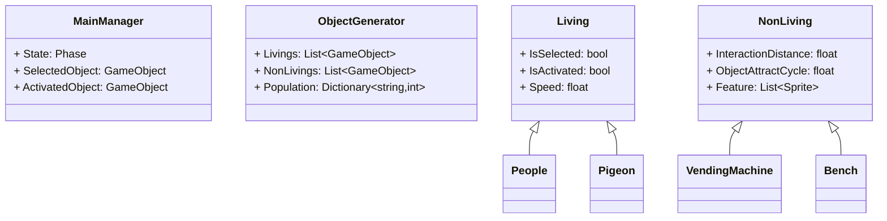
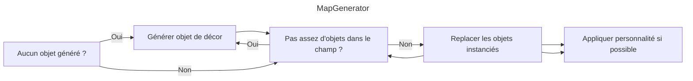
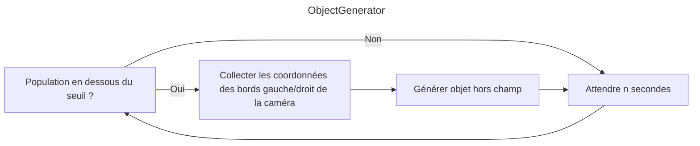
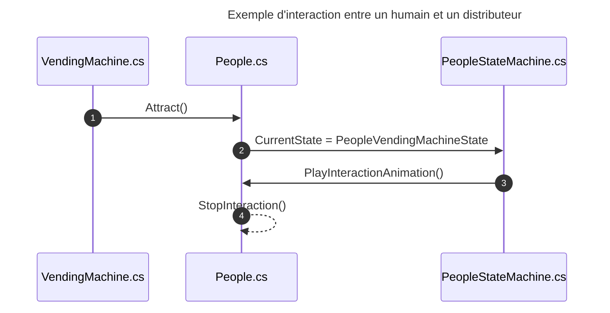
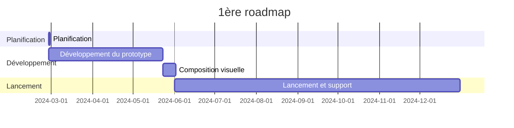

---
image:
    path: /2024-04-30-armonia-first-devlog/gameplay.webp
    lqip: data:image/webp;base64,UklGRiQBAABXRUJQVlA4TBgBAAAvD8ABAM1kRP9jE+UpQv/D4CCSJEXqOXpmBhts/1W8BGZa6B0bG44kyW2bnQUUHM7+//t8zQmA2wiMHEXSexc+ENN/QdRAxJC9WSlicZYaCiHEiBEEBULCMMoQhMMi0bv93TqZbAMSDEWRd+s75TKrKm4VicC+vLm9fnxs++PKnIq5yl2/HI/H7Znt/PFTbA+vP6RcraP+/u4u769YybUSgygQFMaTzCmCmruS9R8Wur+T874jmH1RRSUTIWlnwwMxK3/FTqFkkIRu7it/NDlMKxKqKhJtqW+MXnKWekjlKoNGylt4ripQbry6Ou5Me5Ctq6J0E8qGQe2+v3Tlrj/5bLz7VimPuFYRKZDFKkBIEQUROUhNEJEA
    alt: Prototype en développement
    
title: "'Waybound', premier rapport de développement intermédiaire"
authors: ["dev"]

categories: [마일스톤, 게임 개발]
tags: [마일스톤, 게임 개발, 유니티, C#, 행선지, 개발, 개발일지]
start_with_ads: true

toc: true

date: 2024-04-30 18:14:00 +0900
last_modified_at: 2024-05-23 23:11:00 +0900

mermaid: true
lang: fr
---

## **Introduction**

> Suite de [l'article précédent](https://hyngng.github.io/posts/armonia-devlog-planning/).

Voici le rapport de développement de [mon quatrième jalon](https://hyngng.github.io/categories/%EB%A7%88%EC%9D%BC%EC%8A%A4%ED%86%A4/) — un défi que je relève avec plaisir. J'avais besoin d'un point de contrôle à mi-parcours pour organiser mes notes, je résume donc ici ce que j'ai produit en environ un mois. Voici ce qui a été fait durant cette phase :

- Systèmes du jeu
	- [x] Déplacement fluide de la caméra par toucher
	- [x] Sélection, contrôle et interaction des objets à l'écran
	- [x] Garantir qu'un nombre limité d'objets est contrôlé
	- [x] Certains objets obtiennent une personnalité aléatoire dans une plage définie
	- [x] Les objets n'existent que dans le champ de la caméra

- Objets ajoutés
	- [x] 2 types d'objets vivants (humain, pigeon)
	- [x] 7 types d'objets de décor (maison, métro, etc.)
	- [x] 6 types d'objets de rue (borne incendie, plot, etc.)

## **Archive**

{: .w-75 }
_Quand l'humain a été implémenté. Le joueur peut devenir n'importe quel objet et interagir avec l'environnement._

## **Création d'assets**

### **Assets image**


_Images de décor dessinées_

Voulant créer un décor qui pourrait se trouver en banlieue, j'ai cherché des illustrations urbaines, des photos de quartier ou des vues Street View comme références pour créer les assets d'image de décor. Pour laisser ouverte la possibilité d'une localisation, j'ai évité les éléments textuels comme les publicités, journaux ou enseignes calligraphiées. Je voulais un rendu fait à la main, j'ai donc utilisé des traits à texture rugueuse et évité délibérément les outils de ligne droite. Le résultat, légèrement de travers mais propre, me satisfait.

Cependant, la résolution est trop élevée. J'ai essayé de réduire l'image, mais n'ayant pas été créée en basse résolution dès le départ, elle devenait très pixelisée. J'aurais pu obtenir le même rendu en dessinant en plus basse résolution, ce qui est dommage.

### **Shader Sprite**

Un obstacle rencontré pendant le développement. Tous les objets de ce projet utilisent le composant Sprite, mais parmi les shaders de base d'Unity, aucun shader pour Sprite ne permet de recevoir les ombres (Receive Shadow). J'ai donc trouvé et utilisé un shader créé par quelqu'un d'autre.

Ce shader fonctionne bien, mais étant un shader Unlit par défaut, il ne génère pas d'ombres (Cast Shadow). Je voulais que les objets projettent des ombres entre eux, mais j'ai découvert qu'un shader Unlit ne peut tout simplement pas implémenter Cast Shadow. Un shader applicable aux sprites, générant des ombres sans réflexion lumineuse, serait nécessaire, mais je suis néophyte en matière de shaders et l'implémentation est difficile. Je devrai me renseigner davantage.

### **Assets d'animation**

{: .light .w-25 .border }
{: .dark .w-25 }
*Pigeon volant*

J'ai aussi dessiné les animations moi-même. Par exemple, pour le mouvement du pigeon, difficile à gérer avec le composant Animation d'Unity, j'ai dessiné et assemblé image par image, comme pour une animation traditionnelle. N'ayant jamais dessiné d'animaux en mouvement en animation auparavant, j'ai observé des vidéos de pigeons marchant et volant pour les dessiner.

En les créant, j'ai subdivisé le flux d'animation en phases plutôt que d'utiliser une seule animation simple. Par exemple, pour le vol du pigeon, j'ai divisé en trois ensembles distincts : l'animation EnterFly (envol vers le ciel), BeingFly (station en vol), EndFly (atterrissage), et les ai reliés au pattern state. Grâce à cela, le résultat est assez convaincant, comme on peut le voir dans [l'archive](#archive) ci-dessus.


*Humains marchant et luciole d'ambiance*

Mais fondamentalement, j'ai surtout utilisé le composant Animation d'Unity. L'exemple ci-dessus montre une scène où l'inversion horizontale et la vitesse de lecture de l'animation de marche s'ajustent automatiquement selon le changement de position de l'humain. Faute de documentation préalable, ce n'est pas très visible, mais sans animation cut, la tête, le corps et les membres sont assemblés en pièces détachées dont les positions sont ajustées individuellement.

En passant, le travail d'animation semble être le plus difficile. Contrairement à la programmation, l'animating ne présente pas de solution miracle à l'échelle individuelle, ce qui me frappe à chaque fois. L'efficacité du travail dépend entièrement des compétences personnelles. Je me demande comment font les animateurs professionnels.

## **Développement**

J'ai fait des efforts pour améliorer les points faibles de [l'expérience précédente](https://hyngng.github.io/posts/palette-developing/). Notamment, j'ai veillé aux principes SOLID pour ne pas perdre la maintenabilité du code. Dès qu'une classe me semblait devenir trop grande, je la divisais sans faute pour respecter le principe de responsabilité unique ; j'utilisais les modificateurs d'accès avec plus de prudence ; et plus en détail, j'ai activement utilisé les attributs de classe et `#region`.

Ayant besoin de sauvegardes intermédiaires, j'ai aussi essayé [Unity Version Control (VCS)](https://www.plasticscm.com/), et c'était très pratique. Si on est familier avec GitHub, on s'adapte rapidement, et j'ai particulièrement apprécié de pouvoir télécharger mon travail à tout moment depuis l'interface Unity.

### **Conception des classes**



Avant de commencer le développement, j'ai esquissé une structure de base en considérant les rôles des classes et leurs relations. Pas au point de dessiner un diagramme UML, mais suffisamment formalisé pour éviter qu'une conception trop improvisée ne crée une structure complexe. Il y a d'autres classes que celles-ci, mais les inclure toutes rendrait le diagramme trop grand et complexe, je n'ai donc retenu que les plus représentatives.

En plus des membres des scripts, j'avais à l'esprit que `MainManager` serait utilisé en singleton avec de la programmation événementielle, et que `Living` et `NonLiving` utiliseraient le pattern state en tant que scripts parents — ce qui a été réalisé comme prévu.

Pendant le développement, certains patterns de programmation ont été introduits, le code de gestion du toucher devenu trop volumineux dans `MainManager.cs`{: .filepath } a été extrait dans `TouchManager.cs`{: .filepath }, et la forme réelle a beaucoup changé, mais avoir d'abord établi un cadre général a clairement facilité les choses. Cela m'a tellement aidé que, si je dois développer quelque chose à l'avenir, je compte dessiner un diagramme simple au préalable.

### **Génération et gestion de la carte**

{: .w-75 }



```cs
void GenerateObjects(List<GameObject> instantiated, List<GameObject> instantiable)
{
    GameObject tempInstantiated = instantiated[instantiated.Count - 1];

    for (int i=instantiated.Count - 1; i>0; i--)
        instantiated[i] = instantiated[i - 1];
    instantiated[0] = tempInstantiated;
    
    instantiated[0].transform.position = new Vector3(
        instantiated[1].transform.position.x - objectSize, 0, 0
    );

    /* ... */
}
```

C'est ma première expérience de création de carte. J'avais cherché des algorithmes de génération procédurale de carte comme BSP, mais cela semblait éloigné de ce que je voulais, et un système aussi complexe ne me semblait pas nécessaire, donc je l'ai créé moi-même.

- Il satisfait les conditions suivantes :
	- Une carte générée est conservée jusqu'à la fin du jeu
	- Les objets liés à la carte ne sont visibles qu'à l'écran
	- L'ordre de la liste est mélangé à chaque partie pour composer une carte différente

Finalement, j'ai créé une procédure de génération de carte par étapes basée sur le champ de vision, qui fonctionne quelle que soit la résolution d'écran de l'appareil. Une liste d'objets de jeu est utilisée : le premier élément de la liste est l'objet à l'extrémité gauche, le dernier à l'extrémité droite, et selon le champ de la caméra, de nouveaux objets sont instanciés ou l'ordre est réajusté. Le résultat fonctionne mieux que prévu.

### **Génération d'objets**



```cs
void GenerateObject(GameObject targetObject)
{
    bool spawnAtLeft = Random.value > .5f;
    float spawnPosX = spawnAtLeft
                    ? MainCamera.GetRenderWidth(gameObject).Left - 1.8f
                    : MainCamera.GetRenderWidth(gameObject).Right + 1.8f;

    GameObject generatedObject = Instantiate(
        targetObject,
        new Vector3(
            spawnPosX,
            targetObject.GetComponent<BoxCollider>().size.y / 2,
            Random.Range(-3.5f, 3.5f)
        ),
        Quaternion.identity
    );
    generatedObject.transform.parent = standardObject.transform;
    GeneratedObjects.Add(generatedObject);
}

IEnumerator ManagePopulation()
{
    while (true)
    {
        GenerateLiving(LivingToGenerate);
        yield return new WaitForSeconds(GenerationDelay);
    }
}
```

La génération d'objets n'a pas été très difficile car j'avais déjà écrit un code similaire auparavant. Les objets sont instanciés hors champ via `ViewportToWorldPoint()`, et disparaissent après n secondes hors champ.

Cependant, il reste des points à améliorer. Par exemple, si la caméra se déplace rapidement dans une direction, on voit un village vide sans personne, puis au fil du temps des personnes commencent à apparaître depuis la gauche ou la droite — ce qui est très artificiel. Il faudrait maintenir une densité d'objets constante des deux côtés de la caméra.

### **Interactions**



Pour les interactions entre objets, qui sont le cœur du jeu, l'objet initiateur de l'interaction appelle celle-ci. Via une coroutine, à intervalles réguliers, il utilise `Physics.OverlapBox` pour trouver les objets dans une zone, puis en sélectionne un au hasard pour appeler l'interaction. Le pattern state est utilisé, et le comportement détaillé est celui décrit ci-dessus.

Cependant, peut-être parce que je ne maîtrise pas encore le pattern state, le processus me semble trop emmêlé. Je me demande s'il existe une façon plus simple d'implémenter les interactions.

## **Conclusion**

Le développement jusqu'à présent montre clairement que le développement de jeu est amusant et gratifiant. Concevoir d'abord un système, collecter des données sur la base du plan conçu, créer directement ce qui manque, l'appliquer — le résultat de ce processus复合 donne un retour visuel concret, ce qui procure un sentiment d'accomplissement distinct.

- Il reste les tâches suivantes :
	- [ ] Ajouter des effets sonores
	- [ ] Utiliser l'animation procédurale
	- [ ] Diversifier les objets et les interactions
- Ou j'aimerais essayer ceci :
	- [ ] Toast de notification
	- [ ] Perspective atmosphérique

Pendant le développement, j'ai perdu environ deux semaines à remanier activement le blog. J'espère pouvoir terminer dans les délais sans dispersion d'attention pour le mois restant.


