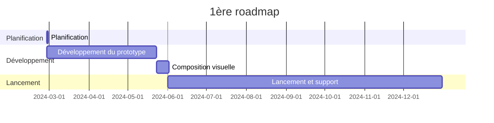

---
image:
    path: /2024-05-31-armonia-second-devlog/gameplay.webp
    lqip: data:image/webp;base64,UklGRlYAAABXRUJQVlA4IEoAAADwAQCdASoQAAgAAUAmJQBOgB8xi/GXoBAA/vuITP1jzd5vh9i82itNyxKJOlCBXvOebik8444+JnSUJik6FdPY8GR+D5jZO/WAAA==
    alt: Prototype en développement
    
title: "'Waybound', deuxième rapport de développement intermédiaire"

categories: [마일스톤, 게임 개발]
tags: [마일스톤, 게임 개발, 유니티, C#, 행선지, 개발, 개발일지]
start_with_ads: true

toc: true

date: 2024-05-31 22:53:00 +0900
last_modified_at: 2025-12-26 11:40:00 +0900

mermaid: true
lang: fr
---

## **Introduction**

:::info
Suite de [l'article précédent](https://hyngng.github.io/fr/dev/armonia-first-devlog/).
:::

Voici le rapport de développement de [mon quatrième jalon](https://hyngng.github.io/categories/%EB%A7%88%EC%9D%BC%EC%8A%A4%ED%86%A4/). J'ai résumé le travail d'un mois supplémentaire. Ce mois-ci a principalement porté sur l'extension des systèmes et du contenu du jeu. Voici ce qui a été fait durant cette phase :

- Systèmes du jeu
	- [x] Hiérarchisation des objets de décor
	- [x] Optimisation par remplacement du shader graph
	- [x] Menu de paramètres accessible par pincement (pinch zoom arrière)
	- [x] Interactions entre objets via animation procédurale
- Objets ajoutés
	- [x] 2 types de bâtiments en arrière-plan

## **Archive**

{: .w-75 }
*Capturé lors du test d'accès aux paramètres*

## **Création d'assets**

### **Assets image**

{: .light .w-25 .border }
{: .dark .w-25 }
*Pigeon picorant le sol*

Je vais continuer à ajouter des animations au format keyframe. Cette fois, j'ai créé une animation pour le pigeon picorant le sol. La quantité d'animation étant courte et surtout grâce aux [assets déjà créés](https://hyngng.github.io/posts/armonia-developing-first/#cr%C3%A9ation-dassets), je n'ai pas eu à chercher d'autres vidéos de pigeons pour en trouver les caractéristiques et les imiter comme avant.

J'ai créé `DigState.cs` de manière similaire et l'ai relié au pattern state. Grâce à cela, le mouvement semble naturel. L'interaction se déclenche en touchant le sol quand le pigeon est sélectionné.

### **Fichier shader**

Comme détaillé plus bas, des problèmes de coût GPU m'ont amené à remplacer le shader 2D Sprite utilisé par un plus léger. Le problème est que ce shader n'a pas de fonction Cast shadow et que l'effet de profondeur de champ (DOF) du post-processing ne s'applique pas. J'aimerais pouvoir améliorer cela, mais les shaders ne me sont pas encore familiers — il faudra soit les étudier en détail, soit abandonner certaines fonctionnalités de mise en scène.

## **Développement**

### **Menu de paramètres façon caméra**

{: .w-75 }
*Accès aux paramètres par pinch zoom, encore un prototype.*

Pour préserver un écran épuré sans UI et obtenir une mise en scène un peu amusante, j'ai fait en sorte que le menu des paramètres soit accessible par pinch zoom, sans affichage d'UI séparé. Le pinch zoom fonctionne par étapes : dans une certaine plage, il agit comme un zoom avant/arrière normal de la caméra, mais au-delà d'un seuil, il entre dans les paramètres avec un retour vibratoire. Une fois dans les paramètres, on en sort par un pinch zoom avant.

L'interface des paramètres a été conçue pour ressembler à un appareil photo. En prenant des photos et en regardant des vidéos POV Street Photography, j'avais ressenti une impression de connexion réaliste entre la scène dans l'écran tenu en main et le sujet, comme si la barrière entre moi et le sujet se brisait — j'ai voulu imiter cette expérience.

La batterie et l'heure utilisent `SystemInfo.batteryLevel` et `DateTime.Now` pour afficher l'état réel. La vitesse d'obturation et l'ouverture sont destinées à contrôler respectivement le motion blur et la profondeur de champ du post-processing.

Il reste des parties à finaliser, comme le texte affiché en police par défaut, mais l'expérience semble déjà unique, ce qui me satisfait pour l'instant.

### **Application de l'animation procédurale**

{: .w-75 }
*Regarde les pigeons quand ils sont à proximité*

En créant [le jalon précédent](https://hyngng.github.io/fr/dev/palette-second-devlog/), j'avais trouvé vraiment cool de voir des animations organiques interagissant avec l'environnement via l'animation procédurale. Je m'en suis souvenu et j'ai essayé cette fois. Je pensais que c'était implémenté avec des conditions techniquement sophistiquées, mais c'était plus facile que prévu car fourni sous forme de package Unity. Cependant, le contrôle par code s'est avéré plus complexe que prévu.

Contrairement au pigeon, l'humain a la tête, le corps et les jambes séparés en objets indépendants. J'ai donc utilisé le composant `Multiple Aim Constraint` du [package Animation Rigging](https://docs.unity3d.com/Packages/com.unity.animation.rigging@1.1/manual/index.html) pour implémenter, à titre d'essai, la fonction permettant à l'objet tête de l'humain de regarder vers un pigeon à une certaine distance.

```cs
public void ChangeSourceObject(GameObject discoveredObject)
{
    WeightedTransformArray sourceObjects = Constraint.data.sourceObjects;
    WeightedTransformArray newSourceObjects = new WeightedTransformArray(sourceObjects.Count);
    
    newSourceObjects[0] = new WeightedTransform();
    WeightedTransform wt = newSourceObjects[0];

    /* ... */

    newSourceObjects[0] = wt;
    
    data.sourceObjects = newSourceObjects;

    Animator.enabled = false;
    rigBuilder.Build();
    Animator.enabled = true;
}
```

Pour implémenter cette fonctionnalité, il fallait échanger la propriété `sourceObject` du composant `Multi Aim Constraint` avec un objet de la scène, un processus semé d'embûches. Si quelqu'un souhaite modifier le `sourceObject` de l'animation procédurale par code, voici quelques conseils :

- La propriété `sourceObjects` est en lecture seule (read-only). Il faut définir les données dans une autre variable locale puis assigner une nouvelle valeur à `data.sourceObjects`.
- Après l'assignation, il faut désactiver l'animator de l'objet concerné, builder le `rigBuilder`, puis réactiver l'animation pour que cela s'applique correctement.
- Si un objet est enregistré comme `sourceObject` d'un autre objet, lorsque cet objet est supprimé, il faut définir la propriété `sourceObject` dans laquelle il était enregistré sur `None`.

Certains comportements et erreurs étaient difficiles à résoudre même en consultant la [documentation officielle](https://docs.unity3d.com/Packages/com.unity.animation.rigging@1.0/api/UnityEngine.Animations.Rigging.html), ce qui a posé problème, mais j'ai finalement réussi à le créer. Après implémentation, l'effet semble effectivement assouplir l'ambiance du jeu. Si je crée un jour un toy project en 3D, j'aimerais vraiment mieux l'exploiter.

### **Tentative d'optimisation avec le profileur**

{: .w-75 }
*Exemple de données mesurées par le profileur Unity*

Mon jeu avait étrangement une forte surchauffe, ne maintenant même pas 40 FPS après build. Même si mon code n'était pas parfait, j'évitais les fonctions lourdes comme `GetComponent()`, `Find()`, et je veillais à ne pas exécuter excessivement les boucles (`for`, `foreach`) ou coroutines. Je pensais respecter les bases, mais je ne comprenais pas pourquoi un projet 2.5D, censé être léger, perdait des frames.

Pendant le débogage, le téléphone devenant rapidement chaud au point d'être désagréable, j'ai relevé le défi de l'optimisation avec le profileur pour la première fois. Le processus était étonnamment simple : dans les données enregistrées par le profileur Unity, je cherchais quelle tâche était la plus exécutée dans les segments où le frame était élevé, et j'améliorais cette partie.

Dans mon cas, `Semaphore.WaitForSignal` occupait 50 à 70 % des ressources. Après avoir lu qu'il était recommandé de remplacer le shader par un plus léger dans ce cas, j'ai changé le [fichier shader trouvé précédemment](https://hyngng.github.io/fr/dev/armonia-first-devlog/#shader-sprite) pour un plus léger, ce qui a considérablement augmenté le frame et réduit la surchauffe.

## **Critères de lancement**

### **Nécessité d'objectifs pour terminer**

Créer des animations et interactions pour chaque objet est fondamentalement amusant et intéressant, mais j'ai ressenti que cela demandait plus de temps et d'efforts que prévu. Je pensais que l'efficacité augmenterait avec l'expérience et les compétences, et c'était en grande partie le cas, mais saisir du code ou créer des animations keyframe exigeait un travail physique minimum — taper ou tracer des lignes sur l'écran.

À mesure que le projet grandissait et que les assets à gérer augmentaient, j'ai commencé à sentir la charge peser sur moi. Je me souviens d'avoir lu un conseil dans un rapport de l'industrie du jeu publié par Unity : "Don't bite off more than you can chew". Je me suis demandé si ma situation actuelle n'allait pas dans ce sens.

J'ai donc pensé qu'il était nécessaire de définir des critères de lancement comme point d'arrivée. Pour l'instant, j'ai décidé de viser un niveau suffisant pour demander un [Google Featuring](https://play.google.com/console/about/guides/featuring/). Google Featuring définit clairement des critères pour les applications et jeux de haute qualité, notamment :

- [Notes utilisateur élevées](https://support.google.com/googleplay/android-developer/answer/138230?hl=en)
- [Conformité aux politiques Google Play](https://play.google/developer-content-policy/#!?modal_active=none)
- [Score Android Vitals élevé](https://support.google.com/googleplay/android-developer/answer/9844486?hl=en&visit_id=638527380779176477-2227653483&rd=1)
- [Respect des directives de qualité des applications de base Android et Google Play](https://developer.android.com/quality?hl=ko)

En particulier, [Android Developers](https://developer.android.com/quality?hl=ko) définit une bonne expérience utilisateur en termes d'utilisabilité (sauvegarde et restauration, etc.), d'accessibilité, de localisation, de deep linking, d'attrait visuel et de savoir-faire (animation, audio, contrôles...), et bien d'autres critères et exemples. Bien qu'il faille les détailler davantage, ils constituent une bonne référence générale.

### **Autres critères auto-définis**

- Application
	- [ ] Icône d'application
	- [ ] Son 3D
	- [ ] Tutoriel simple
	- [ ] Localisation des textes internes
- Objets
	- [ ] Au moins 5 types d'objets
	- [ ] Au moins 2 personnalités par objet
	- [ ] Au moins 3 interactions par objet
- Décor
	- [ ] Système météo (pluie, neige)
	- [ ] Skybox dynamique avec nuages
	- [ ] Au moins 3 objets de décor garantis à l'écran

## **Conclusion**



La roadmap initiale visait une date d'achèvement autour d'aujourd'hui ou demain au moment de la publication de cet article, mais par manque de compétences, j'en suis loin. Il faudra établir une nouvelle roadmap et, surtout, définir plus précisément les rôles et objectifs par trimestre.

De plus, mon service militaire (réserve) commençant en juin, je vais devoir mettre le développement de côté et aller au centre d'entraînement. Je ne sais pas encore si ce sera possible par la suite, mais j'aimerais continuer le développement progressivement pour atteindre un niveau publiable sur le store.
