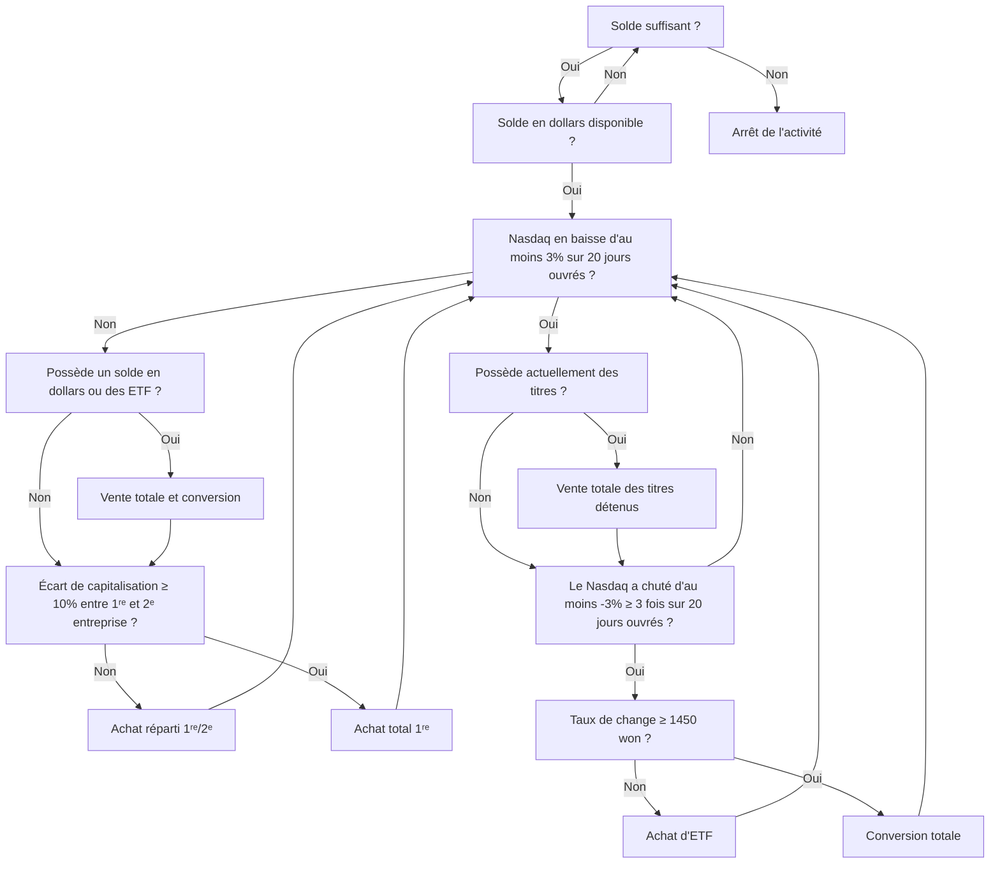

## **Robot de trading automatisé, ASTP**

ASTP (Auto Stock Trading Program) est un projet sur le thème du trading automatisé d'actions selon un algorithme interne, constituant [mon deuxième jalon](https://github.com/hyngng/astp/tree/legacy). Après le second semestre de ma première année, je voulais créer mon propre programme, et l'idée d'un robot de trading automatique suggérée par une connaissance a éveillé mon intérêt. Le programme a été développé en Python, et la partie boursière a été réalisée avec l'aide de cette connaissance, en suivant simplement une stratégie de base.

## **Caractéristiques du programme**

L'[OpenAPI](https://www.truefriend.com/main/customer/systemdown/OpenAPI.jsp?cmd=TF04ea01200) de Korea Investment & Securities a été utilisé. C'était ma première expérience de création d'un programme utilisant une API, et j'ai été surpris par le nombre de possibilités offertes. La stratégie de trading suit les deux règles suivantes et fonctionne sur la base du NASDAQ.

- Résumé de l'algorithme
	- **Achat d'actions** : Achat d'actions en considérant le ratio entre l'indice NDX et les deux premières entreprises cotées au NASDAQ.
	- **Vente d'actions** : Si l'indice NDX s'effondre ou si le taux de change won-dollar augmente excessivement, vendre toutes les actions détenues et cesser toute activité de trading pendant 20 jours ouvrables. La chute de l'indice NDX est déterminée en comparant les valeurs maximale et minimale de l'indice NDX saisies dans Excel à deux reprises, à l'ouverture et à la clôture du marché.
- Bibliothèques utilisées
	- `mojito` : Module de référence Python intégré à l'OpenAPI de Korea Investment & Securities.
	- `yfinance` : Utilisé pour obtenir le classement des capitalisations boursières du NASDAQ.
	- `BeautifulSoup` : Utilisé pour récupérer par scraping les données NASDAQ-100 manquantes dans tous les modules boursiers.

## **Structure et exemple de code**



```python
# Scraping NDX
def get_ndx():

    if response.status_code == 200:
    
        html = response.text
        soup = BeautifulSoup(html, 'html.parser')

        ndx_class = soup.find(class_ = 'Fw(b) Fz(36px) Mb(-4px) D(ib)')
        ndx = re.sub(r'[^0-9]', '', ndx_class.get_text())

    else:
        print(response.status_code)
    
    return ndx

# Vérification de la baisse de -3% du NDX
def ndx_collapsed():

    df_ndf_data['ndx_index'] = df_ndf_data['ndx_index'].astype(float)
    ndx_decrse_3per = False

    ndx_max = df_ndf_data['ndx_index'].max()
    ndx_min = df_ndf_data['ndx_index'].min()

    if 100 * (ndx_max - ndx_min) / ndx_max > 3:
        ndx_decrse_3per = True
        print("\nLa fluctuation de l'indice NDX est importante.\n")
    else:
        print("\nL'indice NDX est stable.\n")

    return ndx_decrse_3per
```

## **Exemple de fonctionnement du programme**

{: .w-75 }
*Capture d'écran du programme en fonctionnement et de l'achat d'une action Apple via le programme*

Étant un simple programme Python sans interface utilisateur, il s'exécute sans problème via l'invite de commande. Une fois le programme lancé, il passe automatiquement des ordres d'achat et de vente jusqu'à ce qu'il soit arrêté manuellement. Les ordres de vente exécutés peuvent être consultés via la fenêtre d'invite de commandes ou l'application Korea Investment & Securities, comme le montrent les captures d'écran ci-dessous, pour vérifier l'état des achats et des actions détenues.

## **Précautions et limites**

- Le marché boursier américain étant ouvert de 23h30 à 6h30, heure coréenne, l'ASTP, basé sur les actions étrangères, est soumis à des contraintes de temps pour vérifier le fonctionnement du code, contrairement aux programmes classiques.
- L'utilisation des services fournis par Korea Investment & Securities nécessite deux étapes préalables en dehors du programme.
    1. Ouvrir un compte chez Korea Investment & Securities et demander l'[OpenAPI](https://apiportal.koreainvestment.com/intro). Sur la page de demande, obtenir une `key` et un `secret`, puis les enregistrer avec le numéro de compte virtuel dans le fichier `mock.key` du projet.
    2. Installer le programme [eFriend Expert](https://www.truefriend.com/main/customer/systemdown/OpenAPI.jsp?cmd=TF04ea01200) fourni par Korea Investment & Securities pour traiter la transmission des ordres et la consultation des soldes.
- En outre, le module de certificat numérique commun ne prenant pas en charge l'environnement 64 bits, il est nécessaire de construire un [environnement virtuel 32 bits](https://hyngng.github.io/posts/virtual-32bit/) et d'exécuter le code dans cet environnement, même si cela est peu pratique.

## **Pour conclure**

:::tip
Vous pouvez explorer plus en détail sur [GitHub](https://github.com/hyngng/astp/tree/legacy).
:::

La création de ce jalon m'a permis de me concentrer sur l'expérience d'utilisation de modules externes tels que les API et les bibliothèques. En les utilisant directement, j'ai pu constater à quel point il est important de tirer activement parti des modules existants pour accomplir davantage de choses. J'ai également appris à trier et afficher des données telles que les indices NASDAQ et les capitalisations boursières des entreprises.

Bien que le programme ne fasse qu'environ 237 lignes de code, si je devais l'étendre à l'avenir, je pense qu'il serait bon d'affiner plus précisément les conditions d'achat et de vente, et de passer par une structuration en classes pour rendre le code plus concis.
