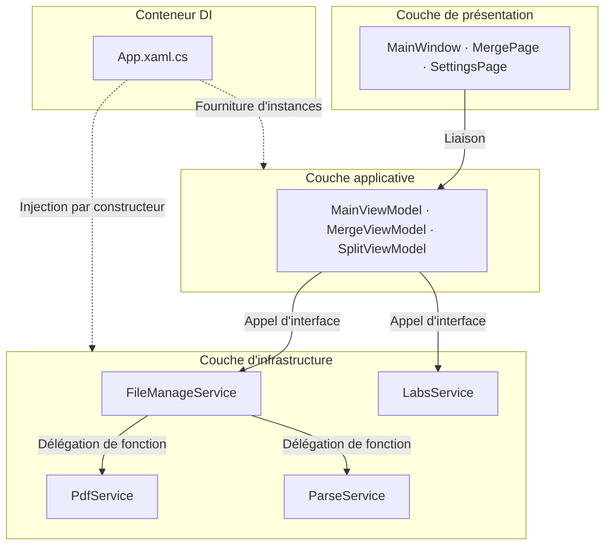

---
image:
    path: /2026-04-02-pascal-devlog/preview-image.webp
    lqip: data:image/webp;base64,UklGRj4AAABXRUJQVlA4IDIAAADQAQCdASoQAAgAAUAmJZwCdAEPDuQrCAD+/crO2PZZpBuP/xETb+8eyANti2KhVUAAAA==
    alt: "Le nom provisoire du programme était 'Pascal'"

title: "Rétrospective sur le développement d'un éditeur PDF basé sur WinUI 3"
authors: ["dev"]

categories: [마일스톤, 기타 개발]
tags: [마일스톤, 기타 개발, WinUI 3, MVVM, XAML, C#]
start_with_ads: true

toc: true

date: 2026-04-02 11:14:00 +0900
last_modified_at: 2026-06-23 16:47:00 +0900

mermaid: true
---

## **Motivation du développement**

> "Merci, mais on est une institution publique, on ne peut pas utiliser n'importe quel programme externe."

Un problème est survenu au bureau pendant mon service civil. Cela est détaillé dans [mon article sur le service civil](https://hyngng.github.io/fr/essay/sabok-logs/), mais pour résumer brièvement, on m'a fait remarquer que les institutions publiques ne peuvent pas utiliser librement des programmes externes sans licence, et cette expérience a conduit à la motivation de développer ce programme. Cependant, je ne me suis pas lancé uniquement avec l'idée de « le faire moi-même ». Je voulais aussi utiliser le C#, que j'avais découvert avec Unity, dans un autre contexte, et j'avais envie de m'attaquer à un vrai programme Windows, ce qui m'a permis d'ouvrir ce nouveau projet avec audace.

Le programme s'appelle Pascal parce qu'il a d'abord été développé dans le but de compresser des PDF. La fonction de compression n'a finalement pas été implémentée car la fin de mon service approchait et le rapport coût-bénéfice n'était pas favorable, mais le contexte de manipulation de fichiers PDF a d'abord été implémenté sous deux formes : la fusion et la division.

## **Présentation du programme**

{: .light }
{: .dark }
*Captures d'écran des 4 pages finalisées. Comme on peut le voir dans la fenêtre de crédits, ce n'est pas un programme très sérieux*

Pascal est un programme qui effectue la fusion et la division de fichiers PDF. Il a été développé sur environ deux mois pendant mon service civil, et par chance, [un collègue aspirant développeur](https://github.com/din-c) était présent, ce qui nous a permis d'ouvrir une page Notion dédiée et de collaborer un peu pendant les temps libres. À l'origine, je prévoyais d'intégrer plusieurs fonctions bureautiques comme l'extraction de texte PDF, la conversion en JPG et la compression, mais compte tenu de mon orientation professionnelle et du temps de service restant, seules quelques fonctions de base ont été implémentées.

Divulguer des informations permettant d'identifier l'institution n'est pas recommandé par l'Administration militaire, et je respecte cette position. Il est donc difficile de décrire précisément dans quel contexte et comment le programme a été utilisé, mais je peux en donner un aperçu. Premièrement, le simple fait d'avoir conscience de posséder ce programme a été psychologiquement très bénéfique. Deuxièmement, contrairement à l'époque où je devais modifier manuellement les paramètres de `config.yaml` avant d'exécuter un script Python, le programme a considérablement simplifié le flux de travail brut en quelques clics.

- Fonctions opérationnelles
	- Fusion de plusieurs fichiers PDF
    - Réorganisation de l'ordre de fusion possible
    - Sélection des pages à fusionner possible
	- Division simultanée de plusieurs fichiers PDF
    - Unité de division configurable
    - Plage de division configurable
	- Affichage d'un écran de mise à jour Windows (laboratoire)

## **Difficultés du développement et efforts d'adaptation**

### **Framework WinUI 3**

Je n'avais aucune connaissance ni expérience préalable du développement d'applications Windows, et j'ai eu du mal à choisir une direction dès l'étape de sélection du framework. J'ai d'abord cherché du côté d'[Electron.NET](https://github.com/ElectronNET/Electron.NET) pour réutiliser mon expérience de développement front-end, mais j'ai eu l'impression que cela s'éloignait beaucoup de l'approche standard, les créateurs eux-mêmes demandant : « Wait — you host a .NET Core app inside Electron? Why? ». Puis, j'ai découvert par hasard la philosophie de design de Microsoft appelée [Fluent 2](https://fluent2.microsoft.design/), et je suis passé à un projet WPF utilisant la bibliothèque [ModernWPF](https://github.com/Kinnara/ModernWpf). En cours de développement, j'ai trouvé l'environnement hérité obsolète pour 2025, et j'ai donc migré vers le framework le plus récent, WinUI 3.

Il y a un point que je voudrais souligner rétrospectivement dans cette expérience. D'après mes recherches, Microsoft a, au cours des vingt dernières années, déversé une multitude de nouveaux frameworks — WinForms, WPF, UWP, WinUI 3, et plus récemment MAUI — qui ne sont pas parfaitement compatibles avec les plateformes précédentes. Ainsi, contrairement au développement dans d'autres domaines comme le mobile, le web ou le jeu, il est vrai que les critères pour déterminer ce qu'il faut adopter comme standard dans le développement d'applications Windows sont flous. Avec le recul, je pense que mes tâtonnements faisaient en quelque sorte partie du rite de passage.

|Développement web front-end|WinUI|
|---|---|
|HTML|XAML|
|CSS|Style XAML|
|JavaScript|C#|

Ce qui m'a tout de même bien plu, c'est que l'expérience de développement avec WPF et WinUI 3 est très similaire au développement web front-end. C'était plutôt amusant. Le processus de définition des éléments et propriétés d'interface avec XAML et d'écriture de la logique détaillée en C# est analogue au fonctionnement du HTML et du JavaScript. De plus, si on a déjà touché au CSS ou au SCSS, la définition des styles n'est pas difficile, ce qui m'a permis de m'adapter rapidement au framework d'interface.

Cependant, l'écosystème de WinUI 3 reste relativement pauvre, malgré le soutien continu de Microsoft. Par exemple, si on parcourt le projet [WinUI-3-Apps-List](https://github.com/DesignLipsx/WinUI-3-Apps-List?tab=readme-ov-file), il y a une certaine quantité de contenu, mais la qualité n'est pas élevée. C'est particulièrement rare que le code soit ouvert en open source, ce qui rend difficile de savoir comment les autres utilisent concrètement ce framework. J'ai donc dû résoudre de manière déductive les questions sur la manière de mener un projet WinUI 3 en luttant avec la [documentation officielle de Microsoft](https://learn.microsoft.com/ko-kr/windows/apps/winui/winui3), mais la qualité de la traduction coréenne étant faible, les documents en anglais étaient pratiquement la seule option, et les LLM n'ont pas été d'une grande aide non plus dans ce domaine. Cela a représenté un coût d'apprentissage initial.

### **IDE, .NET et bibliothèques**

Appréciant la propreté de VSCode, Visual Studio, son lointain cousin, m'était assez étranger. De plus, je n'avais jamais essayé un framework aussi inconnu que WinUI 3. Le premier goulot d'étranglement a été de me familiariser avec des termes comme solution, NuGet, designer, et les fonctionnalités de la barre de menus. J'ai dû passer plus de temps que prévu à comprendre la structure de l'environnement de développement avant même d'implémenter des fonctions.

En examinant d'autres projets open source comme [WinUI-Gallery](https://github.com/microsoft/WinUI-Gallery), [DevWinUI.Gallery](https://github.com/ghost1372/DevWinUI/tree/main/dev/DevWinUI.Gallery) et [Files](https://github.com/files-community/files), on remarque qu'ils suivent une sorte de dialecte avec des dossiers comme `Services`, `Helpers`, `Modules`. C'était une approche que je n'avais pas beaucoup vue dans les projets Unity, Python ou front-end, et elle m'a paru assez déroutante au début. Indépendamment de l'apprentissage des fonctionnalités, j'ai dû explorer la manière même de lire le projet, et traduire et adapter mon intuition existante à ce projet.

Ce qui m'a tout de même permis de bien m'installer dans l'environnement WinUI 3, ce sont les excellentes bibliothèques de contrôles [Windows Community Toolkit](https://github.com/CommunityToolkit/WindowsCommunityToolkit) et [DevWinUI](https://github.com/ghost1372/DevWinUI). Dans l'environnement de développement .NET pour l'interface utilisateur, les éléments d'interface sont appelés des contrôles, et ces deux bibliothèques en offrent une grande variété, ce qui m'a permis d'implémenter la plupart des choses sans difficulté, à l'exception peut-être du `DataTable`. Cela a contribué à réduire le coût d'entrée initial.

### **Le motif MVVM plutôt déroutant**

C'est l'aspect le plus déroutant. Au-delà de la connaissance de la syntaxe XAML ou C#, il fallait une certaine sensibilité au MVVM. Le MVVM n'est pas une condition nécessaire au développement WinUI, mais comme le framework lui-même est conçu en partant du principe qu'il sera utilisé, ne pas le respecter augmente considérablement la difficulté de maintenance du code. C'est ce qui rend l'expérience de développement si différente de celle avec Unity.

Le concept de réduction des dépendances entre les codes m'était familier, mais j'ai dû étudier comment MVVM y parvenait concrètement, jusqu'où chacun des trois domaines — modèle, vue et vue-modèle — pouvait aller, ce qu'il ne devait pas faire, et comment distinguer la différence entre les deux. Et honnêtement, même au moment où j'écris, ma compréhension reste un peu floue. Par exemple, j'estime que la meilleure façon de bien respecter MVVM est d'avoir un ViewModel dédié pour les pages complexes et de l'omettre pour les pages simples, et d'utiliser le code-behind comme pont dans les cas difficiles à traiter uniquement par liaison, comme le glisser-déposer de fichiers. Mais je ne suis pas sûr que ce soit vraiment la meilleure pratique bien conçue, et même si c'est le cas, je n'en ressens pas bien les avantages.

Par ailleurs, le package [MVVM Toolkit](https://learn.microsoft.com/en-us/dotnet/communitytoolkit/mvvm/) est quasiment incontournable pour le développement WinUI 3. Ce package permet à la vue de communiquer avec le ViewModel sans passer par le code-behind du fichier de balisage UI, ce qui améliore la structure de conception du programme en la rendant plus intuitive.

## **Réflexions sur la collaboration et la productivité**

### **Collaboration**

J'ai l'habitude d'utiliser Notion, Figma et GitHub, et il était naturel de vouloir les utiliser pour ce projet. Mon collègue m'ayant dit qu'il n'avait jamais utilisé ces outils, je lui ai brièvement expliqué leur fonctionnement et pourquoi ces outils plutôt que d'autres. J'ai aussi voulu tenter la méthodologie PARA dans Notion pour mettre en place une structure de collaboration systématique qui me soit propre.

Mais en fin de compte, en dehors de GitHub, je n'ai pas eu l'enthousiasme escompté, et honnêtement, j'étais un peu gêné. Ce n'était pas parce que mon collègue était paresseux, mais plutôt parce que l'environnement WinUI 3 était déjà assez exigeant, et ma justification de l'utilité de Notion et Figma manquait probablement de persuasion. Je pensais qu'un système de gestion des ressources était toujours nécessaire car il permet de soutenir le développement sur le long terme, alors que mon collègue semblait considérer qu'on pouvait s'en passer si le coût n'était pas directement lié au développement. Et avec le temps, j'ai commencé à penser qu'il avait raison. Comme pour l'utilité de l'orienté objet, j'ai réalisé que les bons outils et les bons motifs ont aussi une échelle à partir de laquelle ils se justifient. J'avais tendance à croire aveuglément aux outils par inertie, en me disant que ce qui est bon est bon.

Bien que la forme ait changé, la collaboration elle-même s'est bien déroulée et a été satisfaisante. Nous avons divisé le travail en confiant les vues et les ViewModel à moi-même, et le ViewModel et les modèles à mon collègue. Nous partagions et révisions les modifications, puis procédions à des corrections mutuelles secondaires. Le simple fait de pouvoir échanger des points de vue a été une expérience enrichissante. Et le fait que nos habitudes d'écriture de code soient presque identiques, ce qui a réduit les frictions, était un bonus.

### **Productivité**

Il y a quelques années, j'ai lu un article sur un auteur étranger qui voulait quitter son emploi pour se consacrer entièrement à son œuvre. Un lecteur lui a conseillé en commentaire : « Même si c'est pour faire ce que tu aimes, je pense qu'il n'est jamais bon de quitter son travail, quelle qu'en soit la raison. » L'auteur a répondu d'une phrase cinglante : « Je regrette déjà d'avoir laissé mon imagination mourir dans un bureau que je n'aime pas. » Et le débat s'est arrêté là.

Cette anecdote m'est revenue à l'esprit pendant le développement du programme. Ma situation est différente, car la résonance mentale, l'urgence de la réalisation de soi que l'on ressent en créant une œuvre d'art ne sont pas nécessaires au développement d'un programme. Mais je pouvais comprendre l'épuisement que provoque un environnement où l'on doit traiter des tâches épuisantes chaque jour sur la volonté de création et d'avancement du travail.

En réalité, c'est pour cette raison que ce projet a eu du mal à progresser. Au moment où j'imaginais comment utiliser tel ou tel contrôle UI, j'étais appelé pour une tâche liée au travail. Vingt minutes plus tard, de retour à ma place, je reconstruisais le contexte quand le téléphone du bureau sonnait. Ce n'était pas seulement dans les moments nécessitant de la créativité : même de simples tâches de débogage, comme l'examen du flux de dépendances entre M, V et VM, étaient difficiles à cause des interruptions fréquentes. Je ne veux pas me plaindre en disant que la situation était injuste. Cependant, c'est la première fois que j'ai pu constater à quel point la productivité peut chuter lorsque l'environnement n'offre pas de marge.

## **Archives**

### **Captures d'écran diverses**

{: .w-75 }
*Début 2025, un programme Python créé par mon collègue. L'objectif était aussi de le remplacer par une version plus sophistiquée*

{: .light .border }
{: .dark }
*Fin 2024, une ébauche de design brut pour un programme aux fonctions quasiment identiques*

*À l'époque où j'essayais toutes sortes de choses. Une fois les fonctions implémentées, j'ai combiné utilisation réelle et développement*

### **Architecture succincte**

### **Bibliothèques utilisées**

- UI et extension du framework
    - `Windows Community Toolkit`[Licence MIT](https://github.com/CommunityToolkit/Windows/blob/main/License.md)
    - `DevWinUI`[Licence MIT](https://github.com/ghost1372/DevWinUI/blob/main/LICENSE)
- Traitement de documents PDF
    - `PDFsharp`[Licence MIT](https://github.com/empira/PDFsharp/blob/master/LICENSE), responsable de la fusion et de la division PDF
    - `PdfPig`[Licence Apache-2.0](https://github.com/BobLd/PdfPig.Rendering.Skia/blob/master/LICENSE.txt), responsable de l'extraction de texte

### **Documentation utile au développement**

- Icônes
	- [Énumération Symbol](https://learn.microsoft.com/ko-kr/uwp/api/windows.ui.xaml.controls.symbol?view=winrt-26100)
	- [fluentui-system-icons](https://github.com/microsoft/fluentui-system-icons)
	- [Segoe MDL2 Assets icons](https://learn.microsoft.com/en-us/windows/apps/design/style/segoe-ui-symbol-font)
	- [FluentIcons.Wpf](https://www.nuget.org/packages/FluentIcons.WPF/)
- WinUI3
	- [Démarrage rapide : configurer l'environnement et créer un projet WinUI 3](https://learn.microsoft.com/ko-kr/windows/apps/winui/winui3/create-your-first-pascal-devlog3-app?source=recommendations#unpackaged-create-a-new-project-for-an-unpackaged-c-or-c-pascal-devlog-3-desktop-app)
	- [Espace de noms Windows App SDK](https://learn.microsoft.com/ko-kr/windows/windows-app-sdk/api/winrt/?view=windows-app-sdk-1.7)
	- [Template Studio for WinUI](https://marketplace.visualstudio.com/items?itemName=TemplateStudio.TemplateStudioForWinUICs)
- MVVM
	- [Introduction à la MVVM Toolkit](https://learn.microsoft.com/ko-kr/dotnet/communitytoolkit/mvvm/)
- .NET 9
	- [Documentation de programmation avancée .NET](https://learn.microsoft.com/ko-kr/dotnet/navigate/advanced-programming/)
	- [Nouveautés de WPF pour .NET 9](https://learn.microsoft.com/ko-kr/dotnet/desktop/wpf/whats-new/net90)

## **Pour conclure**

:::tip
Vous pouvez explorer plus en détail sur [GitHub](https://github.com/hyngng/pascal.drill) !
:::

Parmi les bibliothèques, DevWinUI est entièrement gérée par Mahdi Hosseini, un développeur iranien qui opère sous le nom de [ghost1372](https://github.com/ghost1372). D'après les informations publiques, il semble travailler comme enseignant et résider dans la ville de Qeydar, en Iran. Et c'est une histoire incroyable : le 28 décembre 2025, des protestations massives ont éclaté dans toute l'Iran, et le régime conservateur intransigeant a commencé à les réprimer par la force.

Selon Wikipédia, des manifestations ont également été signalées dans la ville de Qeydar où il réside. Quelques jours plus tard, le gouvernement iranien a coupé Internet à l'échelle nationale, et les commits de ghost1372 se sont également arrêtés à ce moment-là, rendant son avenir incertain. DevWinUI contribuant de manière significative à l'écosystème WinUI 3, on plaisantait en disant que Microsoft devrait envoyer un hélicoptère pour le sauver, mais je me souviens de l'inquiétude que j'avais ressentie à l'époque, ne sachant pas s'il était vivant ou mort. Heureusement, les commits ont repris, et il semble qu'il aille bien.

- Autres anecdotes
	- Au cours de ce projet, Visual Studio 2026 est sorti11 novembre 2025.
	- DevWinUI est passé de la version `9.4.0` à `9.8.0`.
