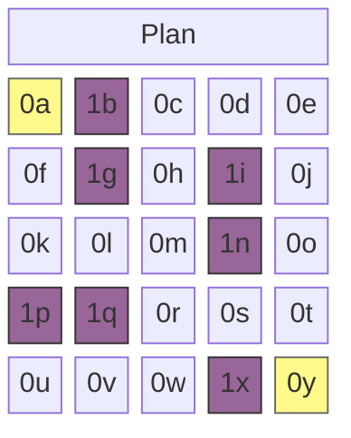
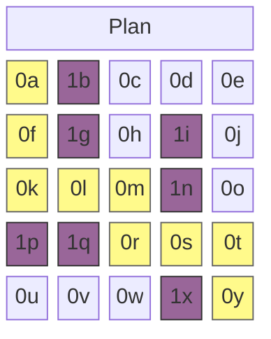

L'algorithme A* est un algorithme de recherche de graphe conçu pour trouver le chemin le plus court entre deux points spécifiques. Sa caractéristique peut se résumer par l'équation suivante, où $n$ représente un nœud :

$$
f(n) = g(n) + h(n)
$$

## **Liste ouverte et liste fermée**

L'algorithme A* examine le coût des nœuds adjacents atteignables lors de la recherche du plus court chemin. Il ajoute d'abord les candidats à la liste ouverte (Open List), puis déplace les nœuds examinés vers la liste fermée (Closed List).

```python
open_list = []
closed_set = set()
```

Deux listes sont utilisées pour implémenter ce processus. La liste ouverte utilise une file de priorité, et la liste fermée utilise une structure d'ensemble (Set).

## **$g(n)$ : coût de déplacement d'un pas**

$g(n)$ est une fonction qui mesure le coût de déplacement vers un nœud candidat enregistré dans la liste ouverte. Si la carte est une grille, le coût de déplacement vertical/horizontal est de $1$ ; si le déplacement en diagonale est possible, le coût diagonal peut être calculé à $\sqrt{2} \approx 1,4$. Le code que j'ai écrit ne considère que les déplacements verticaux et horizontaux.

```python
# En supposant qu'un nœud est défini comme suit
class Node:
    def __init__(self, position, parent=None):
        # ...
        self.g = 0

# Cela peut s'exprimer ainsi
neighbor.g = current_node.g + 1
```

## **$h(n)$ : distance jusqu'à la destination**

$h(n)$ est une fonction qui estime approximativement le coût de déplacement d'un nœud candidat de la liste ouverte jusqu'au nœud de destination. On parle de mesure heuristique, par analogie avec le choix d'un restaurant fréquenté ou l'estimation approximative du taux de change entre 1 200 et 1 400 wons lors de l'achat d'un produit étranger. Il est connu qu'obtenir cette valeur de manière appropriée selon la situation du problème contribue à améliorer les performances de l'algorithme. Elle peut généralement être obtenue de la manière suivante.

- Exemple 1 : Distance de Manhattan $h(n) = \|x_1 - x_2\| + \|y_1 - y_2\|$
```python
def heuristic(start_node, end_node):
    return abs(
        end_node[x] - start_node[x]) + abs(end_node[y] - start_node[y]
    )
```
- Exemple 2 : Distance euclidienne $h(n) = \sqrt{(x_1 - x_2)^2 + (y_1 - y_2)^2}$
```python
def heuristic(start_node, end_node):
    return math.sqrt(
        (end_node['x'] - start_node['x'])**2 + (end_node['y'] - start_node['y'])**2
    )
```

## **Algorithme implémenté en Python**

```python
import heapq

class Node:
    def __init__(self, position, parent=None):
        self.position = position
        self.parent = parent

        self.g = 0
        self.h = 0
        self.f = 0

    def __lt__(self, other):
        return self.f < other.f

def heuristic(a, b):
    return abs(a[0] - b[0]) + abs(a[1] - b[1])

def astar(grid, start, end):
    open_list = []
    closed_set = set()

    start_node = Node(start)
    end_node = Node(end)

    heapq.heappush(open_list, start_node)

    while open_list:
        current_node = heapq.heappop(open_list)
        closed_set.add(current_node.position)

        if current_node.position == end_node.position:
            path = []
            while current_node:
                path.append(current_node.position)
                current_node = current_node.parent
            return path[::-1]

        x, y = current_node.position
        neighbors = [(x+dx, y+dy) for dx, dy in [(-1,0), (1,0), (0,-1), (0,1)]]

        for next_pos in neighbors:
            nx, ny = next_pos
            if not (0 <= nx < len(grid) and 0 <= ny < len(grid[0])):
                continue
            if grid[nx][ny] != 0:
                continue
            if next_pos in closed_set:
                continue

            neighbor = Node(next_pos, current_node)
            neighbor.g = current_node.g + 1
            neighbor.h = heuristic(next_pos, end)
            neighbor.f = neighbor.g + neighbor.h

            if any(n.position == neighbor.position and n.f <= neighbor.f for n in open_list):
                continue

            heapq.heappush(open_list, neighbor)

    return None
```

## **Exemple d'exécution de l'algorithme**

Cet algorithme considère qu'un nœud avec une valeur de $0$ est un chemin et $1$ un obstacle. Prenons l'exemple de la carte suivante. Les cases `0a` et `0y` surlignées en jaune sont respectivement le point de départ et la destination.



```python
grid = [
    [0, 1, 0, 0, 0],
    [0, 1, 0, 1, 0],
    [0, 0, 0, 1, 0],
    [1, 1, 0, 0, 0],
    [0, 0, 0, 1, 0]
]

start = (0, 0)
end = (4, 4)

path = astar(grid, start, end)
```

Avec une carte de taille $5 \times 5$, en définissant le point de départ à `(0, 0)` et la destination à `(4, 4)`, et en plaçant quelques murs, le chemin le plus court `path` est affiché comme suit.



```bash
[(0, 0), (1, 0), (2, 0), (2, 1), (2, 2), (3, 2), (3, 3), (3, 4), (4, 4)]
```
