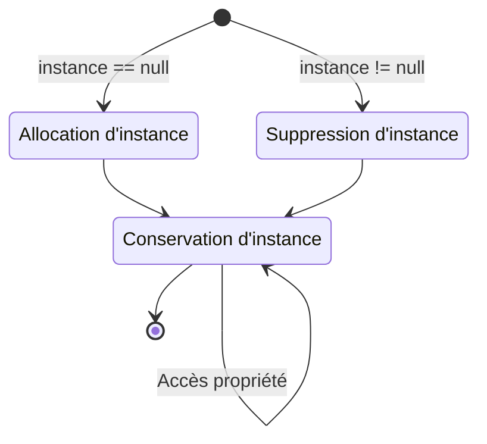

## **Introduction**

En développant des jeux, je réalise de plus en plus qu'il y a beaucoup de concepts à organiser. J'utilise souvent Notion et Obsidian, mais c'est différent d'avoir pris le temps de structurer les choses.

À l'origine, je ne voulais pas alourdir l'ambiance du blog avec des articles trop techniques, alors j'évitais délibérément d'écrire en détail sur les concepts techniques. Mais récemment, j'ai appris que le mot « blog » vient de Web + Log, et je me suis dit qu'un article résumant ce que j'ai appris pouvait être une bonne idée. À l'avenir, je compte donc aborder en profondeur les sujets qui nécessitent une trace écrite, un par un, sur le blog.

Le premier que je vais traiter est le pattern singleton. Le singleton est un patron de conception qui garantit qu'une classe ne possède qu'une seule instance. Il est principalement utilisé pour les avantages suivants :

- Maintenir un état cohérent du jeu à travers plusieurs scripts ou scènes
- Gérer les données (audio, sprites, objets) sans duplication
- Éviter la répétition de code lourd dans des classes individuelles, améliorant ainsi les performances

Je présente le singleton en premier car il est intuitif. Lorsqu'on apprend le développement de jeux et qu'on commence à maîtriser l'écriture de code, beaucoup rencontrent ce pattern. Il est à la fois simple conceptuellement et facile à utiliser.

## **Visualisation de la structure**



## **Code de base**

```cs
public class Singleton : MonoBehaviour
{
    private static Singleton instance = null;
    public static Singleton Instance
    {
        get
        {
            if (instance == null)
                return null;
                
            return instance;
        }
    }

    void Awake()
    {
        if (instance == null)
        {
            instance = this;

            DontDestroyOnLoad(this.gameObject);
        }
        else
            Destroy(this.gameObject);
    }
}
```

Les règles du pattern singleton se résument à deux points :

- Garantir qu'une classe ne peut s'instancier qu'une seule fois (Ensures that a class can only instantiate one instance of itself)
- Fournir un accès global à cette instance unique (Gives easy global access to that single instance)

Ainsi, l'implémentation du singleton dans Unity est très simple. La propriété ci-dessus comme la méthode `Awake()` garantissent qu'il n'existe qu'une seule instance. Comme l'instance du script est déclarée `static`, les champs et méthodes du script utilisant le singleton sont accessibles depuis l'extérieur via `NomDuScript.Instance`.

## **Création de l'instance**

```cs
public class Singleton : MonoBehaviour
{
    private static Singleton instance = null;
    public static Singleton Instance
    {
        get
        {
            if (instance == null)
            {
                GameObject gameObj = new GameObject();
                instance = gameObj.AddComponent<Singleton>();
                DontDestroyOnLoad(gameObj);
            }
                
            return instance;
        }
    }
}
```

Jusqu'à présent, quand il n'y avait pas d'instance singleton, elle était simplement traitée comme `null` sans en créer de nouvelle. Cela obligeait les scripts externes à vérifier l'existence de `Instance` lors de son accès. Si cela est gênant, on peut modifier la propriété comme ci-dessus pour chaîner le code d'instanciation.

Ainsi, l'instance est automatiquement créée à chaque accès à la propriété, ce qui évite aux scripts externes de vérifier son existence. On peut accéder à l'instance singleton simplement en appelant `Singleton.Instance`.

## **Créer plusieurs instances**

```cs
public class Singleton<T> : MonoBehaviour where T : MonoBehaviour
{
    private static T instance;
    public static T Instance
    {
        get
        {
            if (instance == null)
                return null;

            return instance;
        }
    }

    private void Awake()
    {
        if (instance == null)
        {
            instance = this as T;
            DontDestroyOnLoad(gameObject);
        }
        else
            Destroy(gameObject);
    }
}
```

```cs
public class GameManager : Singleton<GameManager>
{
    /* Écrire le code */
}
```

Par nature, une instance singleton reste unique, donc on ne peut pas utiliser plusieurs instances singleton simultanément. On pourrait copier le code tant bien que mal, mais ce serait inefficace. En revanche, si l'on souhaite utiliser plusieurs instances singleton différentes, on peut utiliser les generics pour créer plusieurs scripts singleton distincts sous la forme `Singleton<T>`.

Cela permet également à d'autres classes de devenir facilement des singletons par héritage. Par exemple, pour appliquer le singleton à `GameManager.cs`, on peut hériter de `Singleton<T>` comme ci-dessus.

## **Exemple d'utilisation**

```cs
public class GameManager : MonoBehaviour
{
    /* Déclaration singleton */

    public int Score;

    public void ResetScore()
    {
        Score = 0;
    }
}
```

```cs
public class Player : MonoBehaviour
{
    void AttackEnemy()
    {
        Enemy.TakeDamage();

        if (Enemy.HP <= 0)
        {
            Destroy(Enemy);

            GameManager.Instance.Score += 100;
        }
    }

    void Dead()
    {
        GameManager.Instance.ResetScore();
    }
}
```

Le fait d'exister de manière universelle dans toutes les scènes et de rester unique rend le singleton adapté à `GameManager.cs`, car le script qui supervise les données ou l'état du jeu est généralement unique. Voici un exemple d'utilisation du singleton dans un gestionnaire de jeu.

Le scénario simulé : le joueur combat des ennemis. Quand il en tue un, son score augmente ; quand il meurt, le score est réinitialisé. Le `GameManager` définit `Score` et `ResetScore()`, et `Player.cs`, en tant que classe externe, accède directement à `Score` et `ResetScore()` du gestionnaire via l'instance singleton. Quand un ennemi meurt, `Player.cs` incrémente directement le score ; quand le joueur meurt, il réinitialise directement le score.

Comme l'accès direct aux membres de la classe est possible depuis l'extérieur, cette configuration ne nécessite pas de processus fastidieux de création d'instance de `GameManager`. En tirant parti de cette caractéristique, si l'on utilise un script manager comme `GameSystem.cs` en tant que singleton, on peut configurer et utiliser des champs et méthodes comme ceux-ci :

- Champs
	- `Score`, `CurrentLevel`, `EnemyCount` : stocker l'état principal du jeu (niveau, score, nombre d'ennemis restants)
	- `isGamePaused`, `IsMusicEnabled` : stocker l'état de pause du jeu ou l'activation de la musique de fond
- Méthodes
	- `StartGame()`, `QuitGame()` : utilisées au début ou à la fin du jeu
	- `PauseGame()`, `ResumeGame()` : utilisées pour mettre en pause ou reprendre le jeu
	- `LoadScene()`, `LoadLevel()` : utilisées pour charger une scène ou un niveau spécifique

## **Précautions**

Le singleton est un patron de conception controversé car il est facile à abuser. Sa facilité d'utilisation peut amener un script à assumer trop de rôles ou de données, ce qui renforce le couplage entre l'instance singleton et les autres classes, et rend difficile l'identification de la source ou du moment de modification de l'instance.

Il est donc nécessaire d'envisager soigneusement les alternatives avant de l'utiliser. Comme pour l'écriture de code en général, l'abus du singleton à long terme est difficile à corriger. Si l'on utilise le singleton, il est préférable de limiter le nombre de scripts pouvant accéder à l'instance singleton.

Cependant, il reste facile à utiliser et permet d'éviter l'exécution répétée de fonctions lourdes comme `GetComponent()` ou `Find()`, ce qui lui confère une valeur suffisante selon la taille du projet.
