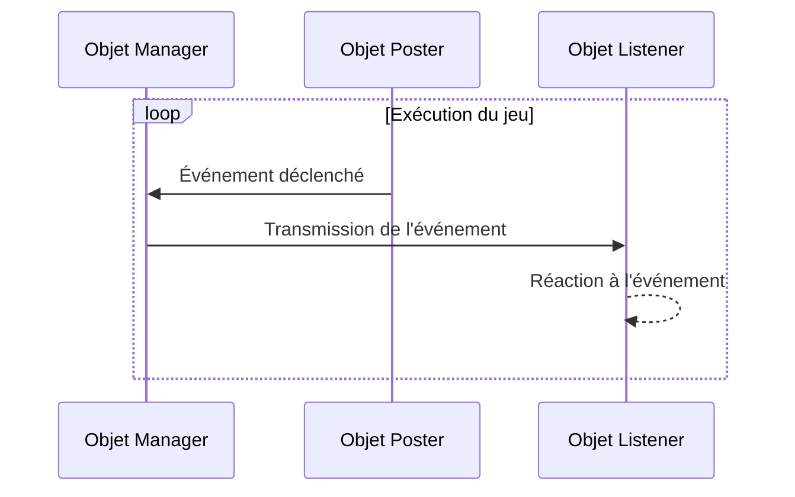

## **Introduction**

La programmation événementielle (Event Driven Programming) est un paradigme où le flux du programme est déterminé par des événements. Elle gère la survenue, la gestion et l'exécution des événements, et est utilisée pour améliorer l'extensibilité du code ainsi que sa lisibilité et sa maintenabilité. M'ayant été très utile dans [un autre projet de développement de jeu](https://hyngng.github.io/posts/armonia-first-devlog/), j'ai pensé la résumer par écrit pour pouvoir l'utiliser à l'avenir.

## **Concepts de base**

- La programmation événementielle s'articule autour de trois concepts :
	- Manager : propage les événements à des objets spécifiques
	- Listener : réagit à des événements spécifiques
	- Poster : déclenche des événements spécifiques

Le rôle de manager est généralement assuré par un seul script manager comme `GameObject.cs`, mais les rôles de listener et poster peuvent être assumés par un même objet (les deux) ou un seul des deux.

Par exemple, dans une situation où une explosion se fait entendre et où les PNJ alentour regardent dans la direction du bruit, l'objet qui produit l'explosion est le poster, et les objets environnants sont les listeners. Mais si l'objet qui produit l'explosion est aussi un PNJ réagissant à cet événement, il peut jouer les deux rôles.

## **Visualisation de la structure**



## **Code de base**

### **Event Manager**

:::info
Le code est assez long !
:::

```cs
public enum EventType
{
    FirstExampleEvent,
    SecondExampleEvent,
    /* ... */
}
```

```cs
public class EventManager : MonoBehaviour
{
    public static EventManager Instance { get { return instance; } }    
    private static EventManager instance = null;

    public delegate void OnEvent(EventType eventType, Component Sender, object Param = null);
    private Dictionary<EventType, List<OnEvent>> Listeners
        = new Dictionary<EventType, List<OnEvent>>();

    void Awake()
    {
        if (instance == null)
        {
            instance = this;
            DontDestroyOnLoad(gameObject);
            return;
        }
        DestroyImmediate(gameObject);
    }

    public void AddListener(EventType eventType, OnEvent Listener)
    {
        List<OnEvent> ListenList = null;

        if (Listeners.TryGetValue(eventType, out ListenList))
        {
            ListenList.Add(Listener);
            return;
        }

        ListenList = new List<OnEvent>();
        ListenList.Add(Listener);
        Listeners.Add(eventType, ListenList);
    }

    public void PostNotification(EventType eventType, Component Sender, object param = null)
    {
        List<OnEvent> ListenList = null;

        if (!Listeners.TryGetValue(eventType, out ListenList))
            return;

        for(int i = 0; i < ListenList.Count; i++)
             ListenList?[i](eventType, Sender, param);
    }

    public void RemoveEvent(EventType eventType) => Listeners.Remove(eventType);

    public void RemoveRedundancies()
    {
        Dictionary<EventType, List<OnEvent>> newListeners
            = new Dictionary<EventType, List<OnEvent>>();

        foreach(KeyValuePair<EventType, List<OnEvent>> Item in Listeners)
        {
            for (int i = Item.Value.Count - 1; i >= 0; i--)
                if(Item.Value[i].Equals(null))
                    Item.Value.RemoveAt(i);

            if (Item.Value.Count > 0)
                newListeners.Add(Item.Key, Item.Value);
        }

        Listeners = newListeners;
    }

    public void RemoveListener(Event eventType, OnEvent listener)
    {
        List<OnEvent> listenList = null;

        if (Listeners.TryGetValue(eventType, out listenList))
            listenList.Remove(listener);
    }

    void OnLevelWasLoaded()
    {
        RemoveRedundancies();
    }
}
```

Une approche utilisant les délégués. On utilise également le [pattern singleton](https://hyngng.github.io/posts/singleton-pattern/) pour permettre aux objets listeners d'utiliser certaines méthodes, et les événements sont définis via `enum`. Le code fait près de 80 lignes, mais il n'est pas difficile car il se compose de 5 méthodes distinctes.

- Délégués et champs
	- `OnEvent()` : délégué qui enregistre la méthode de réaction d'un listener à un événement.
	- `Listeners` : dictionnaire dont la clé est l'événement et la valeur un `List<OnEvent>`. Il associe un événement spécifique à ses réactions.
- Méthodes
	- `AddListener()` : enregistre la réaction d'un objet à un événement sous forme de méthode.
	- `PostNotification()` : méthode utilisée par l'objet poster pour déclencher un événement.
	- `RemoveEvent()` : supprime un événement spécifique du dictionnaire `Listeners`.
	- `RemoveRedundancies()` : une sorte de vérification d'intégrité. Supprime un événement s'il n'y a rien à exécuter pour lui.
	- `RemoveListener()` : supprime un objet du dictionnaire `Listeners` lors de sa destruction pour éviter une erreur `NullReferenceException`.

### **Event Listener**

```cs
public class ListenerObject : MonoBehaviour
{
    void Start()
    {
        EventManager.Instance.AddListener(Event.ObjectAccessed, OnEvent);
    }

    public void OnEvent(EventType EventType, Component Sender, object Param = null)
    {
        switch (EventType)
        {
            case EventType.FirstExampleEvent:
                /* Zone d'écriture du comportement de l'événement */
                break;
        }
    }

    void OnDestroy()
    {
        EventManager.Instance.RemoveListener(Event.ObjectAccessed, OnEvent);
    }
}
```

Au démarrage du jeu ou à la création de l'objet, on ajoute un listener via `EventManager.AddListener()` pour détecter l'événement souhaité. Lorsque l'objet est détruit, on supprime la méthode enregistrée via `EventManager.RemoveListener()` pour éviter des erreurs mineures ou des appels d'événements superflus.

La méthode `OnEvent()` est appelée lorsqu'un événement se produit. Elle reçoit le type d'événement, l'objet qui l'a déclenché et des paramètres supplémentaires, et peut traiter différentes logiques selon le type d'événement via un `switch`. Dans cet exemple, elle est configurée pour écrire une logique spécifique pour l'événement `FirstExampleEvent`.

## **Exemple d'utilisation**


Exemple tiré d'un [jeu en cours de développement](https://hyngng.github.io/posts/armonia-first-devlog/). Lorsqu'un objet spécifique est sélectionné, certains objets interactifs s'affichent dans des tons jaunes ; lorsqu'on le désélectionne, ils retrouvent leur état initial. Cela a été implémenté via la programmation événementielle.
