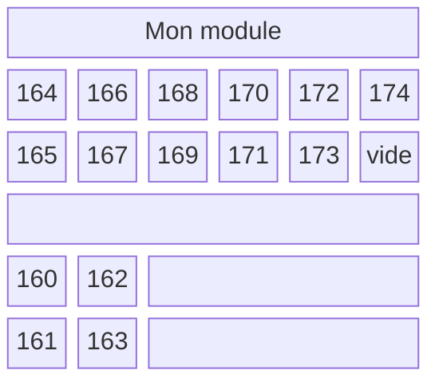

J'ai la tête encore ailleurs. Le temps qui s'écoulait lentement a soudainement disparu, et me voilà sorti du centre d'entraînement, écrivant chez moi.

J'ai fait partie de la premier contingent ayant rejoint juste après l'explosion de grenade du 21 mai 2024 et le décès d'une recrue suite aux sévices d'un commandant de compagnie le 23 mai 2024. Étant également un service complémentaire, j'ai remarqué que l'on nous accordait des égards notables au centre d'entraînement. Ce n'est pas tant que l'entraînement lui-même était plus facile, mais plutôt que les mêmes enseignements étaient dispensés dans des endroits aussi frais que possible, ou que la rigueur militaire était adoucie.

Le programme et l'ambiance du service complémentaire étaient également plus laxistes par rapport au service actif. Contrairement aux soldats actifs dont l'affectation dépend de leur vie au centre, les services complémentaires savent déjà ce qu'ils feront après la formation. Peut-être est-ce pour cela. Chez nous, il y avait même un camarade du même âg, original, qui était venu exprès parce qu'on lui avait dit que le centre d'entraînement était amusant, alors qu'il attendait son transfert vers le service de travail en cas de guerre.

J'avais apporté un cahier et une trousse au centre, et j'ai tenu un journal quotidiennement. Au total, 14 pages ont été remplies. Après la formation, j'ai retravaillé ces notes à la maison pour en faire cet article de blog.

## **Préparation avant le centre**

J'ai emporté quelques affaires. En ressortant, je me suis dit qu'on pourrait très bien venir les mains vides sans trop de problème, mais certains objets se sont révélés utiles. Voici ce que j'avais :

|Affaire|Raison|Utile ?|
|---|---|---|
|Montre Casio F-91W-1|Pour vérifier l'heure|Utile partout. Vraiment bien|
|Semelles Daiso (2 paires)|Pour mettre dans les rangers|Vraiment excellent dans les rangers de combat|
|Bouchons d'oreille 3M (2 paires)|En réserve|Incomparablement meilleurs que ceux de l'armée|
|Cahier et trousse|Pour écrire un journal et dessiner|Je m'en suis servi quelques fois, mais finalement, c'était du poids mort|
|Shampoing, gel douche|En réserve|Bien, mais un produit tout-en-un est mieux|
|2 livres|Pour tromper l'ennui|Finalement du poids mort, à part une courte lecture pendant les gardes|
|1 rouleau de PQ|En réserve|Je n'ai même pas fini le PQ de l'armée|
|Boîte à brosse à dents|Un ami insistait pour que je l'apporte|L'armée a fourni une boîte, donc inutile|

Dans mon module, la plupart des gens apportaient juste un shampoing et un gel douche, mais certains avaient apporté des sachets de Café Nescafé ou de Pocari Sweat à partager. Les chercheurs (spécialistes) avaient même apporté des articles ou des livres. J'avais moi-même pris deux livres, ayant entendu dire que la vie au centre était ennuyeuse.

Un objet que j'aurais aimé avoir est un masque de sommeil. La veilleuse rouge allumée la nuit peut déranger le sommeil des personnes sensibles.

## **Résumé d'une journée type au centre**

Avant d'écrire le journal, j'ai d'abord listé les éléments communs qui se répètent chaque jour. Voici comment se déroule une journée au centre d'entraînement :

```mermaid
gantt
    title Routine normale
    dateFormat HH:mm
    axisFormat %H:%M

    section Appel du matin
    Sommeil: 00:00, 06:30
    Lever et toilette: 06:30, 07:00
    Appel du matin et petit-déjeuner: 07:00, 09:00

    section Matinée
    Instruction et entraînement: 09:00, 12:00
    Déjeuner: 12:00, 13:00

    section Après-midi
    Instruction et entraînement: 13:00, 17:30
    Dîner: 17:30, 18:30
    Douche et temps personnel: 18:30, 20:30

    section Appel du soir
    Nettoyage et attente de l'appel: 20:30, 21:30
    Appel du soir: 21:30, 22:00
    Coucher: 22:00, 2h
```

La routine de base est comme ci-dessus, mais selon le règlement, à partir du mois de juin, les recrues sont classées comme « période chaude » et suivent un programme adapté à la canicule. Ce programme modifié se déroule comme suit :

```mermaid
gantt
    title Routine canicule
    dateFormat HH:mm
    axisFormat %H:%M

    section Avant l'appel du matin
    Sommeil: 00:00, 03:00
    Lever et toilette: 03:00, 03:30
    Instruction et entraînement: 03:30, 07:00
    Petit-déjeuner: 07:00, 08:00
    Instruction et entraînement: 08:00, 12:00
    Déjeuner: 12:00, 13:00
    Temps personnel: 13:00, 14:00
    Sieste: 14:00, 16:00
    Instruction: 16:00, 17:30
    Dîner: 17:30, 18:30
    Douche et temps personnel: 18:30, 19:30

    section Appel du soir
    Nettoyage et attente de l'appel: 19:30, 20:30
    Appel du soir: 20:30, 21:00
    Coucher: 21:00, 3h
```

La particularité de la routine canicule est que le coucher est avancé à 21h et le lever à 3h du matin. Elle commence avant la fin de la première semaine et demande un certain effort, mais il faut s'y faire.

## **Archive**

- 26e Régiment, 24-24e promotion (entrée le 13 juin, fin le 4 juillet)

## **Journal du centre**

### **Semaine 1**

#### **Jour 1**

Premier jour d'entrée. La cérémonie d'accueil est brève au bureau d'examen du centre d'entraînement de l'armée : on chante l'hymne national, on fait un salut rapide, et c'est fini.

On dit que les instructeurs se transforment immédiatement en démons après le départ des parents, mais en réalité, diverses procédures administratives ont commencé dans un calme relatif. Après le départ des parents, on s'est déplacé près de l'endroit où ils étaient assis pour subir divers examens et questionnaires : vérification de notre identité avec la carte nationale d'amour et la pièce d'identité, et remplissage de 4 à 5 questionnaires sur la santé mentale (dépression, suicide, etc.).

Pendant ce temps, les procédures d'admission se poursuivent. On reçoit une bouteille d'eau glacée de 500 mL et un badge avec notre numéro de matricule. L'instructeur mesure le tour de tête de chacun avec un mètre ruban pour la distribution du béret, et on installe la célèbre application mobile de sécurité du ministère de la Défense. Dans ce chaos général, après toutes ces étapes, on traîne sa valise jusqu'au régiment assigné. La distance à vol d'oiseau n'est pas grande, mais il faut passer par le bataillon d'accueil et le gymnase, ce qui fait un long trajet. L'environnement inconnu, le silence gêné, seulement troublé par le roulement des valises, créaient une atmosphère tendue.

Arrivés au régiment et à la compagnie d'instruction assignés, on nous dépoussière avec un compresseur avant d'entrer dans nos modules. Une fois dans le module, on recouvre immédiatement les lits avec des housses, dont la matière est très rugueuse et tendue. Tout le monde, sans exception, se blesse aux deuxièmes phalanges du majeur et de l'annulaire. Après un certain temps, on se rend à la salle de cours de notre compagnie pour recevoir deux séries de haut et bas de treillis de campagne, chacun à notre taille. On se change immédiatement et on range sa valise dans le bac attribué à chaque module, en les empilant comme des Tetris.

Le premier jour, sans entraînement ni instruction particuliers, on remplit plusieurs questionnaires sur la santé mentale, très similaires à ceux du bureau d'examen. On vérifie le panier caché sous le lit contenant les fournitures de base (dentifrice, brosse à dents, savon, serviette), puis on dîne. Après le repas, douche aux bains publics, et la journée se termine dans une atmosphère très étrange.

Une journée vraiment vide et étrange. Le silence persiste entre des gens qui ne se connaissent pas. J'avais apporté des affaires de chez moi (livres, cahier, trousse), mais je ne savais pas si j'avais le droit de les sortir, alors j'ai passé mon temps à regarder bêtement ma montre en attendant de m'endormir.

#### **Jour 2**

Premier réveil au centre et jour d'instruction au drill.

Réveil à 6h30 au son de la célèbre sonnerie, puis premier appel du matin. Encore à moitié endormi, on fait une toilette rapide, on prend son livret d'instruction pour nouvelle recrue, et on se met en rang par 3 sur la route à côté de la compagnie. Après vérification de l'effectif, on se dirige vers la cour pour l'appel du matin : comptage des effectifs de la compagnie et vérification de l'état de santé.

Ce premier appel du matin, dans une ambiance un peu fraîche, m'a marqué par la puissance et la vigueur des voix du commandant de section et du commandant de compagnie. Voir pour la première fois les ordres se transmettre rapidement du chef de groupe au chef de section, puis au commandant de compagnie, puis au commandant de bataillon d'instruction — c'était vraiment l'« armée » dont j'avais entendu parler. C'est là que j'ai vraiment réalisé que j'étais dans l'armée.

Après l'appel du matin et le petit-déjeuner, nous avons eu une instruction de base au drill dans le module. Normalement, elle aurait dû se dérouler à l'extérieur, sur la cour, mais à partir de notre promotion de juin, classée « période chaude », elle a eu lieu à l'intérieur. Le chef de groupe nous a appris les positions de base : garde-à-vous, repos, repos libre, demi-tour, etc. L'évaluation se faisait par groupes de 4 par module, sans être trop pointilleuse — on était reconnu si on maîtrisait les mouvements.

Ce jour-là, on a également choisi les chefs de groupe et les chefs adjoints parmi les recrues. Alors que le chef adjoint est un rôle purement formel sans réelle présence, le chef de groupe est appelé à droite à gauche et en bave, donc je m'attendais à une guerre d'usure pour l'éviter. Mais dans mon module, quelqu'un s'est porté volontaire, disant qu'on pourrait avoir droit à des friandises ou des pauses clopes. Ça a simplifié les choses.

Après le déjeuner, on est allés à l'armurerie d'un autre bâtiment de la compagnie pour recevoir notre arme individuelle, correspondant à notre matricule. C'était la première fois que je voyais en vrai le célèbre fusil K2. On m'avait dit qu'il était lourd, et il pesait exactement ce que j'imaginais. Le garde-main et la crosse étaient couverts d'égratignures et de marques de choc. Cette arme, on la porte pendant les entraînements jusqu'à la veille de la fin, et on la range dans l'armurerie du module le reste du temps.

Je ne me souviens plus exactement quand, mais un camarade de module a obtenu une permission de deux jours pour raisons familiales. C'était un père de famille, probablement pour quelque chose en rapport avec son enfant.

Ce jour-là, en collation, nous avons eu des biscuits ABC Choc & Crème, des chips Pizza, et du café en canette Starbucks.

#### **Jour 3**

Jour d'instruction au drill collectif et au drill avec arme.

C'était mon premier tour de garde. À mon réveil, la personne déjà réveillée m'a passé les consignes : le mot de passe du jour (c'était « Nylon Essence »), les particularités, etc. Je devais me lever à une heure donnée et rester « éveillé » pendant une heure, littéralement à ne rien faire. Au bout de 30 minutes, je devais vérifier la température et l'humidité de la zone de mon module, puis aller la rapporter à la recrue qui les enregistrait au bureau de garde. À 45 minutes, réveiller la personne suivante, et une fois qu'elle était sortie, je pouvais me recoucher. Malheureusement, il y avait un ronfleur vraiment très fort dans mon module, donc j'ai passé le reste de la nuit les yeux grands ouverts.

En principe, le samedi est un jour sans entraînement, mais le premier samedi fait exception. La course à pied du matin a été ajoutée à l'appel, mais ce jour-là, elle a été simplifiée : on a simplement parcouru à pied le parcours de mesure de 1,5 km prévu pour plus tard.

La journée s'est déroulée avec, grosso modo, du drill collectif avant le déjeuner et du drill avec arme après. Pour le drill collectif, on est allés au gymnase, on a appris les formations de base (intervalle de deux bras, intervalle individuel, intervalle serré, alignement à gauche ou à droite, formation en colonne par deux, etc.), on a pratiqué par module, puis on a passé l'inspection du chef de groupe. Pour le drill avec arme, on est retournés au gymnase, on a appris les positions de base (arme sur l'épaule, arme au pied, etc.), puis on a eu directement la cérémonie de remise des armes.

Ce jour-là, on a commencé à se présenter plus en détail et l'ambiance du module a commencé à se réchauffer. C'est aussi le jour où la communication a commencé entre les recrues et les chefs de groupe.

Je ne me souviens pas de l'heure exacte, mais on nous a distribué les treillis de combat et les rangers.

Collation : Coca en canette.

:::info
Anecdote du jour
- Un chercheur de 29 ans de mon module a été appelé au bureau de garde à l'heure du coucher pour un mot de fin de journée du type « Bonne journée à tous ». À partir de ce jour, on l'a surnommé « le gars de la radio ».
- Pendant le temps libre, un camarade qui ne savait pas quoi faire jouait au billard ou aux billes avec des bouchons de bouteille sur le bureau.
:::

#### **Jour 4**

Premier jour de repos réel en tant que recrue. Pas complètement sans programme : on sort les matelas pour les aérer au soleil, et on reçoit les gourdes que les chefs de groupe ont désinfectées à la vapeur.

C'est aussi le premier jour où les téléphones portables sont autorisés, de 14h30 à 15h30. Étant donné la période de notre entrée, un message a été diffusé au bureau de garde : « Compte tenu du contexte, n'oubliez pas d'appeler vos parents. » J'ai téléphoné 30 minutes, et j'ai passé le reste du temps à rattraper des webtoons. Les autres regardaient YouTube ou Instagram, mais les pères de famille exhiber les photos de leurs enfants.

Après la période de téléphone, on a eu une séance de remplissage des exercices du livret d'instruction. Les questions n'étaient pas difficiles, mais il y en avait beaucoup et il fallait chercher dans tout le livret. Dans mon module, on s'est réparti les parties, les chercheurs prenant une charge plus lourde, puis on s'est échangé les livrets. Les chefs de groupe nous motivaient en disant qu'on pourrait regarder la télé si on finissait vite, mais la quantité était trop grande, donc on n'a vu qu'un clip d'Aespa.

La recrue qui avait obtenu une permission deux jours plus tôt est revenue. Tout le monde était content de la revoir.

Collation ce jour-là aussi, mais je n'ai pas noté quoi.

:::info
Anecdote du jour
- Lors de l'inspection du livret de base, d'autres recrues ont montré mon écriture au chef de groupe, qui a complimenté : « Hé, belle écriture ! » C'est à partir de là qu'on m'a surnommé « le scribe ».
- Enquête sur les volontaires pour les vaccins (tétanos, etc.). Dans mon module, un chercheur en pharmacie (doctorat) a dit que ce serait bien de se faire vacciner. Résultat : « Bon, c'est chiant, alors on y va tous. »
- Répliques mémorables de camarades : « Si vous nous faites encore plus souffrir, je vole tous les Cocas », « Donnez-nous deux Cocas et on vous montrera les réponses », « On disait qu'à l'armée on devient constipé, mais moi j'ai la chiasse ».
:::

#### **Jour 5**

Jour d'examen médical et de préparation à l'entraînement.

Ce matin, avant l'appel, j'ai mis les semelles Daiso dans mes rangers. Le confort était incomparable, très moelleux. Les courses matinales, mais aussi les longs trajets vers les champs d'entraînement ou les marches, ont considérablement soulagé la fatigue des pieds et des jambes.

Après la course, on nous a distribué une poudre de réhydratation, Rehive Mix. Tout le monde l'a essayée par curiosité, et l'avis unanime était qu'elle n'était pas bonne. Sensation gustative indéfinissable, bizarre. Après ça, personne n'en a plus jamais repris jusqu'à la fin.

Ensuite, après le petit-déjeuner, test d'urine et test de tuberculose. Simple, mais il y avait beaucoup de monde, donc on a passé la matinée à attendre. Comme à l'école : on faisait la navette entre le couloir de la compagnie et le bus de dépistage. Après le déjeuner, direction un bâtiment hors de la compagnie pour les vaccins contre le méningocoque et le tétanos. Au retour, on a rempli les exercices du livret sur les grenades et les premiers secours jusqu'au dîner.

Après le dîner, distribution par module des plaques d'identité en cuir (appelées « lézard » au centre) à coudre sur le treillis et le béret, ainsi que du matériel de couture. Les plaques portaient les informations régiment, compagnie, matricule. J'ai reçu une plaque pour le treillis (`26-1-XXX`) et une pour le béret (`01-XXX`). Personne n'était vraiment doué pour la couture. Selon le règlement, il faut coudre en X à six endroits autour de la plaque, mais tout le monde s'en est sorti avec des points droits.

Personnellement, à partir de ce jour, la tension du premier jour s'est beaucoup relâchée, et le drill et le salut sont devenus plus naturels. Je commençais à m'habituer à la vie au centre.

Collation du jour : Bints et Monster Zero (blanc).

:::info
Anecdote du jour
- En allant déjeuner, un ancien chef de groupe recrue s'est fait prendre par le chef de groupe et a subi un drill : « Recrue, le drill c'est un jeu ? T'es venu en vacances ? On continue jusqu'à ce que t'y arrives. Marche sur place, une ! deux ! trois ! quatre !... » Le plus drôle, c'est qu'après un moment, la recrue a timidement avoué « Je suis un peu bête » et le chef de groupe a mal compris, disant « Je suis un peu con », ce qui a failli empirer la situation.
- Après l'appel du soir, cette recrue a sincèrement confié à son chef de groupe qu'il voulait rentrer chez lui. Il jouait le rôle de chef de groupe, et contrairement à ce qu'il avait entendu, il n'y avait aucun avantage. Il était aussi franchement en colère à cause de ce qui s'était passé à midi. Le chef de groupe l'a écouté, puis l'a calmé en disant de dormir d'abord et d'y réfléchir.
:::

#### **Jour 6**

Jour de formation sur l'ennemi.

J'étais de garde à 3h du matin. Il y avait un ronfleur, et je n'arrivais pas à me rendormir après la garde, donc j'ai passé la journée éveillé malgré le Monster Zero de la veille. Ce matin-là, l'appel s'est déroulé de manière particulière : seul notre module a été exempté pour faire le tour du bâtiment en ramassant les déchets, probablement à cause d'un mauvais score au système de points.

Après le petit-déjeuner, nous avons suivi une formation sur l'ennemi en intérieur via la télévision toute la matinée et l'après-midi. Le message principal était « notre ennemi principal est la Corée du Nord ». Après la formation, nous avons rédigé une dissertation sur la valeur de la Corée du Sud et notre détermination à protéger la patrie. Ensuite, nous avons eu une autre séance d'exercices du livret.

Le chef de groupe est passé voir les recrues ayant des problèmes de santé (scoliose, anomalies urinaires) pour leur demander s'ils voulaient rentrer chez eux, et a aussi enquêté sur les besoins en patchs nicotiniques. Il en a profité pour nous raconter quelques anecdotes :

- « Les gaz chimiques sont difficiles à décrire, mais c'est comme tremper du wasabi dans du charbon. »
- « À cause de l'accident récent, même les soldats actifs ne peuvent pas lancer de vraies grenades. Vous non plus. Moi j'ai lancé une vraie grenade d'une colline, et sans mentir, le sol a vibré, j'en ai eu des frissons. »
- « La marche se fait par étapes de 5 km avec des pauses. Pendant ma formation, un camarade de 48 kg demandait s'il devait vraiment porter un sac de moitié de son poids. Il a terminé la marche. Moi, j'ai marché en clopinant pendant 3 jours après. »
- « La promotion juste avant vous a passé la première semaine en quarantaine à cause du Covid ; avant, il y a eu des périodes où les 3 semaines entières se faisaient en Zoom. »

Collation : biscuits Cookdas et canette 2%. J'ai reçu le schéma de démontage du fusil ce jour-là. Coucher à 21h à cause du programme canicule.

::info
Anecdote du jour
- La recrue qui voulait rentrer chez elle s'est calmée après une bonne nuit de sommeil.
- Ayant été corrigé la veille pour le drill, il s'est appliqué et a reçu des points de récompense.
- Pendant le temps libre, j'ai écrit une lettre pour un autre camarade.
:::

#### **Jour 7**

Jour de test physique et de formation au démontage du fusil.

La routine canicule a commencé ce jour-là : réveil à 3h du matin. L'appel du matin a été simplifié, puis nous avons eu le test de course de 1,5 km, suivi des redressements assis et des pompes. Chaque épreuve avait un seuil de réussite ; l'échec à l'une d'elles entraînait une formation supplémentaire. J'ai réussi les redressements assis (59) et les pompes (30), mais j'ai échoué à la course (134e) et j'ai dû suivre un entraînement complémentaire.

Pendant une pause, le chef de section nous a raconté quelques histoires :

- Le K2 a un centre de gravité mal équilibré. Le M4 américain est équilibré autour de la gâchette, mais le K2 est plus lourd côté garde-main.
- Lui-même se préparait à être démobilisé pour raisons médicales. Il en avait assez de voir la souffrance des autres devenir son problème.
- Pour la préhension du fusil, il faut adopter la position la plus confortable.

Après le déjeuner et la douche, nous avons eu une sieste de 14h à 16h. Au réveil, nous avons regardé une vidéo éducative sur les armes individuelles, puis nous avons reçu un nouvel uniforme appelé « grade A ».

Collation : Pringles oignon-vinaigrette et Pocari Sweat.

::info
Anecdote du jour
- Le plus jeune du module a perdu à pierre-feuille-ciseaux et a dû faire les corvées : compter et emballer les plateaux-repas pour le lendemain.
:::

### **Semaine 2**

#### **Jour 8**

Formation au démontage du fusil, à la position de tir et à la vérification de sécurité.

Après l'appel du matin, nous nous sommes rendus au terrain d'entraînement en tenue de combat. Le démontage du fusil devait être effectué dans un temps limité, du régulateur de gaz au percuteur, puis remonté. Les positions de tir (debout, assis, couché) ont été apprises et pratiquées avant la validation par le chef de groupe.

Personnellement, j'ai eu quelques difficultés : l'équipement de combat était assez serré, j'ai coincé mon index droit dans le démontage du fusil (vaisseau sanguin éclaté), et tenir le K2 en position debout était épuisant.

De retour au module, nous avons rempli un questionnaire sur le soldat idéal, la satisfaction alimentaire et les habitudes intestinales. Après le dîner, nous avons reçu nos affectations pour le tir du lendemain (5e groupe, 3e tireur). On nous a aussi distribué des bouchons d'oreille, mais ils étaient fins, durs et déchirés — je ne les ai pas utilisés.

Collation : gaufrettes à la fraise.

::info
Anecdote du jour
- La recrue qui voulait rentrer chez elle a été réconfortée par le chef de section.
- Une rumeur circulait sur un module voisin où des intimidations avaient eu lieu.
- La blessure au doigt du premier jour guérissait.
- J'ai été pénalisé pour mon drill en allant manger.
:::

#### **Jour 9**

Premier tir réel.

Nous nous sommes rendus au pas de tir avec équipement de combat. Le chemin passait par un pont piétonnier au-dessus de l'autoroute — le fameux « pont des lamentations » (Soryong). La distance était d'environ 3 km.

Le déroulement du tir :

1. Attente et distribution des bouchons d'oreille militaires.
2. Vérification de sécurité puis entrée dans le pas de tir.
3. Ordres de la tour de contrôle exécutés à voix haute.
4. Tir couché par série de 3 coups.
5. Vérification de la cible et réglage après chaque série.
6. Après le tir, vérification de sécurité (culasse, chambre).
7. Évaluation : 2 impacts sur 3 dans le cercle = réussi.
8. Les non-réussis recommençaient jusqu'à réussite.

Le bruit du tir ressemblait à une explosion. Le recul donnait l'impression de trois petites poussées sur l'épaule. La flamme à la bouche n'était pas visible. J'ai bien tiré : mes impacts étaient groupés. Mon chef de groupe m'a complimenté : « Oh, vous tirez bien ! Réglez vos organes de visée : 3 à droite, 7 en bas. » J'ai réussi du premier coup (environ 1/3 de réussite). Certains ont dû tirer jusqu'à 36 balles.

Sur le chemin du retour, on nous a donné de la glace à mettre dans nos casques (système « oasis »). L'eau de fonte coulait sur notre nuque. De retour, le chef de section nous a félicités.

Collation : saucisson sec, biscuits et canette Milkis 250 ml.

::info
Anecdote du jour
- En jetant les ordures le soir, je me suis légèrement décollé l'ongle du pouce droit.
:::

#### **Jour 10**

Jour de repos avec garde à 1h du matin.

Il pleuvait, donc nous portions des ponchos. L'après-midi, première visite au PX (type supermarché). J'ai acheté des cosmétiques Dokdo et deux t-shirts ROKA pour environ 50 000 wons. Certains ont dépensé jusqu'à 600 000 wons en cadeaux. Retour au module, puis téléphone de 15h à 16h — j'ai appelé mes parents et des amis. Ensuite, TV autorisée : nous avons regardé *Old Boy*.

Enquête sur les donneurs de sang et les participants aux activités religieuses.

#### **Jour 11**

Jour de corvée de nettoyage (세척조).

Nous avons été exemptés de l'appel du matin pour préparer le nettoyage. Les rôles : plateau-repas, bol à soupe, multi-assistance, déchets alimentaires (le plus dur), et déchets généraux (le plus facile). Le nettoyage était épuisant et salissant. Un sous-officier strict nous a fait tout recommencer 2-3 fois pour quelques grains de riz.

Après le dernier nettoyage, nous avons vu la vidéo sur les gaz chimiques que nous avions manquée la veille (sans son, les haut-parleurs ne marchaient pas).

La douche ce jour-là était particulièrement agréable.

::info
Anecdote du jour
- Un instructeur nous a refilé une glace du petit-déjeuner. En demandant au chef de groupe, ils ont tous réagi en reconnaissant la personne.
- Quelqu'un versait du reste de soupe dans l'évier où on lavait les couverts.
- On a reçu des points de pénalité pour avoir laissé le tapis en désordre en partant au nettoyage.
:::

#### **Jour 12**

Le fameux entraînement aux gaz chimiques.

Le terrain se trouvait à 4 km. Déplacement en tenue de combat. Formation à la mise du masque à gaz (9 secondes objectif, mais juste une vérification). Le masque limite la vision et rend la respiration difficile. Un camarade a failli s'étouffer et a dû être retiré de l'entraînement.

Dans la chambre à gaz : entrée sans enlever le masque, juste démontage/remontage du filtre. J'ai eu un peu de gaz juste avant et après — goût plus dégoûtant que la capsaïcine, sensation de quelque chose dans la bouche et la gorge. Après la sortie, on a agité les bras et rincé la peau.

Retour au module, sieste, puis vidéos sur les grenades et les premiers secours.

Collation : Tartelettes fraise, saucisse Maxbong, Coca-Cola Zero.

::info
Anecdote du jour
- Un camarade s'est blessé à la cheville au retour du terrain. Le chef de groupe a temporisé, mais le chef de section est venu et a immédiatement organisé son transfert à l'hôpital. Applaudissements.
:::

#### **Jour 13**

Entraînement aux grenades.

Journée qui a commencé par une garde. Le froid et la fatigue cumulés étaient épuisants. Le terrain de grenade était plus proche que celui des gaz, mais encore loin.

La procédure : « Réception de la grenade — vérification de la cible — retrait de la sécurité — doigt dans l'anneau — retrait de l'anneau, lancez ! — Un, deux, trois, vérification cible. » Il fallait lancer 4 grenades : une seule passant le grillage suffisait. Les trois premières ont échoué, la dernière a réussi de justesse.

Au retour, le commandant de compagnie a rassemblé la 1re compagnie : « La discipline et le drill, c'est n'importe quoi. Vous vous croyez en vacances ? » Puis il a conclu par « Désolé de m'être emporté », ce qui a fait retomber la tension.

Le petit-déjeuner ce jour-là était le pire de tout le séjour.

Collation : canette de 500 ml de Sikhye Birak.

::info
Anecdote du jour
- Un camarade avec un mal de dent est allé à l'hôpital et a eu un traitement de canal.
:::

#### **Jour 14**

Test de course de 3 km et exercices de combat individuel.

Pas de garde, bonne nuit de sommeil mais toujours fatigué. Test de 3 km : je me suis volontairement exempté vu mon échec au 1,5 km. J'ai fait de la gymnastique militaire à la place.

Les exercices de combat (ramper bas, ramper haut) étaient physiquement exigeants — la plus intense des formations. Le chef de groupe montrait d'abord, puis nous faisait répéter en cadence.

Pendant les pauses, je me souviens de deux choses : un soldat actif qui taquinait en disant qu'il partait la semaine prochaine, et le paysage de l'entraînement qui semblait étrangement paisible.

Pendant la sieste, je suis allé à l'infirmerie pour mon rhume. Beaucoup de monde, et des graffitis amusants sur les chaises. J'ai aussi demandé un certificat pour la marche du lendemain à cause de mon dos.

Collation : Honey Butter Baguette et Monster Black.

::info
Anecdote du jour
- Il y avait un footballeur dans ma promotion, et il a terminé largement premier à la course.
:::

### **Semaine 3**

#### **Jour 15**

Exercices pratiques de combat et marche de nuit.

État physique très mauvais : gorge enflée, très somnolent. Distribution des armes avant l'aube puis départ pour le terrain de combat. Parcours d'obstacles : passage sous des pneus en rampant, sous des barbelés en position couchée sur le dos, course en criant à la fin.

Évaluation des réactions aux situations de combat (rencontre ennemie, blessé, aéronef). Pas difficile, plutôt amusant.

Après le petit-déjeuner, formation au rôle de sentinelle, puis le chef de section nous a appris le combat à la baïonnette (sans enthousiasme, préférant le CQB).

Dernière sieste avant la marche de nuit (14h-18h). Dîner, puis départ à 21h. La marche durait jusqu'à 3h du matin, 6 allers-retours sur le parcours de course (45 min par trajet). Allégement maximal des sacs. Après le 4e tour, collation : Powerade, pizza bread, viande séchée. Au 5e tour, un camarade m'a offert un bonbon Super Sour pour me réveiller.

Fin de la marche : dépose du gilet et du sac trempés de sueur pour séchage. Distribution de ramyeon Shin et d'œufs durs. Environ 2 blessés pendant la marche.

Douche à l'eau froide malgré la promesse d'eau chaude.

Coucher de 4h à 11h.

::info
Anecdote du jour
- Pendant la marche, tout le monde mettait le fusil dans le chargeur du sac. Beaucoup plus pratique.
- La Grande Ourse était très visible grâce au ciel clair.
:::

#### **Jour 16**

Nettoyage du matériel après la marche.

Réveil à 11h, déjeuner, puis récupération des gilets et sacs. Lavage du gilet, des chargeurs, du casque et de la gourde. Nettoyage de la terre sur les couvercles, les chargeurs et le masque.

Tirage au sort pour les corvées de repas du lendemain. Mon module a perdu. Rien de spécial ensuite : temps libre, ménage, appel du soir.

::info
Anecdote du jour
- L'ambiance « on rentre enfin » commençait à se faire sentir.
:::

#### **Jour 17**

Jour de repos, mais corvée de service des repas.

Consigne : beaucoup d'incidents surviennent entre la fin des formations et la cérémonie de fin — restez prudents.

Le service des repas était bien plus facile que le nettoyage. Port du chapeau, gants en plastique et manchons. Les servants mangent en dernier, mais peuvent se servir à volonté.

Entraînement physique complémentaire pour les non-qualifiés à la course (squats, pompes, etc.). Intensité modérée.

Après le déjeuner, fin du film *Old Boy*.

::info
Anecdote du jour
- L'armée prépare 1,2 à 1,5 portion par personne — énorme gaspillage. Trois paquets de Cornflakes intacts ont été jetés.
- Douche à l'eau chaude pour la première fois depuis longtemps. Simple bonheur.
:::

#### **Jour 18**

Jour férié tranquille.

Un camarade a fait tomber une armoire en l'ouvrant. Un chef de groupe est venu avec une perceuse pour la réparer, en plaisantant : « Je suis une perceuse humaine. »

Typhon : pluie et vent. Certains sont sortis sans poncho et se sont fait attraper.

Plus de formations majeures. Temps libre : rangement, lecture, snacks, films (*Les Visiteurs*, *Mademoiselle*, *Faust*).

::info
Anecdote du jour
- Un camarade aux cheveux longs risquait la coupe. Tout le module a convaincu le chef de groupe de le laisser tranquille. Il a terminé sans se faire couper les cheveux.
:::

#### **Jour 19**

Premier jour ouvrable de juillet, après la fin des formations.

Vérification du matériel, distribution de baume pour effacer les graffitis sur les lits. Le module voisin a trop vaporisé de baume — presque une bagarre. Résolution : lettre de réconciliation écrite avec l'aide des chercheurs.

Temps libre, lavage collectif des uniformes. Une autre armoire s'est effondrée — pas de réparation cette fois.

Après l'appel du soir, un sergent-chef a annoncé que c'était son dernier jour de service. Applaudissements de tous les modules. Q&A : son idéal féminin (Oh Hae-won de NMIXX) et ses chefs de groupe préférés.

Collation : Pringles Smokey Barbecue et Monster White Zero Sugar.

::info
Anecdote du jour
- En sortant tard pour ranger les produits d'entretien, on a failli se faire enfermer dehors.
- Un camarade a accroché une amulette météo pour éviter la pluie.
- Temps libre à échanger des badges et manger des snacks.
:::

#### **Jour 20**

Garde à 4h du matin — le pire créneau (8h de sommeil réduites à 6h). Le mot de passe du jour était « culture et pare-chocs, calendrier » — plus long que d'habitude. En vérifiant au réveil, le vrai mot était « pare-chocs et calendrier ». « Culture » était une déformation.

Semaine 3, tout le monde était devenu plus proche et bavard.

Conférence d'un docteur en études nord-coréennes sur « pourquoi la paix par la force est importante ». Intéressant mais basique.

La lettre de réconciliation a été enterrée par le chef de section, qui a réuni la section : « La formation est finie et vous vous entretuez. Normalement, 6 d'entre vous seraient exclus. Mais je veux vous voir tous recevoir votre diplôme. Je vais étouffer l'affaire. »

::info
Pendant ma garde, un instructeur m'a réprimandé pour avoir lu un livre.
:::

#### **Jour 21**

Veille de la cérémonie de fin.

Tout le monde réalisait que c'était bientôt fini. Restitution des armes à l'armurerie, puis répétition de la cérémonie — une dizaine de fois « assis-debout », le drill le plus intense du séjour.

« Jour de la recrue » : spectacle de talents (danse, chant), ambiance de fête scolaire. Climatisation, glace. Retour au module, puis le chef de section a réuni la section pour une poignée de main d'adieu. Il a raconté son parcours, sa main était chaude et rugueuse.

Les chefs de groupe sont passés dans chaque module pour des histoires. J'étais trop fatigué et me suis endormi avant.

Personnellement, j'étais triste. J'avais aimé l'ambiance du module, les repas pris ensemble, discuter sans smartphone.

#### **Jour 22**

Cérémonie de fin.

Restitution des uniformes de sport, rangement des bagages. Dernier petit-déjeuner à l'armée — simple mais j'ai tout mangé. Changement en uniforme A, récupération du téléphone. Temps magnifique.

Rassemblement devant le gymnase, cérémonie : hymne national, chant de l'armée. Photos de groupe avec le module — nous étions un groupe soudé. Adieux, retrouvailles avec la famille.

## **Réflexions après la formation**

Bien que courte sur le papier, l'expérience au centre d'entraînement a semblé durer 1,5 à 2 mois par son intensité. De retour à la maison, l'ambiance paisible rendait la vie au centre irréelle.

Changements notables : prise de poids (~5 kg), rêves occasionnels avec les chefs ou camarades, sevrage de dopamine forcé, et surtout correction du cycle de sommeil (coucher désormais à 22h-23h).

Côté humain, à part le ronfleur, j'ai eu la chance de rencontrer des gens biens — commandants, chefs, camarades. L'ambiance du module était bonne grâce à un camarade du même âge qui animait les discussions et aux chercheurs qui maintenaient une atmosphère saine. J'ai entendu dire que d'autres modules avaient des problèmes — j'ai eu de la chance.

Les chefs de groupe étaient de types variés, mais la plupart étaient des gens consciencieux dans leur rôle.

Au final, une expérience positive grâce à la chance. La meilleure chose : mon cycle de sommeil est passé de 1h-2h du matin à 22h-23h.
