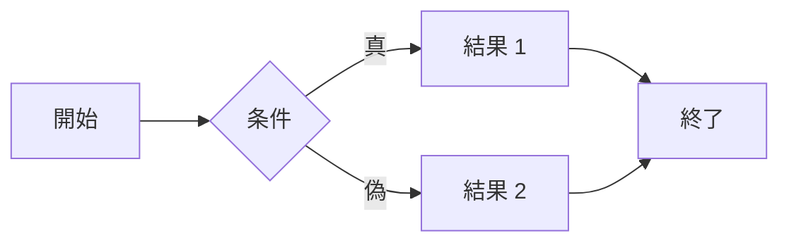

:::info
Jekyllフレームワークを使用していた時に書かれた記事です。現在はAstroに移行しました！
:::

## **はじめに**

[最初のポスト](https://hyngng.github.io/posts/first-post/)以来、ブログを開設してからもう2年近くが経った。実際2年という時間にしてはこれまで書いた記事の数は多い方ではないが、その間愛着がなかったわけではない。様々な公的な用事や私的なことで忙しい時もあり、自分自身の活動が滞る時もあるが、こうして定期的にブログを管理しているのだから。

そうした中で最近ブログを改装し、サイトの検索登録を申請しながら、自分もGitHubブログというプラットフォームに以前よりかなり慣れてきたと思うようになった。以前より記事の作成がかなり楽になり、余った余裕でブログを飾っている。個人的にGitHubブログという選択は賭けに出た割には、プラットフォーム自体の個性を楽しんでいるように思うので、GitHubブログのどのような利点に魅力を感じたのか整理してみようと思う。

## **自由なカスタマイズ**

{: .light .border }
{: .dark }
*最近追加した特定タグ内容の削除機能と、機能が正常に適用された画面*

GitHubブログは全体的に運用難易度が他のプラットフォームに比べて非常に高い方である。その分、関心を持っていろいろと自分で設定しなければならない手間が多いのだが、それでもGitHubブログを選ぶ理由は、ブログ運営の体験が非常に自由だからである。

GitHubブログは他のブログプラットフォームと違い、開放的で柔軟だという印象を常に受ける。他のブログプラットフォームがある程度の垣根の中でサポートされる機能だけを使える閉鎖的な環境であるのに対し、GitHubブログはページを構成する全ての情報を直接修正可能な状態で提供されるため、特にフロントエンドの基礎知識があればほとんどの機能を自作できる。主に以下の言語を用いる。

- Ruby
- Liquid
- SCSS
- JavaScript

私の場合、これに関連してすでに[様々なカスタム設定](https://hyngng.github.io/posts/first-blog-customization/)や[特定の機能実装](https://hyngng.github.io/posts/blog-content-remove/)に関する記事を2回作成した。この他に記事としてまとめてはいないが、LQIPプレビュー画像、Instagramアイコン、Applause-Buttonなどのいくつかのギミックを最近直接追加したりもした。

その分カスタマイズが自由なので、飾る楽しみがあり、これがブログに愛着を持ち続けて運営し続ける動機になる。普段からブログを見ながらどうすればさらに改善できるか、あるいは他の似たタイプのブログを探してどのような良い点を自分のブログにも導入できるか、常に考えるようになる。

## **記事はMarkdownで**

*今見ている記事の段落の作成画面*

この他にGitHubブログの最も大きな特徴の一つは、記事を書く際にMarkdownというマークアップ言語を使うことだ。Markdownには様々な長所と短所があるが、個人的には良い点の方が多いと思う。

なぜなら、Markdownに慣れてしまえば、ボールド体、引用文、区切り線などの記事要素を挿入するたびに編集画面上のボタンを押さなければならない手間がなくなる。文法に十分慣れてしまえば、記事を書く時に手は手でキーボードだけに、目は目で画面だけに集中できる。
さらに私が使っているテーマの場合、数式を表現するための[MathJax](https://www.mathjax.org/)、ダイアグラムや図式を表現するのに適した[Mermaid](https://mermaid.js.org/)など、Markdown文書で使用可能な外部モジュールもよくサポートしているため、記事作成における制約が少なく、むしろ思いのままに記事の品質に集中できた。

例えば、少し気を配れば記事本文に以下のような数式やダイアグラムをすっきりと挿入できる。

**MathJax**
$$
\begin{equation}
  \sum_{n=1}^\infty 1/n^2 = \frac{\pi^2}{6}
  \label{eq:series}
\end{equation}
$$

**Mermaid**

この他にもObsidianのようなMarkdownベースのプログラムとも大きな問題なく互換できる利点もあった。やや不便ではあるがObsidianをモバイルと連携すれば、モバイル環境でも記事の編集が可能である。

## **便利なテーマ固有機能**

*Chirpyテーマの設定画面（_config.yml）の一部*

今使っているこのテンプレートは、最初はすっきりしたデザインとダークモードトグルのサポート、関連記事のレコメンド機能が気に入って選んだが、使っていくうちにテーマレベルでサポートする細かな機能がかなり強力だとわかった。もしGitHubブログを開設してこのテンプレートを使うつもりなら、以下の項目は必ず把握して活用してみてほしい。

- Googleサーチコンソールおよびアナリティクス連携
- ダークモード、ライトモード専用画像の区別
- LQIP（低画質プレビュー画像）、PWA（ウェブアプリ）
- utterance、giscusなどのGitHubベースのコメント機能

上記の機能は共通して見落としがちな部分だが、うまく活用すればブログが書き手と読み手の両方に提供する全体的な体験の質を改善できる。上手に使えば画像を読み込む途中の瞬間をスムーズに処理したり、スマートフォンに自分のブログ専用アプリをインストールしたりするなどの特別な体験を作り出せる。

この他に画像の外周に影を付けたり画像と文章を並列に並べたりするなど、活用度の高い機能がありながら、先に説明したMathJax、Mermaidもブログテンプレートレベルでしっかりサポートしていて、便利に使えている。

## **おわりに**

ただしその反面、少し難しい。開発者でなければ馴染みのないGitHubやウェブページの技術的構成事項をある程度知っていなければ円滑な運営はできず、[Chirpyの公式記事作成ガイド](https://chirpy.cotes.page/posts/write-a-new-post/)を見ればわかるように、単に記事を書く時にも一部の文法を習得しなければならない。広告の挿入や記事の露出も別途の連携サービスがないため、外部の手続きも面倒な方である。

それでもGitHubブログは、プラットフォームへの依存度を下げたい方や技術的好奇心が強い方にとって最高の体験になり得ると思う。確かに難しいが、9割の機能はできあがった状態で提供されるため、絶望的に難しいわけではない。これに加えてプラットフォーム依存度が低く、自分の思い通りにブログを運営できるため、慣れるさえすればやっていけるどころか、それ自体が他に代えがたい達成感と面白さがある。
