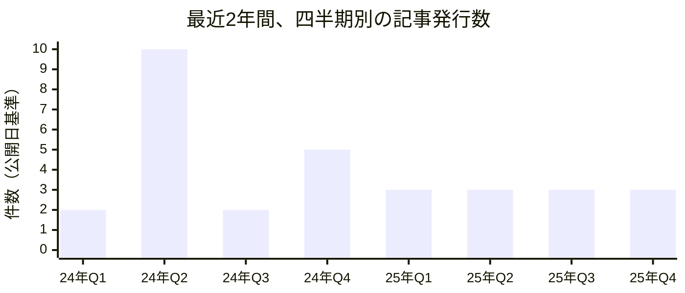
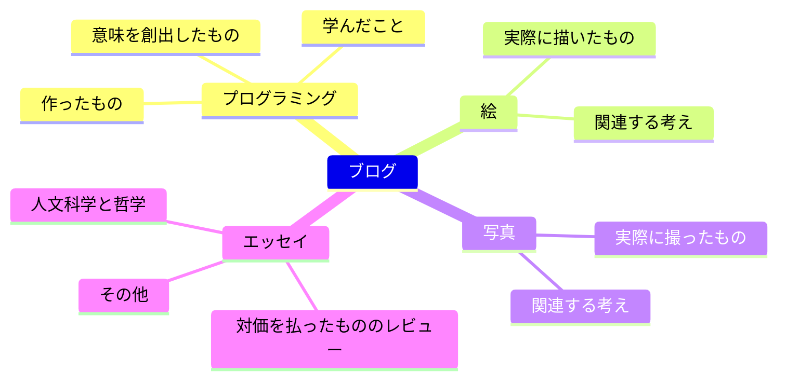

## **なぜブログを始めたのか**

これまで本稿を除いて計42本の記事を書いてきた。まずブログ開設時点を振り返れば、そのきっかけ自体には外部からの影響があった。他のブログで自分が学んだこと、様々な技術的事項、自ら考案した問題解法などを一箇所にまとめているのが格好よく見え、自然と自分のブログも技術ブログの方向を目指すようになった。実際その流れは悪くないので、今もあえてその方向を維持している。今後もプログラミング関連の経験や、その過程で直面した困難を整理した記事を継続的に投稿するつもりだ。

二つ目に、自分をよく説明できる空間を持ちたいと思った。ある時から、初めて会う人に自分がどんな人間かを説明するのが億劫になった。ここが一般に広く使われるSNS、例えばXやスレッズ、Facebook、Instagramなどではなくブログであるのも同じ文脈からだ。SNSは軽い文章の拡散には有利だが、理性を働かせるには良い環境ではなく、一人の人間を誠実に叙述できないからだ。

結論から言えば、この二つの目標は思ったよりうまく達成できているし、以前書いた記事たちに小さな驚きと感慨を覚えている。時間と労力を多く必要とするが、ブログを管理しているのは確かに今の自分の良い点だ。

## **これまでの短く長い軌跡**

### **継続的な執筆のための原則**

二ヶ月を単位として昨年から今までに書いた記事数をまとめると上記のようになる。実際ブログを開設してからどれくらいの頻度で記事を書くべきか悩んできた。昨年は暗黙の裡に二週間に一本を目標とし、実際に月に4〜5本の記事を書いたこともあるが、以下の理由で記事の公開頻度を妥協せざるを得なかった。単に記事の数が多ければブログが豊かになるわけではなかった。ブログへの依存度が高まるほど本来の生活に集中しづらくなり、目標投稿数が多いほど良質な記事を書くのが難しくなる。

25年に入ってからは月の初めか終わかの違いしかなく、毎月一本という頻度を維持している。これも暗黙のパターンなので必ず守る必要はないが、一年ほどこの程度の間合いを保ってみると、忙しい日常とブログの間を適度に行き来できた。一年に12本の記事は少なくないという点で、この程度が長期的に実現可能な水準だと考えており、特別なきっかけがなければおそらく今後もこのくらいの感覚で新しい記事が上がっていくと思う。

### **継続的なブログのカスタマイズ**

ブログの構成ファイルが最も身近にあるせいか、記事を書くたびにページ構造を覗き込みながら頻繁に変更を加えている。以前にも[何度か修正したことがあり](https://hyngng.github.io/posts/first-blog-customization/)、今でも絶えず好みに合わせて変更を続けている。最近の例を挙げれば、ダーク/ライトモード切り替えのアニメーションを無効にした。テーマのレベルで無効にするオプションはないが、どうにも気になるので `id="post-preview"` のようにテーマ変更の効果が定義された属性を探し、`transition: none !important` で上書きした。今はすっきりと切り替わる。

次に、ブログテーマバージョン `v7.3.1` において、ホームページのプレビュー画像がLQIPから原寸に切り替わる際にブラー効果が再生されないバグを発見し、長時間のデバッグの末に解決して、公式リポジトリに[イシューを発行した。](https://github.com/cotes2020/jekyll-theme-chirpy/issues/2537) 二週間半ほど経って開発者の方が問題を確認され、間もなく[私の見解が反映された新しいコミット](https://github.com/cotes2020/jekyll-theme-chirpy/pull/2551)が作られ、さらにすぐに新バージョン [v7.4.0](https://github.com/cotes2020/jekyll-theme-chirpy/blob/master/docs/CHANGELOG.md#740-2025-10-19) がリリースされて当該バグは正式に修正された。

### **検索エンジンに関する雑談**

すでに[一度関連記事](https://hyngng.github.io/posts/webmasters-and-seo/)を書いたことがあるので、後日談として読んでいただければと思う。まず、ウェブマスターツールを扱うには忍耐が必要だった。本当に大きな忍耐が必要だった。特にGoogleサーチコンソールは登録後、正常に検索に表示されるまで半年ほどかかることがあり、十分な時間が経過してもページの権威が低ければクローラーの動作がかなり低下しうる。私の印象が正確とは限らないが、SEOがどれほど高度に実装されているかよりも、ドメインの権威がインデックス生成において非常に重要だという感触を得た。

Bingでは突然インデックスが取り消される出来事があった。正確には、Bingはページを「インデックス登録済み」「エラー」「警告」「除外」のいずれかに分類するのだが、私のブログの全ページが「除外」に移され、Bingの検索結果から消えた。サイトのホスティングや `robots.txt` などページ自体の問題はなかったため、8月13日に[Bingウェブマスターツールサポートチームに問い合わせ](https://www.bing.com/webmasters/support)を入れ、8月30日に _"We have reviewed your site and sent it to our Product Review group for further assessment."_ 、10月3日に _"I am happy to inform you that the issue related to your site has been resolved"_ という返信メールを受け取った。一ヶ月半ほどの時間を要したが、インデックスはほぼ復旧し、現在は検索表示も正常に行われている。

## **個人的な文章執筆の原理**

### **雑多なブログの性格**

記事を書いている時点でブログが扱う題材はおおよそ上記のように整理される。かなり雑多だが、良く言えば豊か、悪く言えば性格が曖昧だと評価できる。多くの主題を混在させることは実際SEOの観点からは不利だが、それでも私は一定の根拠をもって多様な主題の記事を書いている。一つの前提はこうだ。ブログは自由に文章を残すための個人的な空間であり、自分のページで自分が忖度するようなことがあってはならない。自分の関心が本当に多方面に分散しているなら、自分の書く記事もそうあるのが自然だ。

やや批判的になるかもしれないが、例えばSNSで話題になった素材や広告単価の高い主題など、他人の好みを軸にブログを管理する場合——よく見かけるああいったケースは——長期的には個人ブログとしての意味を色褪せさせると思う。どうあれ記事を書く瞬間、辞書的な意味での作者を部分的に達成するという点を考慮すれば、書き手の主観を読み手の好みよりも51:49程度で優先する必要がある。ここは自分をよく説明する空間を作ることに意味があるので、複数の主題を扱うのは文脈上、意図されたことだ。

### **意図的な文体の使い分け**

初期の頃は書き手が主体となる「だ・である」体で書き、次に潜在的な読者を意識して「です・ます」体で統一してみたこともある。文体を変えてみたものの両方で違和感を覚えていたところ、私の好きなキム・ヘリ映画評論家の批評文が、場合によっては自由な文体で書かれているのを発見した。作品ごとに似合う形式が別にあるという発想も、その発想を実践に移す価値があるという哲学も説得力があり、私にも取り入れてみたいと思った。

以前にこうした試みをしたことがないので、他の方々にどう見えるかは少し賭けでもある。しかし[最近のこうした記事](https://hyngng.github.io/posts/finding-camus-in-goryeo-history/)などで、消極的にせよ文末の終止法を他の記事と区別して使ってみているところ、文章がもう少し率直になり、書く過程もより楽しくなって印象が良い。今後は記事執筆において、必ずしも文末終止法に限らず、段落構成、長さ、叙述の視点など、統一性より多様性を追求し、可能な限り何かしら斬新に書いてみようと思う。

### **脱権威的な表現の選択**

プログラミングで変数名を悩むように、文章を書くときも様々な表現の間でしばしば悩む。私にとって良い表現の基準は、修辞の華やかさよりも意味の明瞭さに重点を置いたもの、すなわち文脈の抽象度をどれだけ緩和できるかであり、この基準を真摯に適用しようとしている。すでに書かれた文章も時間が経てば惜しい部分が見えるので、意味伝達力を損なう「ボグ体」や翻訳調、さらに細かく言えば冗漫体に近い文を探しては手を入れている。

同様の文脈で、語を選ぶ際に言語的な階層を意識する。可能な限り韓国語の固有語を優先し、必要に応じて漢字語と外来語を用いる。論旨は単純だ。固有語は検証された古典に属するが、外来語は相対的に一時的な流行に終わる危険がある。この傾向性を盲信するよりは、その時々で意味を最も正確に伝えられる表現を選ぶことが重要だ。ただし後者の比重が高い文章は専門性を誇示する印象を与えかねないので、外来語が固有語より精密でない場合は意図的に避けている。そうした専門表現が必要な状況では、言葉で説明して書いた方がよいかどうかをまず熟考する。

### **読み手への尊重、ゆったりとしたテンポ**

ボールド体を遠ざけている。ボールド体は意味伝達を明確にできるという利点があるが、その効果は視覚的な強調によって手軽に実現される。そしてこれには、書き手の特定の主観を必要以上に優先する副作用がある。もちろんそうせざるを得ない環境もある。映画ポスターや製品広告のように商業性を帯びる場合だ。しかしここのようにアーカイブ性の強い環境では、書き手が説得力のある言語構成のために丁寧に努める方が望ましい。イタリック体や打消し線など、Markdown文法で文章に施せる技巧を最小限に留めるのも、同様の理由からだ。

同じく、長い息の文章を堅持している。記事自体も短く切り上げようとする習慣を遠ざけており、何か新しい情報を盛り込むべき時は、可能な限り独立した新記事として発行する代わりに、既存の記事に追記している。これもモバイル中心の短く濃いコンテンツが効果を上げる今日のトレンドに逆行する処置だ。それを承知で不利益を甘受するのは、今自分が書いている記事が未来にも色褪せず、良い記事として残ってほしいからだ。

### **AIに対する保守的な姿勢**

コードと違い、文章作成においてはChatGPT、Gemini、ClaudeなどのLLM人工知能サービスの助けを借りず、可能な限り伝統的な執筆を堅持している。私が文章を書く理由は反芻と能力向上、愛着にあるので、他人に文章作成を委託する意味はない。主題を十分に扱えるなら外部の助けなしでも良質な記事を書けるし、そうでなければ題材と親しくなるのが先だと思う。ただし完全に排除しているわけではなく、生成AIの健全な活用法を模索している。例えば最近では、執筆中の草稿と印象深く読んだ記事を比較分析したり、特定の表現を点検する用途で活用している。

特にChatGPT 5やClaude 4.5など最近のモデルの回答は、有意義に参考にできる水準だ。特にGemini 2.5 Proはリリース当初から今に至るまで、言語に対する習熟度が高いという印象をしばしば受ける。文章の全体的な印象と問題点、ある単語への代替案、文の縮約版と拡充版を適切に提示するので、国語辞典をしっかり参照すれば添削の用途に優れている。ただしハルシネーションだけは依然として強い警戒が必要だ。リリース時期が後になるほどマイナーな分野で誤概念を提示しやすい問題があるため、私は公式ガイドラインや稀に書籍やいくつかの論文などを調べた上で記事に反映している。

## **今後も平常営業します**

ブログ開設当時は、政治現実主義と政治理想主義などの国際政治の基本理論、そしてインド・ヨーロッパ語族と言語類型論、モンゴル文字と満洲文字の類似性、現代韓国語の漢字音の起源など言語学上の諸論点、AIの急速な発展を織り交ぜた絵の話やCMOSイメージセンサーの物理的限界と克服戦略など、様々な面白い小分野でブログを豊かにする題材が多くあった。時間がないという理由で実際に記事にできなかったのが、過ぎてみると残念だが、関心は継続的に維持されている。おいおい似たような主題で記事を上げるだろう。

もう一つ、最近のAIの発展でインターネット検索活動が萎縮しており、伝統的なブログは終わったという声もある。実際検索エンジンとの相互協力関係が弱まり、広告収入が減って、少なからぬ方々がブログ管理の意欲を失っている様子が見える。多くの指標に基づいているため、私のブログもより希少にしか発見されなくなるのは既定事実だが、私の場合はあくまで情報共有の目的よりも自己消費的な性格が第一なので、大きな動揺なく活動を続けられそうだ。

1年以上継続するブログの数が非常に少ないという文章を読んだことがある。その言が真実なら、私は年数で3年目を超えて4年目を迎えようとしているので、最初の難関はとっくに過ぎたことになる。個人的には、これからも末永く管理していきたい。
