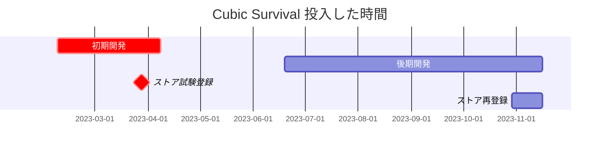

---
image:
    path: /2023-12-22-palette-first-devlog/gameplay.webp
    lqip: data:image/webp;base64,UklGRrYAAABXRUJQVlA4TKoAAAAvD8ABAHW4jWxbbfp4JJmZmSml0LH7L0Mq4pgVtG3DuOOPdQge4zaSFHVVH9P78o+T+j8BbhLNGhMUUL7GTwDFP6j3DTiLqMug0k4+RlwpOQFUC2jKxL/yzX0tKUApmm8sxu7n4LvlOeUbSBnGjBjAWUR/xmX1IQt/X/KSXVS1BnsLKLMeGqGJGl7KM5cUhbtrZyZYxL+CgfcTwNUUcJMaRE0DKQrAqa8oAA==
    alt: ゲームプレイ例
    
title: "「キュービックサバイバル」、構想および開発過程"
authors: ["dev"]

categories: [마일스톤, 게임 개발]
tags: [마일스톤, 게임 개발, 유니티, C#, URP, 큐빅 서바이벌, 기획, 개발일지]
start_with_ads: true

toc: true

date: 2023-12-20 19:18:00 +0900
last_modified_at: 2023-12-22 20:42:00 +0900

mermaid: true
---

## **ゲームを作る**

2023年の新年、私はやることを見つける必要がありました。できればプログラミングの習練に役立ちつつ、自分が楽しく楽しめるものを作りたいと思い、除夜の鐘が鳴った翌日、いくつかの計画を立てました。

いくつかのアイデアを考えてみると、五W一HベースのPythonライブラリ、ミラーレス風カメラアプリケーション、2Dモバイルゲームなどがありました。それぞれ[Pythonベースのプログラム](https://hyngng.github.io/posts/astp-devlog/)やAndroid Studioでの簡単なアプリケーション作成経験、または[以前のUnityプロジェクト](https://hyngng.github.io/posts/lavad-devlog/)から派生したものでした。

ところがゲーム開発の方がとても面白そうに見えました。昔Unityを扱った経験自体が不思議に残っていたし、当時アセットを自給自足して使えるというのが非常に興味深く見えました。結局は苦労ですが、他人には見られない自分だけの素材でプログラムを作るというテーマがとても魅力的に感じられ、ちょうどオブジェクト指向を面白く感じていたところで、オブジェクト指向言語を一度しっかり使ってみたいと思い、2Dモバイルゲームを作り始めました。

## **プロジェクト概要**



開発期間が期間上、初期と後期に区分されるため、それぞれを2つのポストに分けて簡単にレビューしようと思います。したがって、本ポストは上記のチャートで赤色で強調された初期開発の内容を含んでいます。

私は最初、オブジェクト指向の特徴だけをさっと確認して終わろうという気持ちで軽く作り始めたため、このプロジェクトに愛着が湧くとは思いませんでした。なのでこのプロジェクトには体系的な計画や目標はなく、せいぜい以下の事項を少し希望する程度でした。

- [x] 視覚的にミニマリズム的なデザインを作りたい。
- [x] スムーズなカメラ移動を実装したい。
- [x] オブジェクト指向設計を効果的に適用してみたい。
- [x] コルーチンを使ってみたい。

開発期間が長かった分、結果的に上記の目標は次々に達成されました。それぞれどこでどう達成したかは話が長くなるので、今回の記事と次の記事に分けて詳細に扱おうと思います。

## **初期開発過程**

{: w="960" }
*最初は敵を数体倒すごとに何かイベントが発生すると良いと思っていた*

最初はクローンコーディングから始めました。まず小段階で、他の有名なゲームの中で真似できるものを真似してみようというアプローチで取り組みました。

最初は高校の時に友人たちと楽しくプレイした記憶があるBrawl Starsを参考にしました。ただしゲームシステムを丸ごと真似するというよりは、「2Dモバイルプラットフォームはこんな感じでいいんだな」と理解する助けにする程度でした。

### **ジョイスティック**

{: w="960" }

一般的な2Dモバイルゲームに出てくるようなジョイスティックを実装しようとし、左側にプレイヤー移動用のジョイスティック一つと、右側に照準用のジョイスティック一つを作りました。

作る際には`Unity​Engine.​Input​System.​On​Screen`パッケージの`OnScreenStick`クラスを活用し、このクラスに基づく新しいスクリプトを二つ作り、それぞれ位相差に従ってプレイヤーと照準用透明オブジェクトを`Translate()`するようにしました。`On​Screen`パッケージを扱う国内資料がほとんどなくて[公式ドキュメント](https://docs.unity3d.com/Packages/com.unity.inputsystem@1.7/api/UnityEngine.InputSystem.OnScreen.OnScreenStick.html?q=OnScreenStick)を多く参考にしました。

余談ですが、スティックと中心点をLineRendererで視覚的に接続したり、スティックが弾性力を持って弾けるように中心点に戻ったり、あるいは武器ごとにジョイスティック操作法が変わったりするなど、実装したかったアイデアはたくさんありましたが、作った当時の実力が不足していたり、ゲーム構造と衝突する場合もあったりして実装できませんでした。代わりに、ジョイスティックを押したり離したりするたびに振動フィードバックが来る程度だけ作りました。

### **敵スポーンおよび動作**

{: w="960" }
```cs
void spawnEnemy(GameObject Enemy, float east, float west, float south, float north)
{
    float spawnPointX = Random.Range(west, east);
    float spawnPointY = Random.Range(south, north);

    instantiatedEnemy = Instantiate(
        enemy,
        player.transform.position + new Vector3(spawnPointX, spawnPointY),
        transform.rotation
    );
}

IEnumerator spawnEnemies()
{
    for (int i = 0; i < data.spawnCount; i++)
    {
        spawnEnemy(Enemy, east, west, south, north);
        yield return new WaitForSeconds(spawnDelay);
    }
}
```

最初はポータルオブジェクトを作って指定された地点で敵がインスタンス化されるように作ってみましたが、できあがった後の様子が単調すぎると思い、上記のように敵がプレイヤー周辺で生成されるコードを書きました。

`east`、`west`、`south`、`north`の4つのパラメータを基に、プレイヤーから一定距離離れたランダムな座標値を生成するようにしました。プレイヤーの周りに敵が突然現れないよう、該当座標値は画面がレンダリングする領域外になるよう別途処理しました。

Unityではディレイをかける方法が例えば`Delay()`のように簡単に提供されておらず、代わりにほとんどの場合コルーチンの使用を推奨しているため、コルーチンを初めて使うきっかけになりました。`spawnDelay`値だけ間隔を空けて敵をスポーンするコルーチンを作りました。

```cs
void Move()
{
    dirTowardsPlayer = (player.transform.position - gameObject.transform.position).normalized;
    transform.Translate(dirTowardsPlayer * speed * Time.deltaTime);
}

void OnCollisionEnter2D(Collision2D collider)
{
    if (collider.gameObject.tag == "player")
    {
        player.hp -= damage;

        Vibration.Vibrate((long)20);
        Destroy(gameObject);
    }
}
```

敵は基本的にプレイヤーに向かって移動しながら、プレイヤーとの衝突時に振動フィードバックとともに`damage`分だけプレイヤーの体力を減少させ、`Destroy()`されるようにしました。

### **インベントリとアイテム**

ゲーム構造の輪郭ができてくると、アイテムを取得して保存しておき、後で取り出して使えるインベントリがあれば良いと思いました。ここは自分なりの悩みをした部分で、多くのゲームでインベントリUIを別のウィンドウで構成したり、まったく作らずにボタントグル式で作っていたからです。私はどちらも満足できませんでした。

代わりに、複数のアイテムを収納できつつ、そのUIがプレイ体験を損なわないインベントリを作ることを目標にしました。そこで右ジョイスティックに割り当てられていた手動照準機能はオートエイムに代替し、新しいインベントリアクセス機能を割り当てました。右ジョイスティックを長押しするとインベントリが開き、指を離すとインベントリが閉じる仕組みで動作します。

{: w="960" }
```cs
public struct InventoryData
{
    public string[]     Code;
    public GameObject[] UI;
    public GameObject[] ItemUI;
    public GameObject   Weapon;
    public int[]        Rounds;
}

for (int i = 0; i < InventoryData.InventoryUI.Length; i++)
    InventoryData.UI[i].transform.position = Vector3.Lerp(currentPos, targetPos[i], 2*t);
```

インベントリは8つのオブジェクトを使い、アクセス時にプレイヤー周辺にオブジェクトが展開されるようにしました。そのためにインベントリアクセス時に必要なデータ(アイテム識別子、インベントリオブジェクト、アイテムオブジェクト、武器データ、弾薬など)を総括できるよう、上記のような構造体を一つ作りました。

アイテムはフィールドにスポーンされる用途のオブジェクトとUIとして動作するオブジェクトに分割し、プレイヤーがフィールドアイテムを獲得するとアイテムUIオブジェクトが`ItemUI`配列に追加されるようにしました。

|アイテム|ID|
|---|---|
|拳銃|WPPSTL|
|ショットガン|WPPASG|
|ミニガン|WPMING|
|移動速度増加パッシブ|PVMSPD|
|攻撃速度増加パッシブ|PVATKR|
|...|...|

アイテム識別子は上記のように、種別を示す2桁の後にアイテム名を示す4桁が続くようにしました。面白かったのは、作っている時は気づいていなかったのですが、アイテムが増えていくにつれて「区別のために固有コードを作らなければ！」と自然に思いついた発想が、後になって「識別子」という概念だったことです。使ってみるとかなり便利だったので、次回も引き続き活用しようと思います。

### **武器発射**

{: w="960" }
```cs
if (shotTimer > fireThreshold)
{
    for (int i = 0; i < bulletCount; i++)
    {
        instantBullet = Instantiate(
            bullet,
            FirePosition.transform.position,
            Quaternion.Euler(
                0, 0, transform.rotation.eulerAngles.z + Random.Range(MOA * -1, MOA) + 180
            )
        );
        Destroy(instantBullet, 1);
    }
}

shotTimer += Time.deltaTime;
```
```cs
void hasHitEnemy()
{
    hit = Physics2D.Raycast(transform.position, transform.right, 100);

    if (hit.collider != null && hit.distance < 1)
    {
        if (hit.collider.gameObject.tag == "enemy")
        {
            if (hit.collider.GetComponent<Enemy>().HP > 0)
                Destroy(gameObject);
            /* ... */
        }
    }
}
```

弾丸は武器オブジェクトの`FirePosition`子オブジェクトから生成され、プレイヤーが照準している方向に直進し、生成から1秒が経つと消えるようにしました。弾のばらつき効果を実装するため、弾丸が生成される時に武器ごとに指定された`MOA`変数値内で`Random.Range()`により角度のZ軸値が少しずつ補正されるようにしました。

衝突判定はレイキャストを使いました。ところが弾丸速度が速すぎたのか、レイキャストでも衝突判定がうまくいかず、弾丸が敵をそのまま通過してしまう問題がありました。この問題はRay長を増やしたりCollider範囲を広げても解決しませんでしたが、`hit.distance < 1`条件を追加することで解決できました。

すべて実装してみると、弾丸発射のようにオブジェクトのインスタンス化が頻繁に発生する場合に、オブジェクトプーリング(Object Pooling)という最適化手法が使えることを発見しました。今後時間ができたら適用してみようと思います。

## **ユーザー体験デザイン**

前の段落が「フィールドを歩き回って敵を倒すアクションゲームを作りたい」についての内容だったとすれば、この段落は「スムーズでユニークなユーザー体験を実装したい」についての内容です。ちゃんとしたビジュアル関連の作業はほとんど後期開発段階で行われたと思うので、次の記事で扱います。

### **カメラ**

{: w="960" }
```cs
void Move()
{
    transform.position = Vector3.Lerp(
        transform.position,
        player.transform.position,
        Time.deltaTime * moveSpeed
    );
}

void Vignette()
{
    targetVignetteValue = inventoryIsOpen ? 0.35f : 0f;

    vignette.intensity.value  = Mathf.Lerp(
        vignette.intensity.value,
        targetVignetteValue,
        Time.deltaTime * vignetteSpeed
    );
}
```

普段[写真](https://hyngng.github.io/posts/photos-of-imin/)を補正しながら注意深く見たビネット(Vignette)というオプションがあります。この機能は画面端を暗くして視線を中央に集めるもので、ちょうどUnityの[ポストプロセッシング](https://docs.unity3d.com/kr/2020.3/Manual/PostProcessingOverview.html)にも同じオプションがあったので、インベントリが開くときにこの効果を適用すればぴったりだと思いました。

そこでインベントリアクセス時にビネット値が0.35程度になるようにしました。ビネット動作はカメラ移動と同様にLerpを使ってスムーズに処理しました。作る際にLerpが受け取る`vignetteSpeed`や`moveSpeed`などの引数値を自分の希望する感じに調整するのが難しかったですが、プレイして修正し、プレイして修正し、他の部分の作業をしている時にまた満足できなければ再度修正しながら、開発中ずっと希望する値を探すために努力しました。

### **URP**

{: w="960" }
*武器が発射されるたびに敵の背後に影が映る*

最初はUnity2D環境のデフォルトの光効果をどうにか使っていましたが、いろいろ不満な点があり、代替として[URP(Universal Render Pipeline)](https://unity.com/srp/universal-render-pipeline)を適用したところ、ビジュアルがとても良くなりました。基本的にスムーズな美しい光効果を提供しながらも、例えばFalloff Strengthオプションを調整してもっと控えめまたは華やかな光を作ったり、Shadowsオプションで上記のように光と影の効果を演出したりできて、本当に便利に使いました。

ただし後で弾丸や敵一つ一つにLight2Dを入れてみると、スマホがすぐに熱くなる問題がありました。GPUリソースをかなり消費するようで、積極的には使えず、銃が発射されるときの火炎効果を豊かにする用途だけに留めました。

## **おわりに**

初期開発活動を簡単にまとめました。書きながら感じるのは、実はこの期間に感じていたことが思ったよりよく思い出せないという問題があります。様々な考えや努力をすべて盛り込めなかったようなので、次回は途中でメモを頻繁に残しておこうと思います。

それでも色々と直接実装してみながら、ゲームを作ることが自分の考えよりも精巧な仕事であることを知りました。特に、流行のトレンドを追わずに新しいパラダイムを探し求めた、またそれを成功裏に実装した他のゲームたちが本当にすごいと思いました。また個人的には、そういうものをすごいと思う私としては、少し欲が出ました。
