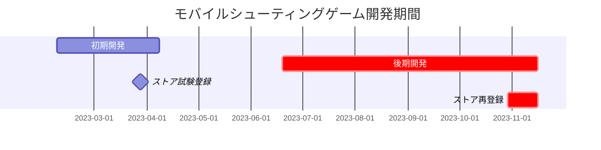
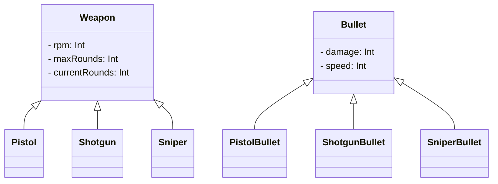

---
image:
    path: /2023-12-24-palette-second-devlog/gameplay.webp
    lqip: data:image/webp;base64,UklGRp4AAABXRUJQVlA4TJIAAAAvD8ABAHW4jW07cZZZFK05opg5dwVuh0KP63YPX9K8r/lX2LZtQ/9/b7pH/6uQQTkldeJfaiu1Vm5md+y6VXAnB01t6GKRzP0ax2haSBXAIpUOphDguA1NYDEqXRj3wIgpeMdtNWAhXjfv2IdZJp2CutpKacCzQSqv6wO8mG9t+BciZqCmJINcWYVt8M57GziHAA==
    alt: ゲームプレイ例
    
title: "「キュービックサバイバル」、開発およびリリース過程"
authors: ["dev"]

categories: [마일스톤, 게임 개발]
tags: [마일스톤, 게임 개발, 유니티, C#, URP, 큐빅 서바이벌, 개발, 개발일지]
start_with_ads: true

toc: true
toc_sticky: true

date: 2023-12-22 22:38:00 +0900
last_modified_at: 2024-03-20 17:38:00 +0900

mermaid: true
---

## **開発を再開した理由**

:::info
[前の記事](https://hyngng.github.io/posts/palette-first-devlog/)からの続きです。
:::



3月になり新学期が始まってから、最初の一ヶ月ほどはプレイヤーインベントリなどゲームの基礎システムを作り続けましたが、試験期間が近づくにつれて負担感から開発の流れが途切れました。ところが6月の期末試験が終わってから時間が再び空き始め、以前作っていたゲームを続けて作ることにしました。

ところが夏休み2ヶ月の間、画像アセットやパーティクルエフェクトなどの視覚的なビジュアルに気を配る中で強い興味を感じました。ゲームが効果的に改善されている印象に加え、他の場所では見られない独特な感じを意図すること自体が非常にユニークに感じられました。こういう経験をするのはなかなか難しいと思い、2学期には一度試しに大きな賭けをし、2学期は授業と試験はきちんとこなしつつ、ゲーム開発に可能な限り最大限の時間を投資することにしました。

したがってこのポストでは、その期間の残りすべての部分について何をどのように作ったかを中心にまとめました。

## **武器作り**

### **発射アニメーション** {#weapon-animation}


```cs
if (shotTimer > fireThreshold)
{
    WeaponAnimator.SetTrigger("Fire");
}

shotTimer += Time.deltaTime;
```

Unityアニメーションコンポーネントを使って発射アニメーションを作りました。Unityが提供するアニメーションコンポーネントは、スプライト画像を交換して実装する伝統的なカットアニメーション以外にも、子オブジェクトの位置を直接調整するアニメーションも作成できるようサポートしているため、二つのタイプを適切に活用して武器を発射するときに対応する反動アニメーションが再生されるように作りました。

銃口前で再生される火炎エフェクトは、画像自体にブラー処理を施した後、違和感を減らすためにスプライトのサイズを誇張し、URPが提供する光効果とポストプロセッシングのBloom効果を加えました。そのおかげで、地味な印象は減らし、目を引く華やかな効果を作ることができました。

{: w="480" }
{: w="480" }

火炎アニメーションエフェクトを構成する画像は、Clip Studioのアニメーション機能を活用して作りました。アニメーションスプライトを直接作るのは結局デジタル手作業なので、Unityが提供する公式アセットを代わりに使おうかとも思いましたが、探してみたところ希望する感じのものがなかったので直接描いて活用しました。作る際には[他のシューティングアニメーション](https://www.youtube.com/watch?v=kAafHZcT2fc)をフレームごとにゆっくり参考にしながら、自分の希望する感じを作りました。


武器オブジェクトが交換される時の不自然さを減らすため、武器を変えたり新しく取得した時のみ再生される、武器別専用の薬室確認アニメーションも作りました。武器を操作している間、プレイヤー操作に一時的にディレイが生じるように作りましたが、適用してみるとプレイ経験がはるかに有機的に見えて満足しています。

### **敵被弾エフェクト**


```cs
public void Hit()
{
    ParticleSystem hitEnemyParticle = hit.collider.GetComponent<ParticleSystem>();
    hitEnemyParticle.Emit(particleNumber);
}
```

被弾効果はパーティクルシステムを使って作りました。最初はパーティクルがランダム方向に移動しながら速度が徐々に減る程度に単純に実装しましたが、成果物が思ったより不自然で悩みました。

これは偶然解決しましたが、上記のようにVelocity over Lifetimeモジュールで線形速度と公転速度をRandom between two curvesに設定し、グラフを二回捻ったところ、まるで埃が舞うような効果ができたのでこれを使いました。見た目も良く、打撃感もかなり良い感じです。

### **装弾数システム**


```cs
public virtual void Update()
{
    if (roundsCurrent > 0)
        Fire();
    else if (!WeaponAnimationInfo.IsTag("Weapon_Reload"))
        WeaponAnimator.SetTrigger("RoundIsEmpty");
    else
        roundsCurrent = roundsMax;
}

public virtual void Fire()
{
    if      (currentRounds == 1) WeaponAnimator.SetTrigger("FiredLastRound");
    else if (currentRounds > 0)  WeaponAnimator.SetTrigger("Fired");

    roundsCurrent -= 1;
}
```

残弾を表示する機能を作りました。弾が0になると再装填アニメーションが再生され、再装填アニメーションが終わると装弾数は武器オブジェクトに設定された最大装弾数の値に戻るようにしました。プレイヤー体力と同様に、装弾数UIはプレイヤーの頭上にゲームオブジェクトの形で表示されるよう簡略に作りました。

少しのディテールも入れました。再装填アニメーションが終わっていないのに武器が変わった場合、後日その武器を再び手にした時に`Gained`アニメーションと区別される`GainedEmpty`アニメーションが再生されるように作りました。違いは`GainedEmpty`の場合、薬室が開放された状態で再装填が開始される点です。多くのFPSゲームでこの点を実装しているのを見て取り入れました。

### **ダメージエフェクト**


ダメージエフェクト自体は初期開発の時に実装しましたが、動作がアニメーションコンポーネントではなくコードで実装されていた上に、そのビジュアルもかなり残念だったので作り直しました。単に徐々に透明になって消えていたものを、エフェクトのサイズや移動速度まで流動的に調整されるように変更しました。

作る際にはクリティカルシステムも一緒に実装しました。確率的にダメージが2倍になる時、専用アニメーションが再生されるように作りました。アニメーションはクリティカルダメージが入ったことを簡単にわかるよう、通常ダメージアニメーションと比べてサイズと色に差をつけました。

### **武器の多様化**


```cs
public abstract class Weapon : MonoBehaviour
{
    protected int   RPM;
    protected int   maxRounds, currentRounds;

    public virtual void Awake()
    {
        /* ... */
    }
}
```
```cs
public class Pistol : Weapon
{
    public override void Awake()
    {
        base.Awake();
        
        maxRounds     = 10;
        rotationSpeed = 40;
    }
}
```

最初は銃を主に作るつもりはありませんでしたが、最初に作ったものを再利用しようとするうちに、武器を銃中心にいくつか作ることになったようです。作りながらはオブジェクト指向プログラミングの多態性を意識し、親役割を果たす`Weapon.cs`クラスに`RPM`、`maxRounds`、`currentRounds`などの基本的なものを書き、`Minigun.cs`、`Shotgun.cs`、`SMG.cs`などの詳細武器クラスがこれを継承して動作するようにしました。

継承を活用したのはこれが初めてですが、これまでのコード作成方式に比べて作業が確かに効率的でした。繰り返されるコードを低い段階で一元化し、末端コードで呼び出して使用するということが、ライブラリを使用するのとは全く異なり、馴染みがないと同時に不思議な印象がありました。

## **アニメーション制作**

### **プレイヤー移動**


Unityでデフォルト提供する四角い図形をプレイヤーとして使うのはあまりにも手抜きに思えたので、新しい胴体と動く脚を取り付けました。プレイヤーがジョイスティックを最大範囲まで引いたかどうかによって、歩くアニメーションと走るアニメーションのいずれかが適切に再生されるようにしました。

アニメーション動作の違和感を減らすため、ジョイスティックを倒した程度に応じて歩くアニメーションの再生速度が流動的に調整され、また照準方向に応じてプレイヤーが後ろに歩いていく機能も追加しました。例えばプレイヤーが左に歩いているのに敵が右にいる場合、プレイヤーは後ろにゆっくり歩きながら敵を照準する形です。結果的に動きが不自然でなく、かなり自然に見えます。

### **経験値システム**


プレイ中の退屈さを少しでも減らすために経験値システムを作りました。敵を倒すとプレイヤーは経験値を得て、経験値が一定量に達するとレベルが上がりプレイヤーが一定量強化され、蓄積されたレベルはゲーム終了時に結果画面にスコアの形で表示されます。

最初はプレイヤーが経験値パーティクルを直接取得しなければ経験値を獲得できないように作りましたが、プレイ後半になるほど増えていく敵によって画面が散らかる問題があったため、敵を倒した即座に経験値を獲得する方式に変更しました。適用してみると、今の方式が正統的と言えるほどはるかにすっきりしているようです。

### **プレイ画面への進入**


個人的に、前のシーンと後のシーンが硬く切り替わるよりも、スムーズにつながる方が、プログラムに配慮されているような感動があって好きです。この部分を自分のゲームにも適用してみたかったです。

そこでシーン切り替え時に、プレイボタンを押すと単にシーンが切り替わって終わりではなく、同じサイズのボタン形状のオブジェクトからプレイヤーが登場するようにしました。ボタンが押されるとメインシーンのUIはスムーズに消え、プレイシーンのUIが画面端から新たに登場します。アマチュアが作ったかのような不足した部分が見えますが、他のゲームにはない独特な固有経験を作ったようで少し誇りに思う部分です。

## **後期開発: その他の作業**

### **画像アセット**


*Galaxy Tabで描画*

[先に説明したように](#weapon-animation)、画像アセットはUnityアセットストアを使わず、すべて自作して使用しました。武器をまずピクセルアートで描いてみたところ、感じが不自然ではなかったので、敵、被弾エフェクト、ジョイスティック、経験値バーなど他の画像もピクセルアートで作りました。ピクセルアートは思ったより描く負担がなく、試案をいくつか作ってみたり使用中の画像を新しく変えてみたりと、作業においてかなり自由でした。

主にClip Studioを使って背景が除去されたpng拡張子でエクスポートした後、画像それぞれのサイズに切り取ってインポートし、インポートした画像はすべてSprite (2D and UI)として、Filter ModeはPoint (no filter)、Max Sizeは画像解像度に合わせて設定して使用しました。

### **カメラ**

私は[写真趣味](https://hyngng.github.io/posts/photos-of-imin/)を通じて、画角で多くのことを表現できることを発見し、それを自分のゲームに適用してみたかったです。Unityの2D環境は正射影(Orthographic)方式でシーンを表示するので概念には違いがありますが、どれだけ広く収めるかという抽象的な観点では2Dでも考慮すべき点があると思いました。

<div class="row">
    <div class="col-md-6">
        
    </div>
    <div class="col-md-6">
        
    </div>
</div>

そこでゲームを作る際に、カメラの視野に関与する`Camera.orthographicSize`値がその時々で自分の希望する値に変更されるようにしました。例えば再装填をする時や新ゲームが始まる時に無力感と緊張感が表現されたら面白いと思い、画角が狭くなるようにしました。テストアプリケーションをビルドして実際にプレイしてみると、意図がよく表現されつつもゲームプレイをユニークにしてくれるようで満足しています。

### **オーディオ**

{: .light .border }
{: .dark }
*クリティカル効果音*

BGM、効果音など音に関するものは、実際に自分で処理しようとすると少し戸惑う部分でした。絵を描いたりコードを書いたりするのとは違い、音に関する部分は自分が何も知らなかったからです。本当にオーディオファイルをどこでどうやって入手すべきか、編集はどうするのかもよくわかりませんでした。

結果的にあれこれと手当たり次第に探した末に、[Pixabay](https://pixabay.com/ko/sound-effects/)と[GDC Game Audio](https://sonniss.com/gameaudiogdc)で無料オーディオファイルを入手した後、[Audacity](https://www.audacityteam.org/)オーディオ編集プログラムを使ってノイズ低減や低音増加など少しずつ編集しながら使用しました。

成果物は悪くなくできましたが、音に関する部分はかなり戸惑うまま残っていて、もし次にゲームを作ることになれば、効果音やBGMを先に入手してから作るべきだと思いました。

### **アプリ内広告**


```cs
void PlayerDied()
{
    ShowInterstitialAd();
}
```

後期開発の中ではほぼ最初に実装した機能です。[簡単な株式自動取引機](https://hyngng.github.io/posts/astp-devlog/)を作りながら、APIやSDKなど外部で配布するモジュールを使うことに興味があった時期で、好奇心から広告呼び出し機能を作りました。プレイヤーが死んで結果画面に移行する際に、途中でインタースティシャル広告が表示されるようになります。

[Google AdMob公式ドキュメント](https://developers.google.com/admob/unity/banner?hl=ko)を参考にしながら作りましたが、公式ガイドをゆっくり辿っていくと、予想よりはるかに簡単に作ることができました。成果物もすっきりと動作して不思議でした。

### **アプリ内課金**

{: .light .border }
{: .dark }
```cs
void Purchase()
{
    if (playerDonateKimbab)
    {
        DonateKimbab();
        playerDonateKimbab = false;
    }
}
```

アプリ内課金機能も同じ文脈で実装してみたかったです。ただアプリ内課金の場合、ゲーム内で通用する通貨やアイテムなどがないため、支援の形で作ることになりました。キンパ、プルダク、ステーキなど3つの食べ物を構想し、Google Consoleでアプリ内商品を申請した後、ゲーム内で報酬なしで決済が行われるようにしました。

実装中にアプリ内課金を実装する際に注意すべきはセキュリティだという話を聞きました。このプロジェクトはトイプロジェクトの色合いが濃いため収益を狙って作ったわけではないので大きな問題はありませんが、次にアプリ内課金を実装することになれば少し注意しながら作らねばと思いました。

## **ストア登録**

### **登録準備**

{: .light .border .w-25 }
{: .dark .w-25 }
*アプロゴ*

統一性のため、アプリロゴはプレイボタンと同じ画像で作りました。このプロジェクトにおいてストア登録は少し象徴的な意味があるだけで、このゲームで関心を集めたいといった考えはなかったので、直感性が低いのは我慢することにしました。アプリのパッケージ名は開発者アカウントと個人的に呼んでいたプロジェクト名から取って`com.payang.palette`と決めました。

### **ストア登録**

{: .light .border w="960" }
{: .dark w="960" }
*Google Consoleのストア登録情報記入欄*

アプリ登録はPlayストアに限定し、したがってGoogle Consoleを利用しました。実は[初期開発段階](https://hyngng.github.io/posts/palette-first-devlog/)で一度登録したことがありますが、アプリ登録の手続きや自分のアプリが本当にストアに上がるのかが気になって好奇心で登録したもので、正常に登録されることを確認した後、アプリをすぐに無効化していました。

そして半年以上時間が経つと、これ以上このプロジェクトに時間を投じるのが負担に感じられるようになり、ゲームの完成度も最初よりはかなり見られるようになったと思い、アプリをアップデートした後、有効化することにしました。登録にあたってはアプリ名とアプリ説明を新たに書き、アプリアイコンとグラフィック画像、そして自社スクリーンショットも新しいものにアップデートしました。

{: .light .border w="960" }
{: .dark w="960" }
*Google Playストアにゲームが掲載された画面*

最終的にアプリが再び有効化され、ダウンロード可能な状態です。アプリ有効化後一週間ほどの時間も経ったので、タイトルを検索すれば問題なく表示される状態です。

### **宣伝とフィードバック**

正直に言うと、ちゃんとした宣伝活動と言うには気恥ずかしく、実際の宣伝もこれまで考えたことがなかったので困難がありましたが、それでも作ったものが「ゲーム」なのでプレイしてくれる人がいれば良いと思い、どこにどう宣伝すべきか探し始めました。

しかしこのゲームは最初からプレイさせるために作ったというより、トイプロジェクトに楽しさを見出して規模が膨らんだケースに近いため、これを宣伝するのが正しいのか不安になり、また開発過程は楽しかったものの、宣伝は別の問題として、実際に自分が作ったものを知らせるのは恥ずかしさが先に立ちました。

{: .light .border w="960" }
{: .dark w="960" }

それでも勇気を出して海外の[Unity2Dサブレディット](https://www.reddit.com/r/Unity2D/comments/17p1toj/my_first_game_is_now_on_google_play_what_do_you/)に短い記事を投稿しました。100人くらい見てくれたら本当に感謝だという気持ちで投稿しましたが、一週間で閲覧数が2万を超え、一ヶ月ほど経つとなんと10万近い方々が関心を持ってくださり、本当に驚きました。

{: .light .border w="960" }
{: .dark w="960" }

その中で何人かの方は本当にありがたいことに、実際にプレイした上でこんなに詳細なフィードバックまで残してくださいました。「ジョイスティックの位置が修正不可能なまま固定されていて不便」「Bloomが過剰」「他のゲームと似ている」程度のフィードバックがありました。

フィードバックには共感する部分がありますが、今すぐこれ以上開発を進めたいとは思わないので、後日時間ができた時に少しずつ修正するか、次期プロジェクトを進めることになればその時に反映しようと思います。

## **おわりに**

:::tip
[Playストア](https://play.google.com/store/apps/details?id=com.payang.palette&hl=ko-KR)からダウンロードしてプレイできます。
:::

これで長い時間をかけたプロジェクトが終わりました。半年ほど気にかけながら時間を過ごしましたが、アプリが登録された画面を見ながら様々な思いが浮かびますが、個人的に最も大きく感じたことが三つほどあります。

- アニメーションを作ることは楽しく充実した仕事ではありますが、一つ一つ手作業で進める必要があるため、時間を非常に多く要します。プロのアニメーターでない限り、希望する感じのアニメーションを作ることは心の準備が必要な仕事であり、またオブジェクトごとに専用アニメーションを作るのは非効率的です。可能であれば複数のオブジェクトが同じアニメーションを共有できるようにするのが効率的だと思いました。

- 即興的なボトムアップ方式で企画なしにプロジェクトを作ることは、小規模な文脈においては面白いかもしれませんが、その限界が明確にあります。開発をしていて流れが途切れ、アニメーションを作っていて流れが途切れ、満足できなければ作った作業物を戻したり削除して新しい作業物を再び作ることが多かったです。  
そのため、最初に企画を念入りに準備していれば、こうした非効率的なことは予防できたのではないかという残念さがずっとありました。なので次回は初期に企画をしっかり固めてから進もうと思います。

- 最後に時間管理についての部分です。このプロジェクトは元々冬休みに長くても一ヶ月ほど短く進めようと始めたプロジェクトでしたが、面白くて夏休みプロジェクトになり、さらに次の冬休みプロジェクトになりかけてました。  
学期中に開発を並行しながらゲームを作るのがあまりにも楽しくて、学業が心理的に二の次に押しやられることもありました。自然と成績に影響が出て、時間管理をうまくできなかった悔いが残りました。

それでも作る過程がとても楽しく充実した経験として残っているので、近いうちにUnityで悔いを補完した次のマイルストーンを作ることになるのではないかと思います。開発しながら途中で知ったヒントやパターンを新たに適用してみたいし、初回が難しいだけで二度目は難しくない気もします。それでも次に手をつけるなら、より体系的な計画と準備プロセスでゲームを一段階発展させたいです。
