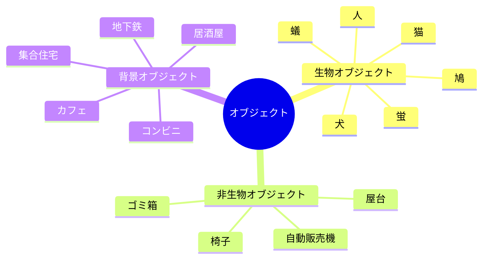
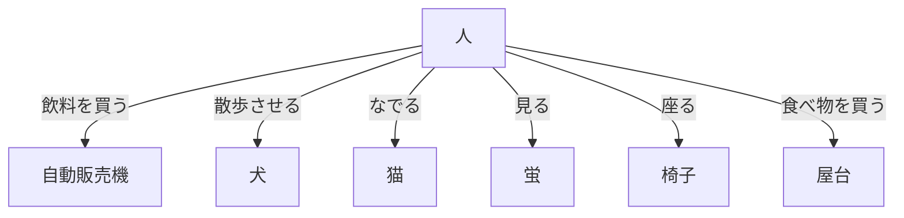
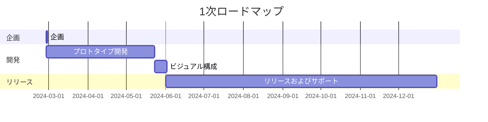

---
image:
    path: /2024-03-22-armonia-devlog-planning/preview-image.webp
    lqip: data:image/webp;base64,UklGRoAAAABXRUJQVlA4THMAAAAvD8ABAJUwiiRJkZtjZmbGF9s5Kyd1ScY8FbRt5MYA/F79RFEjSWpSxn2Zbw+m+z8BjqBzPlDmvL+4+00yVxL5ht9jZKHMSM22JRAbkUChuDviWIX4O+VnNh9jixzr0LjyndMjOUfNsQQDkKGXf/yfCzAGAA==
    alt: こんな感じで
    
title: "「行先地」、ゲーム企画する"
authors: ["dev"]

categories: [마일스톤, 게임 개발]
tags: [마일스톤, 게임 개발, 유니티, 행선지, 기획, 개발일지]
start_with_ads: true

toc: true

date: 2024-03-22 19:24:00 +0900
last_modified_at: 2024-04-30 18:58:00 +0900

mermaid: true
---

## **はじめに**

[直前の経験](https://hyngng.github.io/posts/palette-developing/)を終えて新しいUnityプロジェクトを始めようとしていたところ、10年前に見た静かな映画をもう一度見て、経験が持つ影響力について考えるようになりました。考えがある程度まとまった後、良い映画が良い経験として残るように、私もそういうものを作ってみたいと思うようになりました。普段から何かを作ったり表現したりしたい気持ちもありました。

{: .w-50 }
*友人と話しながら描いた簡易コンセプトアート兼企画*

経験に焦点を当て、単にプレイヤーが何の操作をしなくてもシーン内のオブジェクトが勝手に互いにインタラクションする環境を構想しました。スコアやゲーム終了条件なしに、単に眺めて歩き回るだけのゲームです。  
上のアイデアをもとに素早く絵を描いてみたら、思ったより感じが良くて周りの反応も悪くなかったので、これを基に企画を構想し始めました。

## **企画**

以前最も残念だったのは企画の不在です。参考にできる指標と長期プランがないので、マクロ的にはゲームの方向性を定めにくく、ミクロ的には例えばリテンションや収益性を考えにくかったです。そこで今回は企画を先にある程度構成してから進もうと思います。

ゲーム企画に役立つ概念があるか探してみたところ、GDD(Game Design Document)というものを知りました。一種のゲーム仕様書で、決まった形式があるわけではなく、[Unityが制作したGDD](https://connect-prd-cdn.unity.com/20201215/83f3733d-3146-42de-8a69-f461d6662eb1/Game-Design-Document-Template.pdf)のフォーマットを参考に、必要な部分だけを事前に記述しておこうと思います。

### **簡易GDD**

- 基本説明
	- 名前: 行先地 (英語: waybound)
	- ジャンル: 横スクロールアドベンチャー
	- 形式: 2.5Dモバイル
- ゲームプレイ
	- プレイヤーは都市郊外の環境で人、犬、猫、蟻など環境を構成する生物になり、その生物に与えられたインタラクションを行う。例えば人は自動販売機で飲料を取り出して飲み、犬は路上のベンチの匂いを嗅ぐ。
	- プレイヤーが特に生物を操作しなくても、生物は互いにインタラクションをして都市郊外の雰囲気を構成し、それぞれの生物は与えられた範囲内で外見的な個性を持つ。
- 主な特徴
	- オブジェクト間の多様なインタラクション
	- 手書きの絵画像とカットアニメーション
	- 雨、雪など天候によって変わる体験

### **オブジェクト例**

### **インタラクション例**

## **目標**

### **技術的目標**

これまでは変数や関数名の記述に混乱が多くありました。一貫性と直感性のどちらも上手くいかず、徐々にコードを読んで修正するのが大変になりました。

そんな中、Unityブログで[ネーミングコンベンションをまとめた記事](https://unity.com/how-to/naming-and-code-style-tips-c-scripting-unity)を目にして少し衝撃を受けました。最初から知っていたらもっと楽だったのにと思いました。結果的に、変数名と関数名についてC#でいつ何を使うべきか、どのように書くべきでないかを明確に知ることができました。

自分が知るべき慣行が他にもあるか探していたところ、同じくUnityが発行した["Level up your code with game programming patterns"](https://blog.unity.com/games/level-up-your-code-with-game-programming-patterns)というE-Bookをさらに知りました。ゆっくり精読しながらSOLID原則やファクトリーパターン、状態パターンなど様々な活用可能な技術があることを知り、これをもとに派生パターンを探しながら、より体系的なコード設計のために挑戦してみたいことが生まれました。整理すると以下のようにまとめられます。

- PlasticSCM
- イベント駆動型プログラミング
- プロシージャルアニメーション
- 厳格なネーミングコンベンション

このうちPlasticSCMはGitHubを代替するためのバージョン管理システム(VCS)として、開発中に間々作業物を保存しておくために使用しようと思います。イベント駆動型プログラミング、ネーミングコンベンションなどはこのプロジェクトを通じて得たい開発能力の核心です。この他にシングルトンパターン、コルーチン、デリゲート、get setプロパティなどまだ慣れていないものもより活用してみたいという小さな目標もあります。

### **芸術的目標**

基本的に線と絵が動く経験を通じて、私たちの周りの日常的な雰囲気を描写することが目標です。そういったものを目に十分留まりつつも刺激的ではない感じで表現できればと思います。可能なら映像作品のような演出を目指しながら、具体的には以下程度を活用しようと思います。

- カットアニメーション
- 動的被写界深度
- トーンカーブ曲線

全体的にユーザーがじっとゲーム画面を見つめているだけでも面白いレベルにできればと思います。ただ自分にその程度の力量があるかは悩ましいところで、特に犬、猫、鳩など動物の動きをカットアニメーションで描き出すのはプロのアニメーターの領域だと聞いたことがあります。私がそこまで精密なアニメーションを描く必要はありませんが、背景知識や経験がないので試行錯誤があるでしょう。

## **ロードマップ**

